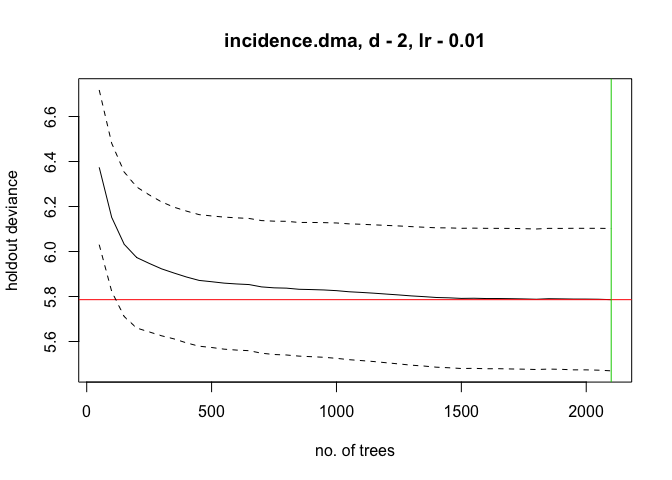
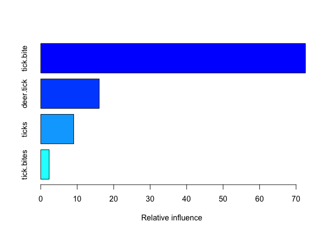
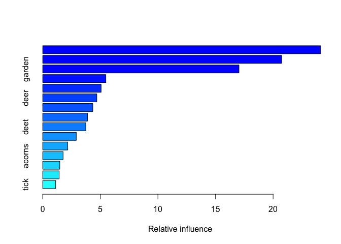

tick\_searches
================
Ilya
5/13/2018

#### When we go outdoors, we run a risk of coming into contact with ticks that could give us disease-causing pathogens. In the eastern U.S., blacklegged ticks (Ixodes scapularis) transmit the bacterium Borrelia burgdorferi, which causes Lyme disease; in the West Coast, the Western blacklegged tick (Ixodes pacificus) is the vector for Lyme disease. Both of these ticks also transmit pathogens causing other diseases in people and pets. Tick activity varies depending on time of year, weather, wildlife host abundance, and other factors. Knowing the level of risk in our area at a particular time can help us decide what outdoor activities to pursue and what precautions to take (such as checking oneself for ticks after going into tick habitat).

#### Internet search data offer a potential source of real-time information on people's encounters with ticks. If we know people in our area are searching more for ticks, this could be a sign that tick activity is high and we need to be more vigilant against ticks. In evaluating whether internet search data provide a useful measure of disease risk, an important step is determining whether internet search predicts Lyme disease incidence. Here we use Google trends data from 2004 to 2016 to predict Lyme disease incidence in those years. The analysis demonstrates that top searches related to tick bites account for 50% of the variance in Lyme disease incidence. Based on this finding, Google search data appears to be a useful measure of encountering ticks that make us sick. A next step will be identifying variables (e.g., weather) that predict increases in Google searches about tick bites, to enable earlier warning of tick risk.

install packages
================

``` r
list.of.packages <- c("sp", "raster", "leaflet", "geojsonio", "lubridate", "data.table", "dismo", "devtools", "dplyr")
new.packages <- list.of.packages[!(list.of.packages %in% installed.packages()[,"Package"])]
if(length(new.packages)) install.packages(new.packages)

print(new.packages)
```

    ## character(0)

``` r
library(devtools)
devtools::install_github("PMassicotte/gtrendsR", branch = "low-search-volume") #use version for getting low search volume regions https://github.com/PMassicotte/gtrendsR/issues/229
```

    ## Downloading GitHub repo PMassicotte/gtrendsR@master
    ## from URL https://api.github.com/repos/PMassicotte/gtrendsR/zipball/master

    ## Installing gtrendsR

    ## '/Library/Frameworks/R.framework/Resources/bin/R' --no-site-file  \
    ##   --no-environ --no-save --no-restore --quiet CMD INSTALL  \
    ##   '/private/var/folders/0d/qm_pqljx11s_ddc42g1_yscr0000gn/T/RtmpSYGbHD/devtools12365e6563ed/PMassicotte-gtrendsR-08b0edb'  \
    ##   --library='/Library/Frameworks/R.framework/Versions/3.4/Resources/library'  \
    ##   --install-tests

    ## 

``` r
library(gtrendsR) 
library(sp)
library(raster)
library(leaflet)
library(lubridate)
```

    ## 
    ## Attaching package: 'lubridate'

    ## The following object is masked from 'package:base':
    ## 
    ##     date

``` r
library(data.table)
```

    ## 
    ## Attaching package: 'data.table'

    ## The following objects are masked from 'package:lubridate':
    ## 
    ##     hour, isoweek, mday, minute, month, quarter, second, wday,
    ##     week, yday, year

    ## The following object is masked from 'package:raster':
    ## 
    ##     shift

``` r
library(dismo)
library(dplyr)
```

    ## 
    ## Attaching package: 'dplyr'

    ## The following objects are masked from 'package:data.table':
    ## 
    ##     between, first, last

    ## The following objects are masked from 'package:lubridate':
    ## 
    ##     intersect, setdiff, union

    ## The following objects are masked from 'package:raster':
    ## 
    ##     intersect, select, union

    ## The following objects are masked from 'package:stats':
    ## 
    ##     filter, lag

    ## The following objects are masked from 'package:base':
    ## 
    ##     intersect, setdiff, setequal, union

read in geojson file with nielsen dmas
======================================

``` r
#https://rstudio.github.io/leaflet/json.html
substrRight <- function(x, n){
  substr(x, nchar(x)-n+1, nchar(x))
}

#nielsen DMA
dma <- geojsonio::geojson_read("https://rawgit.com/simzou/nielsen-dma/master/nielsentopo.json",
  what = "sp")

#make map of dmas to make sure they look okay
pal <- colorNumeric("viridis", NULL)

leaflet(dma) %>%
  addTiles() %>%
  addPolygons(stroke = FALSE, smoothFactor = 0.3, fillOpacity = 1,
    fillColor = ~pal(log10(cableperc)),
    label = ~paste0(name, ": ", formatC(cableperc, big.mark = ","))) %>%
  addLegend(pal = pal, values = ~log10(cableperc), opacity = 1.0,
    labFormat = labelFormat(transform = function(x) round(10^x)))
```

    ## PhantomJS not found. You can install it with webshot::install_phantomjs(). If it is installed, please make sure the phantomjs executable can be found via the PATH variable.

<!--html_preserve-->

<script type="application/json" data-for="htmlwidget-d050ab996c556abd6680">{"x":{"options":{"crs":{"crsClass":"L.CRS.EPSG3857","code":null,"proj4def":null,"projectedBounds":null,"options":{}}},"calls":[{"method":"addTiles","args":["//{s}.tile.openstreetmap.org/{z}/{x}/{y}.png",null,null,{"minZoom":0,"maxZoom":18,"maxNativeZoom":null,"tileSize":256,"subdomains":"abc","errorTileUrl":"","tms":false,"continuousWorld":false,"noWrap":false,"zoomOffset":0,"zoomReverse":false,"opacity":1,"zIndex":null,"unloadInvisibleTiles":null,"updateWhenIdle":null,"detectRetina":false,"reuseTiles":false,"attribution":"&copy; <a href=\"http://openstreetmap.org\">OpenStreetMap<\/a> contributors, <a href=\"http://creativecommons.org/licenses/by-sa/2.0/\">CC-BY-SA<\/a>"}]},{"method":"addPolygons","args":[[[[{"lng":[-98.6699420957096,-99.0108997323732,-99.2362785091509,-99.3171837110711,-99.6292466327633,-99.7043728916892,-100.236035647165,-100.236035647165,-101.18378229823,-101.172224412241,-100.519203853885,-100.519203853885,-99.4732151719172,-99.4732151719172,-98.5774790078008,-98.5774790078008,-98.4734580339034,-98.4734580339034,-98.9242155874587,-98.6699420957096],"lat":[31.7013918636864,31.4728398860886,31.4827769285929,31.410733370437,31.4678713648365,31.5771788323832,31.5821473536354,32.0814837394739,32.0864522607261,32.9633962617262,32.9633962617262,33.3981418712871,33.3981418712871,32.955943479848,32.9534592192219,32.5162293490349,32.5137450884088,32.3000986745675,32.0789994788479,31.7013918636864]}]],[[{"lng":[-84.6386685055506,-84.7889210234023,-84.8293736243624,-84.5462054176418,-84.5982159045905,-84.4421844437444,-84.338163469847,-83.9220795742574,-83.9625321752175,-83.6100166525653,-83.6100166525653,-83.1823748709871,-83.0032276381638,-82.8356382913291,-82.8356382913291,-82.6275963435343,-82.5987016285628,-82.6275963435343,-82.6969436594659,-82.6738278874888,-83.0494591821182,-83.1650380420042,-83.19971169997,-84.5404264746475,-84.5346475316532,-84.6444474485449,-84.6386685055506],"lat":[31.4330917160716,31.4355759766977,31.6020214386439,31.6218955236524,31.9200067987799,31.9672077506751,31.8728058468847,31.9125540169017,32.0317985269527,32.0293142663266,31.8529317618762,31.8529317618762,31.7759196824682,31.8156678524852,31.6715807361736,31.6715807361736,31.5573047473747,31.2740990360036,31.2790675572557,31.1846656534653,31.1846656534653,31.1474017440744,31.0256729733973,31.0778424465447,31.2567092116212,31.2591934722472,31.4330917160716]}]],[[{"lng":[-73.0229930870087,-72.9536457710771,-73.0114352010201,-73.0692246309631,-72.9998773150315,-73.0518878019802,-73.5199821845185,-73.5257611275128,-73.9302871371137,-73.9996344530453,-74.0747607119712,-74.5370761515152,-74.4272762346235,-74.7104444413441,-74.6295392394239,-74.6468760684068,-74.7624549282928,-74.7104444413441,-74.8664759021902,-74.7740128142814,-74.8549180162016,-74.282802659766,-74.2539079447945,-74.3348131467147,-74.2134553438344,-74.0458659969997,-74.0574238829883,-73.3812875526553,-73.433298039604,-73.3061612937294,-73.2483718637864,-73.2541508067807,-72.8207300822082,-72.8669616261626,-72.9940983720372,-72.9305299990999,-73.0229930870087],"lat":[42.7414460859086,42.63959140024,42.3787440345035,42.3812282951295,42.3116689975998,42.0408845893589,42.0508216318632,41.9787780737074,42.0781484987499,42.1775189237924,42.0955383231323,42.202361530053,42.3489329069907,42.517862629563,42.6271700971097,42.8283952078208,42.8631748565857,43.2854991630163,43.3401528967897,43.4867242737274,44.0705255208521,44.1202107333733,43.9686708351835,43.9264384045405,43.8096781551155,43.7972568519852,43.7450873788379,43.8071938944895,43.5860946987699,43.6283271294129,43.5537993106311,43.3153102905291,43.3004047267727,43.1116009191919,43.1190537010701,42.7389618252825,42.7414460859086]}]],[[{"lng":[-104.027022251425,-106.379052050105,-106.338599449145,-106.887599033603,-107.297903986199,-107.297903986199,-108.210976979298,-108.210976979298,-109.048923713471,-109.048923713471,-109.389881350135,-109.852196789679,-109.829081017702,-110.002449307531,-110.002449307531,-109.043144770477,-109.043144770477,-108.916008024602,-107.748661539754,-107.482830162016,-107.482830162016,-105.720252548755,-105.772263035704,-105.749147263726,-105.298389710171,-105.182810850285,-105.130800363336,-105.153916135314,-104.009685422442,-104.009685422442,-103.795864531653,-103.795864531653,-103.362443807081,-103.379780636064,-103.639833070807,-103.639833070807,-103.85943290459,-104.125264282328,-104.131043225323,-103.946117049505,-103.946117049505,-103.842096075608,-103.842096075608,-103.714959329733,-103.720738272727,-103.506917381938,-103.512696324932,-103.050380885389,-103.061938771377,-103.183296574257,-103.258422833183,-103.443349009001,-103.541591039904,-103.813201360636,-103.720738272727,-103.720738272727,-104.027022251425],"lat":[31.9995031388139,32.0019873994399,33.0528296442644,32.7795609753975,32.7795609753975,31.7833724643464,31.7833724643464,31.3337212910291,31.331237030403,34.8713084225423,34.6502092268227,34.662630529953,35.6613033016302,35.6637875622562,36.9978355184519,37.0003197790779,37.4847506011601,37.6313219780978,37.6412590206021,37.638774759976,37.0003197790779,36.9953512578258,37.045036470347,37.3506005273527,37.6586488449845,37.6164164143414,37.4102227823782,36.9953512578258,36.9953512578258,36.1755452512251,36.1730609905991,36.0861118686869,36.0861118686869,35.3979716752675,35.3905188933893,35.2414632558256,35.2638216014602,35.1420928307831,34.6054925355536,34.6054925355536,34.0837978040804,34.0813135434543,33.8204661777178,33.8204661777178,33.6565049763976,33.6565049763976,33.5695558544855,33.5695558544855,32.5634303009301,32.5907571678168,32.4715126577658,32.4193431846185,32.5236821309131,32.5286506521652,32.5236821309131,31.9995031388139,31.9995031388139]}]],[[{"lng":[-93.3879881989199,-92.9487885313531,-92.7176308115812,-92.9719043033303,-92.6193887806781,-92.6193887806781,-92.3651152889289,-92.3824521179118,-92.1628522841284,-92.0819470822082,-92.001041880288,-91.9894839942994,-91.9085787923792,-91.6774210726073,-91.8161157044704,-92.2379785430543,-92.2784311440144,-92.3882310609061,-92.521146749775,-93.5613564887489,-93.5382407167717,-93.4399986858686,-93.3879881989199],"lat":[31.3635324185419,31.3461425941594,31.5225250986099,31.7088446455646,31.7088446455646,31.7982780281028,31.7957937674767,31.6194112630263,31.4728398860886,31.3237842485249,31.3237842485249,31.2244138234824,31.2964573816382,31.1871499140914,30.8492904689469,30.8492904689469,30.9660507183718,31.0033146277628,30.894007160216,30.8691645539554,31.2765832966297,31.2765832966297,31.3635324185419]}]],[[{"lng":[-83.8816269732973,-83.3788589327933,-83.257501129913,-83.3846378757876,-83.4655430777078,-83.315290559856,-83.2690590159016,-83.3210695028503,-83.8874059162916,-83.8816269732973],"lat":[45.2008641057106,45.2033483663366,45.0244816012601,45.0766510744075,45.0046075162516,44.8828787455746,44.7139490230023,44.5127239122912,44.5077553910391,45.2008641057106]}]],[[{"lng":[-100.519203853885,-103.044601942394,-103.050380885389,-103.512696324932,-103.506917381938,-103.720738272727,-103.714959329733,-103.842096075608,-103.842096075608,-103.946117049505,-103.946117049505,-104.131043225323,-104.125264282328,-103.85943290459,-103.639833070807,-103.639833070807,-103.379780636064,-103.362443807081,-103.795864531653,-103.795864531653,-104.009685422442,-104.009685422442,-102.04484480438,-102.039065861386,-101.559413592859,-101.553634649865,-100.004877927393,-99.9990989843984,-100.045330528353,-100.051109471347,-100.519203853885,-100.519203853885],"lat":[34.3148340423042,34.3123497816782,33.5695558544855,33.5695558544855,33.6565049763976,33.6565049763976,33.8204661777178,33.8204661777178,34.0813135434543,34.0837978040804,34.6054925355536,34.6054925355536,35.1420928307831,35.2638216014602,35.2414632558256,35.3905188933893,35.3979716752675,36.0861118686869,36.0861118686869,36.1730609905991,36.1755452512251,36.9953512578258,36.9928669971997,37.3903486973697,37.3878644367437,36.9953512578258,37.002804039704,34.225400659766,34.2303691810181,33.8353717414741,33.8353717414741,34.3148340423042]}]],[[{"lng":[-85.6557624725473,-85.6442045865587,-85.7828992184218,-85.8869201923192,-85.6384256435643,-85.5864151566157,-85.6384256435643,-85.4014889807981,-85.5286257266727,-84.9160577692769,-84.6560053345335,-84.6213316765676,-84.3728371278128,-84.1879109519952,-84.0954478640864,-84.1763530660066,-83.7544902274227,-83.644690310531,-83.5175535646565,-83.1014696690669,-83.3037326738674,-83.4597641347135,-83.3904168187819,-83.3557431608161,-83.1130275550555,-82.9858908091809,-82.7778488613861,-82.9858908091809,-82.9858908091809,-83.2748379588959,-83.81805860036,-83.8411743723372,-84.0434373771377,-84.0434373771377,-84.1243425790579,-84.2052477809781,-84.4999738736874,-85.1818891470147,-85.2338996339634,-85.59219409961,-85.6557624725473],"lat":[33.1074833780378,33.4950280357036,33.4701854294429,33.4776382113211,33.6490521945195,33.8453087839784,33.8751199114912,33.9645532940294,34.5881027111711,34.6353036630663,34.583134189919,34.8564028587859,34.8439815556556,34.6030082749275,34.7272213062306,34.9532890232023,35.1619669157916,35.1520298732873,34.9955214538454,34.9980057144714,34.8166546887689,34.4812795042504,34.4464998554855,34.2229163991399,34.2750858722872,34.0515024159416,33.9720060759076,33.7856865289529,33.4900595144514,33.1869797180718,33.1323259842984,33.1969167605761,33.2018852818282,32.9484906979698,32.9311008735874,32.6901275928593,32.8838999216922,32.8714786185619,33.1074833780378,33.1074833780378,33.1074833780378]}]],[[{"lng":[-82.9858908091809,-82.8471961773177,-82.5640279705971,-82.5929226855686,-82.4831227686769,-82.3270913078308,-82.3039755358536,-82.2461861059106,-82.0092494431443,-81.8763337542754,-81.7318601794179,-81.4718077446745,-81.5700497755776,-81.5353761176118,-81.1886395379538,-81.3735657137714,-80.7956714143414,-80.8939134452445,-80.9343660462046,-81.2233131959196,-81.3966814857486,-81.5411550606061,-81.7665338373837,-81.8416600963096,-82.1479440750075,-82.234628219922,-82.3559860228023,-82.3906596807681,-82.6449331725173,-82.465785939694,-82.4368912247225,-82.523575369637,-82.5524700846085,-82.737396260426,-82.8240804053405,-83.0147855241524,-82.9512171512151,-82.9858908091809],"lat":[33.7856865289529,33.9397106877688,33.9546162515252,34.0142385065507,34.0813135434543,34.0639237190719,33.9720060759076,34.0192070278028,33.9620690334033,34.1682626653665,34.185652489749,34.0763450222022,33.8875412146215,33.8328874808481,33.6540207157716,33.4900595144514,33.1770426755676,33.0627666867687,33.1025148567857,32.9509749585959,32.7447813266327,33.0453768623862,32.9087425279528,32.6478951622162,32.521197870287,32.3174884989499,32.2926458926893,32.4491543121312,32.5137450884088,32.6478951622162,32.7621711510151,32.8217934060406,33.0205342561256,33.1745584149415,33.4254687381738,33.4701854294429,33.6614734976498,33.7856865289529]}]],[[{"lng":[-97.1443011452145,-97.3176694350435,-97.6181744707471,-97.866669019502,-97.9995847083708,-98.0284794233423,-98.3000897440744,-98.4156686039604,-98.5890368937894,-98.5890368937894,-99.4847730579058,-99.4847730579058,-98.4445633189319,-98.4387843759376,-97.9129005634563,-97.8262164185418,-97.2714378910891,-97.1558590312031,-96.9651539123912,-96.7455540786079,-96.6415331047105,-96.7917856225623,-96.6473120477048,-96.5721857887789,-96.8726908244824,-97.1443011452145],"lat":[29.6270342409241,29.783542660366,29.6344870228023,29.8555862185219,29.7512472722272,29.8481334366437,30.0369372442244,29.9375668191819,30.138791929893,30.4990097206721,30.4990097206721,30.9412081121112,30.9213340271027,31.0306414946495,31.0356100159016,30.9113969845985,30.735014480148,30.456777290029,30.5561477150715,30.3201429555956,30.297784609961,30.1611502755276,30.1462447117712,29.9624094254425,29.6320027621762,29.6270342409241]}]],[[{"lng":[-118.116085271527,-117.913822266727,-118.023622183618,-118.058295841584,-118.526390224122,-118.745990057906,-118.722874285929,-118.850011031803,-118.769105829883,-118.936695176718,-118.884684689769,-119.474136875188,-119.474136875188,-119.560821020102,-119.555042077108,-119.809315568857,-119.878662884788,-120.000020687669,-120.086704832583,-120.196504749475,-120.196504749475,-118.064074784578,-118.116085271527],"lat":[35.7457681629163,35.6016810466047,35.5147319246925,35.2464317770777,34.978131629463,35.0675650120012,35.0253325813581,34.9632260657066,34.8862139862986,34.9358991988199,34.7893278218822,34.901119550055,35.0775020545055,35.0874390970097,35.179356740174,35.2638216014602,35.4402041059106,35.4402041059106,35.614102349735,35.614102349735,35.7880005935594,35.7904848541854,35.7457681629163]}]],[[{"lng":[-75.7911067812781,-75.7044226363636,-75.8257804392439,-75.9471382421242,-76.0164855580558,-75.9760329570957,-76.0627171020102,-76.0511592160216,-76.2187485628563,-76.2765379927993,-76.3343274227423,-76.1205065319532,-76.2071906768677,-76.1494012469247,-76.1840749048905,-76.2360853918392,-76.2360853918392,-76.2823169357936,-76.2880958787879,-76.0222645010501,-75.9702540141014,-75.9355803561356,-75.9991487290729,-75.9529171851185,-76.0280434440444,-76.1494012469247,-76.0916118169817,-76.1782959618962,-76.0742749879988,-76.1031697029703,-76.1956327908791,-76.2418643348335,-76.270759049805,-76.2996537647765,-76.2649801068107,-76.2880958787879,-76.2765379927993,-76.3401063657366,-76.3054327077708,-76.2534222208221,-76.1725170189019,-76.1262854749475,-76.1782959618962,-76.1898538478848,-76.0627171020102,-76.1031697029703,-76.1667380759076,-76.1494012469247,-76.1609591329133,-76.1725170189019,-76.1956327908791,-76.2071906768677,-76.1956327908791,-76.1840749048905,-76.1782959618962,-76.2014117338734,-76.2476432778278,-75.9991487290729,-76.0627171020102,-76.039601330033,-76.1725170189019,-76.1205065319532,-76.155180189919,-76.1898538478848,-76.2303064488449,-76.2765379927993,-76.1494012469247,-76.1898538478848,-75.8835698691869,-76.039601330033,-75.8604540972097,-75.924022470147,-75.8315593822382,-76.0049276720672,-75.9471382421242,-76.097390759976,-76.1320644179418,-76.0627171020102,-76.1782959618962,-76.2245275058506,-76.2303064488449,-76.2534222208221,-76.2187485628563,-76.2476432778278,-76.2823169357936,-76.3169905937594,-76.3401063657366,-76.3516642517252,-76.3574431947195,-76.3632221377138,-76.4152326246625,-76.3401063657366,-76.328548479748,-76.444127339634,-76.4036747386739,-76.4788009975998,-76.5076957125713,-76.3978957956796,-76.444127339634,-76.501916769577,-76.4672431116112,-76.4788009975998,-76.4845799405941,-76.5192535985599,-76.5308114845485,-76.6290535154515,-76.55970619952,-76.6059377434743,-76.60015880048,-76.5481483135314,-76.55970619952,-76.4325694536454,-76.4210115676568,-76.4325694536454,-76.542369370537,-76.5308114845485,-76.3921168526853,-76.4556852256226,-76.5481483135314,-76.5654851425142,-76.5712640855085,-76.617495629463,-76.4499062826283,-76.6059377434743,-76.5886009144915,-76.55970619952,-76.5481483135314,-76.5308114845485,-76.5076957125713,-76.4903588835884,-76.5481483135314,-76.4903588835884,-76.55970619952,-76.5308114845485,-76.617495629463,-76.715737660366,-76.7041797743774,-77.1896109858986,-77.1087057839784,-77.3109687887789,-77.2185057008701,-75.7911067812781],"lat":[39.7205851646165,38.5604354522452,38.4784548515852,38.2399658314831,38.3070408683868,38.3666631234123,38.3045566077608,38.2225760071007,38.393989990299,38.3641788627863,38.4834233728373,38.5281400641064,38.5355928459846,38.5728567553755,38.590246579758,38.5405613672367,38.6001836222622,38.5355928459846,38.629994749775,38.552982670367,38.5877623191319,38.6771957016702,38.7566920417042,38.672227180418,38.5803095372537,38.6374475316532,38.6896170048005,38.6771957016702,38.7318494354436,38.7715976054605,38.669742919792,38.8063772542254,38.709491089809,38.7194281323132,38.7989244723472,38.8138300361036,38.7765661267127,38.7343336960696,38.8262513392339,38.8635152486249,38.7417864779478,38.7939559510951,38.7740818660866,38.8585467273727,38.8858735942594,38.9405273280328,38.908231939894,38.9430115886589,38.9777912374237,38.8933263761376,38.8833893336334,38.8535782061206,38.8933263761376,38.9007791580158,38.9305902855286,38.8933263761376,38.9703384555456,39.1516894812481,39.2088274756476,39.1715635662566,39.0945514868487,39.1740478268827,39.1293311356136,39.1765320875088,39.0548033168317,39.1516894812481,39.2759025125513,39.3156506825683,39.3578831132113,39.3976312832283,39.4547692776278,39.4845804051405,39.5665610058006,39.4498007563756,39.5938878726873,39.5342656176618,39.4920331870187,39.4498007563756,39.3777571982198,39.4125368469847,39.3504303313331,39.3752729375938,39.4746433626363,39.464706320132,39.2982608581858,39.3901785013501,39.3901785013501,39.4075683257326,39.4100525863586,39.4125368469847,39.385209980098,39.3727886769677,39.3355247675768,39.3280719856986,39.2485756456646,39.3231034644464,39.305713640064,39.2386386031603,39.1964061725173,39.2088274756476,39.2634812094209,39.2759025125513,39.2510599062906,39.2237330394039,39.265965470047,39.2734182519252,39.2361543425343,39.1815006087609,39.1541737418742,39.2162802575258,39.1442366993699,39.1342996568657,39.0821301837184,39.0572875774577,39.1094570506051,39.067224619962,39.0100866255626,38.9753069767977,39.067224619962,39.0622560987099,39.0771616624663,39.0821301837184,38.9405273280328,38.9777912374237,38.9355588067807,38.9529486311631,38.9206532430243,38.9330745461546,38.8958106367637,38.9032634186419,38.8262513392339,38.8386726423642,38.8014087329733,38.711975350435,38.7194281323132,38.7765661267127,38.9902125405541,39.3404932888289,39.4920331870187,39.6386045639564,39.7205851646165,39.7205851646165]}],[{"lng":[-76.3343274227423,-76.3574431947195,-76.3632221377138,-76.328548479748,-76.3343274227423],"lat":[39.303229379438,39.3106821613161,39.3280719856986,39.3131664219422,39.303229379438]}],[{"lng":[-76.212969619862,-76.2418643348335,-76.2187485628563,-76.2014117338734,-76.212969619862],"lat":[39.0100866255626,39.0249921893189,39.0548033168317,39.0125708861886,39.0100866255626]}],[{"lng":[-76.3690010807081,-76.3632221377138,-76.3054327077708,-76.2476432778278,-76.2823169357936,-76.2996537647765,-76.2938748217822,-76.3169905937594,-76.3690010807081],"lat":[38.8386726423642,38.9380430674067,39.0398977530753,38.9206532430243,38.9628856736674,38.9007791580158,38.9678541949195,38.9753069767977,38.8386726423642]}],[{"lng":[-76.5076957125713,-76.4961378265827,-76.4961378265827,-76.5076957125713],"lat":[38.9032634186419,38.9107162005201,38.9032634186419,38.9032634186419]}],[{"lng":[-76.1840749048905,-76.1667380759076,-76.1031697029703,-76.155180189919,-76.1840749048905],"lat":[38.8659995092509,38.9032634186419,38.8833893336334,38.8933263761376,38.8659995092509]}],[{"lng":[-76.3401063657366,-76.3458853087309,-76.3401063657366,-76.3227695367537,-76.3401063657366],"lat":[38.669742919792,38.6921012654265,38.7243966535654,38.6871327441744,38.669742919792]}],[{"lng":[-76.155180189919,-76.1725170189019,-76.2245275058506,-76.2303064488449,-76.2360853918392,-76.155180189919],"lat":[38.2399658314831,38.2474186133613,38.3095251290129,38.3244306927693,38.3443047777778,38.2399658314831]}],[{"lng":[-76.1956327908791,-76.2014117338734,-76.1782959618962,-76.1725170189019,-76.1956327908791],"lat":[38.314493650265,38.3269149533953,38.3343677352735,38.3269149533953,38.314493650265]}]],[[{"lng":[-69.2666801407141,-69.3475853426343,-69.5093957464746,-69.3707011146114,-69.4689431455145,-69.6307535493549,-69.6076377773777,-69.8214586681668,-69.9948269579958,-70.0352795589559,-70.1508584188419,-70.1624163048305,-70.4166897965796,-70.5553844284428,-70.3993529675968,-70.4166897965796,-70.2606583357336,-70.3184477656766,-70.2375425637564,-70.2895530507051,-70.191311019802,-70.0583953309331,-70.0237216729673,-68.821701530153,-68.821701530153,-68.434512349535,-68.434512349535,-67.7352602472247,-67.4231973255326,-67.4174183825382,-67.5041025274527,-67.4174183825382,-67.4867656984698,-67.3422921236124,-67.2845026936694,-67.1631448907891,-66.9839976579658,-67.064902859886,-67.0706818028803,-67.1747027767777,-67.1342501758176,-67.2267132637264,-67.1515870048005,-67.1689238337834,-67.1053554608461,-67.0706818028803,-67.0244502589259,-67.0591239168917,-66.949324,-67.2093764347435,-67.3943026105611,-67.4058604965496,-67.4289762685269,-67.4578709834983,-67.4636499264926,-67.5329972424242,-67.5387761854185,-67.5734498433843,-67.56767090039,-67.6601339882988,-67.7121444752475,-67.7352602472247,-67.798828620162,-67.7757128481848,-67.7872707341734,-67.7814917911791,-67.7872707341734,-67.7930496771677,-67.8103865061506,-67.8970706510651,-67.9028495940594,-67.9375232520252,-67.9664179669967,-67.9895337389739,-68.0357652829283,-67.9606390240024,-68.0646599978998,-68.0993336558656,-68.1917967437744,-68.1802388577858,-68.2553651167117,-68.1975756867687,-68.2438072307231,-68.2958177176718,-68.2149125157516,-68.2264704017402,-68.318933489649,-68.2727019456946,-68.3536071476148,-68.4287334065407,-68.4229544635463,-68.5038596654665,-68.4576281215122,-68.5674280384038,-68.532754380438,-68.7407963282328,-68.8274804731473,-68.7696910432043,-68.8043647011701,-68.8101436441644,-68.995069819982,-68.9488382760276,-69.0181855919592,-69.1222065658566,-69.2666801407141],"lat":[44.3636682747275,44.3090145409541,44.343794189719,44.54501930043,44.7189175442544,44.701527719872,44.5773146885689,44.582283209821,44.6766851136114,44.8654889211921,44.8953000487049,45.1288205475548,45.1437261113111,45.6679051034103,45.7200745765577,45.7946023953395,45.891488559756,46.0181858516852,46.1448831436144,46.1895998348835,46.3485925149515,46.4156675518552,46.5746602319232,46.5721759712971,46.3957934668467,46.3808879030903,45.5784717208721,45.6877791884188,45.5784717208721,45.5014596414642,45.4890383383338,45.377246610161,45.2803604457446,45.1263362869287,45.1909270632063,45.1586316750675,44.9102056124613,44.9623750856086,44.9151741337134,44.9474695218522,44.8803944849485,44.9325639580958,44.8630046605661,44.7934453630363,44.8928157880788,44.8158037086709,44.8505833574358,44.9077213518352,44.8182879692969,44.6394212042204,44.7189175442544,44.5947045129513,44.6667480711071,44.5971887735774,44.622031379838,44.622031379838,44.6543267679768,44.6592952892289,44.5325979972997,44.5723461673167,44.4978183485349,44.6145785979598,44.5226609547955,44.5897359916992,44.5897359916992,44.6046415554556,44.6046415554556,44.6145785979598,44.6195471192119,44.3934794022402,44.4928498272827,44.4108692266227,44.5077553910391,44.505271130413,44.4829127847785,44.3984479234924,44.3338571472147,44.4754600029003,44.4729757422742,44.5127239122912,44.5524720823082,44.5698619066907,44.5872517310731,44.5549563429343,44.5176924335434,44.465522960396,44.5375665185519,44.4580701785179,44.4580701785179,44.3959636628663,44.4978183485349,44.4953340879088,44.386026620362,44.3984479234924,44.2295182009201,44.3338571472147,44.3114988015802,44.5003026091609,44.5599248641864,44.4680072210221,44.425774790379,44.3413099290929,44.2568450678068,44.2543608071807,44.3636682747275]}],[{"lng":[-67.6139024443444,-67.6196813873387,-67.6139024443444,-67.6023445583558,-67.6139024443444],"lat":[44.502786869787,44.5176924335434,44.5226609547955,44.5077553910391,44.502786869787]}],[{"lng":[-67.5850077293729,-67.6081235013501,-67.5965656153615,-67.6081235013501,-67.5792287863786,-67.5850077293729],"lat":[44.4481331360136,44.4853970454045,44.4928498272827,44.5003026091609,44.5152081729173,44.4481331360136]}],[{"lng":[-68.3362703186319,-68.4229544635463,-68.3651650336034,-68.2553651167117,-68.1744599147915,-68.2958177176718,-68.3304913756376,-68.2900387746775,-68.3362703186319],"lat":[44.2220654190419,44.3388256684669,44.423290529753,44.4357118328833,44.3288886259626,44.2866561953195,44.3760895778578,44.2469080253025,44.2220654190419]}],[{"lng":[-68.9315014470447,-68.9141646180618,-68.9430593330333,-68.879490960096,-68.8621541311131,-68.9315014470447],"lat":[44.2320024615462,44.2816876740674,44.2816876740674,44.3934794022402,44.3661525353535,44.2320024615462]}],[{"lng":[-68.6772279552955,-68.7350173852385,-68.6772279552955,-68.7350173852385,-68.6078806393639,-68.648333240324,-68.590543810381,-68.5674280384038,-68.5847648673867,-68.5963227533753,-68.6772279552955,-68.6136595823582,-68.6772279552955],"lat":[44.14753760026,44.2220654190419,44.2742348921892,44.3090145409541,44.2419395040504,44.2146126371637,44.2146126371637,44.1972228127813,44.184801509651,44.2096441159116,44.2146126371637,44.1823172490249,44.14753760026]}],[{"lng":[-68.9430593330333,-68.9488382760276,-68.9488382760276,-68.937280390039,-68.9430593330333],"lat":[44.264297849685,44.2742348921892,44.2767191528153,44.266782110311,44.264297849685]}],[{"lng":[-68.9546172190219,-68.9661751050105,-68.9546172190219,-68.937280390039,-68.9546172190219],"lat":[44.2444237646765,44.2518765465547,44.2717506315632,44.2568450678068,44.2444237646765]}],[{"lng":[-68.2380282877288,-68.2322493447345,-68.2149125157516,-68.2264704017402,-68.2380282877288],"lat":[44.2518765465547,44.266782110311,44.2543608071807,44.2568450678068,44.2518765465547]}],[{"lng":[-68.2669230027003,-68.2727019456946,-68.2380282877288,-68.2495861737174,-68.2669230027003],"lat":[44.2344867221722,44.2593293284328,44.2469080253025,44.2344867221722,44.2344867221722]}],[{"lng":[-68.3247124326433,-68.3362703186319,-68.3362703186319,-68.3131545466547,-68.3247124326433],"lat":[44.1947385521552,44.1972228127813,44.2071598552855,44.1972228127813,44.1947385521552]}],[{"lng":[-68.7234594992499,-68.7292384422442,-68.7234594992499,-68.7234594992499],"lat":[44.1972228127813,44.2021913340334,44.2046755946595,44.1972228127813]}],[{"lng":[-68.4229544635463,-68.4402912925293,-68.4460702355235,-68.4980807224723,-68.4113965775578,-68.4229544635463],"lat":[44.1276635152515,44.1574746427643,44.1326320365037,44.1599589033903,44.187285770277,44.1276635152515]}],[{"lng":[-68.3651650336034,-68.3536071476148,-68.3304913756376,-68.3593860906091,-68.3651650336034],"lat":[44.0978523877388,44.1276635152515,44.1102736908691,44.107789430243,44.0978523877388]}]],[[{"lng":[-91.7236526165617,-91.6485263576358,-91.6600842436244,-91.5618422127213,-91.6254105856586,-91.4693791248125,-91.2324424620462,-91.1110846591659,-90.5505271887189,-90.5678640177018,-90.4002746708671,-90.9146005973597,-90.9608321413141,-90.8857058823882,-91.0821899441944,-91.2844529489949,-91.2786740060006,-91.4115896948695,-91.5502843267327,-91.556063269727,-91.6600842436244,-91.6196316426643,-91.8796840774077,-91.6254105856586,-91.4693791248125,-91.3884739228923,-91.0995267731773,-91.093747830183,-91.2324424620462,-91.2208845760576,-91.4636001818182,-91.4751580678068,-91.5907369276928,-91.6427474146415,-91.7583262745274,-91.7352105025502,-91.8161157044704,-91.7236526165617],"lat":[31.0430627977798,31.0356100159016,30.971019239624,31.0380942765277,31.132496180318,31.3188157272727,31.3734694610461,31.3188157272727,31.3486268547855,30.4865884175418,30.2853633068307,30.1139493236324,29.9773149891989,29.8779445641564,29.6270342409241,29.5475379008901,29.4829471246125,29.5525064221422,29.5202110340034,29.6320027621762,29.6320027621762,29.7363417084708,29.7114991022102,29.9450196010601,29.9549566435644,29.783542660366,29.6990777990799,29.8009324847485,29.9176927341734,30.0419057654765,30.1015280205021,30.2282253124312,30.258036439944,30.4418717262726,30.496525460046,30.7027190920092,30.8492904689469,31.0430627977798]}]],[[{"lng":[-94.3530716789679,-94.3588506219622,-94.4397558238824,-94.4455347668767,-94.5957872847285,-94.7344819165917,-94.5379978547855,-94.6593556576658,-93.5324617737774,-93.5555775457546,-93.7405037215722,-93.7000511206121,-93.9254298973897,-93.8387457524752,-94.3530716789679],"lat":[29.5599592040204,29.8878816066607,29.8878816066607,30.1139493236324,30.1114650630063,30.4890726781678,30.4915569387939,31.010767409641,31.1846656534653,30.8244478626863,30.5387578906891,30.0568113292329,29.8108695272527,29.6916250172017,29.5599592040204]}]],[[{"lng":[-121.976419191719,-121.866619274827,-121.768377243924,-121.84350350285,-121.230935545455,-121.109577742574,-121.10379879958,-120.988219939694,-120.988219939694,-120.745504333933,-120.745504333933,-120.381430925293,-120.375651982298,-120.260073122412,-120.260073122412,-119.895999713771,-119.895999713771,-122.005313906691,-121.976419191719],"lat":[43.8568791070107,43.9115328407841,44.1003366483648,44.3909951416142,44.3934794022402,44.3909951416142,44.1376005577558,44.1326320365037,43.9612180533053,43.9587337926793,43.8717846707671,43.8717846707671,43.7848355488549,43.7848355488549,43.6978864269427,43.6978864269427,43.6109373050305,43.6159058262826,43.8568791070107]}]],[[{"lng":[-111.100448476448,-111.158237906391,-111.112006362436,-111.042659046505,-111.03688010351,-110.91552230063,-110.921301243624,-110.79416449775,-110.782606611761,-111.059995875488,-111.129343191419,-111.059995875488,-111.244922051305,-111.504974486049,-111.643669117912,-111.603216516952,-111.661005946895,-111.539648144014,-111.539648144014,-111.158237906391,-111.158237906391,-111.083111647465,-111.083111647465,-110.759490839784,-110.464764747075,-110.054459794479,-109.817523131713,-108.632839817882,-108.609724045905,-108.736860791779,-108.719523962796,-108.314997953195,-108.314997953195,-107.979819259526,-107.86424039964,-107.656198451845,-106.916493748575,-106.610209769877,-106.442620423042,-106.355936278128,-106.355936278128,-106.263473190219,-106.298146848185,-106.17101010231,-106.17101010231,-106.084325957396,-106.084325957396,-105.616231574857,-105.575778973897,-105.489094828983,-105.448642228023,-104.986326788479,-104.73205329673,-104.73205329673,-104.905421586559,-104.888084757576,-104.940095244524,-105.038337275428,-107.910471943594,-107.74288259676,-107.546398534953,-107.199661955296,-107.147651468347,-108.551934615962,-108.551934615962,-108.794650221722,-108.794650221722,-108.916008024602,-108.910229081608,-109.095155257426,-109.089376314431,-109.314755091209,-109.540133867987,-109.788628416742,-109.857975732673,-109.857975732673,-110.054459794479,-110.054459794479,-110.118028167417,-110.141143939394,-110.29717540024,-110.29717540024,-110.667027751875,-110.667027751875,-111.054216932493,-111.088890590459,-111.094669533453,-111.100448476448],"lat":[45.0219973406341,45.0542927287729,45.1089464625463,45.0741668137814,45.3524040039004,45.3524040039004,45.5263022477248,45.5908930240024,46.1920840955096,46.1920840955096,46.2740646961696,46.408214769977,46.4380258974898,46.8131492520252,46.842960379538,46.8926455920592,46.9125196770677,46.9125196770677,46.9994687989799,47.0118901021102,47.0889021815182,47.0889021815182,47.0094058414842,46.9000983739374,46.6789991782178,46.7485584757476,46.6939047419742,46.7485584757476,47.0988392240224,47.0988392240224,47.2702532072207,47.3149698984899,47.5832700461046,47.5857543067307,47.4565727541754,47.6528293436344,47.6727034286429,47.7770423749375,47.9832360069007,47.9583934006401,47.8689600181018,47.8689600181018,47.3547180685069,47.3547180685069,47.1808198246825,47.1808198246825,46.8603502039204,46.8330233370337,46.6591250932093,46.6591250932093,46.5696917106711,46.5398805831583,46.6119241413141,46.4827425887589,46.4827425887589,46.1374303617362,46.1374303617362,44.9996389949995,45.0021232556256,44.7164332836284,44.6791693742374,44.4456488753875,44.1649274246425,44.1674116852685,44.0804625633563,44.0804625633563,43.9910291808181,43.9910291808181,43.9040800589059,43.9040800589059,43.8171309369937,43.8121624157416,43.9612180533053,43.8022253732373,43.829552240124,43.9587337926793,44.0084190052005,44.1326320365037,44.1326320365037,44.2767191528153,44.4282590510051,44.54501930043,44.582283209821,44.6667480711071,44.6667480711071,44.4853970454045,44.7884768417842,45.0219973406341]}]],[[{"lng":[-88.3949814518452,-88.4816655967597,-88.6088023426343,-88.7243812025202,-88.8515179483948,-89.2907176159616,-89.3427281029103,-88.8341811194119,-88.8341811194119,-88.4238761668167,-88.3949814518452],"lat":[30.3872179924993,30.3176586949695,30.377280949995,30.3425013012301,30.4344189443944,30.3027531312131,30.9089127239724,30.9113969845985,30.9983461065107,30.9983461065107,30.3872179924993]}]],[[{"lng":[-76.2476432778278,-76.2938748217822,-75.866233040204,-75.8893488121812,-75.2941176837684,-75.4154754866487,-74.727781270327,-74.4272762346235,-74.5370761515152,-74.4503920066007,-75.1554230519052,-75.2594440258026,-75.3576860567057,-76.55970619952,-76.5365904275428,-76.2476432778278],"lat":[42.2967634338434,42.4060709013901,42.4160079438944,42.7240562615262,42.7439303465347,42.3141532582258,42.517862629563,42.3489329069907,42.202361530053,42.1700661419142,41.8495965211521,41.8645020849085,41.9986521587159,42.0011364193419,42.281857870087,42.2967634338434]}]],[[{"lng":[-88.0655817011701,-88.1811605610561,-88.1696026750675,-88.3429709648965,-88.2736236489649,-87.9442238982898,-87.9500028412841,-88.2100552760276,-88.1753816180618,-86.4763723777378,-86.3030040879088,-86.1874252280228,-85.8406886483648,-85.5112888976898,-85.4014889807981,-85.6384256435643,-85.5864151566157,-85.6384256435643,-85.8869201923192,-85.6442045865587,-85.6557624725473,-86.4937092067207,-86.5168249786979,-86.3723514038404,-86.713309040504,-87.0195930192019,-87.0195930192019,-87.4183400858086,-87.522361059706,-87.851760810381,-87.8575397533753,-88.0771395871587,-88.0655817011701],"lat":[32.7894980179018,32.8342147091709,32.995691649865,32.9907231286129,33.5347762057206,33.5248391632163,34.0216912884288,34.0589551978198,34.3222868241824,34.3024127391739,34.0987033678368,34.1831682291229,34.2005580535054,34.5235119348935,33.9645532940294,33.8751199114912,33.8453087839784,33.6490521945195,33.4776382113211,33.4950280357036,33.1074833780378,33.1025148567857,32.9311008735874,32.7522341085109,32.6628007259726,32.6628007259726,32.836698969797,32.8739628791879,32.48144970027,32.5311349127913,32.6205682953295,32.6180840347035,32.7894980179018]}]],[[{"lng":[-80.8592397872787,-80.9112502742274,-81.2233131959196,-81.3793446567657,-81.4949235166517,-81.6856286354635,-81.7780917233723,-81.8994495262526,-81.7434180654065,-81.8532179822982,-81.9976915571557,-81.7029654644464,-81.7607548943894,-81.5180392886289,-81.558491889589,-81.3793446567657,-81.327334169817,-81.2290921389139,-80.7147662124212,-80.4373769486949,-80.2640086588659,-79.957724680168,-80.2582297158716,-80.2986823168317,-80.2235560579058,-80.3275770318032,-80.2986823168317,-80.7725556423642,-80.8592397872787,-80.8476819012901,-80.9748186471647,-80.8592397872787],"lat":[37.1791865441544,37.0723633372337,37.0475207309731,36.9531188271827,37.0152253428343,36.9332447421742,36.9580873484348,37.1394383741374,37.2636514054405,37.2884940117012,37.4772978192819,37.7008812756276,37.7555350094009,37.7853461369137,37.954275859486,37.9691814232423,38.1828278370837,38.2623241771177,38.0784888907891,38.2672926983698,38.0461935026503,38.0635833270327,37.7555350094009,37.6909442331233,37.6288377174718,37.5642469411941,37.5071089467947,37.3729588729873,37.4300968673867,37.3481162667267,37.2909782723272,37.1791865441544]}]],[[{"lng":[-118.196990473447,-118.225885188419,-118.815337373837,-118.815337373837,-119.659063051005,-119.670620936994,-118.243222017402,-118.225885188419,-118.318348276328,-118.283674618362,-118.520611281128,-118.306790390339,-118.497495509151,-118.191211530453,-117.97161169667,-117.590201459046,-117.486180485149,-117.486180485149,-117.220349107411,-117.226128050405,-117.064317646565,-116.85627569877,-116.850496755776,-116.688686351935,-116.341949772277,-116.307276114311,-116.145465710471,-115.972097420642,-114.694951018902,-114.764298334833,-114.955003453645,-115.087919142514,-115.307518976298,-115.226613774377,-115.290182147315,-114.995456054605,-115.047466541554,-114.966561339634,-114.989677111611,-114.70650890489,-114.683393132913,-114.50424590009,-114.533140615061,-114.394445983198,-114.377109154215,-114.377109154215,-115.087919142514,-115.035908655566,-117.01808610261,-118.196990473447],"lat":[41.9961678980898,44.0407143933393,44.0481671752175,43.9612180533053,43.9587337926793,44.9946704737474,44.9574065643564,44.8654889211921,44.8356777936794,44.7512129323932,44.7064962411241,44.5897359916992,44.2767191528153,44.2568450678068,44.4431646147615,44.4456488753875,44.3885108809881,44.3015617590759,44.3015617590759,44.4829127847785,44.7263703261326,44.8803944849485,45.0219973406341,45.2679391426143,45.2679391426143,45.1089464625463,45.1064622019202,45.2207381907191,45.1958955844585,44.8431305755576,44.7214018048805,44.7710870174017,44.5797989491949,44.46303869977,44.3239201047105,44.0978523877388,44.0382301327133,43.9810921383138,43.8593633676368,43.8071938944895,43.591063220022,43.4767872312231,43.3327001149115,43.3252473330333,43.2581722961296,43.1985500411041,43.1985500411041,41.9961678980898,41.9986521587159,41.9961678980898]}]],[[{"lng":[-72.9305299990999,-72.9940983720372,-72.8669616261626,-72.8496247971797,-72.4335409015902,-72.4335409015902,-72.1561516378638,-72.179267409841,-72.0405727779778,-72.0521306639664,-71.8556466021602,-71.8209729441944,-71.7285098562856,-71.6476046543654,-71.5204679084908,-71.5320257944794,-71.2604154737474,-71.1274997848785,-71.1101629558956,-70.9599104380438,-70.9772472670267,-70.809657920192,-70.9136788940894,-70.8385526351635,-70.8558894641464,-70.7114158892889,-70.8385526351635,-70.809657920192,-70.8616684071407,-70.809657920192,-70.7692053192319,-70.8154368631863,-70.8385526351635,-70.5900580864086,-70.6594054023402,-70.925236780078,-70.8327736921692,-70.9367946660666,-70.9078999510951,-70.9772472670267,-70.9541314950495,-71.098605069907,-70.9656893810381,-70.867447350135,-70.925236780078,-70.8847841791179,-70.7171948322832,-70.7403106042604,-70.6016159723972,-70.7114158892889,-70.5380475994599,-70.4918160555056,-70.5611633714371,-70.5900580864086,-70.6305106873687,-70.6016159723972,-70.6247317443744,-70.636289630363,-70.6767422313231,-70.6420685733573,-70.6709632883288,-70.6536264593459,-70.7114158892889,-70.7171948322832,-70.7634263762376,-70.7634263762376,-70.8443315781578,-70.9194578370837,-71.0292577539754,-70.9714683240324,-71.0812682409241,-71.3644364476448,-72.1330358658866,-72.1330358658866,-72.2659515547555,-72.2139410678068,-72.3121830987099,-72.2312778967897,-72.2832883837384,-72.9305299990999],"lat":[42.7389618252825,43.1190537010701,43.1116009191919,43.2631408173817,43.233329689869,43.1364435254525,43.1811602167217,43.1314750042004,43.1289907435744,43.4420075824582,43.6084530444044,43.5438622681268,43.5637363531353,43.6854651238124,43.6978864269427,43.7649614638464,43.5711891350135,43.5736733956396,43.5065983587359,43.5413780075008,43.3575427211721,43.2233926473647,43.0519786641664,43.0445258822882,43.1215379616962,43.0445258822882,42.915344329733,42.8209424259426,42.8134896440644,42.8159739046905,42.7041821765177,42.7613201709171,42.7016979158916,42.6420756608661,42.5799691452145,42.5675478420842,42.5029570658066,42.4557561139114,42.4160079438944,42.4507875926593,42.3439643857386,42.4060709013901,42.2222356150615,42.2545310032003,42.3042162157216,42.3091847369737,42.2098143119312,42.1601290994099,42.0061049405941,42.003620679968,41.9266086005601,41.7800372236224,41.7725844417442,41.7502260961096,41.7378047929793,41.7626473992399,41.765131659866,41.7353205323532,41.7452575748575,41.7228992292229,41.6930881017102,41.7154464473447,41.7576788779878,41.6756982773277,41.7228992292229,41.6409186285629,41.6284973254325,41.7899742661266,41.7800372236224,41.8620178242824,42.0955383231323,41.9862308555856,42.0309475468547,42.162613360036,42.1849717056706,42.3116689975998,42.3439643857386,42.6619497458746,42.7215720009001,42.7389618252825]}],[{"lng":[-70.7114158892889,-70.7287527182718,-70.7229737752775,-70.7345316612661,-70.7056369462946,-70.7114158892889],"lat":[43.0569471854186,43.0569471854186,43.0643999672967,43.0718527491749,43.0718527491749,43.0569471854186]}],[{"lng":[-70.9772472670267,-70.9656893810381,-70.9541314950495,-70.9656893810381,-70.9772472670267],"lat":[42.3116689975998,42.3240903007301,42.3290588219822,42.3141532582258,42.3116689975998]}],[{"lng":[-70.9888051530153,-70.9888051530153,-70.9888051530153,-70.983026210021,-70.9888051530153],"lat":[42.319121779478,42.3265745613561,42.3290588219822,42.3265745613561,42.319121779478]}],[{"lng":[-71.0119209249925,-71.0176998679868,-71.0061419819982,-71.0003630390039,-71.0119209249925],"lat":[42.3091847369737,42.3116689975998,42.321606040104,42.319121779478,42.3091847369737]}],[{"lng":[-70.9367946660666,-70.9483525520552,-70.925236780078,-70.9367946660666,-70.9367946660666],"lat":[42.2843421307131,42.2893106519652,42.3017319550955,42.2942791732173,42.2843421307131]}],[{"lng":[-70.5611633714371,-70.3011109366937,-70.017942729973,-69.9890480150015,-70.0699532169217,-70.0930689888989,-70.249100449745,-70.1624163048305,-69.9948269579958,-69.9428164710471,-69.9717111860186,-69.9832690720072,-69.9370375280528,-69.9254796420642,-69.9312585850585,-69.9485954140414,-69.9948269579958,-69.9428164710471,-69.9659322430243,-70.2202057347735,-70.4051319105911,-70.4571423975398,-70.4860371125112,-70.5264897134713,-70.6883001173117,-70.6131738583858,-70.6651843453345,-70.6189528013801,-70.5611633714371],"lat":[41.7725844417442,41.7055094048405,41.7874900055006,41.9141872974297,41.884376169917,42.0309475468547,42.0657271956196,42.0781484987499,41.9663567705771,41.8247539148915,41.8346909573957,41.7874900055006,41.8148168723872,41.7228992292229,41.6682454954496,41.765131659866,41.7179307079708,41.7055094048405,41.6533399316932,41.6359501073107,41.648371410441,41.6135917616762,41.5539695066507,41.5812963735374,41.5241583791379,41.6583084529453,41.6806667985799,41.6955723623362,41.7725844417442]}],[{"lng":[-70.017942729973,-70.0237216729673,-70.0063848439844,-70.0063848439844,-70.017942729973],"lat":[41.8918289517952,41.8992817336734,41.9017659942994,41.8992817336734,41.8918289517952]}],[{"lng":[-70.0006059009901,-70.017942729973,-69.9948269579958,-69.9890480150015,-69.9717111860186,-70.0006059009901],"lat":[41.5415482035204,41.5514852460246,41.568875070407,41.606138979798,41.6434028891889,41.5415482035204]}],[{"lng":[-70.4166897965796,-70.422468739574,-70.3993529675968,-70.4051319105911,-70.4166897965796],"lat":[41.608623240424,41.6235288041804,41.6260130648065,41.608623240424,41.608623240424]}],[{"lng":[-70.4571423975398,-70.4629213405341,-70.4629213405341,-70.4571423975398],"lat":[41.5788121129113,41.5837806341634,41.5887491554155,41.5788121129113]}],[{"lng":[-70.5264897134713,-70.5496054854486,-70.5264897134713,-70.5438265424542,-70.5264897134713],"lat":[41.5465167247725,41.5539695066507,41.5738435916592,41.5514852460246,41.5465167247725]}],[{"lng":[-70.7056369462946,-70.7114158892889,-70.6998580033003,-70.7056369462946],"lat":[41.5117370760076,41.5191898578858,41.5216741185119,41.5117370760076]}],[{"lng":[-70.6883001173117,-70.6998580033003,-70.6767422313231,-70.6767422313231,-70.6883001173117],"lat":[41.5042842941294,41.5142213366337,41.5167055972597,41.5117370760076,41.5042842941294]}],[{"lng":[-70.7923210912091,-70.7865421482148,-70.7171948322832,-70.6998580033003,-70.7923210912091],"lat":[41.44714629973,41.4769574272427,41.5142213366337,41.5092528153815,41.44714629973]}],[{"lng":[-70.7749842622262,-70.8327736921692,-70.6016159723972,-70.5091528844885,-70.4513634545455,-70.4513634545455,-70.7749842622262],"lat":[41.3005749227923,41.3527443959396,41.4819259484949,41.3477758746875,41.4223036934694,41.3477758746875,41.3005749227923]}],[{"lng":[-70.8327736921692,-70.8327736921692,-70.809657920192,-70.809657920192,-70.8327736921692],"lat":[41.4421777784779,41.4570833422342,41.449630560356,41.4446620391039,41.4421777784779]}],[{"lng":[-70.9021210081008,-70.8558894641464,-70.8501105211521,-70.867447350135,-70.9021210081008],"lat":[41.4223036934694,41.449630560356,41.4372092572257,41.4223036934694,41.4223036934694]}],[{"lng":[-70.9483525520552,-70.925236780078,-70.9078999510951,-70.9194578370837,-70.9483525520552],"lat":[41.409882390339,41.4322407359736,41.4223036934694,41.4223036934694,41.409882390339]}],[{"lng":[-70.0121637869787,-70.1161847608761,-70.2202057347735,-70.0641742739274,-70.0526163879388,-69.96015330003,-70.0121637869787],"lat":[41.2384684071407,41.2409526677668,41.2757323165317,41.3080277046705,41.3924925659566,41.2782165771577,41.2384684071407]}],[{"lng":[-70.2548793927393,-70.2664372787279,-70.2779951647165,-70.249100449745,-70.2433215067507,-70.2548793927393],"lat":[41.288153619662,41.2956064015402,41.3129962259226,41.3055434440444,41.3005749227923,41.288153619662]}],[{"lng":[-70.8038789771977,-70.8212158061806,-70.8327736921692,-70.8154368631863,-70.8038789771977],"lat":[41.248405449645,41.250889710271,41.2583424921492,41.2633110134013,41.248405449645]}]],[[{"lng":[-85.2165628049805,-85.303246949895,-85.4361626387639,-85.4708362967297,-85.6153098715872,-85.7713413324332,-85.979383280228,-86.1354147410741,-86.4070250618062,-86.5803933516352,-86.6728564395439,-86.9386878172817,-86.8808983873387,-86.9386878172817,-86.8173300144014,-86.6092880666067,-86.4705934347435,-86.094962140114,-86.0198358811881,-86.0487305961596,-85.6557624725473,-85.6962150735073,-85.6326467005701,-85.4303836957696,-85.1761102040204,-85.0547524011401,-85.0431945151515,-85.2743522349235,-85.2165628049805],"lat":[36.8537484021402,36.6251964245425,36.6177436426643,36.7345038920892,36.8338743171317,36.8363585777578,36.7220825889589,36.9332447421742,36.7767363227323,36.8313900565057,37.0003197790779,37.0698790766077,37.1121115072507,37.1369541135114,37.3282421817182,37.3953172186219,37.32078939984,37.3307264423442,37.3953172186219,37.4499709523952,37.4226440855086,37.3009153148315,37.124532810381,37.1468911560156,37.3133366179618,37.2561986235624,37.1866393260326,36.8984650934093,36.8537484021402]}]],[[{"lng":[-79.7612406183618,-79.1486726609661,-79.050430630063,-78.8539465682568,-78.9464096561656,-78.8828412832283,-78.8828412832283,-78.8886202262226,-78.9464096561656,-79.0677674590459,-79.0619885160516,-78.5187678745875,-77.9928840621062,-77.9986630051005,-77.9061999171917,-77.9524314611461,-77.9061999171917,-77.9582104041404,-78.0622313780378,-77.7212737413741,-77.7501684563456,-77.6114738244824,-77.5999159384939,-78.0506734920492,-78.200926009901,-78.9579675421542,-78.9175149411941,-79.7612406183618,-79.7612406183618],"lat":[42.2694365669567,42.5526422783278,42.6917608733873,42.7836785165517,42.9774508453845,43.0246517972797,43.0296203185319,43.0445258822882,43.0718527491749,43.0867583129313,43.2631408173817,43.3724482849285,43.3649955030503,43.1339592648265,43.1339592648265,43.0395573610361,43.0246517972797,42.6669182671267,42.5327681933193,42.4706616776678,41.9986521587159,41.9986521587159,41.4794416878688,41.4744731666167,41.6185602829283,41.6235288041804,41.9986521587159,41.9986521587159,42.2694365669567]},{"lng":[-78.9232938841884,-78.9175149411941,-78.9290728271827,-78.9290728271827,-78.9232938841884],"lat":[42.9526082391239,42.95509249975,42.957576760376,42.95509249975,42.9526082391239]},{"lng":[-78.9001781122112,-78.9001781122112,-78.9059570552055,-78.9059570552055,-78.9001781122112],"lat":[42.9128600691069,42.9302498934894,42.9327341541154,42.9302498934894,42.9128600691069]}],[{"lng":[-79.0619885160516,-79.0735464020402,-79.0735464020402,-79.0619885160516],"lat":[43.0793055310531,43.0793055310531,43.0842740523052,43.0793055310531]}],[{"lng":[-78.9464096561656,-79.0157569720972,-78.9984201431143,-78.9001781122112,-78.9464096561656,-78.9464096561656],"lat":[42.957576760376,42.9898721485149,43.0643999672967,43.0420416216622,42.994840669767,42.957576760376]}],[{"lng":[-78.8828412832283,-78.8886202262226,-78.8886202262226,-78.8828412832283,-78.8828412832283],"lat":[43.0246517972797,43.0321045791579,43.034588839784,43.0296203185319,43.0246517972797]}],[{"lng":[-78.9579675421542,-78.9637464851485,-78.9579675421542,-78.9579675421542],"lat":[42.957576760376,42.9600610210021,42.9625452816282,42.957576760376]}]],[[{"lng":[-73.2541508067807,-73.2483718637864,-73.3061612937294,-73.433298039604,-73.3812875526553,-74.0574238829883,-74.0458659969997,-74.2134553438344,-74.3348131467147,-74.2539079447945,-74.282802659766,-74.5370761515152,-74.6410971254125,-74.727781270327,-71.4626784785478,-71.5378047374737,-71.4973521365137,-71.6302678253825,-71.5378047374737,-71.5782573384338,-71.7631835142514,-71.5782573384338,-71.445341649565,-71.3470996186619,-71.3644364476448,-71.5666994524452,-71.5204679084908,-71.6476046543654,-71.7285098562856,-71.8209729441944,-71.8556466021602,-72.0521306639664,-72.0405727779778,-72.179267409841,-72.1561516378638,-72.4335409015902,-72.4335409015902,-72.8207300822082,-73.2541508067807],"lat":[43.3153102905291,43.5537993106311,43.6283271294129,43.5860946987699,43.8071938944895,43.7450873788379,43.7972568519852,43.8096781551155,43.9264384045405,43.9686708351835,44.1202107333733,44.1003366483648,44.9524380431043,44.9946704737474,45.0145445587559,44.9946704737474,44.9052370912091,44.7512129323932,44.5872517310731,44.502786869787,44.4059007053705,44.2543608071807,44.2493922859286,44.0705255208521,43.9165013620362,43.8941430164016,43.6978864269427,43.6854651238124,43.5637363531353,43.5438622681268,43.6084530444044,43.4420075824582,43.1289907435744,43.1314750042004,43.1811602167217,43.1364435254525,43.233329689869,43.2556880355036,43.3153102905291]}]],[[{"lng":[-111.383616683168,-111.516532372037,-111.470300828083,-112.285131790279,-112.389152764176,-112.782120887789,-112.845689260726,-113.001720721572,-113.128857467447,-113.342678358236,-113.475594047105,-113.452478275128,-113.683635994899,-113.76454119682,-113.833888512751,-113.80499379778,-113.937909486649,-113.897456885689,-113.591172906991,-113.284888928293,-113.284888928293,-113.036394379538,-113.036394379538,-113.290667871287,-113.302225757276,-113.464036161116,-113.464036161116,-113.128857467447,-113.059510151515,-113.059510151515,-112.799457716772,-112.793678773777,-112.533626339034,-112.533626339034,-112.319805448245,-112.319805448245,-112.03085829853,-111.632111231923,-111.585879687969,-111.33160619622,-111.343164082208,-111.244922051305,-111.059995875488,-111.129343191419,-111.059995875488,-110.782606611761,-110.79416449775,-110.921301243624,-110.91552230063,-111.03688010351,-111.042659046505,-111.112006362436,-111.158237906391,-111.100448476448,-111.094669533453,-111.383616683168],"lat":[44.7561814536454,44.6443897254725,44.5400507791779,44.5673776460646,44.4481331360136,44.4853970454045,44.3586997534753,44.4506173966397,44.7735712780278,44.7835083205321,44.8953000487049,45.059261250025,45.2530335788579,45.5213337264726,45.5213337264726,45.6033143271327,45.695231970297,45.7697597890789,45.8492561291129,46.0380599366937,46.2218952230223,46.2218952230223,46.7361371726173,46.805696470147,47.1783355640564,47.1783355640564,47.600659870487,47.5882385673567,47.4888681423142,47.1783355640564,47.1783355640564,46.8305390764076,46.8355075976598,46.6988732632263,46.6566408325833,46.4206360731073,46.5696917106711,46.5696917106711,46.7808538638864,46.6342824869487,46.5448491044104,46.4380258974898,46.408214769977,46.2740646961696,46.1920840955096,46.1920840955096,45.5908930240024,45.5263022477248,45.3524040039004,45.3524040039004,45.0741668137814,45.1089464625463,45.0542927287729,45.0219973406341,44.4853970454045,44.7561814536454]}]],[[{"lng":[-109.372544521152,-109.551691753975,-109.753954758776,-110.054459794479,-110.054459794479,-109.857975732673,-109.857975732673,-109.788628416742,-109.540133867987,-109.314755091209,-109.089376314431,-109.095155257426,-108.910229081608,-108.916008024602,-108.794650221722,-108.794650221722,-108.551934615962,-108.551934615962,-107.147651468347,-107.170767240324,-107.36725130213,-106.00919969847,-106.014978641464,-104.899642643564,-104.89386370057,-105.286831824182,-105.281052881188,-105.373515969097,-105.616231574857,-105.558442144914,-107.523282762976,-107.523282762976,-109.043144770477,-109.072039485449,-109.158723630363,-109.372544521152],"lat":[42.9451554572457,43.0122304941494,43.4643659280928,43.4643659280928,44.0084190052005,43.9587337926793,43.829552240124,43.8022253732373,43.9612180533053,43.8121624157416,43.8171309369937,43.9040800589059,43.9040800589059,43.9910291808181,43.9910291808181,44.0804625633563,44.0804625633563,44.1674116852685,44.1649274246425,44.3934794022402,44.5599248641864,44.5648933854386,43.4941770556056,43.4991455768577,42.6097802727273,42.6048117514752,42.4309135076508,42.2893106519652,42.3042162157216,42.4309135076508,42.4333977682768,42.2619837850785,42.2644680457046,42.6942451340134,42.7414460859086,42.9451554572457]}]],[[{"lng":[-90.6429902766277,-90.475400929793,-90.6661060486049,-90.6661060486049,-90.8972637683768,-90.8972637683768,-91.3653581509151,-91.3711370939094,-91.4867159537954,-91.4867159537954,-92.4113468328833,-92.4113468328833,-92.2957679729973,-92.2957679729973,-92.7638623555356,-92.7696412985298,-93.0007990183018,-93.023914790279,-92.5558204077408,-92.5558204077408,-92.0819470822082,-92.0819470822082,-91.2151056330633,-91.209326690069,-91.0590741722172,-91.1804319750975,-91.0648531152115,-90.706558649565,-90.6429902766277],"lat":[42.5079255870587,42.3812282951295,42.3812282951295,42.2942791732173,42.2942791732173,41.5962019372937,41.5986861979198,41.4223036934694,41.4247879540954,41.1614563277328,41.1614563277328,41.5092528153815,41.5092528153815,41.8620178242824,41.8620178242824,42.2098143119312,42.2098143119312,42.9078915478548,42.9078915478548,43.2134556048605,43.2134556048605,43.5016298374838,43.5016298374838,43.35257419992,43.2581722961296,43.0668842279228,42.7513831284128,42.637107139614,42.5079255870587]}]],[[{"lng":[-90.5967587326733,-90.5852008466847,-89.9957486612661,-89.9841907752775,-89.6027805376538,-89.6027805376538,-88.4585498247825,-88.4585498247825,-88.2331710480048,-88.2447289339934,-87.5281400027003,-87.5339189456946,-87.9384449552955,-88.0077922712271,-88.3603077938794,-88.3603077938794,-88.8052864044404,-88.8052864044404,-89.1404650981098,-89.1404650981098,-89.5334332217222,-89.5334332217222,-90.302032639964,-90.3713799558956,-90.5967587326733],"lat":[39.7901444621462,39.8770935840584,39.8721250628063,40.1280039072907,40.1205511254125,40.3192919754975,40.2820280661066,40.6174032506251,40.6174032506251,40.9950108657866,41.009916429543,39.8820621053105,39.8795778446845,39.1740478268827,39.1715635662566,38.9107162005201,38.9107162005201,39.2162802575258,39.2162802575258,39.3479460707071,39.3479460707071,39.5243285751575,39.5193600539054,39.7528805527553,39.7901444621462]}]],[[{"lng":[-80.6685346684668,-80.8245661293129,-81.0846185640564,-80.9343660462046,-80.8939134452445,-80.8939134452445,-80.5009453216322,-80.4258190627063,-80.2697876018602,-80.2235560579058,-80.1021982550255,-79.9981772811281,-79.8537037062706,-79.4954092406241,-79.3509356657666,-79.1024411170117,-79.0041990861086,-79.0851042880288,-79.1428937179718,-79.1717884329433,-79.2873672928293,-79.1891252619262,-79.454956639664,-79.4202829816982,-79.4145040387039,-79.4954092406241,-79.454956639664,-79.5647565565557,-79.6167670435044,-79.5763144425443,-79.7439037893789,-79.8016932193219,-79.7554616753675,-79.9346089081908,-79.8941563072307,-80.4142611767177,-80.6685346684668],"lat":[32.6702535078508,32.6975803747375,33.0255027773777,33.1025148567857,33.0627666867687,33.1248732024202,33.3335510950095,33.2565390156016,33.2863501431143,33.4478270838084,33.4975122963296,33.7682967045705,33.8925097358736,33.7757494864486,33.8154976564657,33.5720401151115,33.5720401151115,33.4776382113211,33.393173350035,33.2068538030803,33.3410038768877,33.1720741543154,33.0577981655166,33.0627666867687,33.0155657348735,33.0006601711171,33.0727037292729,33.0180499954996,32.9534592192219,32.9062582673267,32.8714786185619,32.8143406241624,32.8093721029103,32.8019193210321,32.6901275928593,32.4715126577658,32.6702535078508]}],[{"lng":[-79.7207880174017,-79.726566960396,-79.7034511884188,-79.7034511884188,-79.7207880174017],"lat":[32.8267619272927,32.8466360123012,32.8491202729273,32.836698969797,32.8267619272927]}],[{"lng":[-79.8074721623162,-79.7496827323732,-79.7381248463846,-79.7150090744074,-79.8074721623162],"lat":[32.7745924541454,32.8093721029103,32.8267619272927,32.8143406241624,32.7745924541454]}],[{"lng":[-79.8479247632763,-79.8652615922592,-79.8132511053105,-79.8190300483048,-79.8479247632763],"lat":[32.7547183691369,32.7671396722672,32.7745924541454,32.7671396722672,32.7547183691369]}],[{"lng":[-79.9750615091509,-79.9057141932193,-79.8941563072307,-79.899935250225,-79.8883773642364,-79.8883773642364,-79.9172720792079,-79.9750615091509],"lat":[32.640442380338,32.6752220291029,32.6876433322332,32.6975803747375,32.6876433322332,32.6826748109811,32.6652849865987,32.640442380338]}]],[[{"lng":[-83.19971169997,-83.3037326738674,-83.4019747047705,-83.5811219375938,-83.6389113675367,-83.5117746216622,-83.2863958448845,-83.2690590159016,-83.2112695859586,-82.8067435763576,-82.7489541464146,-82.2866387068707,-82.2808597638764,-82.1652809039904,-82.1595019609961,-82.0497020441044,-82.0554809870987,-81.8474390393039,-81.8532179822982,-81.7203022934293,-81.7491970084008,-81.5816076615662,-81.2984394548455,-81.2522079108911,-81.0326080771077,-81.0037133621362,-81.0557238490849,-80.9863765331533,-80.6107452385238,-80.4431558916892,-80.6800925544554,-80.6280820675067,-80.4604927206721,-80.7147662124212,-81.2290921389139,-81.327334169817,-81.3793446567657,-81.558491889589,-81.5180392886289,-81.7607548943894,-81.7029654644464,-81.8705548112811,-82.5640279705971,-82.7258383744374,-82.7605120324032,-83.257501129913,-83.2690590159016,-83.1303643840384,-82.9627750372037,-83.026343410141,-83.2690590159016,-83.19971169997],"lat":[38.1704065339534,38.2101547039704,38.391505729673,38.4287696390639,38.669742919792,38.7020383079308,38.6001836222622,39.0150551468147,38.9604014130413,38.947980109911,39.3678201557156,39.385209980098,39.4721591020102,39.4671905807581,39.5566239632963,39.5516554420442,39.4597377988799,39.4498007563756,39.3181349431943,39.2684497306731,39.0945514868487,39.0249921893189,39.186469130013,39.0349292318232,39.0125708861886,38.8461254242424,38.7939559510951,38.7169438716872,38.9057476792679,38.7715976054605,38.5032974578458,38.354241820282,38.2499028739874,38.0784888907891,38.2623241771177,38.1828278370837,37.9691814232423,37.954275859486,37.7853461369137,37.7555350094009,37.7008812756276,37.5369200743074,37.1965763685369,37.2586828841884,37.4251283461346,37.678522929993,37.7679563125313,37.8921693438344,37.9070749075908,38.0089295932593,38.0685518482848,38.1704065339534]}]],[[{"lng":[-81.4891445736574,-81.4082393717372,-81.3677867707771,-81.7665338373837,-81.6914075784578,-81.8243232673267,-81.8705548112811,-81.9861336711671,-81.9225652982298,-82.0323652151215,-82.0785967590759,-81.8532179822982,-81.7087444074407,-81.6798496924692,-81.3504499417942,-81.2464289678968,-81.3620078277828,-81.5469340036004,-81.327334169817,-80.6916504404441,-80.7089872694269,-80.3333559747975,-80.1079771980198,-80.0501877680768,-80.073303540054,-79.6803354164416,-79.4607355826583,-79.5705354995499,-79.6167670435044,-79.9346089081908,-79.7785774473447,-79.8305879342934,-80.2871244308431,-80.4084822337234,-80.5529558085809,-80.5587347515752,-80.7378819843984,-80.7436609273927,-80.8765766162616,-80.8765766162616,-81.4255762007201,-81.4891445736574],"lat":[35.0303011026103,35.0452066663666,35.1644511764176,35.179356740174,35.5793227009701,35.574354179718,35.7184412960296,35.8078746785679,35.9370562311231,35.9420247523752,36.1010174324432,36.3370221919192,36.3345379312931,36.5879325151515,36.5755112120212,36.3891916650665,36.3643490588059,36.1184072568257,35.9941942255226,36.051332219922,35.852591369837,35.7209255566557,35.4600781909191,35.3706448083808,35.1420928307831,35.176872479548,35.0427224057406,34.9930371932193,34.8141704281428,34.8042333856386,34.6154295780578,34.5309647167717,34.3670035154515,34.6154295780578,34.5607758442844,34.4887322861286,34.4812795042504,34.5409017592759,34.4589211586159,34.543386019902,34.5707128867887,35.0303011026103]}]],[[{"lng":[-78.3396206417642,-78.085347150015,-78.3396206417642,-78.3685153567357,-78.2067049528953,-78.4956521026103,-78.645904620462,-78.8366097392739,-78.3396206417642],"lat":[38.6275104891489,38.3269149533953,38.2200917464747,38.1853120977098,38.1331426245625,37.7629877912791,37.7331766637664,38.0486777632763,38.6275104891489]}]],[[{"lng":[-85.6037519855986,-85.863804420342,-85.8869201923192,-85.4592784107411,-85.2570154059406,-85.0316366291629,-84.783142080408,-84.5288685886589,-84.4017318427843,-84.4941949306931,-84.3439424128413,-84.0318794911491,-83.9683111182118,-83.6909218544855,-84.0029847761776,-84.1763530660066,-84.0954478640864,-84.1879109519952,-84.3728371278128,-84.6213316765676,-84.6560053345335,-84.9160577692769,-85.5286257266727,-85.6037519855986],"lat":[34.9855844113411,34.9880686719672,35.5172161853185,35.5470273128313,35.7656422479248,35.7457681629163,35.8252645029503,35.6290079134913,35.3433179414941,35.2861799470947,35.2041993464346,35.2911484683468,35.219104910191,35.2439475164516,34.9880686719672,34.9532890232023,34.7272213062306,34.6030082749275,34.8439815556556,34.8564028587859,34.583134189919,34.6353036630663,34.5881027111711,34.9855844113411]}]],[[{"lng":[-103.362443807081,-103.368222750075,-104.050138023402,-104.055916966397,-105.275273938194,-105.281052881188,-104.651148094809,-104.656927037804,-104.050138023402,-104.050138023402,-103.362443807081],"lat":[42.003620679968,41.6980566229623,41.6980566229623,41.0024636476648,40.9974951264126,41.6558241923192,41.6533399316932,42.6097802727273,42.6122645333533,42.0011364193419,42.003620679968]}]],[[{"lng":[-86.9849193612361,-86.9849193612361,-87.1004982211221,-87.1004982211221,-87.5281400027003,-87.5281400027003,-88.2447289339934,-88.2505078769877,-88.932423150315,-88.932423150315,-89.048002010201,-89.048002010201,-89.163580870087,-89.1693598130813,-88.9382020933093,-88.9382020933093,-88.7070443735373,-88.7070443735373,-87.7997503234323,-87.8113082094209,-87.6668346345635,-87.5743715466547,-87.4183400858086,-86.5226039216922,-86.5226039216922,-86.6439617245724,-86.9329088742874,-86.9329088742874,-86.9849193612361],"lat":[40.9130302651265,40.8385024463446,40.8385024463446,40.7366477606761,40.7366477606761,41.009916429543,40.9950108657866,41.1142553758376,41.1068025939594,40.9279358288829,40.9254515682568,41.1043183333333,41.1043183333333,41.6284973254325,41.6284973254325,42.1526763175318,42.1526763175318,42.4930200233023,42.4930200233023,42.2296883969397,42.0607586743674,41.7800372236224,41.6409186285629,41.7601631386139,41.4322407359736,41.4322407359736,41.2359841465147,40.9130302651265,40.9130302651265]}]],[[{"lng":[-123.409597054305,-122.941502671767,-122.895271127813,-122.95883950075,-122.802808039904,-122.571650320132,-122.479187232223,-122.496524061206,-121.329177576358,-121.329177576358,-121.496766923192,-121.473651151215,-121.340735462346,-121.444756436244,-121.369630177318,-121.427419607261,-121.074904084608,-121.161588229523,-121.30606180438,-121.404303835284,-121.907071875788,-121.889735046805,-122.011092849685,-122.739239666967,-122.733460723972,-122.883713241824,-122.935723728773,-123.542512743174,-123.542512743174,-123.623417945095,-123.450049655266,-123.409597054305],"lat":[41.1788461521152,40.9925266051605,41.0273062539254,41.1813304127413,41.2036887583758,41.367649959696,41.3204490078008,41.1838146733673,41.1838146733673,40.4459892674267,40.4459892674267,40.3515873636364,40.3093549329933,40.1901104229423,40.0857714766477,39.899451929693,39.5963721333133,39.5193600539054,39.5193600539054,39.3404932888289,39.303229379438,39.3827257194719,39.4125368469847,39.3827257194719,39.581466569557,39.5789823089309,39.978948269727,40.0013066153615,40.73416350005,40.9279358288829,40.9428413926393,41.1788461521152]}]],[[{"lng":[-83.2863958448845,-83.6157955955595,-83.644690310531,-83.9278585172517,-83.9972058331833,-84.1705741230123,-84.2052477809781,-84.4132897287729,-84.7946999663966,-85.0778681731173,-84.9391735412541,-85.0258576861686,-85.1992259759976,-85.2050049189919,-85.4477205247525,-85.4419415817582,-85.2974680069007,-85.2974680069007,-85.0374155721572,-85.0316366291629,-84.8120367953795,-84.8178157383738,-83.5753429945995,-83.5926798235824,-83.373079989799,-83.3846378757876,-83.2690590159016,-83.2863958448845],"lat":[38.6001836222622,38.6846484835484,38.5256558034803,38.4933604153415,38.4213168571857,38.4859076334633,38.5827937978798,38.5654039734974,38.3393362565257,38.5778252766277,38.6523530954095,38.7616605629563,38.6921012654265,38.9132004611461,38.9132004611461,39.1964061725173,39.2684497306731,39.5243285751575,39.5268128357836,39.7280379464947,39.7255536858686,39.5665610058006,39.544202660166,39.3777571982198,39.3777571982198,39.0548033168317,39.0150551468147,38.6001836222622]}]],[[{"lng":[-81.0557238490849,-81.0094923051305,-81.2522079108911,-81.327334169817,-81.2926605118512,-81.2233131959196,-80.9343660462046,-80.8881345022502,-80.7147662124212,-80.5182821506151,-80.4258190627063,-80.1484297989799,-79.8941563072307,-79.8363668772877,-79.2873672928293,-79.3278198937894,-79.5185250126013,-79.5936512715272,-79.784356390339,-79.8652615922592,-80.3506928037804,-80.362250689769,-80.6627557254726,-80.6800925544554,-80.4489348346835,-80.4720506066607,-80.6685346684668,-80.9863765331533,-81.0557238490849],"lat":[38.7939559510951,38.9703384555456,39.0349292318232,39.1492052206221,39.2237330394039,39.3081979006901,39.3901785013501,39.2932923369337,39.4299266713671,39.4348951926193,39.6410888245825,39.6063091758176,39.4348951926193,39.2411228637864,39.1889533906391,38.9827597586759,38.8908421155116,38.6622901379138,38.7368179566957,38.550498409741,38.3443047777778,38.2250602677268,38.4113798146815,38.5032974578458,38.749239259826,38.8337041211121,38.8933263761376,38.7169438716872,38.7939559510951]}]],[[{"lng":[-80.9170292172217,-80.865018730273,-80.922808160216,-80.9401449891989,-81.269544739874,-81.3388920558056,-81.6220602625262,-81.616281319532,-81.714523350435,-81.7087444074407,-82.1826177329733,-82.176838789979,-82.6218174005401,-82.6275963435343,-82.7258383744374,-82.7258383744374,-82.8298593483348,-82.8471961773177,-82.9049856072607,-82.7027226024602,-82.6622700015001,-82.4889017116712,-82.0092494431443,-81.7434180654065,-81.2811026258626,-80.5182821506151,-80.5182821506151,-81.0037133621362,-80.9979344191419,-81.0846185640564,-81.0846185640564,-80.9170292172217],"lat":[40.7267107181718,40.5552967349735,40.5552967349735,40.4236309217922,40.4335679642964,40.2149530292029,40.2224058110811,40.3689771880188,40.3714614486449,40.4459892674267,40.455926309931,40.5726865593559,40.5503282137214,40.7093208937894,40.7118051544154,40.9950108657866,40.9974951264126,41.4297564753475,41.4297564753475,41.4645361241124,41.4347249965997,41.3800712628263,41.5167055972597,41.489378730373,41.765131659866,41.9762938130813,41.4993157728773,41.5018000335034,40.9875580839084,40.9875580839084,40.7267107181718,40.7267107181718]}],[{"lng":[-82.6969436594659,-82.737396260426,-82.6738278874888,-82.679606830483,-82.6969436594659],"lat":[41.5837806341634,41.6036547191719,41.6235288041804,41.5962019372937,41.5837806341634]}],[{"lng":[-82.6160384575458,-82.6738278874888,-82.6969436594659,-82.6853857734773,-82.6160384575458],"lat":[41.4297564753475,41.4620518634864,41.489378730373,41.4918629909991,41.4297564753475]}]],[[{"lng":[-102.039065861386,-102.04484480438,-105.153916135314,-105.182810850285,-105.298389710171,-105.494873771977,-105.43130539904,-105.477536942994,-105.281052881188,-105.171252964296,-105.049895161416,-105.049895161416,-105.818494579658,-106.014978641464,-105.876284009601,-105.96874709751,-105.327284425143,-105.333063368137,-104.050138023402,-104.055916966397,-103.171738688269,-103.16018080228,-102.04484480438,-102.04484480438,-102.744096906691,-102.749875849685,-102.039065861386,-102.039065861386],"lat":[37.3903486973697,36.9928669971997,36.9953512578258,37.6164164143414,37.6586488449845,37.5841210262026,37.8424841313131,37.8797480407041,37.9021063863386,38.0188666357636,37.9145276894689,38.2573556558656,38.274745480248,38.4411909421942,38.6001836222622,38.6945855260526,38.6970697866787,39.1293311356136,39.1293311356136,38.5231715428543,38.5256558034803,39.0374134924492,39.0473505349535,38.2697769589959,38.2672926983698,37.6437432812281,37.6437432812281,37.3903486973697]}]],[[{"lng":[-81.1886395379538,-81.4140183147315,-81.5700497755776,-81.4718077446745,-81.7318601794179,-81.8705548112811,-81.945681070207,-81.6451760345035,-81.5411550606061,-81.4255762007201,-81.4197972577258,-80.8765766162616,-80.8765766162616,-80.7436609273927,-80.7378819843984,-80.5587347515752,-80.5529558085809,-80.4084822337234,-80.2813454878488,-80.1773245139514,-80.1137561410141,-80.1484297989799,-79.8941563072307,-79.9750615091509,-79.8768194782478,-80.3102402028203,-80.4373769486949,-80.5009453216322,-80.8014503573357,-80.9459239321932,-81.3735657137714,-81.2868815688569,-81.1886395379538],"lat":[33.6540207157716,33.7310327951795,33.8726356508651,34.0763450222022,34.185652489749,34.1359672772277,34.2030423141314,34.5334489773977,34.4440155948595,34.4937008073807,34.5731971474147,34.543386019902,34.4589211586159,34.5409017592759,34.4812795042504,34.4887322861286,34.5607758442844,34.6154295780578,34.3570664729473,34.3670035154515,34.227884920392,34.1434200591059,33.986911639664,33.947163469647,33.8850569539954,33.2639917974797,33.2590232762276,33.3335510950095,33.1770426755676,33.3087084887489,33.4900595144514,33.5645873332333,33.6540207157716]}]],[[{"lng":[-91.440484409841,-91.4115896948695,-91.2613371770177,-91.267116120012,-91.4173686378638,-91.4173686378638,-91.6427474146415,-91.6311895286529,-92.5153678067807,-92.6425045526553,-93.0065779612961,-93.0759252772277,-93.0470305622562,-92.85054650045,-93.2781882820282,-93.2666303960396,-92.6887360966097,-92.694515039604,-92.3015469159916,-92.3131048019802,-91.440484409841],"lat":[39.3181349431943,39.1417524387439,39.1392681781178,38.8436411636164,38.8461254242424,38.709491089809,38.7045225685569,38.0511620239024,38.0213508963896,38.2126389645965,38.1853120977098,38.2598399164917,38.9728227161716,39.2311858212821,39.4572535382538,39.703195340234,39.6982268189819,39.6112776970697,39.6063091758176,39.3479460707071,39.3181349431943]}]],[[{"lng":[-85.4303836957696,-85.4072679237924,-85.4361626387639,-85.6962150735073,-85.6962150735073,-85.59219409961,-85.59219409961,-85.2338996339634,-85.1818891470147,-84.4768581017102,-84.0549952631263,-84.0029847761776,-84.1127846930693,-84.2514793249325,-84.2572582679268,-84.0261005481548,-83.9220795742574,-84.338163469847,-84.4421844437444,-84.5982159045905,-84.5462054176418,-84.8178157383738,-84.8178157383738,-85.0316366291629,-85.1529944320432,-85.2165628049805,-85.418825809781,-85.418825809781,-85.748225560456,-85.649983529553,-85.5864151566157,-85.4303836957696],"lat":[32.0144087025703,32.1386217338734,32.4963552640264,32.5808201253125,32.6975803747375,32.7273915022502,33.1074833780378,33.1074833780378,32.8714786185619,32.876447139814,32.6354738590859,32.5311349127913,32.5137450884088,32.3969848389839,32.2951301533153,32.1709171220122,31.9125540169017,31.8728058468847,31.9672077506751,31.9200067987799,31.6218955236524,31.6194112630263,31.5001667529753,31.4852611892189,31.7734354218422,31.7013918636864,31.7063603849385,31.6194112630263,31.6169270024002,31.9125540169017,31.9970188781878,32.0144087025703]}],[{"lng":[-84.0549952631263,-84.049216320132,-84.0087637191719,-84.0145426621662,-84.0549952631263],"lat":[32.521197870287,32.521197870287,32.521197870287,32.4963552640264,32.521197870287]}]],[[{"lng":[-83.8816269732973,-83.4944377926793,-83.4944377926793,-83.4424273057306,-83.1130275550555,-83.1130275550555,-82.7258383744374,-82.7258383744374,-82.6275963435343,-82.6218174005401,-82.176838789979,-82.1826177329733,-81.7087444074407,-81.714523350435,-81.616281319532,-81.6682918064807,-82.1883966759676,-82.234628219922,-82.1595019609961,-82.1710598469847,-82.0785967590759,-81.6393970915092,-81.5873866045605,-81.714523350435,-81.7087444074407,-81.8243232673267,-82.0554809870987,-82.0497020441044,-82.1595019609961,-82.1652809039904,-82.2808597638764,-82.2866387068707,-82.7489541464146,-82.8067435763576,-83.2112695859586,-83.3846378757876,-83.373079989799,-83.5926798235824,-83.5753429945995,-83.6678060825082,-83.644690310531,-83.586900880588,-83.5059956786679,-83.5175535646565,-83.8816269732973,-83.8816269732973],"lat":[40.8186283613361,40.8186283613361,40.7018681119112,40.6869625481548,40.7018681119112,40.9925266051605,40.9950108657866,40.7118051544154,40.7093208937894,40.5503282137214,40.5726865593559,40.455926309931,40.4459892674267,40.3714614486449,40.3689771880188,40.1503622529253,40.1677520773077,39.9143574934493,39.9093889721972,39.819955589659,39.7702703771377,39.7528805527553,39.5864350908091,39.583950830183,39.4796118838884,39.4498007563756,39.4597377988799,39.5516554420442,39.5566239632963,39.4671905807581,39.4721591020102,39.385209980098,39.3678201557156,38.947980109911,38.9604014130413,39.0548033168317,39.3777571982198,39.3777571982198,39.544202660166,39.5491711814181,39.7727546377638,39.7677861165117,40.0112436578658,40.5080957830783,40.5329383893389,40.8186283613361]}]],[[{"lng":[-88.3429709648965,-88.3487499078908,-89.3196123309331,-89.3138333879388,-89.6432331386139,-89.6490120816082,-89.7877067134714,-89.7877067134714,-89.5045385067507,-89.5045385067507,-89.9264013453345,-89.9321802883288,-89.2444860720072,-89.2444860720072,-88.718602259526,-88.718602259526,-88.3660867368737,-88.3660867368737,-88.198497390039,-88.1002553591359,-88.2100552760276,-87.9500028412841,-87.9442238982898,-88.2736236489649,-88.3429709648965],"lat":[32.9907231286129,32.9286166129613,32.9311008735874,33.2863501431143,33.2863501431143,33.4031103925393,33.4155316956696,33.6763790614061,33.6763790614061,33.867667129613,33.8974782571257,34.1632941441144,34.1608098834884,34.5980397536754,34.5955554930493,34.7570324337434,34.7545481731173,34.9955214538454,34.9955214538454,34.8911825075508,34.0589551978198,34.0216912884288,33.5248391632163,33.5347762057206,32.9907231286129]}]],[[{"lng":[-98.9531103024302,-98.9531103024302,-98.7970788415842,-98.8028577845785,-98.3347634020402,-98.3347634020402,-98.0978267392739,-98.0053636513651,-97.7742059315932,-97.693300729673,-97.4448061809181,-97.3754588649865,-97.1616379741974,-96.7628909075908,-96.8611329384939,-96.7917856225623,-96.9131434254425,-96.9073644824482,-96.9304802544254,-96.9593749693969,-96.9651539123912,-96.9131434254425,-96.9767117983798,-97.0287222853285,-97.0056065133513,-97.0229433423342,-97.2598800051005,-97.1558590312031,-97.1847537461746,-97.1269643162316,-97.0171643993399,-97.1905326891689,-97.2714378910891,-97.5546060978098,-97.3812378079808,-97.3639009789979,-97.2425431761176,-97.3003326060606,-97.4101325229523,-97.5083745538554,-97.5372692688269,-97.5430482118212,-97.4794798388839,-97.4679219528953,-97.4968166678668,-97.5603850408041,-97.4737008958896,-97.6123955277528,-97.6875217866787,-97.7684269885989,-97.6528481287129,-97.7799848745875,-97.4216904089409,-97.5083745538554,-97.4794798388839,-97.5603850408041,-97.5719429267927,-97.5257113828383,-97.5892797557756,-97.4737008958896,-97.4448061809181,-97.9880268223822,-97.9880268223822,-98.9531103024302],"lat":[26.7850400847085,27.2694709067907,27.2669866461646,28.0569815252525,28.0569815252525,28.6134559054906,28.7873541493149,28.6904679848985,28.6681096392639,28.5414123473347,28.4022937522752,28.3873881885189,28.553833650465,28.4246520979098,28.4147150554055,28.3203131516152,28.1364778652865,28.1513834290429,28.1240565621562,28.1215723015302,28.1265408227823,28.2706279390939,28.1315093440344,28.1513834290429,28.193615859686,28.2060371628163,28.0793398708871,28.0495287433743,27.9700324033403,28.0594657858786,28.1041824771477,27.8234610264026,27.8830832814281,27.8706619782978,27.835882329533,27.7389961651165,27.6917952132213,27.6272044369437,27.3241246405641,27.2744394280428,27.281892209921,27.2843764705471,27.3489672468247,27.4557904537454,27.4682117568757,27.4085895018502,27.3961681987199,27.2843764705471,27.4036209805981,27.4533061931193,27.3042505555556,27.2794079492949,27.2620181249125,27.0881198810881,26.9986864985499,26.9986864985499,26.9837809347935,26.8819262491249,26.8496308609861,26.7577132178218,26.5987205377538,26.6161103621362,26.7800715634563,26.7850400847085]},{"lng":[-96.942038140414,-96.9304802544254,-96.942038140414,-96.942038140414],"lat":[28.2557223753375,28.2681436784678,28.2582066359636,28.2557223753375]}],[{"lng":[-96.9824907413741,-96.9940486273627,-96.999827570357,-96.9767117983798,-96.9824907413741],"lat":[28.1240565621562,28.1290250834083,28.1315093440344,28.1265408227823,28.1240565621562]}],[{"lng":[-97.0460591143114,-97.0518380573057,-96.9709328553855,-96.9824907413741,-96.9651539123912,-96.8611329384939,-97.0460591143114],"lat":[27.838366590159,27.8532721539154,27.9675481427143,27.9849379670967,28.0197176158616,28.0594657858786,27.838366590159]}],[{"lng":[-97.0749538292829,-97.0865117152715,-97.0807327722772,-97.0633959432943,-97.0749538292829],"lat":[27.8433351114111,27.8532721539154,27.8632091964196,27.8458193720372,27.8433351114111]}],[{"lng":[-97.1616379741974,-97.1847537461746,-97.1674169171917,-97.1385222022202,-97.0691748862886,-97.1038485442544,-97.0460591143114,-97.1616379741974],"lat":[27.6768896494649,27.6967637344734,27.7315433832383,27.7365119044904,27.8284295476548,27.8309138082808,27.8333980689069,27.6768896494649]}],[{"lng":[-97.2020905751575,-97.1963116321632,-97.1789748031803,-97.1674169171917,-97.2020905751575],"lat":[27.6147831338134,27.6843424313431,27.6893109525953,27.6744053888389,27.6147831338134]}],[{"lng":[-97.288774720072,-97.3927956939694,-97.3927956939694,-97.3581220360036,-97.2252063471347,-97.2598800051005,-97.2020905751575,-97.3754588649865,-97.288774720072],"lat":[26.6012047983798,26.8620521641164,27.2048801305131,27.3713255924592,27.5874562669267,27.6570155644564,27.6147831338134,27.1005411842184,26.6012047983798]}],[{"lng":[-97.4448061809181,-97.4505851239124,-97.4448061809181,-97.4448061809181,-97.4448061809181],"lat":[27.1154467479748,27.125383790479,27.1278680511051,27.1527106573657,27.1154467479748]}],[{"lng":[-97.4737008958896,-97.4794798388839,-97.4563640669067,-97.4505851239124,-97.4737008958896],"lat":[26.9688753710371,27.0011707591759,27.003655019802,26.9887494560456,26.9688753710371]}],[{"lng":[-97.3003326060606,-97.3350062640264,-97.346564150015,-97.3176694350435,-97.3003326060606],"lat":[26.6012047983798,26.6260474046405,26.6956067021702,26.6533742715272,26.6012047983798]}]],[[{"lng":[-95.4452919048905,-95.2719236150615,-95.7400179975998,-95.7400179975998,-96.2370070951095,-96.497059529853,-96.7166593636364,-96.9304802544254,-97.0345012283228,-97.6066165847585,-97.6875217866787,-98.2711950291029,-98.4907948628863,-98.6699420957096,-98.9242155874587,-98.4734580339034,-98.4734580339034,-98.5774790078008,-98.5774790078008,-98.427226489949,-98.4214475469547,-97.9764689363936,-97.9764689363936,-97.8319953615361,-97.6701849576958,-97.5892797557756,-97.462143009901,-97.4274693519352,-97.2078695181518,-97.1905326891689,-97.1269643162316,-97.0460591143114,-97.0865117152715,-96.942038140414,-96.942038140414,-96.8437961095109,-96.3872596129613,-96.381480669967,-96.1792176651665,-96.1445440072007,-95.9365020594059,-95.7689127125713,-95.5955444227423,-95.5435339357936,-95.3123762160216,-95.3065972730273,-95.6648917386739,-95.5955444227423,-95.4452919048905,-95.4915234488449,-95.4279550759076,-95.4452919048905],"lat":[31.8429947193719,31.5920843961396,31.5051352742274,31.6541909117912,31.4132176310631,31.7957937674767,31.8156678524852,31.7088446455646,31.8628688043804,31.5871158748875,31.7113289061906,31.4157018916892,31.7237502093209,31.7013918636864,32.0789994788479,32.3000986745675,32.5137450884088,32.5162293490349,32.9534592192219,32.9534592192219,33.4677011688169,33.4677011688169,33.8900254752475,33.8577300871087,33.9918801609161,33.9024467783778,33.9049310390039,33.8204661777178,33.9148680815082,33.7608439226923,33.7161272314231,33.8179819170917,33.8552458264827,33.949647730273,33.4155316956696,33.4055946531653,33.3981418712871,33.7260642739274,33.7583596620662,33.8378560021002,33.8875412146215,33.8453087839784,33.9421949483948,33.8800884327433,33.8800884327433,32.9633962617262,32.9609120011001,32.478965439644,32.3522681477148,32.2330236376638,32.0168929631963,31.8429947193719]}]],[[{"lng":[-91.4867159537954,-91.4867159537954,-91.3711370939094,-91.3653581509151,-90.8972637683768,-90.8972637683768,-90.6661060486049,-90.6661060486049,-90.475400929793,-90.6429902766277,-89.9264013453345,-89.9206224023402,-89.6894646825683,-89.6316752526253,-89.1693598130813,-89.163580870087,-89.4640859057906,-89.4640859057906,-89.6374541956196,-89.6374541956196,-89.8686119153915,-89.8686119153915,-89.9841907752775,-89.9841907752775,-90.4465062148215,-90.4465062148215,-91.1862109180918,-91.1110846591659,-91.3942528658866,-91.7178736735674,-91.7178736735674,-91.4867159537954],"lat":[41.1614563277328,41.4247879540954,41.4223036934694,41.5986861979198,41.5962019372937,42.2942791732173,42.2942791732173,42.3812282951295,42.3812282951295,42.5079255870587,42.5054413264326,42.1973930088009,42.1998772694269,41.5837806341634,41.5862648947895,41.3105119652965,41.2334998858886,41.1490350246025,41.1490350246025,41.2334998858886,41.2334998858886,41.1490350246025,41.1490350246025,40.7118051544154,40.7142894150415,40.6273402931293,40.6372773356336,40.6968995906591,40.8086913188319,40.813659840084,41.1639405883588,41.1614563277328]}]],[[{"lng":[-84.8178157383738,-84.8120367953795,-85.187668090009,-85.1992259759976,-84.8120367953795,-84.8004789093909,-83.8816269732973,-83.8816269732973,-83.5175535646565,-83.5059956786679,-83.586900880588,-83.644690310531,-83.6678060825082,-84.8178157383738],"lat":[39.5665610058006,39.7255536858686,39.7156166433643,40.0037908759876,40.0037908759876,40.7291949787979,40.6447301175118,40.5329383893389,40.5080957830783,40.0112436578658,39.7677861165117,39.7727546377638,39.5491711814181,39.5665610058006]}]],[[{"lng":[-106.014978641464,-106.026536527453,-105.090347762376,-105.078789876388,-106.014978641464],"lat":[43.4941770556056,44.9946704737474,44.9996389949995,43.4991455768577,43.4941770556056]}],[{"lng":[-109.048923713471,-107.916250886589,-107.927808772577,-107.511724876988,-107.523282762976,-105.558442144914,-105.616231574857,-105.373515969097,-105.281052881188,-105.286831824182,-104.89386370057,-104.899642643564,-104.055916966397,-104.050138023402,-104.656927037804,-104.651148094809,-105.281052881188,-105.275273938194,-104.055916966397,-104.050138023402,-102.634296989799,-102.674749590759,-102.067960576358,-102.067960576358,-101.987055374437,-101.987055374437,-101.270466443144,-101.247350671167,-102.050623747375,-102.04484480438,-103.16018080228,-103.171738688269,-104.055916966397,-104.050138023402,-105.333063368137,-105.327284425143,-105.96874709751,-105.876284009601,-106.014978641464,-105.818494579658,-105.049895161416,-105.049895161416,-105.171252964296,-105.281052881188,-105.477536942994,-105.43130539904,-105.483315885989,-105.754926206721,-105.772263035704,-105.720252548755,-107.482830162016,-107.482830162016,-107.974040316532,-107.858461456646,-107.991377145515,-109.043144770477,-109.043144770477,-107.94514560156,-107.939366658566,-108.130071777378,-107.500166990999,-107.500166990999,-108.378566326133,-108.378566326133,-108.141629663366,-107.979819259526,-107.719766824782,-107.378809188119,-107.465493333033,-107.430819675068,-109.048923713471,-109.048923713471],"lat":[40.9999793870387,41.0024636476648,41.6607927135714,41.6583084529453,42.4333977682768,42.4309135076508,42.3042162157216,42.2893106519652,42.4309135076508,42.6048117514752,42.6097802727273,43.4991455768577,43.5041140981098,42.6122645333533,42.6097802727273,41.6533399316932,41.6558241923192,40.9974951264126,41.0024636476648,41.3924925659566,41.4396935178518,42.0061049405941,42.0085892012201,41.7427733142314,41.7427733142314,41.3949768265827,41.3949768265827,41.0049479082908,41.0049479082908,39.0473505349535,39.0374134924492,38.5256558034803,38.5231715428543,39.1293311356136,39.1293311356136,38.6970697866787,38.6945855260526,38.6001836222622,38.4411909421942,38.274745480248,38.2573556558656,37.9145276894689,38.0188666357636,37.9021063863386,37.8921693438344,37.8424841313131,37.5766682443244,37.3456320061006,37.045036470347,36.9953512578258,37.0003197790779,37.638774759976,37.638774759976,37.7754090944094,37.8573896950695,37.8822323013301,38.153016709571,38.153016709571,38.2200917464747,38.3318834746475,38.3020723471347,38.669742919792,38.6672586591659,38.82873559986,38.9057476792679,39.0597718380838,39.0647403593359,39.2684497306731,39.3156506825683,39.3653358950895,39.3678201557156,40.9999793870387]}],[{"lng":[-103.362443807081,-103.443349009001,-103.506917381938,-102.790328450645,-102.697865362736,-103.362443807081],"lat":[42.003620679968,42.0905698018802,42.9998091910191,42.9998091910191,42.003620679968,42.003620679968]}],[{"lng":[-116.602002207021,-116.584665378038,-116.15702359646,-116.15702359646,-116.000992135614,-115.82184490279,-115.816065959796,-115.908529047705,-115.908529047705,-116.602002207021],"lat":[39.1616265237524,40.9999793870387,40.9999793870387,40.6670884631463,40.1280039072907,40.1205511254125,39.5938878726873,39.464706320132,39.1616265237524,39.1616265237524]}],[{"lng":[-102.749875849685,-102.744096906691,-102.04484480438,-102.039065861386,-102.749875849685],"lat":[37.6437432812281,38.2672926983698,38.2697769589959,37.6437432812281,37.6437432812281]}]],[[{"lng":[-94.4686505388539,-94.4686505388539,-94.4686505388539,-94.6998082586259,-94.6998082586259,-95.0407658952895,-95.0407658952895,-95.0927763822382,-95.0927763822382,-94.8558397194719,-94.9136291494149,-94.4455347668767,-94.4455347668767,-93.9716614413441,-93.9716614413441,-93.023914790279,-93.0007990183018,-92.7696412985298,-92.7638623555356,-92.2957679729973,-92.2957679729973,-92.4113468328833,-92.4113468328833,-92.6425045526553,-92.636725609661,-93.3764303129313,-93.3648724269427,-93.7636194935494,-93.775177379538,-94.9136291494149,-94.9309659783978,-94.4686505388539],"lat":[40.9006089619962,41.0720229451945,41.1564878064807,41.1589720671067,41.5042842941294,41.5042842941294,41.6011704585459,41.6011704585459,42.2098143119312,42.2098143119312,42.9103758084809,42.9078915478548,43.5016298374838,43.4991455768577,42.9078915478548,42.9078915478548,42.2098143119312,42.2098143119312,41.8620178242824,41.8620178242824,41.5092528153815,41.5092528153815,41.1614563277328,41.1614563277328,40.5900763837384,40.5801393412341,40.2671225023502,40.2646382417242,40.5776550806081,40.575170819982,40.9006089619962,40.9006089619962]}]],[[{"lng":[-83.4828799066907,-83.760269170417,-83.7718270564056,-84.1301215220522,-84.1590162370237,-83.6851429114911,-83.6909218544855,-83.4539851917192,-83.4597641347135,-83.3499642178218,-83.3557431608161,-83.1014696690669,-83.1188064980498,-82.6044805715572,-82.4195543957396,-82.5177964266427,-82.7258383744374,-82.8818698352835,-82.8934277212721,-83.0783538970897,-83.141922270027,-83.19971169997,-83.1881538139814,-83.3788589327933,-83.4250904767477,-83.4482062487249,-83.4828799066907],"lat":[41.7328362717272,41.7228992292229,42.083117020002,42.0731799774978,42.7762257346735,42.7836785165517,42.8706276384639,42.875596159716,43.233329689869,43.2358139504951,43.3227630724072,43.3277315936594,43.6755280813081,43.6904336450645,42.9749665847585,42.6271700971097,42.6818238308831,42.4930200233023,42.3861968163816,42.3141532582258,42.24210970007,42.0856012806281,42.0334318074808,41.8943132124212,41.7402890536054,41.7899742661266,41.7328362717272]}],[{"lng":[-82.6391542295229,-82.6738278874888,-82.5871437425743,-82.6044805715572,-82.6391542295229],"lat":[42.5948747089709,42.6097802727273,42.6172330546055,42.597358969597,42.5948747089709]}],[{"lng":[-82.6044805715572,-82.6680489444944,-82.6044805715572,-82.5929226855686,-82.523575369637,-82.6044805715572],"lat":[42.5501580177018,42.5725163633363,42.5948747089709,42.6122645333533,42.6147487939794,42.5501580177018]}],[{"lng":[-82.6738278874888,-82.6564910585058,-82.6391542295229,-82.6564910585058,-82.6738278874888],"lat":[42.5750006239624,42.5948747089709,42.5923904483448,42.5799691452145,42.5750006239624]}],[{"lng":[-82.679606830483,-82.6507121155115,-82.6449331725173,-82.6680489444944,-82.679606830483],"lat":[42.5352524539454,42.560095060206,42.560095060206,42.5377367145715,42.5352524539454]}],[{"lng":[-83.0032276381638,-82.9743329231923,-82.9512171512151,-82.9627750372037,-83.0032276381638],"lat":[42.3340273432343,42.3514171676168,42.3489329069907,42.3389958644864,42.3340273432343]}],[{"lng":[-83.1650380420042,-83.1765959279928,-83.141922270027,-83.1361433270327,-83.1650380420042],"lat":[42.0880855412541,42.122865190019,42.202361530053,42.1303179718972,42.0880855412541]}],[{"lng":[-83.1534801560156,-83.1534801560156,-83.1477012130213,-83.1534801560156],"lat":[42.0905698018802,42.0955383231323,42.0955383231323,42.0905698018802]}],[{"lng":[-83.1534801560156,-83.1534801560156,-83.1592590990099,-83.1592590990099,-83.1534801560156],"lat":[42.0905698018802,42.0856012806281,42.0856012806281,42.0905698018802,42.0905698018802]}],[{"lng":[-83.4828799066907,-83.4713220207021,-83.4655430777078,-83.4713220207021,-83.4828799066907],"lat":[41.7328362717272,41.7378047929793,41.7427733142314,41.7328362717272,41.7328362717272]}],[{"lng":[-83.4539851917192,-83.4655430777078,-83.4597641347135,-83.4539851917192,-83.4539851917192],"lat":[41.7328362717272,41.7328362717272,41.7402890536054,41.7402890536054,41.7328362717272]}]],[[{"lng":[-85.0027419141914,-86.1874252280228,-86.1469726270627,-85.418825809781,-85.418825809781,-85.2165628049805,-85.1529944320432,-85.0316366291629,-84.7946999663966,-84.7889210234023,-84.6386685055506,-84.6444474485449,-84.9160577692769,-84.9218367122712,-84.7311315934593,-84.7715841944194,-84.8640472823282,-85.0027419141914],"lat":[31.0008303671367,30.9933775852585,31.6169270024002,31.6194112630263,31.7063603849385,31.7013918636864,31.7734354218422,31.4852611892189,31.5001667529753,31.4355759766977,31.4330917160716,31.2567092116212,31.2567092116212,31.0728739252925,31.0703896646665,30.8368691658166,30.7126561345135,31.0008303671367]}]],[[{"lng":[-92.0299365952595,-92.0472734242424,-92.2957679729973,-92.289989030003,-93.0528095052505,-93.0528095052505,-93.4342197428743,-93.42844079988,-93.8098510375037,-93.775177379538,-94.0294508712871,-94.0930192442244,-94.4166400519052,-94.4281979378938,-93.8387457524752,-93.7867352655265,-93.255072510051,-92.9545674743474,-92.636725609661,-92.7118518685868,-92.4575783768377,-92.3708942319232,-92.2668732580258,-92.2610943150315,-92.0530523672367,-91.9605892793279,-91.5618422127213,-91.5676211557156,-91.267116120012,-90.8857058823882,-90.7527901935194,-90.1460011791179,-89.897506630363,-89.4929806207621,-90.7759059654965,-91.4636001818182,-92.0877260252025,-92.1686312271227,-92.0992839111911,-91.9952629372937,-91.7929999324932,-90.8568111674167,-90.7527901935194,-90.9434953123312,-90.7007797065707,-90.7585691365136,-90.4349483288329,-89.8628329723972,-89.8628329723972,-89.7414751695169,-89.7414751695169,-89.3658438748875,-89.3658438748875,-88.990212580258,-88.990212580258,-89.9264013453345,-89.9264013453345,-90.6776639345935,-90.6776639345935,-92.0299365952595],"lat":[45.6405782365237,46.1573044467447,46.1573044467447,46.4181518124813,46.4181518124813,46.1573044467447,46.1548201861186,46.2467378292829,46.249222089909,47.3025485953595,47.3522338078808,47.47893109981,47.4441514510451,48.7011873278328,48.629143769677,48.5148677808781,48.6415650728073,48.631628030303,48.5421946477648,48.4626983077308,48.4130130952095,48.2192407663766,48.2490518938894,48.3558751008101,48.3583593614362,48.234146330133,48.1074490382038,48.0428582619262,48.0776379106911,48.2465676332633,48.0900592138214,48.1124175594559,47.9882045281528,48.0055943525353,47.6056283917392,47.1311346121612,46.7932751670167,46.7162630876088,46.7485584757476,46.6789991782178,46.6939047419742,46.962204889589,46.8876770708071,46.5870815350535,46.6690621357136,46.7063260451045,46.5622389287929,46.76594830013,46.5920500563056,46.5920500563056,46.5051009343934,46.5051009343934,46.3336869511951,46.3336869511951,46.0976821917192,46.2989073024303,45.9809219422942,45.9809219422942,45.6380939758976,45.6405782365237]},{"lng":[-92.0472734242424,-92.058831310231,-92.0646102532253,-92.0530523672367,-92.0472734242424],"lat":[46.7137788269827,46.7212316088609,46.7212316088609,46.7137788269827,46.7137788269827]}],[{"lng":[-90.9608321413141,-90.9839479132913,-90.9319374263426,-90.9319374263426,-90.9608321413141],"lat":[46.962204889589,46.9845632352235,47.001953059606,46.964689150215,46.962204889589]}],[{"lng":[-90.8568111674167,-90.8741479963996,-90.8799269393939,-90.8510322244224,-90.8568111674167],"lat":[46.9771104533453,46.9845632352235,46.9920160171017,46.9845632352235,46.9771104533453]}],[{"lng":[-90.7990217374737,-90.804800680468,-90.7874638514851,-90.7874638514851,-90.7990217374737],"lat":[46.9696576714672,46.9721419320932,46.9771104533453,46.9696576714672,46.9696576714672]}],[{"lng":[-90.7816849084908,-90.6198745046505,-90.5678640177018,-90.6776639345935,-90.7816849084908],"lat":[46.7535269969997,46.8727715070507,46.8479289007901,46.8206020339034,46.7535269969997]}],[{"lng":[-92.0183787092709,-92.0299365952595,-92.058831310231,-92.0935049681968,-92.0183787092709],"lat":[46.7063260451045,46.7088103057306,46.7311686513651,46.7783696032603,46.7063260451045]}]],[[{"lng":[-104.980547845485,-105.217484508251,-105.402410684068,-105.951410268527,-106.205683760276,-106.419504651065,-107.297903986199,-107.297903986199,-106.887599033603,-106.338599449145,-106.379052050105,-104.027022251425,-104.102148510351,-104.980547845485],"lat":[30.6281912732273,30.8070580383038,30.851774729573,31.3635324185419,31.4678713648365,31.7510770762076,31.7833724643464,32.7795609753975,32.7795609753975,33.0528296442644,32.0019873994399,31.9995031388139,31.1051693134313,30.6281912732273]}]],[[{"lng":[-76.9295585511551,-76.8717691212121,-76.9584532661266,-77.5999159384939,-77.6114738244824,-77.7501684563456,-77.7212737413741,-77.1433794419442,-77.1433794419442,-76.9642322091209,-76.9006638361836,-76.9122217221722,-76.6926218883888,-76.6926218883888,-76.5365904275428,-76.55970619952,-76.9295585511551],"lat":[42.0011364193419,41.5962019372937,41.5514852460246,41.5415482035204,41.9986521587159,41.9986521587159,42.5352524539454,42.5774848845885,42.4955042839284,42.4582403745375,42.4632088957896,42.5427052358236,42.5476737570757,42.2843421307131,42.281857870087,42.0011364193419,42.0011364193419]}]],[[{"lng":[-79.7612406183618,-79.7612406183618,-78.9175149411941,-78.9175149411941,-78.9579675421542,-79.8305879342934,-79.9981772811281,-80.5182821506151,-80.5182821506151,-79.7612406183618],"lat":[42.2694365669567,41.9986521587159,41.9986521587159,41.8396594786479,41.6235288041804,41.6210445435544,41.489378730373,41.489378730373,41.9762938130813,42.2694365669567]}]],[[{"lng":[-124.478701508251,-124.386238420342,-124.322670047405,-124.334227933393,-124.305333218422,-124.241764845485,-124.218649073507,-124.166638586559,-124.189754358536,-124.230206959496,-124.23598590249,-124.27643850345,-124.322670047405,-124.334227933393,-124.345785819382,-124.201312244524,-124.11462809961,-123.773670462946,-123.814123063906,-123.715881033003,-123.721659975998,-123.594523230123,-123.600302173117,-123.149544619562,-123.074418360636,-123.259344536454,-123.166881448545,-122.906829013801,-122.866376412841,-122.38094520132,-121.791493015902,-121.774156186919,-121.976419191719,-121.964861305731,-122.149787481548,-121.976419191719,-122.074661222622,-122.282703170417,-122.282703170417,-122.560092434143,-122.79702909691,-123.230449821482,-123.715881033003,-123.779449405941,-124.131964928593,-124.143522814581,-124.218649073507,-124.478701508251],"lat":[42.95509249975,43.3302158542854,43.3500899392939,43.3177945511551,43.2854991630163,43.4246177580758,43.3799010668067,43.3625112424242,43.471818709971,43.4693344493449,43.432070539954,43.4196492368237,43.3600269817982,43.3550584605461,43.3600269817982,43.6655910388039,44.2767191528153,44.2841719346935,44.343794189719,44.3611840141014,44.4332275722572,44.4332275722572,44.7214018048805,44.7214018048805,44.6592952892289,44.5599248641864,44.1997070734073,44.1997070734073,44.2891404559456,44.2096441159116,44.2469080253025,44.0903996058606,43.8568791070107,43.6283271294129,43.5215039224923,43.2606565567557,43.0668842279228,43.0668842279228,42.997324930393,42.9401869359936,42.7787099952995,42.7016979158916,42.7389618252825,42.8010683409341,42.6669182671267,42.8482692928293,42.9327341541154,42.95509249975]}]],[[{"lng":[-123.542512743174,-124.07417549865,-124.363122648365,-124.409354192319,-124.328448990399,-124.23598590249,-124.259101674467,-124.085733384638,-124.15508070057,-124.201312244524,-124.23598590249,-124.120407042604,-124.166638586559,-124.062617612661,-124.149301757576,-124.253322731473,-124.212870130513,-123.519396971197,-123.704323147015,-123.65809160306,-123.721659975998,-123.611860059106,-123.663870546055,-123.478944370237,-123.409597054305,-123.450049655266,-123.623417945095,-123.542512743174,-123.542512743174],"lat":[40.0013066153615,40.0236649609961,40.257185459846,40.4385364855486,40.614918989999,40.7565218456846,40.6968995906591,40.8310496644664,40.8633450526053,40.7813644519452,40.7664588881888,40.9875580839084,41.129160939594,41.4421777784779,41.7179307079708,41.7701001811181,41.9986521587159,42.0011364193419,41.8297224361436,41.7129621867187,41.5962019372937,41.4620518634864,41.3825555234524,41.3726184809481,41.1788461521152,40.9428413926393,40.9279358288829,40.73416350005,40.0013066153615]}],[{"lng":[-124.178196472547,-124.166638586559,-124.15508070057,-124.15508070057,-124.178196472547],"lat":[40.8086913188319,40.8186283613361,40.8186283613361,40.8161441007101,40.8086913188319]}],[{"lng":[-124.166638586559,-124.160859643564,-124.15508070057,-124.160859643564,-124.166638586559],"lat":[40.8086913188319,40.813659840084,40.811175579458,40.8086913188319,40.8086913188319]}]],[[{"lng":[-87.851760810381,-87.7997503234323,-88.140707960096,-88.1580447890789,-88.0309080432043,-88.0886974731473,-88.0309080432043,-88.1349290171017,-88.371865679868,-88.371865679868,-88.7012654305431,-88.7012654305431,-87.6494978055806,-87.7419608934893,-87.4241190288029,-86.6844143255325,-86.6786353825383,-86.4590355487549,-86.4301408337834,-86.6786353825383,-86.5746144086409,-86.6670774965497,-86.6092880666067,-86.8173300144014,-86.9386878172817,-86.8924562733273,-87.117835050105,-87.2507507389739,-87.3316559408941,-87.522361059706,-87.6783925205521,-87.7997503234323,-87.851760810381],"lat":[37.3183051392139,37.3828959154916,37.5866052868287,37.6661016268627,37.8002517006701,37.8226100463046,37.837515610061,37.917011950095,37.9095591682168,38.2548713952395,38.2573556558656,38.6051521435144,38.5678882341234,38.4138640753075,38.5405613672367,38.5256558034803,38.2623241771177,38.2076704433443,38.0784888907891,37.7927989187919,37.5518256380638,37.5493413774377,37.3953172186219,37.3282421817182,37.1369541135114,37.0897531616162,37.045036470347,37.0400679490949,37.1568281985199,37.1046587253725,37.1493754166417,37.2785569691969,37.3183051392139]}]],[[{"lng":[-99.0051207893789,-99.0340155043504,-99.45009939994,-99.4789941149115,-99.2651732241224,-99.2998468820882,-99.8141728085808,-99.8488464665466,-99.8488464665466,-99.4905520009001,-99.5252256588659,-95.1563447551755,-95.1505658121812,-94.8153871185119,-94.6882503726373,-94.4281979378938,-94.4281979378938,-95.2083552421242,-95.2141341851185,-95.6013233657366,-95.589765479748,-95.2314710141014,-95.2777025580558,-95.1910184131413,-95.1447868691869,-96.265901810081,-96.265901810081,-96.5779647317732,-96.5606279027903,-99.0051207893789],"lat":[45.9411737722772,46.6293139656966,46.6317982263226,47.3273912016202,47.3273912016202,47.8466016724673,47.8466016724673,48.0204999162916,48.3707806645665,48.3707806645665,48.9992986029603,48.9992986029603,49.384359,49.3197682237224,48.7781994072407,48.7011873278328,48.3682964039404,48.3658121433143,48.5397103871387,48.5397103871387,48.0204999162916,48.0204999162916,47.9211294912491,47.8714442787279,46.1076192342234,46.1076192342234,46.0206701123112,46.0206701123112,45.9362052510251,45.9411737722772]}]],[[{"lng":[-83.3210695028503,-83.3326273888389,-83.5348903936394,-83.5753429945995,-83.8411743723372,-83.9047427452745,-83.9567532322232,-83.8469533153315,-83.6851429114911,-83.3268484458446,-83.3326273888389,-83.3961957617762,-83.4077536477648,-83.4077536477648,-82.9627750372037,-82.7431752034203,-82.6044805715572,-83.1188064980498,-83.1014696690669,-83.3557431608161,-83.3499642178218,-83.4597641347135,-83.4539851917192,-83.6909218544855,-83.6851429114911,-84.3612792418242,-84.3670581848185,-84.8351525673567,-84.8467104533453,-85.0836471161116,-85.0894260591059,-84.6039948475848,-84.6097737905791,-84.3670581848185,-84.3670581848185,-83.3210695028503],"lat":[44.5127239122912,44.3363414078408,44.2518765465547,44.0481671752175,43.9959977020702,43.9189856226623,43.7599929425943,43.6407484325433,43.5811261775178,43.8842059738974,43.9040800589059,43.906564319532,43.9115328407841,43.9165013620362,44.068041260226,43.9910291808181,43.710307730073,43.6755280813081,43.3277315936594,43.3227630724072,43.2358139504951,43.233329689869,42.875596159716,42.8706276384639,42.7836785165517,42.7762257346735,43.1190537010701,43.1190537010701,43.4668501887189,43.4668501887189,43.8146466763676,43.8146466763676,44.1599589033903,44.1599589033903,44.5077553910391,44.5127239122912]}]],[[{"lng":[-120.670378075007,-120.595251816082,-121.219377659466,-121.248272374437,-120.965104167717,-120.9824409967,-120.387209868287,-120.392988811281,-120.312083609361,-120.340978324332,-120.080925889589,-119.809315568857,-119.537705248125,-119.260315984398,-119.121621352535,-119.017600378638,-118.798000544854,-118.665084855986,-118.439706079208,-118.364579820282,-118.098748442544,-117.983169582658,-118.006285354635,-120.213841578458,-120.32364149535,-120.670378075007],"lat":[36.1382813418342,36.488562090109,36.9108863965397,37.0897531616162,37.3456320061006,37.400285739874,37.6338062387239,37.6834914512451,37.6536803237324,37.7257238818882,37.8275785675568,37.7555350094009,37.9045906469647,37.7257238818882,37.7331766637664,37.5841210262026,37.4872348617862,37.1543439378938,37.0599420341034,36.6922714614461,36.3469592344234,35.8674969335934,35.7880005935594,35.7904848541854,35.9097293642364,36.1382813418342]}]],[[{"lng":[-82.2577439918992,-82.2577439918992,-82.0554809870987,-82.0554809870987,-81.5642708325832,-81.5642708325832,-81.269544739874,-81.1713027089709,-80.9459239321932,-80.8707976732673,-80.8707976732673,-81.3446709987999,-81.6509549774977,-81.8012074953495,-81.8532179822982,-82.0150283861386,-82.0092494431443,-81.9283442412241,-81.7780917233723,-82.0323652151215,-82.061259930093,-82.2057335049505,-82.1595019609961,-82.1479440750075,-82.1595019609961,-82.1595019609961,-82.2808597638764,-82.3386491938194,-82.3155334218422,-82.2981965928593,-82.3559860228023,-82.2577439918992],"lat":[26.9440327647765,27.0309818866887,27.0309818866887,27.3390302043204,27.3415144649465,27.0334661473147,27.0334661473147,27.2098486517652,27.2098486517652,27.1477421361136,25.8062413980398,25.8037571374137,25.932938689969,26.0894471094109,26.4446963789379,26.486928809581,26.5217084583458,26.5440668039804,26.7080280053005,26.526676979598,26.9514855466547,26.9614225891589,26.8570836428643,26.7900086059606,26.7800715634563,26.8223039940994,26.8173354728473,26.8943475522552,26.8695049459946,26.8943475522552,26.9465170254025,26.9440327647765]},{"lng":[-81.9919126141614,-81.9919126141614,-81.9976915571557,-81.9919126141614],"lat":[26.4918973308331,26.4943815914591,26.4918973308331,26.4918973308331]}],[{"lng":[-82.3733228517852,-82.3617649657966,-82.3617649657966,-82.3444281368137,-82.3733228517852],"lat":[26.9465170254025,26.9365799828983,26.924158679768,26.8968318128813,26.9465170254025]}],[{"lng":[-82.3559860228023,-82.3617649657966,-82.3559860228023,-82.3559860228023],"lat":[26.926642940394,26.9291272010201,26.9340957222722,26.926642940394]}],[{"lng":[-82.2635229348935,-82.2693018778878,-82.2808597638764,-82.2635229348935,-82.2693018778878,-82.2577439918992,-82.2519650489049,-82.2635229348935],"lat":[26.7179650478048,26.7875243453345,26.8098826909691,26.7949771272127,26.7924928665867,26.7428076540654,26.7477761753175,26.7179650478048]}],[{"lng":[-82.2577439918992,-82.2635229348935,-82.2461861059106,-82.2461861059106,-82.2577439918992],"lat":[26.7577132178218,26.7626817390739,26.7726187815782,26.7626817390739,26.7577132178218]}],[{"lng":[-82.2577439918992,-82.2577439918992,-82.2577439918992,-82.2635229348935,-82.2577439918992],"lat":[26.7577132178218,26.7502604359436,26.7552289571957,26.7577132178218,26.7577132178218]}],[{"lng":[-82.2230703339334,-82.2288492769277,-82.2404071629163,-82.2577439918992,-82.2519650489049,-82.2230703339334],"lat":[26.6111418408841,26.6335001865187,26.645921489649,26.6782168777878,26.7080280053005,26.6111418408841]}],[{"lng":[-82.1652809039904,-82.176838789979,-82.1710598469847,-82.1479440750075,-82.1652809039904,-82.1652809039904],"lat":[26.6956067021702,26.7005752234223,26.7055437446745,26.7030594840484,26.7055437446745,26.6956067021702]}],[{"lng":[-82.0843757020702,-82.1826177329733,-82.1595019609961,-82.0670388730873,-82.0843757020702],"lat":[26.489413070207,26.6807011384138,26.7030594840484,26.6111418408841,26.489413070207]}],[{"lng":[-82.0728178160816,-82.0785967590759,-82.0785967590759,-82.0785967590759,-82.0670388730873,-82.0728178160816,-82.0728178160816,-82.0728178160816,-82.0728178160816],"lat":[26.6285316652665,26.6335001865187,26.6359844471447,26.6384687077708,26.6310159258926,26.6285316652665,26.6235631440144,26.6260474046405,26.6285316652665]}],[{"lng":[-82.0728178160816,-82.0670388730873,-82.0670388730873,-82.0728178160816],"lat":[26.6285316652665,26.6285316652665,26.6260474046405,26.6285316652665]}],[{"lng":[-82.1999545619562,-82.2230703339334,-82.2230703339334,-82.2057335049505,-82.1999545619562],"lat":[26.5564881071107,26.5887834952495,26.606173319632,26.5862992346235,26.5564881071107]}],[{"lng":[-82.0785967590759,-82.176838789979,-82.1826177329733,-82.1883966759676,-82.1999545619562,-82.1826177329733,-82.0150283861386,-82.0785967590759],"lat":[26.4223380333033,26.4720232458246,26.4769917670767,26.4918973308331,26.5515195858586,26.4794760277028,26.4546334214421,26.4223380333033]}],[{"lng":[-82.061259930093,-82.061259930093,-82.0670388730873,-82.0554809870987,-82.061259930093],"lat":[26.4943815914591,26.4993501127113,26.5018343733373,26.4968658520852,26.4943815914591]}],[{"lng":[-81.9514600132013,-81.9399021272127,-81.9399021272127,-81.9514600132013,-81.9514600132013],"lat":[26.4670547245725,26.4645704639464,26.4571176820682,26.4571176820682,26.4670547245725]}],[{"lng":[-81.887891640264,-81.8936705832583,-81.9052284692469,-81.9630178991899,-81.9687968421842,-81.9687968421842,-81.9630178991899,-81.9283442412241,-81.9167863552355,-81.9052284692469,-81.887891640264],"lat":[26.4024639482948,26.4049482089209,26.4248222939294,26.4546334214421,26.4596019426943,26.4645704639464,26.4596019426943,26.44966490019,26.4372435970597,26.4322750758076,26.4024639482948]}],[{"lng":[-81.8705548112811,-81.8821126972697,-81.8821126972697,-81.8647758682868,-81.8705548112811],"lat":[26.3776213420342,26.3950111664166,26.407432469547,26.3925269057906,26.3776213420342]}],[{"lng":[-81.8532179822982,-81.8647758682868,-81.8647758682868,-81.8647758682868,-81.8532179822982],"lat":[26.3602315176518,26.3652000389039,26.3751370814081,26.3776213420342,26.3602315176518]}],[{"lng":[-81.6740707494749,-81.7260812364236,-81.7491970084008,-81.7434180654065,-81.6740707494749],"lat":[25.9006433018302,25.9080960837084,25.9528127749775,25.9677183387339,25.9006433018302]}]],[[{"lng":[-93.6942721776178,-93.7116090066007,-93.4342197428743,-93.4226618568857,-93.2781882820282,-93.2781882820282,-93.7058300636064,-93.7116090066007,-93.8791983534353,-94.4570926528653,-94.4628715958596,-94.9367449213921,-94.9367449213921,-95.0581027242724,-95.0581027242724,-94.9251870354035,-94.9251870354035,-94.8153871185119,-94.8153871185119,-95.0869974392439,-95.127450040204,-94.4744294818482,-94.6189030567057,-93.8676404674467,-93.8676404674467,-93.659598519652,-93.5844722607261,-93.4457776288629,-93.5209038877888,-93.6942721776178],"lat":[35.7681265085509,35.375613329633,35.4277828027803,35.3284123777378,35.3184753352335,35.2116521283128,35.1346400489049,34.7446111306131,34.6651147905791,34.7297055668567,34.5086063711371,34.5061221105111,34.6800203543354,34.6800203543354,34.8539185981598,34.9433519806981,35.2017150858086,35.2017150858086,35.3234438564857,35.4625624515452,35.6389449559956,35.6389449559956,36.4984991326133,36.4984991326133,36.3072110644064,36.3022425431543,36.1556711662166,36.0811433474347,35.7631579872987,35.7681265085509]}]],[[{"lng":[-84.39595289979,-84.8004789093909,-84.8062578523852,-85.2165628049805,-85.1992259759976,-85.4477205247525,-85.4477205247525,-85.9389306792679,-85.9447096222622,-85.6846571875188,-85.6557624725473,-85.1934470330033,-85.1992259759976,-84.8062578523852,-84.8062578523852,-84.3439424128413,-84.3439424128413,-84.4017318427843,-84.338163469847,-84.39595289979],"lat":[40.6844782875288,40.7291949787979,40.3093549329933,40.3068706723672,40.5677180381038,40.5677180381038,40.654667160016,40.6521828993899,41.0422118176818,41.0471803389339,41.5241583791379,41.526642639764,41.7601631386139,41.7601631386139,41.2533739708971,41.208657279628,40.9900423445345,40.9900423445345,40.8583765313531,40.6844782875288]}]],[[{"lng":[-82.7547330894089,-82.8067435763576,-83.0552381251125,-83.0552381251125,-83.1188064980498,-83.141922270027,-83.1534801560156,-83.1650380420042,-83.2228274719472,-83.3961957617762,-83.4077536477648,-83.3210695028503,-82.8934277212721,-82.7894067473747,-82.6507121155115,-82.523575369637,-82.1306072460246,-82.0497020441044,-82.0554809870987,-82.407996509751,-82.4022175667567,-82.5351332556256,-82.5351332556256,-82.7547330894089],"lat":[29.0010005631563,29.1674460251025,29.1748988069807,29.2394895832583,29.3165016626663,29.3239544445445,29.3165016626663,29.3239544445445,29.425809130213,29.5177267733773,29.6667824109411,29.823290830383,29.8257750910091,29.9350825585559,29.8257750910091,29.9450196010601,29.8357121335134,29.7338574478448,29.4407146939694,29.4854313852385,29.2146469769977,29.2146469769977,29.0457172544254,29.0010005631563]}],[{"lng":[-83.1245854410441,-83.1592590990099,-83.141922270027,-83.1130275550555,-83.1245854410441],"lat":[29.2767534926493,29.2941433170317,29.3214701839184,29.2966275776578,29.2767534926493]}],[{"lng":[-83.0321223531353,-83.0321223531353,-83.026343410141,-83.026343410141,-83.0321223531353],"lat":[29.1500562007201,29.1550247219722,29.1575089825983,29.1550247219722,29.1500562007201]}],[{"lng":[-83.0379012961296,-83.0436802391239,-83.0552381251125,-83.0494591821182,-83.0379012961296],"lat":[29.1351506369637,29.147571940094,29.1376348975898,29.1575089825983,29.1351506369637]}],[{"lng":[-83.0321223531353,-83.0321223531353,-83.0379012961296,-83.0321223531353],"lat":[29.1500562007201,29.1401191582158,29.1426034188419,29.1500562007201]}],[{"lng":[-83.0552381251125,-83.0494591821182,-83.0379012961296,-83.0494591821182,-83.0552381251125],"lat":[29.1276978550855,29.1376348975898,29.1401191582158,29.1326663763376,29.1276978550855]}],[{"lng":[-83.0667960111011,-83.0725749540954,-83.0783538970897,-83.0610170681068,-83.0667960111011],"lat":[29.0954024669467,29.0978867275728,29.1003709881988,29.1028552488249,29.0954024669467]}],[{"lng":[-83.0321223531353,-83.0321223531353,-83.026343410141,-83.0321223531353],"lat":[29.0954024669467,29.0978867275728,29.0954024669467,29.0954024669467]}],[{"lng":[-83.0321223531353,-83.0379012961296,-83.0321223531353,-83.0321223531353],"lat":[29.0954024669467,29.0954024669467,29.0978867275728,29.0954024669467]}]],[[{"lng":[-105.962968154515,-105.962968154515,-105.88784189559,-105.830052465647,-105.835831408641,-105.408189627063,-105.361958083108,-105.234821337234,-105.234821337234,-104.980547845485,-104.980547845485,-104.593358664866,-104.593358664866,-104.512453462946,-104.512453462946,-104.419990375038,-104.448885090009,-104.339085173117,-104.304411515152,-104.431548261026,-104.604916550855,-104.604916550855,-104.044359080408,-104.044359080408,-104.136822168317,-104.136822168317,-104.391095660066,-104.391095660066,-104.518232405941,-104.518232405941,-104.888084757576,-104.905421586559,-104.73205329673,-104.73205329673,-104.986326788479,-105.448642228023,-105.489094828983,-105.575778973897,-105.616231574857,-106.084325957396,-106.084325957396,-105.962968154515],"lat":[47.1808198246825,47.0938707027703,47.0938707027703,47.0938707027703,47.1808198246825,47.1808198246825,47.7894636780678,47.7919479386939,47.7025145561556,47.7025145561556,47.6155654342434,47.6155654342434,47.5286163123312,47.5286163123312,47.3547180685069,47.3547180685069,47.3174541591159,47.2454106009601,47.041701229623,46.8901613314331,46.8603502039204,46.68396769947,46.6417352688269,45.8815515172517,45.8815515172517,45.9685006391639,45.97098489979,46.0554497610761,46.0554497610761,46.1374303617362,46.1374303617362,46.4827425887589,46.4827425887589,46.6119241413141,46.5398805831583,46.5696917106711,46.6591250932093,46.6591250932093,46.8330233370337,46.8603502039204,47.1808198246825,47.1808198246825]}]],[[{"lng":[-109.048923713471,-107.430819675068,-107.465493333033,-107.378809188119,-107.719766824782,-107.979819259526,-108.141629663366,-108.378566326133,-108.378566326133,-107.500166990999,-107.500166990999,-108.130071777378,-107.939366658566,-107.94514560156,-109.043144770477,-109.048923713471],"lat":[39.3678201557156,39.3653358950895,39.3156506825683,39.2684497306731,39.0647403593359,39.0597718380838,38.9057476792679,38.82873559986,38.6672586591659,38.669742919792,38.3020723471347,38.3318834746475,38.2200917464747,38.153016709571,38.153016709571,39.3678201557156]}],[{"lng":[-109.043144770477,-108.257208523252,-108.210976979298,-107.991377145515,-107.86424039964,-107.974040316532,-108.916008024602,-109.043144770477,-109.043144770477],"lat":[37.8822323013301,37.8946536044605,37.8201257856786,37.8573896950695,37.7555350094009,37.638774759976,37.6313219780978,37.4847506011601,37.8822323013301]}]],[[{"lng":[-85.7886781614161,-85.7655623894389,-86.2220988859886,-86.2220988859886,-86.3665724608461,-86.2452146579658,-86.210541,-86.2567725439544,-86.5399407506751,-86.4301408337834,-85.5632993846385,-85.5632993846385,-84.8467104533453,-84.8351525673567,-85.072089230123,-85.0778681731173,-85.072089230123,-84.7195737074707,-84.7080158214821,-84.8235946813681,-84.8235946813681,-85.7886781614161],"lat":[41.7601631386139,42.0682114562456,42.0706957168717,42.2445939606961,42.24210970007,42.4880515020502,42.8631748565857,43.0917268341834,43.6183900869087,43.8196151976198,43.8146466763676,43.4693344493449,43.4668501887189,42.7712572134214,42.7712572134214,42.597358969597,42.4209764651465,42.4209764651465,42.0706957168717,42.0731799774978,41.7601631386139,41.7601631386139]}]],[[{"lng":[-111.788142692769,-111.788142692769,-112.042416184518,-112.048195127513,-112.285131790279,-112.550963168017,-112.857247146715,-112.984383892589,-112.880362918692,-112.984383892589,-113.232878441344,-113.238657384338,-113.38890990219,-113.354236244224,-113.481372990099,-113.46981510411,-113.752983310831,-113.700972823882,-113.758762253825,-114.001477859586,-114.070825175518,-106.113220672367,-106.153673273327,-106.020757584458,-106.020757584458,-105.806936693669,-105.841610351635,-106.396388879088,-106.419504651065,-106.500409852985,-106.610209769877,-106.916493748575,-107.656198451845,-107.86424039964,-107.979819259526,-108.314997953195,-108.314997953195,-108.719523962796,-108.736860791779,-108.609724045905,-108.632839817882,-109.817523131713,-110.054459794479,-110.464764747075,-110.759490839784,-111.083111647465,-111.083111647465,-111.158237906391,-111.158237906391,-111.539648144014,-111.539648144014,-111.661005946895,-111.788142692769],"lat":[46.9150039376938,47.1286503515352,47.1932411278128,47.5161950092009,47.5062579666967,47.6528293436344,47.6304709979998,47.9534248793879,47.9782674856486,48.1198703413341,48.1695555538554,48.2465676332633,48.3409695370537,48.4229501377138,48.4527612652265,48.5471631690169,48.6142382059206,48.7160928915892,48.8179475772577,48.8328531410141,48.9992986029603,48.9992986029603,48.8229160985099,48.8229160985099,48.5620687327733,48.5645529933993,48.0105628737874,48.0652166075608,47.9583934006401,47.9583934006401,47.7770423749375,47.6727034286429,47.6528293436344,47.4565727541754,47.5857543067307,47.5832700461046,47.3149698984899,47.2702532072207,47.0988392240224,47.0988392240224,46.7485584757476,46.6939047419742,46.7485584757476,46.6789991782178,46.9000983739374,47.0094058414842,47.0889021815182,47.0889021815182,47.0118901021102,46.9994687989799,46.9125196770677,46.9125196770677,46.9150039376938]}]],[[{"lng":[-89.5970015946595,-89.5970015946595,-89.2271492430243,-89.22137030003,-88.9844336372637,-88.9844336372637,-88.6434760006001,-88.6781496585659,-88.429655109811,-88.4238761668167,-88.0598027581758,-87.9962343852385,-87.695729349535,-87.695729349535,-87.6148241476148,-87.6148241476148,-87.3663295988599,-87.3258769978998,-87.2680875679568,-87.5974873186319,-87.6321609765977,-87.8402029243924,-88.0482448721872,-87.9268870693069,-87.580150489649,-87.4356769147915,-87.3836664278428,-87.40678219982,-87.2391928529853,-87.1698455370537,-87.060045620162,-86.9733614752475,-87.0427087911791,-87.0484877341734,-87.1236139930993,-87.464571629763,-87.5454768316832,-87.5108031737174,-87.6437188625863,-87.7304030075007,-88.1638237320732,-88.1638237320732,-88.4007603948395,-88.4007603948395,-89.2444860720072,-89.2444860720072,-89.1693598130813,-89.1693598130813,-89.5970015946595],"lat":[43.9810921383138,44.2469080253025,44.2444237646765,45.0294501225123,45.0294501225123,45.1188835050505,45.1163992444244,45.3797308707871,45.377246610161,45.7225588371837,45.7126217946795,45.7946023953395,45.7225588371837,45.8989413416342,45.8989413416342,45.9858904635464,45.9858904635464,45.5511448539854,45.5387235508551,45.1511788931893,44.9772806493649,44.9325639580958,44.5599248641864,44.5350822579258,44.8530676180618,44.8928157880788,44.8331935330533,44.9126898730873,45.1685687175718,45.1536631538154,45.297750270127,45.2430965363536,45.2281909725973,45.0890723775378,45.0667140319032,44.5549563429343,44.3214358440844,44.1922542915292,44.105305169617,43.8916587557756,43.8916587557756,43.5438622681268,43.5438622681268,43.630811390039,43.6432326931693,43.7674457244725,43.7649614638464,43.9835763989399,43.9810921383138]}],[{"lng":[-86.8346668433843,-86.82888790039,-86.8115510714071,-86.8057721284128,-86.8346668433843],"lat":[45.4020892164216,45.4294160833083,45.4219633014301,45.4070577376738,45.4020892164216]}],[{"lng":[-86.8751194443444,-86.9213509882988,-86.9560246462646,-86.9386878172817,-86.8404457863786,-86.8751194443444],"lat":[45.3300456582658,45.3548882645265,45.3424669613961,45.4219633014301,45.3971206951695,45.3300456582658]}],[{"lng":[-86.8982352163216,-86.9329088742874,-86.9329088742874,-86.8982352163216,-86.8982352163216],"lat":[45.295266009501,45.3325299188919,45.3399827007701,45.3126558338834,45.295266009501]}],[{"lng":[-86.944466760276,-86.9560246462646,-86.9618035892589,-86.9502457032703,-86.944466760276],"lat":[45.3027187913791,45.3052030520052,45.3126558338834,45.3126558338834,45.3027187913791]}],[{"lng":[-87.3258769978998,-87.3778874848485,-87.3778874848485,-87.3374348838884,-87.3258769978998],"lat":[45.1561474144414,45.178505760076,45.1983798450845,45.2108011482148,45.1561474144414]}]],[[{"lng":[-81.6798496924692,-81.5411550606061,-81.0441659630963,-80.8361240153015,-80.6107452385238,-80.593408409541,-80.4893874356436,-80.3449138607861,-80.073303540054,-80.0559667110711,-79.1371147749775,-79.1544516039604,-79.2584725778578,-79.2353568058806,-79.5416407845784,-79.5531986705671,-79.7727985043504,-79.6167670435044,-80.073303540054,-80.0501877680768,-80.1079771980198,-80.3333559747975,-80.7089872694269,-80.6916504404441,-81.327334169817,-81.5469340036004,-81.3620078277828,-81.2464289678968,-81.3504499417942,-81.6798496924692],"lat":[36.5879325151515,36.7022085039504,36.806547450245,36.5581213876388,36.5581213876388,36.6624603339334,36.6500390308031,36.8338743171317,36.846295620262,36.5432158238824,36.5407315632563,36.2426202881288,36.2426202881288,35.8451385879588,35.8426543273327,35.5147319246925,35.5122476640664,35.1644511764176,35.1420928307831,35.3706448083808,35.4600781909191,35.7209255566557,35.852591369837,36.051332219922,35.9941942255226,36.1184072568257,36.3643490588059,36.3891916650665,36.5755112120212,36.5879325151515]}]],[[{"lng":[-78.200926009901,-78.1662523519352,-77.8310736582658,-77.8252947152715,-77.351421389739,-77.409210819682,-77.2300635868587,-77.2994109027903,-76.7330744893489,-76.7215166033603,-76.1667380759076,-76.0107066150615,-76.0742749879988,-76.1089486459646,-76.1205065319532,-76.1262854749475,-76.0684960450045,-76.0107066150615,-76.039601330033,-76.1262854749475,-75.9009066981698,-75.8835698691869,-76.1494012469247,-76.3516642517252,-76.3458853087309,-76.4036747386739,-76.3978957956796,-76.5250325415542,-76.5886009144915,-76.4845799405941,-76.4499062826283,-76.6290535154515,-76.5712640855085,-77.0740321260126,-76.9700111521152,-76.4845799405941,-76.4903588835884,-76.5481483135314,-76.5943798574857,-76.5192535985599,-76.5250325415542,-76.6117166864686,-76.6117166864686,-76.6348324584458,-76.6521692874287,-76.657948230423,-76.6695061164116,-76.773527090309,-76.5365904275428,-76.8024218052805,-76.9873479810981,-77.0335795250525,-77.0740321260126,-77.0740321260126,-77.0855900120012,-76.9642322091209,-76.7619692043204,-76.7850849762976,-76.7619692043204,-76.7041797743774,-76.6868429453945,-76.6290535154515,-76.6348324584458,-76.5192535985599,-76.5828219714971,-76.501916769577,-76.4383483966397,-76.4672431116112,-76.4383483966397,-76.4036747386739,-76.4094536816682,-76.3112116507651,-76.4036747386739,-76.5134746555655,-76.6059377434743,-76.6521692874287,-76.7215166033603,-76.7793060333033,-76.6926218883888,-76.9064427791779,-77.0913689549955,-77.0740321260126,-77.1029268409841,-77.1144847269727,-77.1087057839784,-77.1144847269727,-77.1549373279328,-77.120263669967,-77.2185057008701,-77.3167477317732,-77.4034318766877,-77.3167477317732,-77.3976529336934,-77.3629792757276,-77.351421389739,-77.4323265916592,-77.3687582187219,-77.4496634206421,-77.3629792757276,-77.5305686225623,-77.680821140414,-78.1142418649865,-78.200926009901],"lat":[34.7371583487349,35.1892937826783,35.176872479548,35.5718699190919,35.8202959816982,35.9991627467747,36.1035016930693,36.2078406393639,36.2426202881288,35.9370562311231,35.9941942255226,35.9569303161316,35.9221506673667,35.9519617948795,35.9519617948795,35.9469932736274,35.9097293642364,35.9221506673667,35.6836616472647,35.6811773866387,35.6687560835084,35.574354179718,35.3284123777378,35.41536149965,35.3482864627463,35.3482864627463,35.4327513240324,35.3954874146415,35.5072791428143,35.5047948821882,35.5544800947095,35.5197004459446,35.3880346327633,35.5197004459446,35.4352355846585,35.3110225533553,35.219104910191,35.2439475164516,35.2389789951995,35.2066836070607,35.1843252614261,35.2215891708171,35.179356740174,35.1743882189219,35.1992308251825,35.2041993464346,35.2041993464346,35.1346400489049,35.1495456126613,34.9657103263326,35.0650807513751,35.137124309531,35.1520298732873,35.1619669157916,35.1644511764176,34.9930371932193,34.9160251138114,34.8936667681768,34.861371380038,34.9557732838284,34.8986352894289,34.8961510288029,34.9880686719672,34.8886982469247,34.9880686719672,34.9532890232023,35.0576279694969,34.9632260657066,34.9036038106811,34.9632260657066,34.9358991988199,34.9060880713071,34.8862139862986,34.7197685243524,34.7893278218822,34.7123157424742,34.7992648643864,34.7545481731173,34.7148000031003,34.7321898274827,34.6725675724572,34.7123157424742,34.7172842637264,34.742126869987,34.7520639124913,34.7545481731173,34.7719379974997,34.6874731362136,34.6526934874487,34.5483545411541,34.5856184505451,34.6328194024402,34.7172842637264,34.7247370456046,34.7346740881088,34.7520639124913,34.6402721843184,34.6129453174317,34.543386019902,34.4564368979898,34.7197685243524,34.7222527849785,34.7371583487349]}],[{"lng":[-76.7272955463546,-76.7215166033603,-76.7272955463546,-76.7272955463546],"lat":[36.2426202881288,36.2426202881288,36.2301989849985,36.2426202881288]}],[{"lng":[-76.0049276720672,-75.98181190009,-75.7622120663066,-75.9644750711071,-76.0049276720672],"lat":[35.0650807513751,35.1222187457746,35.1967465645565,35.09986040014,35.0650807513751]}],[{"lng":[-75.750654180318,-75.7564331233123,-75.750654180318,-75.750654180318],"lat":[35.1892937826783,35.1942623039304,35.1942623039304,35.1892937826783]}],[{"lng":[-76.0684960450045,-76.0569381590159,-76.0511592160216,-76.0684960450045,-76.0684960450045],"lat":[35.0675650120012,35.0700492726273,35.0650807513751,35.0576279694969,35.0675650120012]}],[{"lng":[-76.0684960450045,-76.0742749879988,-76.0742749879988,-76.0684960450045,-76.0684960450045],"lat":[35.0675650120012,35.0650807513751,35.0675650120012,35.0725335332533,35.0675650120012]}],[{"lng":[-76.1262854749475,-76.1262854749475,-76.0511592160216,-76.0453802730273,-76.0511592160216,-76.039601330033,-76.039601330033,-76.1262854749475],"lat":[35.0004899750975,35.0029742357236,35.0526594482448,35.0551437088709,35.0700492726273,35.0625964907491,35.0551437088709,35.0004899750975]}],[{"lng":[-76.0742749879988,-76.0800539309931,-76.0858328739874,-76.0800539309931,-76.0742749879988],"lat":[35.0551437088709,35.0551437088709,35.0551437088709,35.0625964907491,35.0551437088709]}],[{"lng":[-76.2996537647765,-76.3805589666967,-76.3169905937594,-76.3574431947195,-76.3169905937594,-76.3343274227423,-76.2996537647765,-76.2996537647765],"lat":[34.9234778956896,34.9309306775678,34.9582575444544,35.0228483207321,35.0029742357236,35.0253325813581,35.0104270176018,34.9234778956896]}],[{"lng":[-76.1378433609361,-76.1436223039304,-76.1378433609361,-76.1378433609361],"lat":[35.0004899750975,35.0029742357236,35.0054584963496,35.0004899750975]}],[{"lng":[-76.1782959618962,-76.1782959618962,-76.1262854749475,-76.212969619862,-76.1782959618962],"lat":[34.9607418050805,34.9731631082108,35.0004899750975,34.9358991988199,34.9607418050805]}],[{"lng":[-76.1782959618962,-76.1840749048905,-76.1782959618962,-76.1782959618962],"lat":[34.9607418050805,34.9657103263326,34.9632260657066,34.9607418050805]}],[{"lng":[-76.1898538478848,-76.1956327908791,-76.1956327908791,-76.1898538478848,-76.1898538478848],"lat":[34.9557732838284,34.9557732838284,34.9582575444544,34.9607418050805,34.9557732838284]}],[{"lng":[-76.3112116507651,-76.3169905937594,-76.212969619862,-76.2765379927993,-76.3112116507651],"lat":[34.8539185981598,34.8588871194119,34.9334149381938,34.8812454650465,34.8539185981598]}],[{"lng":[-76.5365904275428,-76.5539272565257,-76.5365904275428,-76.4383483966397,-76.3227695367537,-76.5365904275428],"lat":[34.5806499292929,34.6253666205621,34.6104610568057,34.7595166943694,34.8539185981598,34.5806499292929]}],[{"lng":[-76.6810640024002,-76.6868429453945,-76.6695061164116,-76.6810640024002,-76.6810640024002],"lat":[34.7073472212221,34.7197685243524,34.7272213062306,34.7197685243524,34.7073472212221]}],[{"lng":[-76.5250325415542,-76.5828219714971,-76.5886009144915,-76.55970619952,-76.5250325415542],"lat":[34.6849888755876,34.6998944393439,34.7123157424742,34.7098314818482,34.6849888755876]}],[{"lng":[-77.0971478979898,-77.062474240024,-76.8255375772577,-76.6752850594059,-77.0971478979898],"lat":[34.6427564449445,34.6675990512051,34.7048629605961,34.6974101787179,34.6427564449445]},{"lng":[-76.8024218052805,-76.8024218052805,-76.8197586342634,-76.8024218052805],"lat":[34.6974101787179,34.70237869997,34.6974101787179,34.6974101787179]}],[{"lng":[-76.6984008313831,-76.7041797743774,-76.6984008313831,-76.6926218883888,-76.6984008313831],"lat":[34.6998944393439,34.7073472212221,34.7123157424742,34.70237869997,34.6998944393439]}],[{"lng":[-76.5308114845485,-76.5539272565257,-76.6521692874287,-76.6637271734173,-76.5712640855085,-76.5308114845485,-76.5308114845485],"lat":[34.6278508811881,34.6477249661966,34.6800203543354,34.6899573968397,34.6651147905791,34.6427564449445,34.6278508811881]}],[{"lng":[-77.1722741569157,-77.1433794419442,-77.1144847269727,-77.1260426129613,-77.1722741569157],"lat":[34.622882359936,34.6427564449445,34.6402721843184,34.6353036630663,34.622882359936]}],[{"lng":[-77.2011688718872,-77.2069478148815,-77.2069478148815,-77.1953899288929,-77.2011688718872],"lat":[34.6154295780578,34.622882359936,34.6278508811881,34.6154295780578,34.6154295780578]}],[{"lng":[-77.2300635868587,-77.2127267578758,-77.2069478148815,-77.17805309991,-77.2300635868587],"lat":[34.5955554930493,34.622882359936,34.6129453174317,34.6203980993099,34.5955554930493]}],[{"lng":[-77.3340845607561,-77.3398635037504,-77.2820740738074,-77.2416214728473,-77.2300635868587,-77.3340845607561],"lat":[34.5309647167717,34.5334489773977,34.5657443655366,34.5955554930493,34.5930712324232,34.5309647167717]}],[{"lng":[-77.5190107365736,-77.524789679568,-77.5074528505851,-77.5132317935794,-77.4727791926193,-77.3687582187219,-77.3398635037504,-77.3398635037504,-77.5190107365736],"lat":[34.4415313342334,34.4514683767377,34.4663739404941,34.4489841161116,34.4812795042504,34.5160591530153,34.5409017592759,34.5259961955196,34.4415313342334]}]],[[{"lng":[-84.0203216051605,-83.8816269732973,-83.5002167356736,-83.1592590990099,-82.9627750372037,-82.9223224362436,-82.8067435763576,-82.6680489444944,-82.5582490276028,-82.3559860228023,-82.1479440750075,-82.0323652151215,-81.9225652982298,-81.9861336711671,-81.8705548112811,-81.8243232673267,-81.6914075784578,-81.7665338373837,-81.3677867707771,-81.4082393717372,-81.4891445736574,-81.4255762007201,-81.5411550606061,-81.6451760345035,-81.8936705832583,-81.945681070207,-81.8705548112811,-82.0092494431443,-82.2461861059106,-82.3039755358536,-82.3270913078308,-82.4831227686769,-82.5929226855686,-82.5640279705971,-82.8645330063006,-83.1014696690669,-83.1130275550555,-83.3557431608161,-83.3904168187819,-83.4597641347135,-83.3037326738674,-83.1014696690669,-83.5175535646565,-83.644690310531,-83.7371533984398,-83.7082586834683,-83.9567532322232,-84.0261005481548,-84.0203216051605],"lat":[35.4128772390239,35.5197004459446,35.5619328765877,35.7656422479248,35.7904848541854,35.9296034492449,35.9271191886189,36.0538164805481,35.9544460555056,36.1159229961996,36.1507026449645,35.9420247523752,35.9370562311231,35.8078746785679,35.7184412960296,35.574354179718,35.5793227009701,35.179356740174,35.1644511764176,35.0452066663666,35.0303011026103,34.4937008073807,34.4440155948595,34.5334489773977,34.2999284785479,34.2030423141314,34.1334830166017,33.9620690334033,34.0192070278028,33.9720060759076,34.0639237190719,34.0813135434543,34.0142385065507,33.9546162515252,33.9819431184118,34.1682626653665,34.2750858722872,34.2229163991399,34.4464998554855,34.4812795042504,34.8166546887689,34.9980057144714,34.9955214538454,35.1520298732873,35.1569983945395,35.256368819582,35.216620649565,35.2911484683468,35.4128772390239]}]],[[{"lng":[-89.7472541125113,-90.3193694689469,-90.2846958109811,-90.3656010129013,-90.4522851578158,-90.7296744215421,-90.6776639345935,-90.9146005973597,-90.9146005973597,-91.4578212388239,-91.4520422958296,-91.2440003480348,-91.1284214881488,-91.2208845760576,-91.03595840024,-91.1457583171317,-90.9897268562856,-91.0706320582058,-91.0128426282628,-91.0879688871887,-90.8914848253825,-90.8741479963996,-90.9550531983198,-90.6603271056105,-90.6603271056105,-90.4522851578158,-90.4522851578158,-90.1344432931293,-90.1344432931293,-89.9321802883288,-89.9264013453345,-89.5045385067507,-89.5045385067507,-89.7877067134714,-89.7877067134714,-89.6490120816082,-89.6432331386139,-89.7472541125113],"lat":[33.2143065849585,33.3757835256526,33.313677010001,33.2391491912191,33.3285825737574,33.2664760581058,33.1025148567857,33.0975463355336,33.0081129529953,33.0056286923692,33.5645873332333,33.5173863813381,33.6043355032503,33.6937688857886,33.6738948007801,33.7682967045705,33.7757494864486,33.8602143477348,33.9297736452645,33.9695218152815,34.029144070307,34.0887663253325,34.1210617134713,34.1185774528453,33.986911639664,33.986911639664,34.0738607615762,34.0738607615762,34.1608098834884,34.1632941441144,33.8974782571257,33.867667129613,33.6763790614061,33.6763790614061,33.4155316956696,33.4031103925393,33.2863501431143,33.2143065849585]}]],[[{"lng":[-99.1669311932193,-98.9531103024302,-97.9880268223822,-97.9880268223822,-97.4390272379238,-97.4794798388839,-97.3927956939694,-97.4159114659466,-97.3292273210321,-97.3118904920492,-97.2020905751575,-97.2136484611461,-97.2078695181518,-97.2194274041404,-97.230985290129,-97.2425431761176,-97.2656589480948,-97.2598800051005,-97.1558590312031,-97.173195860186,-97.1558590312031,-97.1443011452145,-97.346564150015,-97.3639009789979,-97.404353579958,-97.6644060147015,-98.1498372262226,-98.4445633189319,-98.6699420957096,-98.8086367275727,-99.0860259912991,-99.1669311932193],"lat":[26.5713936708671,26.7850400847085,26.7800715634563,26.6161103621362,26.5987205377538,26.4546334214421,26.4148852514251,26.3502944751475,26.3527787357736,26.1192582369237,26.0770258062806,26.0621202425243,26.0422461575158,26.0347933756376,26.0695730244024,26.0720572850285,26.0621202425243,25.9950452056206,26.0000137268727,26.0571517212721,26.0596359818982,25.9577812962296,25.9304544293429,25.8509580893089,25.8385367861786,26.0372776362636,26.0496989393939,26.2235971832183,26.2360184863486,26.370168560156,26.3974954270427,26.5713936708671]}],[{"lng":[-97.288774720072,-97.2772168340834,-97.3118904920492,-97.2829957770777,-97.288774720072],"lat":[26.6012047983798,26.566425149615,26.566425149615,26.568909410241,26.6012047983798]}],[{"lng":[-97.1847537461746,-97.2714378910891,-97.288774720072,-97.3292273210321,-97.2714378910891,-97.1963116321632,-97.1558590312031,-97.1847537461746],"lat":[26.2037230982098,26.5490353252325,26.5241927189719,26.5614566283628,26.5614566283628,26.3105463051305,26.0695730244024,26.2037230982098]}],[{"lng":[-97.2020905751575,-97.2078695181518,-97.1905326891689,-97.1963116321632,-97.2020905751575],"lat":[26.0472146787679,26.0646045031503,26.0720572850285,26.0670887637764,26.0472146787679]}]],[[{"lng":[-77.8888630882088,-77.8426315442544,-77.680821140414,-77.3629792757276,-77.3572003327333,-77.0393584680468,-76.9180006651665,-76.7041797743774,-75.8720119831983,-75.9413592991299,-75.9875908430843,-76.1031697029703,-77.4612213066307,-77.4554423636364,-77.6114738244824,-77.7039369123912,-77.7501684563456,-77.8888630882088],"lat":[40.3938197942794,40.5503282137214,40.7291949787979,40.8484394888489,40.7018681119112,40.6795097662766,40.6024976868687,40.6571514206421,40.137940949795,40.1081298222822,39.8721250628063,39.7230694252425,39.7205851646165,39.9714954878488,40.2323428535854,40.2646382417242,40.3789142305231,40.3938197942794]}]],[[{"lng":[-78.4840942166217,-78.7441466513651,-78.9001781122112,-79.1486726609661,-79.4954092406241,-79.4433987536754,-79.5358618415842,-79.3104830648065,-79.6514407014701,-79.512746069607,-79.5185250126013,-79.3509356657666,-79.0562095730573,-78.99264120012,-78.6401256774678,-78.6921361644164,-78.4840942166217],"lat":[38.4213168571857,38.2151232252225,37.9493073382338,37.8896850832083,38.0958787151715,38.1654380127013,38.155500970197,38.4113798146815,38.592730840384,38.7815346479648,38.8908421155116,38.9579171524152,38.7616605629563,38.8510939454946,38.6051521435144,38.510750239724,38.4213168571857]}]],[[{"lng":[-73.0692246309631,-73.3003823507351,-73.4390769825983,-73.5199821845185,-73.4853085265526,-71.7978571722172,-71.8267518871887,-72.0405727779778,-72.3121830987099,-72.8958563411341,-72.9074142271227,-73.1212351179118,-73.0692246309631],"lat":[41.3005749227923,41.4719889059906,41.4918629909991,41.6657612348235,42.0508216318632,42.0234947649765,41.3428073534353,41.3477758746875,41.2782165771577,41.2409526677668,41.2980906621662,41.1763618914892,41.3005749227923]},{"lng":[-72.3295199276928,-72.3237409846985,-72.3410778136814,-72.3352988706871,-72.3295199276928],"lat":[41.2807008377838,41.290637880288,41.2980906621662,41.2856693590359,41.2807008377838]}],[{"lng":[-71.9654465190519,-71.9654465190519,-71.9596675760576,-71.9654465190519],"lat":[41.3204490078008,41.3254175290529,41.3229332684269,41.3204490078008]}]],[[{"lng":[-89.3253912739274,-88.9150863213321,-88.9093073783378,-88.4758866537654,-88.4469919387939,-88.8399600624062,-88.8341811194119,-89.3427281029103,-89.3485070459046,-89.8339382574257,-89.8339382574257,-90.0304223192319,-90.0419802052205,-89.5854437086709,-89.6027805376538,-89.7530330555055,-89.7530330555055,-89.3138333879388,-89.3253912739274],"lat":[32.2230865951595,32.2230865951595,31.8256048949895,31.8926799318932,31.4355759766977,31.4330917160716,30.9113969845985,30.9089127239724,31.010767409641,31.0008303671367,31.0753581859186,31.1747286109611,31.3958278066807,31.4330917160716,31.5399149229923,31.6094742205221,31.7734354218422,31.8032465493549,32.2230865951595]}]],[[{"lng":[-111.632111231923,-112.03085829853,-112.319805448245,-112.319805448245,-112.533626339034,-112.533626339034,-112.793678773777,-112.799457716772,-113.059510151515,-113.059510151515,-113.117299581458,-113.163531125413,-113.059510151515,-113.088404866487,-112.984383892589,-112.915036576658,-112.816794545755,-112.550963168017,-112.285131790279,-112.048195127513,-112.042416184518,-111.788142692769,-111.788142692769,-111.620553345935,-111.637890174917,-111.499195543054,-111.637890174917,-111.632111231923],"lat":[46.5696917106711,46.5696917106711,46.4206360731073,46.6566408325833,46.6988732632263,46.8355075976598,46.8305390764076,47.1783355640564,47.1783355640564,47.4888681423142,47.4913524029403,47.7199043805381,47.7894636780678,47.9186452306231,47.9534248793879,47.6950617742774,47.6081126523652,47.6528293436344,47.5062579666967,47.5161950092009,47.1932411278128,47.1286503515352,46.9150039376938,46.9025826345635,46.8330233370337,46.763464039504,46.7386214332433,46.5696917106711]}]],[[{"lng":[-94.3530716789679,-94.7807134605461,-94.6940293156316,-94.7229240306031,-94.8905133774377,-94.9656396363636,-95.0234290663066,-94.9078502064206,-94.954081750375,-94.9483028073807,-94.9194080924092,-94.8096081755176,-94.8847344344434,-94.896292320432,-94.9425238643864,-95.0060922373237,-95.0985553252325,-95.2083552421242,-95.1505658121812,-95.2199131281128,-95.1216710972097,-95.3817235319532,-95.9249441734173,-95.9596178313831,-95.6995653966397,-95.9827336033603,-95.976954660366,-95.9885125463546,-95.976954660366,-95.976954660366,-95.9885125463546,-95.9711757173717,-95.9942914893489,-96.0058493753375,-96.0405230333033,-96.208112380138,-96.2254492091209,-96.2312281521152,-96.2370070951095,-96.1792176651665,-96.1734387221722,-96.3641438409841,-96.3872596129613,-96.4334911569157,-96.3757017269727,-96.4681648148815,-96.4912805868587,-96.4334911569157,-96.4623858718872,-96.4855016438644,-96.5606279027903,-96.8322382235224,-96.9362591974197,-96.5606279027903,-96.8726908244824,-96.5721857887789,-96.6473120477048,-96.7917856225623,-96.7339961926193,-96.3121333540354,-96.1792176651665,-96.1445440072007,-96.0809756342634,-96.1907755511551,-96.1676597791779,-95.6302180807081,-95.4337340189019,-95.3990603609361,-95.2488078430843,-95.2025762991299,-94.8442818334834,-94.5611136267627,-94.6593556576658,-94.5379978547855,-94.7344819165917,-94.5957872847285,-94.4455347668767,-94.4397558238824,-94.3588506219622,-94.3530716789679],"lat":[29.5599592040204,29.5301480765077,29.6543611078108,29.7885111816182,29.661813889689,29.701562059706,29.5525064221422,29.4978526883688,29.4705258214821,29.4183563483348,29.4481674758476,29.3637026145615,29.3885452208221,29.304080359536,29.3140174020402,29.2792377532753,29.1748988069807,29.2121627163716,29.1798673282328,29.0159061269127,29.0705598606861,28.8643662287229,28.7028892880288,28.6258772086209,28.7252476336634,28.5960660811081,28.6159401661166,28.633329990499,28.6358142511251,28.6432670330033,28.6432670330033,28.6581725967597,28.6631411180118,28.6457512936294,28.6532040755076,28.5836447779778,28.5786762567257,28.5811605173517,28.6432670330033,28.7053735486549,28.7625115430543,28.6258772086209,28.7302161549155,28.7327004155416,28.6258772086209,28.5737077354735,28.5687392142214,28.6035188629863,28.6681096392639,28.6060031236124,28.6358142511251,29.0208746481648,29.0631070788079,29.3363757476748,29.6320027621762,29.9624094254425,30.1462447117712,30.1611502755276,30.2431308761876,30.3847337318732,30.3946707743774,30.337532779978,30.4319346837684,30.5983801457146,30.8219636020602,30.8989756814681,31.0579683615362,30.8592275114511,30.9064284633463,30.8244478626863,31.1474017440744,31.0629368827883,31.010767409641,30.4915569387939,30.4890726781678,30.1114650630063,30.1139493236324,29.8878816066607,29.8878816066607,29.5599592040204]}],[{"lng":[-94.682471429643,-94.7055872016202,-94.6766924866487,-94.5900083417342,-94.566892569757,-94.509103139814,-94.682471429643],"lat":[29.4531359970997,29.4357461727173,29.4754943427343,29.4928841671167,29.5326323371337,29.5202110340034,29.4531359970997]}],[{"lng":[-94.682471429643,-94.5033241968197,-94.6535767146715,-94.7575976885689,-94.682471429643],"lat":[29.4531359970997,29.5102739914992,29.4407146939694,29.3612183539354,29.4531359970997]}],[{"lng":[-94.798050289529,-94.8211660615061,-94.8096081755176,-94.7749345175518,-94.798050289529],"lat":[29.3115331414141,29.3214701839184,29.3512813114311,29.3363757476748,29.3115331414141]}],[{"lng":[-95.1101132112211,-94.954081750375,-94.8327239474947,-94.8789554914491,-94.8789554914491,-94.7807134605461,-94.7691555745575,-94.7229240306031,-95.1101132112211],"lat":[29.0879496850685,29.2295525407541,29.2792377532753,29.2792377532753,29.2941433170317,29.3140174020402,29.3363757476748,29.3314072264226,29.0879496850685]}],[{"lng":[-94.9194080924092,-94.9309659783978,-94.9020712634263,-94.9136291494149,-94.9194080924092],"lat":[29.2941433170317,29.2991118382838,29.2991118382838,29.2941433170317,29.2941433170317]}],[{"lng":[-96.9304802544254,-96.6646488766877,-96.6415331047105,-96.4045964419442,-96.6646488766877,-96.8900276534653,-96.9304802544254],"lat":[28.5861290386039,28.7053735486549,28.5712234748475,28.4420419222922,28.3252816728673,28.5066326985699,28.5861290386039]}],[{"lng":[-95.976954660366,-95.9885125463546,-96.2196702661266,-96.2196702661266,-95.976954660366],"lat":[28.6159401661166,28.5886132992299,28.4917271348135,28.511601219822,28.6159401661166]}],[{"lng":[-96.323691240024,-96.3352491260126,-96.2254492091209,-96.2312281521152,-96.323691240024],"lat":[28.4246520979098,28.4370734010401,28.4942113954395,28.4842743529353,28.4246520979098]}],[{"lng":[-96.381480669967,-96.3410280690069,-96.3294701830183,-96.3641438409841,-96.381480669967],"lat":[28.394840970397,28.432104879788,28.4246520979098,28.3998094916492,28.394840970397]}],[{"lng":[-96.8206803375338,-96.7513330216022,-96.4045964419442,-96.8495750525052,-96.8206803375338],"lat":[28.1687732534253,28.1712575140514,28.3724826247625,28.0644343071307,28.1687732534253]}],[{"lng":[-96.7975645655566,-96.7860066795679,-96.8091224515452,-96.7975645655566],"lat":[28.2780807209721,28.2507538540854,28.2209427265727,28.2780807209721]}]],[[{"lng":[-88.1002553591359,-88.2042763330333,-87.9846764992499,-88.02512910021,-87.9731186132613,-87.7361819504951,-87.5743715466547,-87.6032662616262,-86.8346668433843,-86.82888790039,-86.5803933516352,-86.3896882328233,-86.3203409168917,-85.6037519855986,-85.5112888976898,-85.8406886483648,-86.1874252280228,-86.3030040879088,-86.4763723777378,-88.1753816180618,-88.1002553591359],"lat":[34.8911825075508,35.0079427569757,35.0054584963496,35.3930031540154,35.4600781909191,35.4923735790579,35.4054244571457,35.0029742357236,34.9905529325933,35.2638216014602,35.3706448083808,35.2364947345735,34.9905529325933,34.9855844113411,34.5235119348935,34.2005580535054,34.1831682291229,34.0987033678368,34.3024127391739,34.3222868241824,34.8911825075508]}]],[[{"lng":[-110.054459794479,-110.343406944194,-110.343406944194,-110.580343606961,-110.620796207921,-110.539891006001,-110.054459794479,-110.048680851485,-111.048437989499,-111.048437989499,-111.233364165317,-111.244922051305,-111.279595709271,-111.603216516952,-111.580100744974,-111.897942609661,-111.897942609661,-112.19266870237,-112.325584391239,-112.296689676268,-112.383373821182,-112.498952681068,-112.498952681068,-112.654984141914,-112.654984141914,-113.001720721572,-113.001720721572,-113.238657384338,-113.180867954395,-113.238657384338,-113.244436327333,-113.244436327333,-113.007499664566,-113.007499664566,-113.360015187219,-113.360015187219,-113.637404450945,-113.591172906991,-113.700972823882,-113.80499379778,-114.001477859586,-114.105498833483,-114.290425009301,-114.486909071107,-114.562035330033,-114.816308821782,-114.816308821782,-114.972340282628,-115.047466541554,-115.024350769577,-115.290182147315,-115.226613774377,-115.307518976298,-115.116813857486,-114.943445567657,-114.723845733873,-114.729624676868,-114.590930045004,-114.793193049805,-114.793193049805,-114.66605630393,-114.469572242124,-114.330877610261,-113.989919973597,-113.80499379778,-113.833888512751,-113.76454119682,-113.741425424842,-113.452478275128,-113.452478275128,-113.342678358236,-113.128857467447,-113.007499664566,-112.857247146715,-112.782120887789,-112.389152764176,-112.285131790279,-111.470300828083,-111.516532372037,-111.383616683168,-111.048437989499,-111.054216932493,-110.667027751875,-110.667027751875,-110.291396457246,-110.29717540024,-110.141143939394,-110.118028167417,-110.054459794479,-110.054459794479,-110.054459794479],"lat":[43.3774168061806,43.3774168061806,43.2904676842684,43.2904676842684,42.7091506977698,42.2768893488349,42.2719208275828,41.5763278522852,41.5788121129113,42.5128941083108,42.478114459546,42.6023274908491,42.5526422783278,42.5899061877188,42.4284292470247,42.4160079438944,42.2570152638264,42.3514171676168,42.3240903007301,42.4458190714071,42.5029570658066,42.5029570658066,42.4160079438944,42.4160079438944,42.3290588219822,42.3265745613561,42.5874219270927,42.6246858364836,42.7613201709171,42.7613201709171,42.8482692928293,43.1116009191919,43.1116009191919,43.2854991630163,43.2854991630163,43.3674797636764,43.3674797636764,43.4668501887189,43.5836104381438,43.5711891350135,43.7649614638464,43.7426031182118,43.8866902345235,43.9040800589059,43.8444578038804,43.9289226651665,43.9935134414442,43.9388597076708,44.0382301327133,44.1574746427643,44.3338571472147,44.46303869977,44.5797989491949,44.7561814536454,44.7238860655066,44.8903315274528,45.1511788931893,45.297750270127,45.4368688651865,45.5089124233423,45.4716485139514,45.5660504177418,45.4592272108211,45.7051690128013,45.6033143271327,45.5213337264726,45.5213337264726,45.3300456582658,45.059261250025,44.8654889211921,44.7835083205321,44.7735712780278,44.4555859178918,44.3611840141014,44.4853970454045,44.4481331360136,44.5673776460646,44.5400507791779,44.6443897254725,44.7561814536454,44.4729757422742,44.6667480711071,44.6667480711071,44.582283209821,44.542535039804,44.4282590510051,44.2767191528153,44.1326320365037,44.1326320365037,44.0084190052005,43.3774168061806]}]],[[{"lng":[-85.4419415817582,-85.8002360474047,-85.863804420342,-86.3203409168917,-86.3087830309031,-86.6844143255325,-86.6844143255325,-87.0542666771677,-87.0542666771677,-86.944466760276,-86.9386878172817,-87.0138140762076,-87.0080351332133,-87.0889403351335,-87.0889403351335,-87.4414558577858,-87.4183400858086,-87.0947192781278,-87.0947192781278,-86.6959722115212,-86.6959722115212,-87.0947192781278,-87.0947192781278,-87.5281400027003,-87.5281400027003,-87.1004982211221,-87.1004982211221,-86.9849193612361,-86.9849193612361,-86.1700883990399,-86.1700883990399,-85.9447096222622,-85.9389306792679,-85.4477205247525,-85.4477205247525,-85.1992259759976,-85.2165628049805,-84.8062578523852,-84.8120367953795,-85.1992259759976,-85.2223417479748,-85.187668090009,-85.0316366291629,-85.0374155721572,-85.2974680069007,-85.2974680069007,-85.4419415817582],"lat":[39.1964061725173,39.1293311356136,39.0398977530753,39.0498347955796,38.6871327441744,38.6871327441744,39.1665950450045,39.1690793056306,39.342977549455,39.342977549455,39.4721591020102,39.4746433626363,39.8671565415542,39.8671565415542,39.9541056634664,39.9615584453445,40.1925946835684,40.3664929273927,40.2149530292029,40.2149530292029,40.5627495168517,40.5627495168517,40.4758003949395,40.4782846555656,40.7366477606761,40.7366477606761,40.8385024463446,40.8385024463446,40.9130302651265,40.9105460045005,40.9974951264126,40.9999793870387,40.6521828993899,40.654667160016,40.5677180381038,40.5677180381038,40.3068706723672,40.3093549329933,40.0037908759876,40.0037908759876,39.7876602015202,39.7156166433643,39.7156166433643,39.5268128357836,39.5243285751575,39.2684497306731,39.1964061725173]}]],[[{"lng":[-89.8339382574257,-90.5505271887189,-90.5505271887189,-91.1110846591659,-91.2324424620462,-91.4693791248125,-91.4867159537954,-91.5907369276928,-91.6543053006301,-91.5098317257726,-91.5676211557156,-91.4636001818182,-91.5213896117612,-91.4058107518752,-91.5098317257726,-91.4000318088809,-91.3711370939094,-91.267116120012,-91.3653581509151,-91.3422423789379,-91.2555582340234,-91.1862109180918,-91.0764110012001,-91.1573162031203,-91.0821899441944,-91.0070636852685,-91.1630951461146,-91.1630951461146,-91.0417373432343,-90.9955057992799,-90.8741479963996,-90.9955057992799,-90.9723900273027,-91.1110846591659,-91.093747830183,-90.9897268562856,-91.0821899441944,-91.0012847422742,-91.1457583171317,-91.0532952292229,-91.1630951461146,-91.1630951461146,-91.0648531152115,-91.1110846591659,-91.1746530321032,-91.2035477470747,-91.1688740891089,-90.9146005973597,-90.9146005973597,-90.6834428775878,-90.7296744215421,-90.5563061317132,-90.5563061317132,-90.4522851578158,-90.4118325568557,-90.2846958109811,-90.3193694689469,-89.7472541125113,-89.7010225685569,-89.3138333879388,-89.3138333879388,-89.7530330555055,-89.7530330555055,-89.6027805376538,-89.5854437086709,-90.0419802052205,-90.0304223192319,-89.8339382574257,-89.8339382574257],"lat":[31.0008303671367,31.0008303671367,31.3486268547855,31.3188157272727,31.3734694610461,31.3188157272727,31.2293823447345,31.1921184353435,31.249256429743,31.2840360785079,31.4231546735674,31.3809222429243,31.5225250986099,31.5896001355136,31.6343168267827,31.6194112630263,31.7461085549555,31.7510770762076,31.7610141187119,31.845478979998,31.8131835918592,31.9622392294229,32.0168929631963,32.0740309575958,32.0467040907091,32.1435902551255,32.1336532126213,32.1957597282728,32.242960680168,32.1932754676468,32.3721422327233,32.3547524083408,32.439217269627,32.478965439644,32.5485247371737,32.4889024821482,32.5559775190519,32.6230525559556,32.6031784709471,32.7224229809981,32.7472655872587,32.8118563635364,32.9236480917092,32.9882388679868,32.9012897460746,32.9609120011001,33.0105972136214,33.0081129529953,33.0975463355336,33.0975463355336,33.2664760581058,33.2714445793579,33.3285825737574,33.3285825737574,33.234180669967,33.313677010001,33.3757835256526,33.2143065849585,33.2863501431143,33.2863501431143,31.8032465493549,31.7734354218422,31.6094742205221,31.5399149229923,31.4330917160716,31.3958278066807,31.1747286109611,31.0753581859186,31.0008303671367]}]],[[{"lng":[-88.198497390039,-88.3776446228623,-88.3660867368737,-88.5972444566457,-88.816844290429,-89.0768967251725,-89.0711177821782,-89.0191072952295,-88.9150863213321,-88.7070443735373,-88.6550338865887,-88.2100552760276,-88.1811605610561,-88.2505078769877,-88.0598027581758,-87.9788975562556,-87.9846764992499,-88.198497390039],"lat":[34.9955214538454,34.9955214538454,35.4923735790579,35.5917440041004,35.4277828027803,35.4302670634063,35.693598689769,35.6712403441344,35.7979376360636,35.7904848541854,36.1184072568257,36.1457341237124,35.7507366841684,35.4228142815282,35.417845760276,35.296116989599,35.0054584963496,34.9955214538454]}]],[[{"lng":[-82.0497020441044,-82.1306072460246,-82.523575369637,-82.6507121155115,-82.8009646333633,-82.795185690369,-82.6911647164716,-82.6449331725173,-82.7258383744374,-82.4195543957396,-82.4889017116712,-82.7027226024602,-82.6275963435343,-82.6275963435343,-82.4022175667567,-82.2288492769277,-82.061259930093,-82.0323652151215,-81.7260812364236,-81.6220602625262,-81.38512359976,-81.4082393717372,-81.4082393717372,-81.4197972577258,-81.4313551437144,-81.4255762007201,-81.4255762007201,-81.4313551437144,-81.4255762007201,-81.4255762007201,-81.4313551437144,-81.4255762007201,-81.3966814857486,-81.4197972577258,-81.442913029703,-81.4313551437144,-81.4833656306631,-81.4255762007201,-81.5180392886289,-81.5064814026403,-81.5064814026403,-81.5064814026403,-81.500702459646,-81.5064814026403,-81.5064814026403,-81.500702459646,-81.4949235166517,-81.4833656306631,-81.4718077446745,-81.4949235166517,-81.5180392886289,-81.4833656306631,-81.5180392886289,-81.5353761176118,-81.500702459646,-81.4255762007201,-81.4544709156916,-81.2868815688569,-81.3620078277828,-81.3677867707771,-81.3042183978398,-81.2464289678968,-81.2522079108911,-81.2464289678968,-81.211755309931,-81.5238182316232,-81.4313551437144,-81.5527129465947,-81.6798496924692,-81.8416600963096,-82.0554809870987,-82.0497020441044],"lat":[29.7338574478448,29.8357121335134,29.9450196010601,29.8257750910091,29.9325982979298,30.337532779978,30.3325642587259,30.4070920775078,30.5636004969497,30.5809903213321,30.9635664577458,31.2244138234824,31.2740990360036,31.4703556254625,31.4157018916892,31.5299778804881,31.4653871042104,31.3660166791679,31.3262685091509,31.4529658010801,31.2815518178818,31.2666462541254,31.2790675572557,31.2840360785079,31.28900459976,31.28900459976,31.3014259028903,31.3039101635164,31.2989416422642,31.28900459976,31.28900459976,31.2865203391339,31.2542249509951,31.249256429743,31.2070239990999,31.130011919692,31.1101378346835,31.0480313190319,30.971019239624,30.9635664577458,30.9561136758676,30.9486608939894,30.9436923727373,30.9362395908591,30.931271069607,30.9238182877288,30.9238182877288,30.931271069607,30.9213340271027,30.9089127239724,30.8865543783378,30.8443219476948,30.8468062083208,30.8269321233123,30.7225931770177,30.7002348313831,30.5213680663066,29.9127242129213,30.0667483717372,30.0344529835984,29.8282593516352,29.743794490349,29.7313731872187,29.7164676234623,29.6717509321932,29.622065719672,29.3984822633263,29.3537655720572,29.3239544445445,29.5202110340034,29.4705258214821,29.7338574478448]}],[{"lng":[-81.4197972577258,-81.3966814857486,-81.38512359976,-81.3793446567657,-81.3909025427543,-81.269544739874,-81.3909025427543,-81.4197972577258,-81.4082393717372,-81.4197972577258,-81.4197972577258],"lat":[31.1896341747175,31.2045397384738,31.2467721691169,31.2840360785079,31.3063944241424,31.291488860386,31.132496180318,31.1548545259526,31.1747286109611,31.1846656534653,31.1896341747175]}],[{"lng":[-81.4197972577258,-81.4313551437144,-81.4197972577258,-81.3966814857486,-81.3966814857486,-81.3966814857486,-81.4197972577258],"lat":[31.1896341747175,31.2268980841084,31.2467721691169,31.2467721691169,31.2591934722472,31.2045397384738,31.1896341747175]}],[{"lng":[-81.4255762007201,-81.4313551437144,-81.4197972577258,-81.4082393717372,-81.4255762007201],"lat":[31.1548545259526,31.1623073078308,31.1821813928393,31.172244350335,31.1548545259526]}],[{"lng":[-81.4313551437144,-81.4197972577258,-81.442913029703,-81.4082393717372,-81.4024604287429,-81.4197972577258,-81.4313551437144],"lat":[31.013251670267,31.0356100159016,31.092748010301,31.1200748771877,31.0728739252925,31.0207044521452,31.013251670267]}],[{"lng":[-81.4544709156916,-81.4833656306631,-81.4718077446745,-81.5122603456346,-81.4082393717372,-81.4544709156916],"lat":[30.7126561345135,30.735014480148,30.8418376870687,30.8815858570857,30.9784720215021,30.7126561345135]}],[{"lng":[-81.500702459646,-81.4833656306631,-81.5064814026403,-81.4486919726973,-81.500702459646],"lat":[30.9238182877288,30.9461766333633,30.9635664577458,30.9660507183718,30.9238182877288]}],[{"lng":[-81.5064814026403,-81.5064814026403,-81.5238182316232,-81.5238182316232,-81.5064814026403],"lat":[30.8294163839384,30.8244478626863,30.8194793414341,30.8368691658166,30.8294163839384]}],[{"lng":[-81.5064814026403,-81.5064814026403,-81.500702459646,-81.5180392886289,-81.5180392886289,-81.5064814026403],"lat":[30.8244478626863,30.8294163839384,30.7946367351735,30.8070580383038,30.8169950808081,30.8244478626863]}],[{"lng":[-81.2464289678968,-81.2522079108911,-81.2811026258626,-81.2984394548455,-81.2926605118512,-81.2290921389139,-81.2464289678968,-81.2464289678968],"lat":[29.743794490349,29.7611843147315,29.8183223091309,29.8307436122612,29.9052714310431,29.7065305809581,29.7264046659666,29.743794490349]}]],[[{"lng":[-77.8599683732373,-78.1315786939694,-78.3800732427243,-79.3913882667267,-79.397167209721,-79.0099780291029,-78.7961571383138,-78.8077150243024,-79.2180199768977,-79.2064620909091,-79.4780724116412,-79.512746069607,-78.200926009901,-77.9871051191119,-78.0911260930093,-78.0391156060606,-77.9004209741974,-77.8946420312031,-77.5710212235224,-77.5074528505851,-77.1433794419442,-77.8195157722772,-77.8888630882088,-77.7501684563456,-77.7039369123912,-77.8599683732373],"lat":[40.060928870387,40.1652678166817,39.7230694252425,39.7205851646165,39.899451929693,40.3391660605061,40.7167736756676,40.9055774832483,40.9105460045005,41.4297564753475,41.3875240447045,41.6235288041804,41.6185602829283,41.4744731666167,41.2161100615062,41.1540035458546,41.2533739708971,41.1763618914892,41.0670544239424,40.9627154776478,41.0446960783078,40.5801393412341,40.3938197942794,40.3789142305231,40.2646382417242,40.060928870387]}]],[[{"lng":[-92.1570733411341,-91.5676211557156,-91.5676211557156,-91.4520422958296,-91.4520422958296,-90.1517801221122,-90.0650959771977,-90.0766538631863,-90.3771588988899,-90.2904747539754,-90.2846958109811,-91.03595840024,-91.0301794572457,-91.4636001818182,-91.7525473315332,-91.8507893624362,-92.1108417971797,-92.058831310231,-92.1975259420942,-92.1570733411341],"lat":[36.2600101125113,36.250073070007,36.3370221919192,36.3345379312931,36.4984991326133,36.4984991326133,36.3842231438144,36.2798841975198,35.9966784861486,35.9966784861486,35.7010514716472,35.7085042535254,35.8848867579758,35.9370562311231,35.9420247523752,35.8674969335934,35.932087709871,36.0339423955396,36.1333128205821,36.2600101125113]}]],[[{"lng":[-94.6189030567057,-95.0003132943294,-95.0060922373237,-95.5204181638164,-95.5204181638164,-95.9596178313831,-95.9596178313831,-94.0583455862586,-94.0756824152415,-94.6189030567057,-94.6189030567057],"lat":[36.6674288551855,36.6699131158116,37.0003197790779,37.0003197790779,37.3828959154916,37.3878644367437,38.0412249813981,38.036256460146,36.4984991326133,36.4984991326133,36.6674288551855]}]],[[{"lng":[-95.3412709309931,-95.0523237812781,-95.1043342682268,-94.6015662277228,-94.6015662277228,-94.2085981041104,-94.2028191611161,-94.6073451707171,-94.5957872847285,-94.2143770471047,-94.2317138760876,-93.775177379538,-93.7636194935494,-93.3648724269427,-93.3648724269427,-92.8447675574557,-92.8563254434443,-93.2897461680168,-93.2781882820282,-92.85054650045,-93.0470305622562,-93.0701463342334,-93.5151249447945,-93.5209038877888,-94.0525666432643,-94.0641245292529,-95.5204181638164,-95.5030813348335,-95.185239470147,-95.1794605271527,-95.5724286507651,-95.5666497077708,-95.3412709309931],"lat":[39.6535101277128,39.6236990002,39.5342656176618,39.5317813570357,39.7479120315032,39.7454277708771,40.0336020035004,40.0385705247525,40.3863670124012,40.3838827517752,40.5726865593559,40.5776550806081,40.2646382417242,40.2671225023502,40.0336020035004,40.0360862641264,39.700711079608,39.6833212552255,39.4572535382538,39.2311858212821,38.9728227161716,38.5306243247325,38.51323450035,38.2076704433443,38.2151232252225,38.0312879388939,38.0387407207721,39.0548033168317,39.0448662743274,39.4199896288629,39.4199896288629,39.6535101277128,39.6535101277128]}]],[[{"lng":[-85.245457519952,-85.1529944320432,-85.0836471161116,-85.0894260591059,-84.9449524842484,-84.7311315934593,-84.783142080408,-84.5924369615961,-84.2977108688869,-84.3555002988299,-84.280374039904,-83.933637460246,-83.9567532322232,-83.586900880588,-83.4597641347135,-83.1823748709871,-83.1245854410441,-83.1477012130213,-82.9396592652265,-82.852975120312,-82.9049856072607,-83.0725749540954,-83.1361433270327,-83.6735850255025,-82.8298593483348,-83.0379012961296,-83.2863958448845,-83.2401643009301,-83.1765959279928,-83.1534801560156,-83.084132840084,-83.1708169849985,-82.8992066642664,-82.9916697521752,-83.1592590990099,-83.5002167356736,-83.8816269732973,-84.0203216051605,-84.049216320132,-84.3439424128413,-84.4941949306931,-84.4017318427843,-84.5288685886589,-84.783142080408,-85.0316366291629,-85.2512364629463,-85.245457519952],"lat":[36.1010174324432,36.0985331718172,36.1954193362336,36.5009833932393,36.5804797332733,36.5258259995,36.6028380789079,36.8636854446445,36.9456660453045,36.8090317108711,36.6425862489249,36.5879325151515,36.645070509551,36.9556030878088,36.883559529653,37.0201938640864,37.00528830033,36.9531188271827,37.0152253428343,36.9556030878088,36.8761067477748,36.8537484021402,36.7419566739674,36.6003538182818,36.5929010364036,36.5506686057606,36.3792546225623,36.2823684581458,36.3419907131713,36.3419907131713,36.2451045487549,36.1556711662166,35.9445090130013,35.773095029803,35.7656422479248,35.5619328765877,35.5197004459446,35.4128772390239,35.2737586439644,35.2041993464346,35.2861799470947,35.3433179414941,35.6290079134913,35.8252645029503,35.7457681629163,35.7656422479248,36.1010174324432]}]],[[{"lng":[-92.0819470822082,-92.0819470822082,-91.8565683054305,-91.9259156213621,-92.0819470822082,-92.0299365952595,-91.6485263576358,-91.6658631866187,-91.5445053837384,-91.5387264407441,-90.6776639345935,-90.6776639345935,-90.9261584833483,-90.9261584833483,-90.3135905259526,-90.3135905259526,-90.6718849915992,-90.6661060486049,-91.1573162031203,-91.1746530321032,-91.0590741722172,-91.209326690069,-91.2151056330633,-91.729431559556,-91.729431559556,-92.0819470822082,-92.0819470822082],"lat":[44.107789430243,44.1922542915292,44.1922542915292,44.3338571472147,44.4083849659966,44.5872517310731,44.5971887735774,45.2083168875888,45.2058326269627,45.6380939758976,45.6380939758976,45.377246610161,45.3797308707871,45.0319343831383,45.0344186437644,43.5537993106311,43.5537993106311,43.1712231742174,42.9873878878888,43.1314750042004,43.2532037748775,43.35257419992,43.5016298374838,43.5016298374838,43.8469420645065,43.8469420645065,44.107789430243]}]],[[{"lng":[-87.5281400027003,-87.0947192781278,-87.0947192781278,-86.6959722115212,-86.6959722115212,-87.0947192781278,-87.0947192781278,-87.4183400858086,-87.40678219982,-87.5339189456946,-87.5281400027003],"lat":[40.4782846555656,40.4758003949395,40.5627495168517,40.5627495168517,40.2149530292029,40.2149530292029,40.3664929273927,40.1925946835684,40.1280039072907,40.1478779922992,40.4782846555656]}]],[[{"lng":[-92.6251677236724,-92.5962730087009,-92.3882310609061,-92.2784311440144,-92.2379785430543,-91.7987788754876,-91.7352105025502,-91.7583262745274,-91.6427474146415,-91.5907369276928,-91.4751580678068,-91.4636001818182,-91.2208845760576,-91.2324424620462,-91.093747830183,-91.0995267731773,-91.3884739228923,-91.4693791248125,-91.6254105856586,-91.8565683054305,-91.827673590459,-91.9721471653165,-92.1397365121512,-92.1339575691569,-92.2033048850885,-92.1686312271227,-92.0992839111911,-92.1108417971797,-92.0357155382538,-92.0068208232823,-92.0472734242424,-92.2957679729973,-92.6193887806781,-92.6136098376838,-92.9950200753075,-92.8852201584158,-92.8909991014101,-92.9950200753075,-93.0296937332733,-93.1337147071707,-92.6251677236724],"lat":[30.4890726781678,30.8964914208421,31.0033146277628,30.9660507183718,30.8492904689469,30.8368691658166,30.7027190920092,30.496525460046,30.4418717262726,30.258036439944,30.2282253124312,30.1015280205021,30.0419057654765,29.9176927341734,29.8009324847485,29.6990777990799,29.783542660366,29.9549566435644,29.9450196010601,29.7388259690969,29.8307436122612,29.8332278728873,29.7189518840884,29.7661528359836,29.7512472722272,29.701562059706,29.6990777990799,29.622065719672,29.6320027621762,29.6146129377938,29.584801810281,29.5326323371337,29.5798332890289,30.0369372442244,30.0394215048505,30.0816539354935,30.1561817542754,30.1561817542754,30.3797652106211,30.4244819018902,30.4890726781678]}],[{"lng":[-91.8218946474647,-91.9663682223222,-92.0357155382538,-91.9027998493849,-91.7063157875787,-91.8218946474647],"lat":[29.4730100821082,29.5301480765077,29.5773490284028,29.6419398046805,29.5723805071507,29.4730100821082]}]],[[{"lng":[-92.6193887806781,-93.197283080108,-93.8387457524752,-93.9254298973897,-93.7000511206121,-93.7405037215722,-93.5555775457546,-92.5962730087009,-92.6251677236724,-93.1337147071707,-93.0296937332733,-92.9950200753075,-92.8909991014101,-92.8852201584158,-92.9950200753075,-92.6136098376838,-92.6193887806781],"lat":[29.5798332890289,29.7736056178618,29.6916250172017,29.7885111816182,30.0568113292329,30.5387578906891,30.8766173358336,30.8989756814681,30.4890726781678,30.4244819018902,30.3797652106211,30.1561817542754,30.1561817542754,30.0816539354935,30.0394215048505,30.0369372442244,29.5798332890289]}]],[[{"lng":[-84.8235946813681,-84.7080158214821,-84.7195737074707,-85.072089230123,-85.072089230123,-84.8351525673567,-84.8351525673567,-84.3670581848185,-84.3612792418242,-84.1590162370237,-84.1301215220522,-84.3612792418242,-84.3612792418242,-84.8062578523852,-84.8235946813681],"lat":[42.0731799774978,42.0706957168717,42.4209764651465,42.4209764651465,42.7712572134214,42.7712572134214,43.1190537010701,43.1190537010701,42.7762257346735,42.7762257346735,42.0731799774978,42.0731799774978,41.7055094048405,41.6955723623362,42.0731799774978]}]],[[{"lng":[-99.1669311932193,-99.2709521671167,-99.4443204569457,-99.4443204569457,-99.5367835448545,-99.5136677728773,-99.8777411815181,-99.9297516684668,-100.212919875188,-99.392309969997,-99.3865310270027,-98.8028577845785,-98.7970788415842,-98.9531103024302,-98.9531103024302,-99.1669311932193],"lat":[26.5713936708671,26.8421780791079,27.0235291048105,27.2520810824082,27.3166718586859,27.5675821819182,27.798618420142,27.9799694458446,28.196100120312,28.2035529021902,28.0296546583658,28.0569815252525,27.2669866461646,27.2694709067907,26.7850400847085,26.5713936708671]}]],[[{"lng":[-117.168338620462,-117.168338620462,-118.196990473447,-118.196990473447,-117.330149024302,-115.908529047705,-115.0012349976,-114.04770940354,-114.04770940354,-114.151730377438,-114.244193465347,-114.406003869187,-114.752740448845,-114.660277360936,-114.712287847885,-114.677614189919,-114.567814273027,-114.648719474947,-114.631382645965,-117.168338620462],"lat":[36.9705086515652,38.0014768113811,38.9181689823982,39.0001495830583,39.1641107843784,39.1616265237524,38.6771957016702,38.6771957016702,36.1929350756076,36.0240053530353,36.0165525711571,36.1482183843384,36.0861118686869,35.8724654548455,35.8053904179418,35.4998263609361,35.1843252614261,35.1023446607661,35.0029742357236,36.9705086515652]}]],[[{"lng":[-85.0431945151515,-85.1645523180318,-85.0431945151515,-85.0027419141914,-85.1472154890489,-85.1703312610261,-85.0489734581458,-84.9969629711971,-84.7484684224422,-84.4132897287729,-84.2052477809781,-84.1705741230123,-83.9972058331833,-83.9278585172517,-83.644690310531,-83.5811219375938,-83.4019747047705,-83.3037326738674,-83.19971169997,-83.2690590159016,-83.026343410141,-82.9627750372037,-83.0032276381638,-83.1303643840384,-83.2690590159016,-83.257501129913,-82.7605120324032,-82.7085015454545,-83.0494591821182,-83.0494591821182,-83.1130275550555,-83.1823748709871,-83.2054906429643,-83.3961957617762,-83.4713220207021,-83.5522272226223,-83.5117746216622,-83.586900880588,-83.5811219375938,-83.7833849423942,-83.9567532322232,-83.933637460246,-84.2283635529553,-84.3555002988299,-84.2977108688869,-84.3612792418242,-84.5924369615961,-84.7773631374137,-84.9911840282028,-85.0663102871287,-85.2165628049805,-85.2743522349235,-85.0431945151515],"lat":[37.1866393260326,37.3108523573357,37.4127070430043,37.8524211738174,37.8896850832083,37.996508290129,38.073520369537,38.3368519958996,38.3492732990299,38.5654039734974,38.5827937978798,38.4859076334633,38.4213168571857,38.4933604153415,38.5256558034803,38.4287696390639,38.3890214690469,38.2101547039704,38.1704065339534,38.0586148057806,38.0089295932593,37.9120434288429,37.8598739556956,37.8921693438344,37.7679563125313,37.678522929993,37.4251283461346,37.2860097510751,37.1692495016502,37.0301309065907,36.9928669971997,37.0201938640864,37.1767022835284,37.32078939984,37.2909782723272,37.1667652410241,36.9382132634263,36.9556030878088,36.9034336146615,36.8015789289929,36.645070509551,36.5879325151515,36.5929010364036,36.8090317108711,36.9456660453045,36.963055869687,36.8636854446445,36.6028380789079,36.6202279032903,36.8587169233923,36.8537484021402,36.8984650934093,37.1866393260326]}]],[[{"lng":[-84.39595289979,-84.39595289979,-83.8816269732973,-83.8816269732973,-84.39595289979],"lat":[40.6844782875288,40.8161441007101,40.9204830470047,40.6447301175118,40.6844782875288]}]],[[{"lng":[-97.3696799219922,-97.3696799219922,-97.9302373924392,-97.9302373924392,-99.6292466327633,-99.623467689769,-101.322476930093,-101.322476930093,-102.050623747375,-102.050623747375,-101.247350671167,-101.247350671167,-100.224477761176,-100.253372476148,-99.6870360627063,-99.6870360627063,-100.166688331233,-100.195583046205,-98.4965738058806,-98.311647630063,-98.3058686870687,-97.8319953615361,-97.8319953615361,-97.7048586156616,-97.7048586156616,-97.6008376417642,-97.6008376417642,-97.3696799219922,-97.3696799219922,-96.4623858718872,-96.4623858718872,-97.3696799219922],"lat":[40.0013066153615,39.6535101277128,39.6535101277128,39.5665610058006,39.5665610058006,40.0013066153615,40.0037908759876,40.3515873636364,40.3491031030103,41.0049479082908,41.0049479082908,40.6968995906591,40.6993838512851,41.7402890536054,41.7402890536054,42.0856012806281,42.0856012806281,42.997324930393,42.997324930393,42.8830489415942,42.4358820289029,42.438366289529,41.526642639764,41.526642639764,41.3949768265827,41.3949768265827,41.3328703109311,41.3949768265827,41.0471803389339,41.0446960783078,40.0013066153615,40.0013066153615]}]],[[{"lng":[-93.370651369937,-93.8214089234923,-93.8214089234923,-93.9254298973897,-93.9369877833783,-94.2548296480648,-94.2432717620762,-94.4686505388539,-94.4570926528653,-93.8791983534353,-93.7116090066007,-93.7058300636064,-93.2781882820282,-93.2781882820282,-93.4226618568857,-93.4342197428743,-93.7116090066007,-93.6942721776178,-92.9487885313531,-92.9430095883588,-92.4113468328833,-92.4171257758776,-92.3073258589859,-92.3073258589859,-92.1975259420942,-92.1975259420942,-92.058831310231,-92.1108417971797,-91.8507893624362,-91.7525473315332,-91.0301794572457,-91.0475162862286,-91.151537260126,-91.151537260126,-91.1053057161716,-91.0475162862286,-91.0012847422742,-91.0590741722172,-91.1168636021602,-90.8683690534053,-90.9897268562856,-90.9666110843084,-91.0879688871887,-91.0128426282628,-91.0706320582058,-90.9897268562856,-91.1342004311431,-91.1457583171317,-91.03595840024,-91.2208845760576,-91.1284214881488,-91.2440003480348,-91.4520422958296,-91.4578212388239,-91.9894839942994,-91.9779261083108,-92.1628522841284,-92.2264206570657,-92.4460204908491,-92.5500414647465,-93.1163778781878,-93.1048199921992,-93.1799462511251,-93.370651369937],"lat":[33.9571005121512,34.0092699852985,34.1831682291229,34.185652489749,34.3496136910691,34.3545822123212,34.1931052716272,34.1906210110011,34.7297055668567,34.6651147905791,34.7446111306131,35.1346400489049,35.2116521283128,35.3184753352335,35.3284123777378,35.4277828027803,35.375613329633,35.7681265085509,35.7258940779078,36.1159229961996,36.0637535230523,35.9768044011401,35.9743201405141,36.0612692624262,36.0587850018002,36.1333128205821,36.0339423955396,35.932087709871,35.8674969335934,35.9420247523752,35.8848867579758,35.0004899750975,35.0029742357236,34.9110565925593,34.7346740881088,34.7346740881088,34.3371923879388,34.3371923879388,34.1185774528453,34.0813135434543,34.0192070278028,33.9620690334033,33.9720060759076,33.9297736452645,33.8602143477348,33.7856865289529,33.7832022683268,33.7310327951795,33.6738948007801,33.6937688857886,33.6043355032503,33.5173863813381,33.5645873332333,33.3882048287829,33.3981418712871,33.3012557068707,33.1621371118112,33.2540547549755,33.273928839984,33.3658464831483,33.3807520469047,33.7782337470747,33.8005920927093,33.9571005121512]}]],[[{"lng":[-119.474136875188,-119.445242160216,-119.277652813381,-119.242979155416,-118.884684689769,-118.936695176718,-118.769105829883,-118.850011031803,-118.722874285929,-118.745990057906,-118.526390224122,-118.064074784578,-118.023622183618,-117.913822266727,-118.116085271527,-117.983169582658,-118.098748442544,-118.364579820282,-118.439706079208,-118.665084855986,-118.665084855986,-118.786442658866,-118.774884772877,-117.832917064806,-114.631382645965,-114.637161588959,-114.469572242124,-114.38288809721,-114.140172491449,-114.527361672067,-114.492688014101,-114.62560370297,-115.677371327933,-116.029886850585,-116.19747619742,-116.457528632163,-116.457528632163,-116.717581066907,-116.682907408941,-116.792707325833,-116.567328549055,-116.538433834083,-117.208791221422,-117.509296257126,-117.59598040204,-118.116085271527,-118.410811364236,-118.439706079208,-118.526390224122,-118.803779487849,-119.12740029553,-119.474136875188],"lat":[34.3744562973297,34.901119550055,34.8787612044204,34.8141704281428,34.7893278218822,34.9358991988199,34.8862139862986,34.9632260657066,35.0253325813581,35.0675650120012,34.978131629463,35.2439475164516,35.5147319246925,35.6016810466047,35.7457681629163,35.8674969335934,36.3469592344234,36.6922714614461,37.0599420341034,37.1543439378938,37.2611671448145,37.3431477454746,37.4623922555256,37.4648765161516,35.0029742357236,34.8737926831683,34.7123157424742,34.4564368979898,34.3024127391739,33.949647730273,33.708674449545,33.432921520052,33.4279529987999,33.5869456788679,33.8602143477348,33.9744903365337,34.0341125915592,34.0341125915592,33.7459383589359,33.6763790614061,33.5621030726073,33.4677011688169,33.432921520052,33.5049650782078,33.3882048287829,33.750906880188,33.7409698376838,33.9794588577858,34.0316283309331,33.9993329427943,34.0987033678368,34.3744562973297]}],[{"lng":[-119.375894844284,-119.37011590129,-119.358558015302,-119.364336958296,-119.375894844284],"lat":[34.0117542459246,34.0167227671767,34.0167227671767,34.0142385065507,34.0117542459246]}],[{"lng":[-119.393231673267,-119.422126388239,-119.445242160216,-119.381673787279,-119.393231673267],"lat":[34.0018172034203,34.0043014640464,34.0142385065507,34.0117542459246,34.0018172034203]}],[{"lng":[-118.324127219322,-118.462821851185,-118.503274452145,-118.607295426043,-118.364579820282,-118.324127219322],"lat":[33.2987714462446,33.3260983131313,33.4354057806781,33.4776382113211,33.4080789137914,33.2987714462446]}],[{"lng":[-119.468357932193,-119.543484191119,-119.578157849085,-119.422126388239,-119.468357932193],"lat":[33.2143065849585,33.2316964093409,33.2788973612361,33.2292121487149,33.2143065849585]}],[{"lng":[-118.422369250225,-118.497495509151,-118.607295426043,-118.347242991299,-118.422369250225],"lat":[32.8019193210321,32.8516045335534,33.0329555592559,32.8217934060406,32.8019193210321]}]],[[{"lng":[-86.6092880666067,-86.6670774965497,-86.5746144086409,-86.6786353825383,-86.4301408337834,-86.4590355487549,-86.6786353825383,-86.6844143255325,-86.3087830309031,-86.3203409168917,-85.863804420342,-85.8002360474047,-85.4419415817582,-85.4477205247525,-85.2050049189919,-85.1992259759976,-85.0258576861686,-84.9391735412541,-85.0778681731173,-84.8698262253225,-84.9969629711971,-85.0489734581458,-85.1703312610261,-85.1472154890489,-85.0027419141914,-85.0431945151515,-85.5286257266727,-85.6846571875188,-85.6557624725473,-86.0487305961596,-86.0198358811881,-86.094962140114,-86.4705934347435,-86.6092880666067],"lat":[37.3953172186219,37.5493413774377,37.5518256380638,37.7927989187919,38.0784888907891,38.2076704433443,38.2623241771177,38.6871327441744,38.6871327441744,39.0498347955796,39.0398977530753,39.1293311356136,39.1964061725173,38.9132004611461,38.9132004611461,38.6921012654265,38.7616605629563,38.6523530954095,38.5778252766277,38.3666631234123,38.3368519958996,38.073520369537,37.996508290129,37.8896850832083,37.8549054344434,37.4127070430043,37.1096272466247,37.1816708047805,37.4226440855086,37.4499709523952,37.3953172186219,37.3307264423442,37.32078939984,37.3953172186219]}]],[[{"lng":[-100.519203853885,-100.519203853885,-101.172224412241,-101.172224412241,-103.061938771377,-103.044601942394,-100.519203853885,-100.519203853885],"lat":[33.3981418712871,32.9633962617262,32.9633962617262,32.5236821309131,32.521197870287,34.3123497816782,34.3148340423042,33.3981418712871]}]],[[{"lng":[-84.0549952631263,-84.0549952631263,-84.0029847761776,-84.0029847761776,-84.0549952631263,-84.2052477809781,-84.1243425790579,-84.0434373771377,-84.0434373771377,-83.8411743723372,-83.81805860036,-83.3210695028503,-83.0090065811581,-82.8240804053405,-82.737396260426,-82.5524700846085,-82.523575369637,-82.4368912247225,-82.465785939694,-82.6449331725173,-82.3848807377738,-82.407996509751,-82.6564910585058,-82.5466911416142,-83.0032276381638,-83.1823748709871,-83.6100166525653,-83.6100166525653,-83.9625321752175,-84.0261005481548,-84.2572582679268,-84.2514793249325,-84.0549952631263],"lat":[32.521197870287,32.5311349127913,32.5311349127913,32.5336191734173,32.6354738590859,32.6901275928593,32.9311008735874,32.9484906979698,33.2018852818282,33.1969167605761,33.1323259842984,33.1695898936894,33.4701854294429,33.4254687381738,33.1745584149415,33.0205342561256,32.8217934060406,32.7621711510151,32.6478951622162,32.5137450884088,32.439217269627,32.3547524083408,32.3000986745675,31.9547864475448,31.7759196824682,31.8529317618762,31.8529317618762,32.0293142663266,32.0317985269527,32.1709171220122,32.2951301533153,32.3969848389839,32.521197870287]},{"lng":[-84.0549952631263,-84.0145426621662,-84.0087637191719,-84.049216320132,-84.0549952631263],"lat":[32.521197870287,32.4963552640264,32.521197870287,32.521197870287,32.521197870287]}]],[[{"lng":[-90.6429902766277,-90.706558649565,-91.0532952292229,-91.1457583171317,-91.151537260126,-90.6661060486049,-90.6718849915992,-90.3135905259526,-90.3135905259526,-89.9032855733573,-90.0246433762376,-89.7877067134714,-89.6027805376538,-89.5970015946595,-89.1693598130813,-89.1693598130813,-89.2444860720072,-89.2444860720072,-89.0075494092409,-89.0133283522352,-88.7763916894689,-88.7763916894689,-89.9264013453345,-90.6429902766277],"lat":[42.5079255870587,42.637107139614,42.7389618252825,42.9103758084809,42.9923564091409,43.1712231742174,43.5537993106311,43.5537993106311,44.2493922859286,44.2493922859286,44.068041260226,43.6407484325433,43.6432326931693,43.9810921383138,43.9835763989399,43.7649614638464,43.7674457244725,43.6432326931693,43.6332956506651,42.8482692928293,42.8433007715772,42.4930200233023,42.5054413264326,42.5079255870587]}]],[[{"lng":[-94.8616186624662,-95.0985553252325,-95.1101132112211,-94.8673976054605,-94.8673976054605,-94.2085981041104,-94.1276929021902,-94.1276929021902,-93.7693984365437,-93.7693984365437,-94.2490507050705,-94.2490507050705,-94.4455347668767,-94.4455347668767,-94.9136291494149,-94.8616186624662],"lat":[44.107789430243,44.107789430243,44.2816876740674,44.2816876740674,44.4978183485349,44.1997070734073,44.184801509651,44.2692663709371,44.2394552434243,43.8469420645065,43.8469420645065,43.4991455768577,43.5016298374838,43.2556880355036,43.2556880355036,44.107789430243]}]],[[{"lng":[-89.1578019270927,-89.2329281860186,-89.1809176990699,-88.4238761668167,-88.6088023426343,-89.1578019270927],"lat":[47.8242433268327,47.8540544543454,47.9360350550055,48.19191389949,48.0428582619262,47.8242433268327]}],[{"lng":[-85.863804420342,-85.9158149072907,-86.2798883159316,-86.3550145748575,-86.5803933516352,-86.6092880666067,-86.7190879834984,-86.6324038385839,-86.557277579658,-86.5399407506751,-86.7826563564356,-86.8404457863786,-86.9675825322532,-86.9733614752475,-87.060045620162,-87.3258769978998,-87.3663295988599,-87.6148241476148,-87.6148241476148,-87.695729349535,-87.695729349535,-87.9962343852385,-88.0598027581758,-88.6781496585659,-88.6839286015602,-88.990212580258,-88.990212580258,-89.3658438748875,-89.3658438748875,-89.7414751695169,-89.7414751695169,-89.8628329723972,-89.8859487443744,-88.9728757512751,-88.2158342190219,-87.7997503234323,-87.7130661785178,-87.9557817842784,-87.9442238982898,-88.3487499078908,-88.4932234827483,-88.1464869030903,-88.2909604779478,-88.082918530153,-87.8170871524152,-87.5917083756376,-87.3605506558656,-87.0080351332133,-86.8751194443444,-86.7479826984699,-86.6381827815782,-86.1643094560456,-85.863804420342,-85.863804420342],"lat":[45.9685006391639,45.9188154266427,45.9411737722772,45.7921181347135,45.7126217946795,45.6008300665067,45.6778421459146,45.7821810922092,45.772244049705,45.8890042991299,45.8591931716172,45.7225588371837,45.6679051034103,45.9163311660166,45.7076532734273,45.5511448539854,45.9858904635464,45.9858904635464,45.8989413416342,45.8989413416342,45.7225588371837,45.7946023953395,45.7126217946795,45.7225588371837,46.0132173304331,46.0976821917192,46.3336869511951,46.3336869511951,46.5051009343934,46.5051009343934,46.5920500563056,46.5920500563056,46.76594830013,47.001953059606,47.4491199722972,47.4739625785579,47.401919020402,47.3870134566457,47.3348439834984,47.0764808783878,46.7560112576258,46.9671734108411,46.8206020339034,46.9199724589459,46.8901613314331,46.7833381245125,46.5051009343934,46.5349120619062,46.4380258974898,46.4802583281328,46.4106990306031,46.6690621357136,46.6914204813481,45.9685006391639]}],[{"lng":[-86.6728564395439,-86.7075300975097,-86.655519610561,-86.6092880666067,-86.6728564395439],"lat":[46.4504472006201,46.5448491044104,46.5597546681668,46.4728055462546,46.4504472006201]}]],[[{"lng":[-124.212870130513,-124.351564762376,-124.415133135314,-124.403575249325,-124.565385653165,-124.478701508251,-124.218649073507,-124.143522814581,-124.131964928593,-123.779449405941,-123.467386484248,-122.79702909691,-122.560092434143,-122.282703170417,-122.282703170417,-122.074661222622,-121.976419191719,-122.149787481548,-122.005313906691,-119.895999713771,-119.942231257726,-119.364336958296,-119.358558015302,-120.000020687669,-120.000020687669,-122.496524061206,-122.479187232223,-122.571650320132,-122.802808039904,-122.95883950075,-122.901050070807,-123.03974470267,-123.380702339334,-123.484723313231,-123.663870546055,-123.611860059106,-123.721659975998,-123.65809160306,-123.704323147015,-123.519396971197,-124.212870130513],"lat":[41.9986521587159,42.1029911050105,42.2520467425743,42.6271700971097,42.835847989699,42.95509249975,42.9327341541154,42.8482692928293,42.6669182671267,42.8010683409341,42.6992136552655,42.7787099952995,42.9401869359936,42.997324930393,43.0668842279228,43.0668842279228,43.2606565567557,43.5215039224923,43.6159058262826,43.6109373050305,42.7464146071607,42.7488988677868,41.9936836374637,41.9936836374637,41.1838146733673,41.1838146733673,41.3204490078008,41.367649959696,41.2036887583758,41.1813304127413,41.0148849507951,41.0049479082908,41.1515192852285,41.3775870022002,41.3825555234524,41.4620518634864,41.5962019372937,41.7129621867187,41.8297224361436,42.0011364193419,41.9986521587159]}]],[[{"lng":[-90.1344432931293,-90.1344432931293,-90.4522851578158,-90.4522851578158,-90.6603271056105,-90.6603271056105,-91.1168636021602,-91.0590741722172,-91.0012847422742,-91.0475162862286,-91.1053057161716,-91.151537260126,-91.151537260126,-91.0475162862286,-91.03595840024,-90.2846958109811,-90.2904747539754,-89.9610750033003,-89.9610750033003,-89.5912226516652,-89.5449911077108,-89.6201173666367,-89.5334332217222,-89.7068015115512,-89.6316752526253,-88.9613178652865,-88.6954864875487,-88.7070443735373,-88.9150863213321,-89.0191072952295,-89.0711177821782,-89.0768967251725,-88.816844290429,-88.5972444566457,-88.3660867368737,-88.3660867368737,-88.3660867368737,-88.718602259526,-88.718602259526,-89.2444860720072,-89.2444860720072,-90.1344432931293],"lat":[34.1608098834884,34.0738607615762,34.0738607615762,33.986911639664,33.986911639664,34.1185774528453,34.1185774528453,34.3371923879388,34.3371923879388,34.7346740881088,34.7346740881088,34.9110565925593,35.0029742357236,35.0004899750975,35.7085042535254,35.7010514716472,35.9966784861486,35.9991627467747,36.3891916650665,36.4040972288229,36.3370221919192,36.3221166281628,36.2525573306331,36.2376517668767,36.1854822937294,36.2227462031203,36.0662377836784,35.7904848541854,35.7979376360636,35.6712403441344,35.693598689769,35.4302670634063,35.4277828027803,35.5917440041004,35.4923735790579,34.9955214538454,34.7545481731173,34.7570324337434,34.5955554930493,34.5980397536754,34.1608098834884,34.1608098834884]}]],[[{"lng":[-88.4758866537654,-88.9093073783378,-88.9150863213321,-89.3253912739274,-89.3196123309331,-88.3487499078908,-88.3429709648965,-88.1696026750675,-88.2100552760276,-88.1811605610561,-88.0655817011701,-88.1175921881188,-88.0424659291929,-88.0598027581758,-87.9268870693069,-87.8402029243924,-87.8979923543354,-87.8459818673867,-88.0366869861986,-88.0424659291929,-87.9731186132613,-87.9268870693069,-87.9268870693069,-88.0193501572157,-88.0424659291929,-88.1175921881188,-88.0713606441644,-88.1233711311131,-88.0540238151815,-88.1811605610561,-88.0886974731473,-88.4643287677768,-88.4758866537654],"lat":[31.8926799318932,31.8256048949895,32.2230865951595,32.2230865951595,32.9311008735874,32.9286166129613,32.9907231286129,32.995691649865,32.9236480917092,32.8292461879188,32.7894980179018,32.6975803747375,32.6901275928593,32.5957256890689,32.6329895984598,32.6056627315732,32.598209949695,32.518713609661,32.4243117058706,32.3746264933493,32.3448153658366,32.3100357170717,32.2876773714371,32.2851931108111,32.0839680001,32.0541568725873,31.9895660963096,31.9473336656666,31.9224910594059,31.8181521131113,31.6989076030603,31.6989076030603,31.8926799318932]}]],[[{"lng":[-80.1253140270027,-80.1253140270027,-80.131092969997,-80.3102402028203,-80.3102402028203,-80.4258190627063,-80.4142611767177,-80.3506928037804,-80.3680296327633,-80.2582297158716,-80.3853664617462,-80.4489348346835,-80.4951663786379,-80.5645136945695,-80.5876294665466,-80.3853664617462,-80.4547137776778,-80.4373769486949,-80.4951663786379,-80.4547137776778,-80.4373769486949,-80.4258190627063,-80.5182821506151,-80.6743136114611,-81.1424079939994,-81.1424079939994,-81.1192922220222,-81.0903975070507,-81.0672817350735,-81.0672817350735,-81.0730606780678,-81.0672817350735,-81.0210501911191,-80.9979344191419,-80.9054713312331,-81.1481869369937,-81.0846185640564,-81.211755309931,-81.1597448229823,-81.2290921389139,-81.2868815688569,-81.1828605949595,-81.2637657968797,-81.2926605118512,-80.8707976732673,-80.8823555592559,-80.073303540054,-80.1253140270027],"lat":[25.9006433018302,25.9205173868387,25.9279701687169,25.614953329833,25.3714957884788,25.2646725815582,25.1975975446545,25.2025660659066,25.2820624059406,25.3342318790879,25.1205854652465,25.0858058164816,25.021215040204,24.9566242639264,24.9516557426743,25.1677864171417,25.2249244115412,25.2423142359236,25.2149873690369,25.2224401509151,25.2000818052805,25.1280382471247,25.2224401509151,25.137975289629,25.1578493746375,25.3267790972097,25.3267790972097,25.2770938846885,25.2770938846885,25.259704060306,25.259704060306,25.2547355390539,25.219955890289,25.2125031084108,25.2522512784278,25.3888856128613,25.4311180435043,25.5081301229123,25.5578153354335,25.5578153354335,25.6795441061106,25.696933930493,25.8012728767877,25.8037571374137,25.8062413980398,26.3329046507651,26.3204833476348,25.9006433018302]},{"lng":[-81.1192922220222,-81.1135132790279,-81.1192922220222,-81.1192922220222],"lat":[25.376464309731,25.376464309731,25.378948570357,25.376464309731]}],[{"lng":[-80.1253140270027,-80.1253140270027,-80.1195350840084,-80.1253140270027,-80.131092969997,-80.1426508559856,-80.1253140270027,-80.1253140270027,-80.1195350840084,-80.131092969997,-80.1426508559856,-80.1368719129913,-80.1426508559856,-80.131092969997,-80.1253140270027],"lat":[25.8459895680568,25.8410210468047,25.8435053074307,25.8509580893089,25.8633793924392,25.8633793924392,25.8683479136914,25.9006433018302,25.8509580893089,25.7640089673967,25.7888515736574,25.8087256586659,25.8112099192919,25.8410210468047,25.8459895680568]}],[{"lng":[-80.1368719129913,-80.131092969997,-80.131092969997,-80.131092969997,-80.1368719129913],"lat":[25.8832534774477,25.8956747805781,25.8907062593259,25.8807692168217,25.8832534774477]}],[{"lng":[-80.131092969997,-80.1368719129913,-80.1426508559856,-80.1426508559856,-80.131092969997],"lat":[25.8807692168217,25.8708321743174,25.8733164349435,25.8832534774477,25.8807692168217]}],[{"lng":[-80.1426508559856,-80.1426508559856,-80.1253140270027,-80.1426508559856],"lat":[25.8484738286829,25.8584108711871,25.853442349935,25.8484738286829]}],[{"lng":[-80.1542087419742,-80.1599876849685,-80.1599876849685,-80.1542087419742],"lat":[25.8435053074307,25.8435053074307,25.8559266105611,25.8435053074307]}],[{"lng":[-80.1253140270027,-80.131092969997,-80.131092969997,-80.1253140270027],"lat":[25.8459895680568,25.8459895680568,25.8509580893089,25.8459895680568]}],[{"lng":[-80.1542087419742,-80.1542087419742,-80.1426508559856,-80.1484297989799,-80.1542087419742],"lat":[25.8435053074307,25.8484738286829,25.8484738286829,25.8435053074307,25.8435053074307]}],[{"lng":[-80.1484297989799,-80.1426508559856,-80.1426508559856,-80.1484297989799],"lat":[25.8037571374137,25.8062413980398,25.8037571374137,25.8037571374137]}],[{"lng":[-81.3446709987999,-81.3042183978398,-81.327334169817,-81.3446709987999],"lat":[25.8037571374137,25.8037571374137,25.7838830524052,25.8037571374137]}],[{"lng":[-80.1484297989799,-80.1426508559856,-80.1426508559856,-80.1484297989799,-80.1484297989799],"lat":[25.8037571374137,25.8037571374137,25.8012728767877,25.8012728767877,25.8037571374137]}],[{"lng":[-81.2984394548455,-81.3446709987999,-81.3677867707771,-81.3099973408341,-81.2984394548455,-81.2811026258626,-81.2984394548455],"lat":[25.696933930493,25.7217765367537,25.7789145311531,25.7838830524052,25.8012728767877,25.7963043555356,25.696933930493]}],[{"lng":[-80.1426508559856,-80.1426508559856,-80.1484297989799,-80.1426508559856],"lat":[25.8012728767877,25.7987886161616,25.7987886161616,25.8012728767877]}],[{"lng":[-80.1657666279628,-80.1657666279628,-80.1599876849685,-80.1657666279628],"lat":[25.7888515736574,25.7938200949095,25.7888515736574,25.7888515736574]}],[{"lng":[-80.1715455709571,-80.1773245139514,-80.1715455709571,-80.1715455709571],"lat":[25.7888515736574,25.7888515736574,25.7913358342834,25.7888515736574]}],[{"lng":[-80.1715455709571,-80.1657666279628,-80.1715455709571,-80.1715455709571],"lat":[25.7913358342834,25.7913358342834,25.7888515736574,25.7913358342834]}],[{"lng":[-80.1542087419742,-80.1657666279628,-80.1657666279628,-80.1542087419742],"lat":[25.7813987917792,25.7838830524052,25.7863673130313,25.7813987917792]}],[{"lng":[-80.1599876849685,-80.1657666279628,-80.1657666279628,-80.1542087419742,-80.1599876849685],"lat":[25.7764302705271,25.7789145311531,25.7813987917792,25.7789145311531,25.7764302705271]}],[{"lng":[-80.1657666279628,-80.1773245139514,-80.1831034569457,-80.1599876849685,-80.1657666279628],"lat":[25.7664932280228,25.773946009901,25.7789145311531,25.7714617492749,25.7664932280228]}],[{"lng":[-80.1542087419742,-80.1484297989799,-80.1484297989799,-80.1542087419742],"lat":[25.7813987917792,25.7813987917792,25.773946009901,25.7813987917792]}],[{"lng":[-81.269544739874,-81.2811026258626,-81.2753236828683,-81.2579868538854,-81.269544739874],"lat":[25.7491034036404,25.7640089673967,25.7764302705271,25.7540719248925,25.7491034036404]}],[{"lng":[-80.1831034569457,-80.18888239994,-80.1831034569457,-80.1831034569457],"lat":[25.7640089673967,25.7689774886489,25.7689774886489,25.7640089673967]}],[{"lng":[-80.1426508559856,-80.1484297989799,-80.131092969997,-80.1426508559856],"lat":[25.7565561855186,25.7640089673967,25.7615247067707,25.7565561855186]}],[{"lng":[-80.1657666279628,-80.1831034569457,-80.1426508559856,-80.1599876849685,-80.1657666279628],"lat":[25.7317135792579,25.7466191430143,25.7491034036404,25.7317135792579,25.7317135792579]}],[{"lng":[-81.2753236828683,-81.2868815688569,-81.2522079108911,-81.2522079108911,-81.2406500249025,-81.2753236828683],"lat":[25.696933930493,25.7267450580058,25.7466191430143,25.7242607973797,25.7143237548755,25.696933930493]}],[{"lng":[-81.2348710819082,-81.2522079108911,-81.2464289678968,-81.2290921389139,-81.2348710819082],"lat":[25.7168080155015,25.7267450580058,25.7416506217622,25.7267450580058,25.7168080155015]}],[{"lng":[-81.2290921389139,-81.2233131959196,-81.211755309931,-81.2290921389139],"lat":[25.7242607973797,25.7317135792579,25.7267450580058,25.7242607973797]}],[{"lng":[-80.1599876849685,-80.1773245139514,-80.1542087419742,-80.1484297989799,-80.1599876849685],"lat":[25.6646385423542,25.6869968879888,25.7292293186319,25.7217765367537,25.6646385423542]}],[{"lng":[-80.1773245139514,-80.18888239994,-80.1773245139514,-80.1773245139514,-80.1773245139514],"lat":[25.4932245591559,25.5056458622862,25.5180671654165,25.5155829047905,25.4932245591559]}],[{"lng":[-80.1773245139514,-80.2004402859286,-80.2293350009001,-80.2062192289229,-80.1773245139514],"lat":[25.4932245591559,25.416212479748,25.3913698734873,25.416212479748,25.4932245591559]}],[{"lng":[-80.2524507728773,-80.2524507728773,-80.2408928868887,-80.2408928868887,-80.2524507728773],"lat":[25.3690115278528,25.3814328309831,25.3864013522352,25.3814328309831,25.3690115278528]}],[{"lng":[-80.2408928868887,-80.2582297158716,-80.2293350009001,-80.2293350009001,-80.2408928868887],"lat":[25.3491374428443,25.3640430066007,25.3864013522352,25.3839170916092,25.3491374428443]}],[{"lng":[-81.1135132790279,-81.1192922220222,-81.1250711650165,-81.153965879988,-81.1366290510051,-81.1019553930393,-81.1135132790279],"lat":[25.3193263153315,25.3317476184618,25.3317476184618,25.3242948365837,25.3441689215922,25.3267790972097,25.3193263153315]}],[{"lng":[-80.9979344191419,-81.0037133621362,-81.0441659630963,-80.9979344191419,-80.9979344191419],"lat":[25.2149873690369,25.2298929327933,25.2398299752975,25.2820624059406,25.2149873690369]}],[{"lng":[-81.0499449060906,-81.0672817350735,-81.0326080771077,-81.0326080771077,-81.0499449060906],"lat":[25.2423142359236,25.25721979968,25.2696411028103,25.2522512784278,25.2423142359236]}],[{"lng":[-80.6107452385238,-80.6107452385238,-80.593408409541,-80.5876294665466,-80.6107452385238],"lat":[24.939234439544,24.9516557426743,24.9591085245525,24.9491714820482,24.939234439544]}],[{"lng":[-80.6107452385238,-80.6338610105011,-80.6569767824782,-80.6223031245125,-80.6107452385238],"lat":[24.939234439544,24.9143918332833,24.8970020089009,24.9442029607961,24.939234439544]}],[{"lng":[-80.6685346684668,-80.6743136114611,-80.6800925544554,-80.6800925544554,-80.6685346684668],"lat":[24.8945177482748,24.8920334876488,24.8870649663966,24.8895492270227,24.8945177482748]}],[{"lng":[-80.749439870387,-80.7321030414041,-80.6916504404441,-80.7032083264326,-80.749439870387],"lat":[24.8448325357536,24.8671908813881,24.8845807057706,24.8671908813881,24.8448325357536]}],[{"lng":[-80.8476819012901,-80.7956714143414,-80.7783345853585,-80.7956714143414,-80.8476819012901],"lat":[24.8026001051105,24.8448325357536,24.8398640145014,24.8125371476148,24.8026001051105]}],[{"lng":[-80.7609977563756,-80.7667766993699,-80.7552188133813,-80.7609977563756],"lat":[24.8348954932493,24.8373797538754,24.8423482751275,24.8348954932493]}],[{"lng":[-80.9054713312331,-80.8939134452445,-80.8823555592559,-80.8939134452445,-80.9054713312331],"lat":[24.782726020102,24.7926630626063,24.7901788019802,24.782726020102,24.782726020102]}],[{"lng":[-80.9112502742274,-80.922808160216,-80.9170292172217,-80.9054713312331,-80.9112502742274],"lat":[24.7653361957196,24.7653361957196,24.7802417594759,24.7703047169717,24.7653361957196]}],[{"lng":[-80.980597590159,-80.9748186471647,-80.922808160216,-80.9748186471647,-80.980597590159],"lat":[24.7404935894589,24.7553991532153,24.7777574988499,24.7479463713371,24.7404935894589]}],[{"lng":[-80.9921554761476,-80.9863765331533,-80.9863765331533,-80.980597590159,-80.9921554761476],"lat":[24.7380093288329,24.7529148925893,24.7603676744674,24.7454621107111,24.7380093288329]}],[{"lng":[-81.0268291341134,-81.0268291341134,-80.9921554761476,-80.9921554761476,-81.0152712481248,-81.0268291341134],"lat":[24.7255880257026,24.7305565469547,24.7479463713371,24.7355250682068,24.7330408075808,24.7255880257026]}],[{"lng":[-81.4255762007201,-81.4544709156916,-81.4544709156916,-81.4197972577258,-81.4255762007201],"lat":[24.6883241163116,24.7231037650765,24.7454621107111,24.7007454194419,24.6883241163116]}],[{"lng":[-81.3620078277828,-81.3677867707771,-81.3504499417942,-81.3562288847885,-81.3388920558056,-81.3388920558056,-81.3735657137714,-81.3966814857486,-81.327334169817,-81.3620078277828],"lat":[24.6311861219122,24.6336703825383,24.6386389037904,24.6436074250425,24.6411231644164,24.6535444675468,24.6510602069207,24.7454621107111,24.6460916856686,24.6311861219122]}],[{"lng":[-81.0788396210621,-81.0903975070507,-81.0846185640564,-81.1077343360336,-81.1250711650165,-81.0268291341134,-81.0788396210621],"lat":[24.6883241163116,24.703229680068,24.7131667225723,24.703229680068,24.7081982013201,24.7355250682068,24.6883241163116]}],[{"lng":[-81.0094923051305,-81.0152712481248,-80.9921554761476,-81.0094923051305],"lat":[24.7231037650765,24.7305565469547,24.7330408075808,24.7231037650765]}],[{"lng":[-81.0268291341134,-81.0094923051305,-81.0210501911191,-81.0268291341134],"lat":[24.7255880257026,24.7206195044504,24.7156509831983,24.7255880257026]}],[{"lng":[-81.3157762838284,-81.3215552268227,-81.3446709987999,-81.3215552268227,-81.3157762838284],"lat":[24.6734185525553,24.6908083769377,24.7057139406941,24.7007454194419,24.6734185525553]}],[{"lng":[-81.3966814857486,-81.4197972577258,-81.4140183147315,-81.4197972577258,-81.3966814857486],"lat":[24.6560287281728,24.6808713344334,24.6833555950595,24.7057139406941,24.6560287281728]}],[{"lng":[-81.1077343360336,-81.1135132790279,-81.0846185640564,-81.096176450045,-81.1077343360336],"lat":[24.6883241163116,24.7007454194419,24.6957768981898,24.6883241163116,24.6883241163116]}],[{"lng":[-81.4775866876688,-81.5238182316232,-81.5064814026403,-81.4660288016802,-81.4775866876688],"lat":[24.6436074250425,24.6709342919292,24.7007454194419,24.663481510051,24.6436074250425]}],[{"lng":[-81.5700497755776,-81.5527129465947,-81.5816076615662,-81.5816076615662,-81.5700497755776,-81.5180392886289,-81.558491889589,-81.5064814026403,-81.5180392886289,-81.5700497755776],"lat":[24.6038592550255,24.6287018612861,24.6510602069207,24.6709342919292,24.6460916856686,24.6287018612861,24.6932926375638,24.6436074250425,24.6187648187819,24.6038592550255]}],[{"lng":[-81.3966814857486,-81.3966814857486,-81.38512359976,-81.3909025427543,-81.3966814857486],"lat":[24.6560287281728,24.6908083769377,24.6734185525553,24.6510602069207,24.6560287281728]}],[{"lng":[-81.442913029703,-81.4660288016802,-81.442913029703,-81.4371340867087,-81.442913029703],"lat":[24.6436074250425,24.6709342919292,24.6858398556856,24.6510602069207,24.6436074250425]}],[{"lng":[-81.2811026258626,-81.2579868538854,-81.2522079108911,-81.2522079108911,-81.2811026258626],"lat":[24.6535444675468,24.6759028131813,24.6734185525553,24.6659657706771,24.6535444675468]}],[{"lng":[-81.4082393717372,-81.4255762007201,-81.4197972577258,-81.4024604287429,-81.4082393717372],"lat":[24.6436074250425,24.6460916856686,24.6709342919292,24.663481510051,24.6436074250425]}],[{"lng":[-81.3157762838284,-81.3215552268227,-81.2984394548455,-81.3157762838284],"lat":[24.6460916856686,24.6485759462946,24.6560287281728,24.6460916856686]}],[{"lng":[-81.5931655475547,-81.6278392055206,-81.5873866045605,-81.5931655475547,-81.5931655475547],"lat":[24.6162805581558,24.6311861219122,24.6560287281728,24.6436074250425,24.6162805581558]}],[{"lng":[-81.5527129465947,-81.558491889589,-81.5411550606061,-81.5527129465947],"lat":[24.6510602069207,24.6510602069207,24.6535444675468,24.6510602069207]}],[{"lng":[-81.5758287185719,-81.5873866045605,-81.5816076615662,-81.5758287185719,-81.5758287185719],"lat":[24.6336703825383,24.6336703825383,24.6411231644164,24.6411231644164,24.6336703825383]}],[{"lng":[-81.6105023765377,-81.5931655475547,-81.5873866045605,-81.5700497755776,-81.6105023765377],"lat":[24.5864694306431,24.5964064731473,24.6162805581558,24.6013749943994,24.5864694306431]}],[{"lng":[-81.7087444074407,-81.7029654644464,-81.6509549774977,-81.6451760345035,-81.7087444074407],"lat":[24.5566583031303,24.6038592550255,24.6137962975298,24.583985170017,24.5566583031303]}],[{"lng":[-81.6220602625262,-81.6336181485148,-81.616281319532,-81.5989444905491,-81.6220602625262],"lat":[24.5815009093909,24.5914379518952,24.6013749943994,24.5988907337734,24.5815009093909]}],[{"lng":[-81.7954285523552,-81.8012074953495,-81.7954285523552,-81.7954285523552,-81.7954285523552],"lat":[24.5665953456346,24.5715638668867,24.5939222125212,24.5864694306431,24.5665953456346]}],[{"lng":[-81.7318601794179,-81.7434180654065,-81.7491970084008,-81.7203022934293,-81.7318601794179],"lat":[24.5566583031303,24.5591425637564,24.5889536912691,24.5765323881388,24.5566583031303]}],[{"lng":[-81.8069864383438,-81.772312780378,-81.7491970084008,-81.7549759513951,-81.8069864383438],"lat":[24.544237,24.583985170017,24.5715638668867,24.5516897818782,24.544237]}]],[[{"lng":[-88.4007603948395,-88.4007603948395,-88.1638237320732,-88.1638237320732,-87.7304030075007,-87.7015082925292,-87.909550240324,-87.8922134113411,-87.7592977224722,-87.7997503234323,-88.7763916894689,-88.7763916894689,-89.0133283522352,-89.0075494092409,-88.4007603948395],"lat":[43.630811390039,43.5438622681268,43.5438622681268,43.8916587557756,43.8916587557756,43.6854651238124,43.2507195142514,43.0097462335234,42.7811942559256,42.4930200233023,42.4930200233023,42.8433007715772,42.8482692928293,43.6332956506651,43.630811390039]}]],[[{"lng":[-95.4568497908791,-95.4626287338734,-96.0809756342634,-96.092533520252,-96.4508279858986,-96.4508279858986,-96.6935435916592,-96.8553539954995,-96.5837436747675,-96.5779647317732,-96.265901810081,-96.265901810081,-95.1447868691869,-95.1910184131413,-95.2777025580558,-95.2314710141014,-95.589765479748,-95.6013233657366,-95.2141341851185,-95.2083552421242,-94.4281979378938,-94.4166400519052,-94.0930192442244,-94.0294508712871,-93.775177379538,-93.8098510375037,-93.42844079988,-93.4342197428743,-93.0528095052505,-93.0528095052505,-92.289989030003,-92.2957679729973,-92.0472734242424,-92.0299365952595,-91.5387264407441,-91.5445053837384,-91.6658631866187,-91.6485263576358,-92.0241576522652,-92.0819470822082,-91.9259156213621,-91.8565683054305,-92.3015469159916,-92.3188837449745,-93.0470305622562,-93.0470305622562,-93.6480406336634,-93.6480406336634,-94.2490507050705,-94.2490507050705,-93.7693984365437,-93.7693984365437,-94.1276929021902,-94.1276929021902,-94.2085981041104,-94.8673976054605,-94.8673976054605,-95.1101132112211,-95.0985553252325,-94.8616186624662,-94.8558397194719,-94.9136291494149,-95.4568497908791],"lat":[43.5016298374838,44.1947385521552,44.1972228127813,44.6294841617162,44.6319684223422,45.3002345307531,45.416994780178,45.6057985877588,45.8194450016002,46.0206701123112,46.0206701123112,46.1076192342234,46.1076192342234,47.8714442787279,47.9211294912491,48.0204999162916,48.0204999162916,48.5397103871387,48.5397103871387,48.3658121433143,48.3682964039404,47.4441514510451,47.47893109981,47.3522338078808,47.3025485953595,46.249222089909,46.2467378292829,46.1548201861186,46.1573044467447,46.4181518124813,46.4181518124813,46.1573044467447,46.1573044467447,45.6405782365237,45.6380939758976,45.2058326269627,45.2083168875888,44.5971887735774,44.5897359916992,44.4282590510051,44.3338571472147,44.1922542915292,44.107789430243,44.1947385521552,44.1972228127813,43.8494263251325,43.8469420645065,43.4991455768577,43.4991455768577,43.8469420645065,43.8469420645065,44.2394552434243,44.2692663709371,44.184801509651,44.1997070734073,44.4978183485349,44.2816876740674,44.2816876740674,44.107789430243,44.107789430243,43.5016298374838,43.5016298374838,43.5016298374838]}]],[[{"lng":[-99.7159307776778,-99.7159307776778,-100.432519708971,-100.478751252925,-100.276488248125,-100.328498735074,-100.276488248125,-100.409403936994,-100.397846051005,-100.548098568857,-100.698351086709,-100.733024744674,-101.137550754275,-101.137550754275,-101.501624162916,-101.472729447945,-101.998613260426,-101.998613260426,-102.95791779748,-102.940580968497,-104.044359080408,-104.044359080408,-104.604916550855,-104.604916550855,-104.431548261026,-104.304411515152,-104.339085173117,-104.448885090009,-104.419990375038,-104.512453462946,-104.512453462946,-104.593358664866,-104.593358664866,-104.980547845485,-104.980547845485,-105.234821337234,-105.234821337234,-105.361958083108,-105.408189627063,-105.835831408641,-105.830052465647,-105.962968154515,-105.962968154515,-106.17101010231,-106.17101010231,-106.298146848185,-106.263473190219,-106.355936278128,-106.431062537054,-106.396388879088,-105.841610351635,-105.806936693669,-106.020757584458,-106.020757584458,-106.153673273327,-106.113220672367,-99.5252256588659,-99.4905520009001,-99.8488464665466,-99.8488464665466,-99.8141728085808,-99.2998468820882,-99.2651732241224,-99.4789941149115,-99.45009939994,-99.0340155043504,-99.0051207893789,-99.7159307776778],"lat":[45.9411737722772,45.5933772846285,45.5958615452545,45.5263022477248,45.3822151314131,45.0865881169117,45.0219973406341,45.0120602981298,44.8654889211921,44.7611499748975,44.8282250118012,44.7636342355236,44.7462444111411,44.9946704737474,44.9946704737474,45.4716485139514,45.4716485139514,45.0393871650165,45.0393871650165,45.9461422935294,45.9461422935294,46.6417352688269,46.68396769947,46.8603502039204,46.8901613314331,47.041701229623,47.2454106009601,47.3174541591159,47.3547180685069,47.3547180685069,47.5286163123312,47.5286163123312,47.6155654342434,47.6155654342434,47.7025145561556,47.7025145561556,47.7919479386939,47.7894636780678,47.1808198246825,47.1808198246825,47.0938707027703,47.0938707027703,47.1808198246825,47.1808198246825,47.3547180685069,47.3547180685069,47.8689600181018,47.8689600181018,48.0204999162916,48.0652166075608,48.0105628737874,48.5645529933993,48.5620687327733,48.8229160985099,48.8229160985099,48.9992986029603,48.9992986029603,48.3707806645665,48.3707806645665,48.0204999162916,47.8466016724673,47.8466016724673,47.3273912016202,47.3273912016202,46.6317982263226,46.6293139656966,45.9411737722772,45.9411737722772]}]],[[{"lng":[-114.602487930993,-114.66605630393,-114.770077277828,-114.787414106811,-114.897214023702,-114.926108738674,-115.319076862286,-115.758276529853,-115.631139783978,-115.758276529853,-115.688929213921,-115.723602871887,-116.047223679568,-116.047223679568,-115.954760591659,-115.735160757876,-115.544455639064,-115.186161173417,-115.157266458446,-115.012792883588,-115.018571826583,-114.845203536754,-114.891435080708,-114.637161588959,-114.689172075908,-114.614045816982,-114.735403619862,-114.683393132913,-114.735403619862,-114.070825175518,-114.001477859586,-113.758762253825,-113.700972823882,-113.752983310831,-113.475594047105,-113.481372990099,-113.354236244224,-113.38890990219,-113.238657384338,-113.232878441344,-113.001720721572,-112.880362918692,-113.088404866487,-113.059510151515,-113.163531125413,-113.14619429643,-113.464036161116,-113.464036161116,-113.302225757276,-113.290667871287,-113.036394379538,-113.036394379538,-113.284888928293,-113.284888928293,-113.591172906991,-113.897456885689,-113.909014771677,-114.013035745575,-114.330877610261,-114.458014356136,-114.562035330033,-114.498466957096,-114.567814273027,-114.388667040204,-114.510024843084,-114.458014356136,-114.527361672067,-114.475351185119,-114.325098667267,-114.602487930993],"lat":[46.6367667475748,46.7386214332433,46.6963890026003,46.7808538638864,46.803212209521,46.9174881983198,47.2578319040904,47.4217931054105,47.47893109981,47.5484903973397,47.5956913492349,47.6975460349035,47.9757832250225,48.2142722451245,48.1496814688469,48.2639574576458,47.9211294912491,47.9186452306231,48.0180156556656,48.0155313950395,48.2266935482548,48.2266935482548,48.6589548971897,48.6589548971897,48.708640109711,48.750872540354,48.8104947953795,48.9744559966997,48.9968143423342,48.9992986029603,48.8328531410141,48.8179475772577,48.7160928915892,48.6142382059206,48.552131690269,48.4527612652265,48.4229501377138,48.3409695370537,48.2465676332633,48.1695555538554,48.1298073838384,47.9782674856486,47.9186452306231,47.7894636780678,47.7298414230423,47.5956913492349,47.600659870487,47.1783355640564,47.1783355640564,46.805696470147,46.7361371726173,46.2218952230223,46.2218952230223,46.0380599366937,45.8492561291129,45.7697597890789,45.6977162309231,45.695231970297,45.4592272108211,45.5610818964897,45.5585976358636,45.7026847521752,45.774728310331,45.8890042991299,46.0306071548155,46.0951979310931,46.1448831436144,46.1597887073707,46.6541565719572,46.6367667475748]}]],[[{"lng":[-88.3949814518452,-88.4238761668167,-88.8399600624062,-88.8399600624062,-88.4469919387939,-88.4643287677768,-88.0886974731473,-88.1811605610561,-88.0540238151815,-88.1233711311131,-88.0713606441644,-87.6668346345635,-87.6206030906091,-86.9040141593159,-86.8635615583558,-86.7017511545154,-86.6670774965497,-86.7017511545154,-86.3896882328233,-86.3954671758176,-86.499488149715,-86.4937092067207,-86.6381827815782,-86.6035091236124,-86.7768774134413,-86.9502457032703,-87.1814034230423,-86.8751194443444,-87.0195930192019,-86.9906983042304,-87.0947192781278,-87.1004982211221,-87.1871823660366,-87.175624480048,-87.3547717128713,-87.2680875679568,-87.2680875679568,-87.4010032568257,-87.4298979717972,-87.4992452877288,-87.3374348838884,-87.4125611428143,-87.4356769147915,-87.4298979717972,-87.4298979717972,-87.4356769147915,-87.4356769147915,-87.4183400858086,-87.3894453708371,-87.4010032568257,-87.5512557746775,-87.7997503234323,-88.02512910021,-87.7535187794779,-87.909550240324,-87.9962343852385,-88.1118132451245,-88.1927184470447,-88.1869395040504,-88.3949814518452],"lat":[30.3872179924993,30.9983461065107,30.9983461065107,31.4330917160716,31.4355759766977,31.6989076030603,31.6989076030603,31.8181521131113,31.9224910594059,31.9473336656666,31.9895660963096,31.9920503569357,31.8280891556156,31.8305734162416,31.5473677048705,31.5250093592359,31.4181861523152,31.0008303671367,30.9933775852585,30.4542930294029,30.5213680663066,30.4617458112811,30.4319346837684,30.4021235562556,30.4095763381338,30.3946707743774,30.3425013012301,30.4393874656466,30.5039782419242,30.5785060607061,30.4393874656466,30.5188838056806,30.5834745819582,30.4269661625163,30.3598911256126,30.3747966893689,30.3449855618562,30.3102059130913,30.3151744343434,30.3126901737174,30.4294504231423,30.456777290029,30.4791356356636,30.4890726781678,30.4990097206721,30.4990097206721,30.4741671144114,30.4542930294029,30.4468402475248,30.4244819018902,30.2754262643264,30.2307095730573,30.2207725305531,30.2828790462046,30.4120605987599,30.7772469107911,30.3648596468647,30.3176586949695,30.3648596468647,30.3872179924993]}],[{"lng":[-86.3954671758176,-86.5052670927093,-86.5168249786979,-86.4359197767777,-86.3954671758176],"lat":[30.3797652106211,30.3822494712471,30.3971550350035,30.4095763381338,30.3797652106211]}],[{"lng":[-87.2680875679568,-87.3027612259226,-87.2102981380138,-87.1525087080708,-86.7248669264926,-86.5977301806181,-86.5168249786979,-87.2680875679568],"lat":[30.3151744343434,30.3300799980998,30.3226272162216,30.3449855618562,30.4021235562556,30.4021235562556,30.3872179924993,30.3151744343434]}],[{"lng":[-87.5454768316832,-87.5454768316832,-87.5339189456946,-87.4530137437744,-87.4356769147915,-87.40678219982,-87.3143191119112,-87.3200980549055,-87.5454768316832],"lat":[30.2754262643264,30.2803947855786,30.2803947855786,30.2953003493349,30.3126901737174,30.3002688705871,30.3275957374738,30.3176586949695,30.2754262643264]}],[{"lng":[-87.5396978886889,-87.5050242307231,-87.4587926867687,-87.4876874017402,-87.5396978886889],"lat":[30.2803947855786,30.3002688705871,30.3052373918392,30.2928160887089,30.2803947855786]}],[{"lng":[-88.3025183639364,-88.1175921881188,-88.0771395871587,-88.1927184470447,-88.3025183639364],"lat":[30.2282253124312,30.2654892218222,30.2480993974397,30.2480993974397,30.2282253124312]}]],[[{"lng":[-92.3824521179118,-92.3651152889289,-92.6193887806781,-92.6193887806781,-92.9776832463246,-92.8736622724272,-92.9372306453645,-92.8158728424843,-92.7754202415241,-92.7754202415241,-92.8794412154215,-92.8794412154215,-92.8274307284728,-92.7234097545755,-92.7234097545755,-92.9892411323132,-92.9776832463246,-92.5500414647465,-92.4460204908491,-92.2264206570657,-92.1628522841284,-91.9779261083108,-91.9894839942994,-91.4578212388239,-91.4578212388239,-91.1688740891089,-91.1688740891089,-91.1342004311431,-91.0821899441944,-91.1630951461146,-91.0532952292229,-91.151537260126,-91.0128426282628,-91.0821899441944,-90.9897268562856,-91.093747830183,-91.1168636021602,-90.9723900273027,-90.9955057992799,-90.8741479963996,-90.9955057992799,-91.0417373432343,-91.1630951461146,-91.1630951461146,-91.0012847422742,-91.0821899441944,-91.1573162031203,-91.0764110012001,-91.1862109180918,-91.2555582340234,-91.3422423789379,-91.3653581509151,-91.267116120012,-91.3711370939094,-91.4000318088809,-91.5156106687669,-91.4058107518752,-91.5213896117612,-91.4693791248125,-91.5734000987099,-91.5156106687669,-91.6543053006301,-91.5618422127213,-91.6600842436244,-91.6485263576358,-91.7236526165617,-91.6889789585959,-91.9085787923792,-91.9894839942994,-92.0241576522652,-92.3824521179118],"lat":[31.6194112630263,31.7957937674767,31.7982780281028,31.7088446455646,31.7113289061906,31.9448494050405,32.1485587763776,32.1460745157516,32.2355078982898,32.4541228333833,32.4541228333833,32.600694210321,32.759686890389,32.759686890389,33.0006601711171,33.0180499954996,33.3782677862786,33.3658464831483,33.273928839984,33.2540547549755,33.1621371118112,33.3012557068707,33.3981418712871,33.3882048287829,33.0056286923692,33.0031444317432,32.8988054854485,32.9807860861086,32.9633962617262,32.7522341085109,32.719938720372,32.6255368165817,32.640442380338,32.5559775190519,32.4938710034003,32.5485247371737,32.4839339608961,32.439217269627,32.3547524083408,32.3721422327233,32.1932754676468,32.242960680168,32.1957597282728,32.1336532126213,32.1460745157516,32.0467040907091,32.0740309575958,32.0168929631963,31.9622392294229,31.8131835918592,31.845478979998,31.7610141187119,31.7510770762076,31.7461085549555,31.6194112630263,31.6293483055306,31.5896001355136,31.5225250986099,31.3759537216722,31.410733370437,31.2790675572557,31.2542249509951,31.0380942765277,30.971019239624,31.0356100159016,31.0430627977798,31.1995712172217,31.2964573816382,31.2244138234824,31.2815518178818,31.6194112630263]}]],[[{"lng":[-121.346514405341,-121.675914156016,-121.901292932793,-121.976419191719,-121.814608787879,-121.785714072907,-121.860840331833,-122.155566424542,-122.317376828383,-122.155566424542,-122.155566424542,-122.149787481548,-121.577672125113,-121.490987980198,-121.213598716472,-121.14425140054,-120.595251816082,-120.670378075007,-120.265852065407,-120.213841578458,-121.346514405341],"lat":[35.7954533754375,36.1631239480948,36.3072110644064,36.5804797332733,36.6823344189419,36.804063189619,36.9332447421742,36.9754771728173,37.1866393260326,37.2164504535454,37.2760727085709,37.2860097510751,36.8934965721572,36.9829299546955,36.9605716090609,36.8363585777578,36.488562090109,36.1382813418342,35.8973080611061,35.7904848541854,35.7954533754375]}]],[[{"lng":[-86.7017511545154,-86.6670774965497,-86.7017511545154,-86.8635615583558,-86.9040141593159,-87.6206030906091,-87.6668346345635,-88.1060343021302,-88.0193501572157,-87.9268870693069,-88.0366869861986,-87.8459818673867,-87.522361059706,-87.4183400858086,-87.0195930192019,-87.0195930192019,-86.713309040504,-86.3723514038404,-86.5168249786979,-86.4937092067207,-85.59219409961,-85.59219409961,-85.6962150735073,-85.6962150735073,-85.4361626387639,-85.4303836957696,-85.59219409961,-85.7424466174618,-86.1469726270627,-86.1874252280228,-86.7017511545154],"lat":[31.0008303671367,31.4181861523152,31.5250093592359,31.5473677048705,31.8305734162416,31.8280891556156,31.9920503569357,31.9995031388139,32.2851931108111,32.2876773714371,32.4317644877488,32.5460404765477,32.48144970027,32.8739628791879,32.836698969797,32.6628007259726,32.6628007259726,32.7522341085109,32.9311008735874,33.1025148567857,33.1074833780378,32.7273915022502,32.6975803747375,32.5808201253125,32.4963552640264,32.0144087025703,31.9945346175618,31.6194112630263,31.6169270024002,30.9933775852585,31.0008303671367]}]],[[{"lng":[-79.3509356657666,-79.1891252619262,-79.0330938010801,-78.9290728271827,-78.8077150243024,-78.8423886822682,-79.0735464020402,-78.5534415325533,-79.0041990861086,-79.1024411170117,-79.3509356657666,-79.4954092406241,-79.9461667941794,-79.9750615091509,-79.8941563072307,-80.1484297989799,-80.1137561410141,-80.1773245139514,-80.2871244308431,-79.8305879342934,-79.7785774473447,-79.9346089081908,-79.6167670435044,-79.512746069607,-79.3624935517552,-79.3509356657666],"lat":[34.8390130344034,34.8340445131513,34.9532890232023,34.8911825075508,34.6899573968397,34.5086063711371,34.2999284785479,33.8602143477348,33.5720401151115,33.5720401151115,33.8154976564657,33.7757494864486,33.8850569539954,33.947163469647,33.98939590029,34.1434200591059,34.227884920392,34.3670035154515,34.3645192548255,34.5309647167717,34.6154295780578,34.8042333856386,34.8141704281428,35.0253325813581,34.9582575444544,34.8390130344034]}]],[[{"lng":[-87.6783925205521,-87.522361059706,-87.3316559408941,-87.2507507389739,-86.8462247293729,-86.6728564395439,-86.5803933516352,-86.4070250618062,-86.1989831140114,-86.0660674251425,-86.0718463681368,-85.979383280228,-85.7713413324332,-85.6153098715872,-85.4708362967297,-85.4361626387639,-85.2974680069007,-85.2338996339634,-85.0663102871287,-84.9969629711971,-84.783142080408,-84.7311315934593,-85.0489734581458,-85.1183207740774,-85.1009839450945,-85.245457519952,-85.2627943489349,-85.4246047527753,-85.8869201923192,-85.863804420342,-86.3203409168917,-86.3896882328233,-86.5803933516352,-86.82888790039,-86.8346668433843,-87.6032662616262,-87.5743715466547,-87.7477398364836,-88.198497390039,-88.2505078769877,-88.1811605610561,-88.2100552760276,-88.5278971407141,-88.5163392547255,-88.0540238151815,-88.1580447890789,-87.7650766654666,-87.6783925205521],"lat":[37.1493754166417,37.1046587253725,37.1568281985199,37.0400679490949,37.0574577734774,37.0003197790779,36.8313900565057,36.7767363227323,36.9357290028003,36.9009493540354,36.8090317108711,36.7220825889589,36.8363585777578,36.8338743171317,36.7345038920892,36.6177436426643,36.6251964245425,36.886043790279,36.8587169233923,36.6251964245425,36.6028380789079,36.5258259995,36.5531528663866,36.4065814894489,36.1382813418342,36.1010174324432,35.7209255566557,35.5669013978398,35.5172161853185,34.9880686719672,34.9905529325933,35.2364947345735,35.3706448083808,35.2638216014602,34.9905529325933,35.0029742357236,35.4054244571457,35.4923735790579,35.3805818508851,35.4228142815282,35.7507366841684,36.1457341237124,36.1507026449645,36.5009833932393,36.4960148719872,36.8661697052705,36.9754771728173,37.1493754166417]}]],[[{"lng":[-91.0821899441944,-90.8857058823882,-90.9608321413141,-90.4002746708671,-90.5678640177018,-90.5678640177018,-89.3485070459046,-89.3427281029103,-89.3311702169217,-89.4583069627963,-89.5392121647165,-89.6605699675968,-89.7183593975398,-89.8570540294029,-89.6547910246025,-89.4929806207621,-89.4294122478248,-89.4583069627963,-89.336949159916,-89.4178543618362,-89.2733807869787,-89.4698648487849,-89.4929806207621,-89.4236333048305,-89.4294122478248,-89.6547910246025,-89.6432331386139,-89.5970015946595,-89.5970015946595,-89.5507700507051,-89.5507700507051,-89.5276542787279,-89.4872016777678,-89.6374541956196,-89.7183593975398,-89.5218753357336,-89.5623279366937,-89.2676018439844,-89.2618229009901,-89.3542859888989,-89.3427281029103,-89.3542859888989,-89.4294122478248,-89.6374541956196,-89.8281593144314,-89.7761488274827,-89.8339382574257,-89.8339382574257,-89.9784118322832,-90.1748958940894,-90.2326853240324,-90.0593170342034,-90.0362012622262,-90.1402222361236,-90.0477591482148,-90.2211274380438,-90.2731379249925,-90.2384642670267,-90.3482641839184,-90.3309273549355,-90.3367062979298,-90.3309273549355,-90.3482641839184,-90.3367062979298,-90.3829378418842,-90.4291693858386,-90.475400929793,-90.6083166186619,-90.5505271887189,-90.6140955616562,-90.6025376756676,-90.5967587326733,-90.590979789679,-90.6314323906391,-90.6603271056105,-90.6950007635764,-90.8568111674167,-90.9550531983198,-91.2786740060006,-91.3480213219322,-91.2324424620462,-91.1688740891089,-91.1168636021602,-91.267116120012,-91.0821899441944],"lat":[29.6270342409241,29.8779445641564,30.0667483717372,30.2853633068307,30.4865884175418,31.0008303671367,31.010767409641,30.3723124287429,30.3027531312131,30.1760558392839,30.1959299242924,30.1611502755276,30.0270002017202,30.0046418560856,29.8630390004,30.0692326323632,30.0518428079808,29.9947048135814,29.8878816066607,29.8183223091309,29.7587000541054,29.783542660366,29.7512472722272,29.701562059706,29.6767194534453,29.7487630116012,29.7090148415842,29.704046320332,29.6841722353235,29.6792037140714,29.661813889689,29.664298150315,29.622065719672,29.6816879746975,29.5972231134113,29.4581045183518,29.3935137420742,29.346312790179,29.2022256738674,29.2866905351535,29.1972571526153,29.1674460251025,29.1426034188419,29.3239544445445,29.3115331414141,29.4009665239524,29.3935137420742,29.4754943427343,29.4556202577258,29.5773490284028,29.5003369489949,29.4531359970997,29.306564620162,29.3189859232923,29.1947728919892,29.0854654244424,29.1426034188419,29.2345210620062,29.2767534926493,29.2966275776578,29.2966275776578,29.3090488807881,29.3413442689269,29.3090488807881,29.2543951470147,29.346312790179,29.2792377532753,29.3140174020402,29.2022256738674,29.2494266257626,29.224584019502,29.2220997588759,29.2071941951195,29.2444581045104,29.2370053226323,29.1202450732073,29.0879496850685,29.1773830676068,29.2469423651365,29.3165016626663,29.3736396570657,29.266816450145,29.2568794076408,29.5326323371337,29.6270342409241]}],[{"lng":[-89.5912226516652,-89.6201173666367,-89.5334332217222,-89.5334332217222,-89.5912226516652],"lat":[30.1512132330233,30.1636345361536,30.1909614030403,30.1760558392839,30.1512132330233]}],[{"lng":[-88.8804126633663,-88.8977494923492,-88.8804126633663,-88.8688547773777,-88.8804126633663],"lat":[29.8729760429043,29.8853973460346,29.8978186491649,29.8853973460346,29.8729760429043]}],[{"lng":[-88.9035284353435,-88.8977494923492,-88.8919705493549,-88.8977494923492,-88.9035284353435],"lat":[29.8779445641564,29.8829130854085,29.8779445641564,29.8804288247825,29.8779445641564]}],[{"lng":[-88.9150863213321,-88.9208652643264,-88.9093073783378,-88.9035284353435,-88.9150863213321],"lat":[29.8630390004,29.8630390004,29.8729760429043,29.8655232610261,29.8630390004]}],[{"lng":[-88.8688547773777,-88.8630758343834,-88.8515179483948,-88.8688547773777],"lat":[29.7537315328533,29.7785741391139,29.7760898784878,29.7537315328533]}],[{"lng":[-89.4236333048305,-89.4409701338134,-89.4467490768077,-89.4351911908191,-89.4236333048305],"lat":[29.7288889265927,29.741310229723,29.7487630116012,29.7537315328533,29.7288889265927]}],[{"lng":[-88.8919705493549,-88.8861916063606,-88.874633720372,-88.8688547773777,-88.8919705493549],"lat":[29.7214361447145,29.7288889265927,29.7487630116012,29.7462787509751,29.7214361447145]}],[{"lng":[-90.0882117491749,-90.128664350135,-90.1171064641464,-90.0477591482148,-90.0882117491749],"lat":[29.46555730023,29.4928841671167,29.5077897308731,29.4978526883688,29.46555730023]}],[{"lng":[-90.0015276042604,-90.0015276042604,-90.0593170342034,-90.0015276042604,-90.0015276042604],"lat":[29.4282933908391,29.4456832152215,29.4779786033603,29.4556202577258,29.4282933908391]}],[{"lng":[-89.2329281860186,-89.2444860720072,-89.1982545280528,-89.1924755850585,-89.2329281860186],"lat":[29.2543951470147,29.3090488807881,29.3512813114311,29.304080359536,29.2543951470147]}],[{"lng":[-89.2560439579958,-89.1866966420642,-89.1809176990699,-89.1346861551155,-89.2560439579958],"lat":[29.1997414132413,29.3015960989099,29.3289229657966,29.2891747957796,29.1997414132413]}],[{"lng":[-89.1924755850585,-89.1982545280528,-89.1346861551155,-89.1231282691269,-89.1578019270927,-89.1924755850585],"lat":[29.2171312376238,29.2220997588759,29.2817220139014,29.2519108863886,29.2444581045104,29.2171312376238]}],[{"lng":[-89.2733807869787,-89.336949159916,-89.3485070459046,-89.2964965589559,-89.2733807869787],"lat":[29.1227293338334,29.1898043707371,29.2693007107711,29.2220997588759,29.1227293338334]}],[{"lng":[-90.0419802052205,-90.0073065472547,-89.9495171173117,-89.955296060306,-90.0419802052205],"lat":[29.1997414132413,29.2394895832583,29.264332189519,29.2543951470147,29.1997414132413]}],[{"lng":[-89.1462440411041,-89.1693598130813,-89.1231282691269,-89.1231282691269,-89.1346861551155,-89.1462440411041],"lat":[29.2295525407541,29.2320368013801,29.2419738438844,29.2345210620062,29.2320368013801,29.2295525407541]}],[{"lng":[-89.2098124140414,-89.2618229009901,-89.1751387560756,-89.1751387560756,-89.1520229840984,-89.1404650981098,-89.1231282691269,-89.2098124140414],"lat":[29.147571940094,29.1922886313631,29.2121627163716,29.227068280128,29.2220997588759,29.2320368013801,29.2320368013801,29.147571940094]}],[{"lng":[-89.1173493261326,-89.1289072121212,-89.1173493261326,-89.1289072121212,-89.1173493261326,-89.1173493261326],"lat":[29.2047099344935,29.2071941951195,29.2096784557456,29.2096784557456,29.2121627163716,29.2047099344935]}],[{"lng":[-89.048002010201,-89.0422230672067,-89.0364441242124,-89.0422230672067,-89.048002010201],"lat":[29.2022256738674,29.2121627163716,29.2071941951195,29.2047099344935,29.2022256738674]}],[{"lng":[-89.0191072952295,-89.0248862382238,-89.0306651812181,-89.0364441242124,-89.0306651812181,-89.0248862382238,-89.0191072952295],"lat":[29.1997414132413,29.1922886313631,29.1972571526153,29.1947728919892,29.1997414132413,29.1947728919892,29.1997414132413]}],[{"lng":[-89.0248862382238,-89.0191072952295,-89.0248862382238,-89.0191072952295,-89.0248862382238],"lat":[29.187320110111,29.1997414132413,29.1898043707371,29.1848358494849,29.187320110111]}],[{"lng":[-89.0884546111611,-89.0711177821782,-89.048002010201,-89.0884546111611],"lat":[29.187320110111,29.1947728919892,29.1997414132413,29.187320110111]}],[{"lng":[-89.0248862382238,-89.048002010201,-89.0422230672067,-89.0422230672067,-89.0248862382238],"lat":[29.187320110111,29.1922886313631,29.1972571526153,29.1922886313631,29.187320110111]}],[{"lng":[-89.0075494092409,-89.0133283522352,-89.0133283522352,-89.0075494092409,-89.0075494092409],"lat":[29.1823515888589,29.1823515888589,29.1922886313631,29.187320110111,29.1823515888589]}],[{"lng":[-89.0537809531953,-89.0653388391839,-89.0537809531953,-89.0595598961896,-89.0248862382238,-89.0191072952295,-89.0537809531953],"lat":[29.1724145463546,29.187320110111,29.1798673282328,29.187320110111,29.1798673282328,29.1748988069807,29.1724145463546]}],[{"lng":[-89.0826756681668,-89.1115703831383,-89.0711177821782,-89.0942335541554,-89.0826756681668],"lat":[29.147571940094,29.1724145463546,29.1848358494849,29.1748988069807,29.147571940094]}],[{"lng":[-89.1404650981098,-89.1404650981098,-89.1346861551155,-89.1346861551155,-89.1404650981098],"lat":[29.1748988069807,29.1798673282328,29.1798673282328,29.1773830676068,29.1748988069807]}],[{"lng":[-89.1404650981098,-89.1289072121212,-89.1231282691269,-89.1404650981098],"lat":[29.1724145463546,29.1773830676068,29.1773830676068,29.1724145463546]}],[{"lng":[-89.0248862382238,-89.0364441242124,-89.0133283522352,-89.0248862382238],"lat":[29.1674460251025,29.1724145463546,29.1724145463546,29.1674460251025]}],[{"lng":[-89.1173493261326,-89.1346861551155,-89.1115703831383,-89.1289072121212,-89.1173493261326],"lat":[29.1500562007201,29.1674460251025,29.1748988069807,29.1649617644764,29.1500562007201]}],[{"lng":[-89.0537809531953,-89.048002010201,-89.0653388391839,-89.0595598961896,-89.0537809531953],"lat":[29.1724145463546,29.1575089825983,29.1624775038504,29.1699302857286,29.1724145463546]}],[{"lng":[-89.163580870087,-89.1404650981098,-89.1404650981098,-89.1520229840984,-89.163580870087],"lat":[29.1575089825983,29.1674460251025,29.1649617644764,29.1525404613461,29.1575089825983]}],[{"lng":[-89.1346861551155,-89.1462440411041,-89.1462440411041,-89.1346861551155,-89.1346861551155],"lat":[29.147571940094,29.1525404613461,29.1599932432243,29.1599932432243,29.147571940094]}],[{"lng":[-89.163580870087,-89.1520229840984,-89.1751387560756,-89.1809176990699,-89.163580870087],"lat":[29.1575089825983,29.1450876794679,29.1525404613461,29.147571940094,29.1575089825983]}],[{"lng":[-89.1346861551155,-89.1289072121212,-89.1173493261326,-89.1115703831383,-89.1173493261326,-89.1346861551155],"lat":[29.147571940094,29.1575089825983,29.1450876794679,29.1500562007201,29.1426034188419,29.147571940094]}],[{"lng":[-89.0826756681668,-89.0768967251725,-89.0768967251725,-89.0768967251725,-89.0826756681668],"lat":[29.147571940094,29.147571940094,29.1450876794679,29.1301821157116,29.147571940094]}],[{"lng":[-89.1578019270927,-89.163580870087,-89.1578019270927,-89.1578019270927],"lat":[29.1426034188419,29.147571940094,29.1450876794679,29.1426034188419]}],[{"lng":[-89.2444860720072,-89.2502650150015,-89.2155913570357,-89.2387071290129,-89.2329281860186,-89.1751387560756,-89.2329281860186,-89.2444860720072],"lat":[29.1351506369637,29.1450876794679,29.1376348975898,29.1276978550855,29.1028552488249,29.028327430043,29.1053395094509,29.1351506369637]}],[{"lng":[-89.1404650981098,-89.1462440411041,-89.1404650981098,-89.1404650981098],"lat":[29.1351506369637,29.1450876794679,29.1426034188419,29.1351506369637]}],[{"lng":[-89.0422230672067,-89.0306651812181,-89.0248862382238,-89.0422230672067],"lat":[29.1351506369637,29.1426034188419,29.1376348975898,29.1351506369637]}],[{"lng":[-89.279159729973,-89.2502650150015,-89.2444860720072,-89.2444860720072,-89.2271492430243,-89.2560439579958,-89.2676018439844,-89.279159729973],"lat":[29.0879496850685,29.1426034188419,29.1351506369637,29.1227293338334,29.0904339456946,29.1326663763376,29.0829811638164,29.0879496850685]}],[{"lng":[-89.2155913570357,-89.2040334710471,-89.2098124140414,-89.2155913570357,-89.2155913570357],"lat":[29.1376348975898,29.1426034188419,29.1301821157116,29.1351506369637,29.1376348975898]}],[{"lng":[-89.2040334710471,-89.1924755850585,-89.2040334710471,-89.1982545280528,-89.2040334710471],"lat":[29.1426034188419,29.1401191582158,29.1351506369637,29.1376348975898,29.1426034188419]}],[{"lng":[-89.0884546111611,-89.1115703831383,-89.1404650981098,-89.1173493261326,-89.0884546111611],"lat":[29.1276978550855,29.1326663763376,29.1351506369637,29.1401191582158,29.1276978550855]}],[{"lng":[-89.163580870087,-89.1866966420642,-89.1924755850585,-89.2040334710471,-89.1866966420642,-89.1693598130813,-89.1809176990699,-89.163580870087],"lat":[29.1028552488249,29.1177608125813,29.1351506369637,29.1301821157116,29.1401191582158,29.1401191582158,29.1301821157116,29.1028552488249]}],[{"lng":[-89.1289072121212,-89.1462440411041,-89.1462440411041,-89.1289072121212],"lat":[29.1301821157116,29.1301821157116,29.1376348975898,29.1301821157116]}],[{"lng":[-89.0595598961896,-89.048002010201,-89.0306651812181,-89.048002010201,-89.0595598961896],"lat":[29.1227293338334,29.1301821157116,29.1351506369637,29.1202450732073,29.1227293338334]}],[{"lng":[-90.3829378418842,-90.4002746708671,-90.4002746708671,-90.3367062979298,-90.3829378418842],"lat":[29.1028552488249,29.1053395094509,29.107823770077,29.1252135944594,29.1028552488249]}],[{"lng":[-89.0653388391839,-89.0595598961896,-89.048002010201,-89.0537809531953,-89.0653388391839],"lat":[29.1227293338334,29.1276978550855,29.1326663763376,29.1301821157116,29.1227293338334]}],[{"lng":[-89.0768967251725,-89.0942335541554,-89.1173493261326,-89.0826756681668,-89.0768967251725],"lat":[29.107823770077,29.1202450732073,29.1326663763376,29.1227293338334,29.107823770077]}],[{"lng":[-89.1289072121212,-89.1231282691269,-89.1115703831383,-89.1289072121212],"lat":[29.1301821157116,29.1301821157116,29.1202450732073,29.1301821157116]}],[{"lng":[-89.0884546111611,-89.0884546111611,-89.0768967251725,-89.0768967251725,-89.0884546111611],"lat":[29.1276978550855,29.1301821157116,29.1301821157116,29.1227293338334,29.1276978550855]}],[{"lng":[-89.2098124140414,-89.1924755850585,-89.1866966420642,-89.1866966420642,-89.2040334710471,-89.2098124140414],"lat":[29.1252135944594,29.1252135944594,29.1053395094509,29.107823770077,29.1177608125813,29.1252135944594]}],[{"lng":[-89.22137030003,-89.22137030003,-89.2098124140414,-89.2098124140414,-89.22137030003],"lat":[29.1177608125813,29.1227293338334,29.1252135944594,29.1177608125813,29.1177608125813]}],[{"lng":[-89.2098124140414,-89.2040334710471,-89.1866966420642,-89.2040334710471,-89.2098124140414],"lat":[29.1252135944594,29.1028552488249,29.0879496850685,29.0978867275728,29.1252135944594]}],[{"lng":[-89.1231282691269,-89.1231282691269,-89.1462440411041,-89.1173493261326,-89.1173493261326,-89.1231282691269],"lat":[29.1053395094509,29.1103080307031,29.1227293338334,29.1177608125813,29.107823770077,29.1053395094509]}],[{"lng":[-89.0595598961896,-89.048002010201,-89.0595598961896,-89.0653388391839,-89.0595598961896],"lat":[29.1227293338334,29.1152765519552,29.0804969031903,29.107823770077,29.1227293338334]}],[{"lng":[-89.22137030003,-89.22137030003,-89.2329281860186,-89.22137030003,-89.22137030003],"lat":[29.1177608125813,29.1028552488249,29.1103080307031,29.1202450732073,29.1177608125813]}],[{"lng":[-89.1520229840984,-89.1520229840984,-89.1578019270927,-89.163580870087,-89.1693598130813,-89.1462440411041,-89.1520229840984],"lat":[29.1053395094509,29.1127922913291,29.107823770077,29.1177608125813,29.1202450732073,29.1127922913291,29.1053395094509]}],[{"lng":[-89.1115703831383,-89.105791440144,-89.105791440144,-89.105791440144,-89.1115703831383],"lat":[29.1202450732073,29.1202450732073,29.1103080307031,29.1053395094509,29.1202450732073]}],[{"lng":[-89.1404650981098,-89.1346861551155,-89.1289072121212,-89.1346861551155,-89.1404650981098],"lat":[29.1028552488249,29.1127922913291,29.1103080307031,29.1028552488249,29.1028552488249]}],[{"lng":[-89.0711177821782,-89.0768967251725,-89.0711177821782,-89.0711177821782],"lat":[29.1003709881988,29.1103080307031,29.107823770077,29.1003709881988]}],[{"lng":[-89.2964965589559,-89.2907176159616,-89.2733807869787,-89.279159729973,-89.2964965589559],"lat":[29.0755283819382,29.0879496850685,29.107823770077,29.0929182063206,29.0755283819382]}],[{"lng":[-90.3656010129013,-90.3482641839184,-90.3424852409241,-90.3424852409241,-90.3656010129013],"lat":[29.1028552488249,29.107823770077,29.107823770077,29.1028552488249,29.1028552488249]}],[{"lng":[-89.2155913570357,-89.2155913570357,-89.2098124140414,-89.2155913570357],"lat":[29.0829811638164,29.0854654244424,29.1053395094509,29.0829811638164]}],[{"lng":[-89.105791440144,-89.105791440144,-89.0884546111611,-89.0942335541554,-89.105791440144],"lat":[29.1053395094509,29.1003709881988,29.0730441213121,29.0755283819382,29.1053395094509]}],[{"lng":[-89.1115703831383,-89.1231282691269,-89.1289072121212,-89.1115703831383,-89.1115703831383],"lat":[29.0929182063206,29.0929182063206,29.1003709881988,29.1028552488249,29.0929182063206]}],[{"lng":[-89.0653388391839,-89.0711177821782,-89.0711177821782,-89.0711177821782,-89.0653388391839],"lat":[29.0705598606861,29.0780126425643,29.0978867275728,29.0804969031903,29.0705598606861]}],[{"lng":[-89.1115703831383,-89.105791440144,-89.105791440144,-89.1173493261326,-89.1173493261326,-89.1115703831383],"lat":[29.0929182063206,29.0954024669467,29.0780126425643,29.0904339456946,29.0929182063206,29.0929182063206]}],[{"lng":[-90.2615800390039,-90.2500221530153,-90.244243210021,-90.2558010960096,-90.2615800390039],"lat":[29.0804969031903,29.0929182063206,29.0879496850685,29.0829811638164,29.0804969031903]}],[{"lng":[-90.4465062148215,-90.4696219867987,-90.5274114167417,-90.5389693027303,-90.4580641008101,-90.4465062148215],"lat":[29.0531700363036,29.0581385575558,29.0804969031903,29.0879496850685,29.0705598606861,29.0531700363036]},{"lng":[-90.4927377587759,-90.475400929793,-90.5100745877588,-90.5042956447645,-90.4927377587759],"lat":[29.06807560006,29.06807560006,29.0804969031903,29.0730441213121,29.06807560006]}],[{"lng":[-90.2731379249925,-90.2789168679868,-90.2731379249925,-90.2673589819982,-90.2731379249925],"lat":[29.0780126425643,29.0829811638164,29.0879496850685,29.0804969031903,29.0780126425643]}],[{"lng":[-89.163580870087,-89.163580870087,-89.1578019270927,-89.163580870087],"lat":[29.0705598606861,29.0879496850685,29.0854654244424,29.0705598606861]}],[{"lng":[-89.279159729973,-89.2676018439844,-89.2733807869787,-89.2964965589559,-89.336949159916,-89.2964965589559,-89.279159729973],"lat":[29.0879496850685,29.0829811638164,29.0854654244424,29.06807560006,29.0183903875388,29.0705598606861,29.0879496850685]}],[{"lng":[-89.2155913570357,-89.2155913570357,-89.2329281860186,-89.2155913570357,-89.2155913570357,-89.2155913570357],"lat":[29.0556542969297,29.0581385575558,29.0854654244424,29.0705598606861,29.0581385575558,29.0556542969297]}],[{"lng":[-89.2560439579958,-89.2618229009901,-89.2502650150015,-89.2560439579958],"lat":[29.0780126425643,29.0829811638164,29.0854654244424,29.0780126425643]}],[{"lng":[-89.2676018439844,-89.2618229009901,-89.2560439579958,-89.2618229009901,-89.2676018439844],"lat":[29.0780126425643,29.0854654244424,29.0755283819382,29.0631070788079,29.0780126425643]}],[{"lng":[-89.1289072121212,-89.1346861551155,-89.1404650981098,-89.1231282691269,-89.1289072121212],"lat":[29.06807560006,29.0755283819382,29.0829811638164,29.0705598606861,29.06807560006]}],[{"lng":[-90.3424852409241,-90.3309273549355,-90.3251484119412,-90.2962536969697,-90.2846958109811,-90.2789168679868,-90.2904747539754,-90.3424852409241],"lat":[29.0581385575558,29.0705598606861,29.0655913394339,29.0705598606861,29.0804969031903,29.0804969031903,29.0730441213121,29.0581385575558]}],[{"lng":[-89.2676018439844,-89.2733807869787,-89.2849386729673,-89.2676018439844,-89.2676018439844],"lat":[29.0730441213121,29.0755283819382,29.0755283819382,29.0780126425643,29.0730441213121]}],[{"lng":[-89.1924755850585,-89.1982545280528,-89.1924755850585,-89.1924755850585],"lat":[29.06807560006,29.0730441213121,29.0755283819382,29.06807560006]}],[{"lng":[-89.2676018439844,-89.2676018439844,-89.2849386729673,-89.2849386729673,-89.2676018439844,-89.2676018439844],"lat":[29.06807560006,29.0705598606861,29.0705598606861,29.0730441213121,29.0730441213121,29.06807560006]}],[{"lng":[-89.3022755019502,-89.3022755019502,-89.2849386729673,-89.279159729973,-89.2907176159616,-89.3022755019502],"lat":[29.0531700363036,29.0556542969297,29.0730441213121,29.0655913394339,29.0655913394339,29.0531700363036]}],[{"lng":[-89.3138333879388,-89.3138333879388,-89.3022755019502,-89.3138333879388],"lat":[29.0581385575558,29.0655913394339,29.0730441213121,29.0581385575558]}],[{"lng":[-90.7181165355535,-90.6718849915992,-90.6372113336334,-90.6372113336334,-90.7181165355535],"lat":[29.0457172544254,29.0705598606861,29.0705598606861,29.0655913394339,29.0457172544254]}],[{"lng":[-89.279159729973,-89.279159729973,-89.2676018439844,-89.2676018439844,-89.279159729973],"lat":[29.0655913394339,29.0705598606861,29.06807560006,29.0631070788079,29.0655913394339]}],[{"lng":[-90.4349483288329,-90.4407272718272,-90.4522851578158,-90.4407272718272,-90.4349483288329],"lat":[29.0556542969297,29.0581385575558,29.06807560006,29.0655913394339,29.0556542969297]}],[{"lng":[-89.1520229840984,-89.163580870087,-89.1578019270927,-89.1404650981098,-89.1404650981098,-89.1520229840984],"lat":[29.0556542969297,29.0631070788079,29.0655913394339,29.0606228181818,29.0581385575558,29.0556542969297]}],[{"lng":[-89.2964965589559,-89.2964965589559,-89.279159729973,-89.279159729973,-89.2964965589559],"lat":[29.0531700363036,29.0606228181818,29.0631070788079,29.0581385575558,29.0531700363036]}],[{"lng":[-90.9088216543654,-90.9608321413141,-90.9666110843084,-90.920379540354,-90.9088216543654],"lat":[29.0432329937994,29.0556542969297,29.0606228181818,29.0531700363036,29.0432329937994]}],[{"lng":[-90.7412323075308,-90.7412323075308,-90.7123375925593,-90.7412323075308],"lat":[29.0482015150515,29.0606228181818,29.0531700363036,29.0482015150515]}],[{"lng":[-90.8163585664566,-90.8221375094509,-90.7990217374737,-90.8105796234623,-90.8163585664566],"lat":[29.0407487331733,29.0556542969297,29.0556542969297,29.0457172544254,29.0407487331733]}],[{"lng":[-89.1520229840984,-89.1578019270927,-89.163580870087,-89.1462440411041,-89.1520229840984],"lat":[29.0506857756776,29.0531700363036,29.0556542969297,29.0531700363036,29.0506857756776]}],[{"lng":[-89.1578019270927,-89.1693598130813,-89.1751387560756,-89.1751387560756,-89.1578019270927],"lat":[29.0432329937994,29.0506857756776,29.0482015150515,29.0531700363036,29.0432329937994]}],[{"lng":[-90.4349483288329,-90.4233904428443,-90.4407272718272,-90.4349483288329],"lat":[29.0556542969297,29.0482015150515,29.0531700363036,29.0556542969297]}],[{"lng":[-89.3022755019502,-89.3022755019502,-89.2964965589559,-89.2964965589559,-89.3080544449445,-89.3022755019502],"lat":[29.0531700363036,29.0506857756776,29.0556542969297,29.0506857756776,29.0432329937994,29.0531700363036]}],[{"lng":[-90.8221375094509,-90.8336953954395,-90.8452532814281,-90.8394743384338,-90.8221375094509],"lat":[29.0382644725473,29.0382644725473,29.0432329937994,29.0531700363036,29.0382644725473]}],[{"lng":[-90.7990217374737,-90.7874638514851,-90.7816849084908,-90.7990217374737],"lat":[29.0382644725473,29.0506857756776,29.0506857756776,29.0382644725473]}],[{"lng":[-90.7412323075308,-90.7354533645365,-90.7181165355535,-90.7238954785479,-90.7412323075308],"lat":[29.0407487331733,29.0482015150515,29.0482015150515,29.0432329937994,29.0407487331733]}],[{"lng":[-90.9030427113711,-90.9030427113711,-90.862590110411,-90.8741479963996,-90.9030427113711],"lat":[29.0407487331733,29.0457172544254,29.0457172544254,29.0407487331733,29.0407487331733]}],[{"lng":[-90.8221375094509,-90.8221375094509,-90.8221375094509,-90.804800680468,-90.8221375094509],"lat":[29.0382644725473,29.0457172544254,29.0407487331733,29.0382644725473,29.0382644725473]}],[{"lng":[-89.336949159916,-89.3253912739274,-89.3253912739274,-89.336949159916],"lat":[29.0308116906691,29.0432329937994,29.0407487331733,29.0308116906691]}],[{"lng":[-89.1751387560756,-89.1693598130813,-89.163580870087,-89.1693598130813,-89.1751387560756],"lat":[29.0258431694169,29.028327430043,29.0308116906691,29.0258431694169,29.0258431694169]}],[{"lng":[-89.3427281029103,-89.3485070459046,-89.336949159916,-89.3427281029103,-89.3427281029103],"lat":[29.0183903875388,29.0233589087909,29.0308116906691,29.0233589087909,29.0183903875388]}],[{"lng":[-89.1751387560756,-89.163580870087,-89.1693598130813,-89.1751387560756],"lat":[29.0258431694169,29.0233589087909,29.0208746481648,29.0258431694169]}],[{"lng":[-89.1693598130813,-89.1751387560756,-89.1866966420642,-89.1751387560756,-89.1693598130813],"lat":[29.0134218662866,29.0183903875388,29.0208746481648,29.0208746481648,29.0134218662866]}],[{"lng":[-89.1693598130813,-89.163580870087,-89.1520229840984,-89.1693598130813],"lat":[29.0183903875388,29.0208746481648,29.0084533450345,29.0183903875388]}],[{"lng":[-89.3427281029103,-89.4062964758476,-89.394738589859,-89.3427281029103],"lat":[29.0183903875388,28.948831090009,28.9786422175218,29.0183903875388]}],[{"lng":[-89.1693598130813,-89.1462440411041,-89.1520229840984,-89.1693598130813],"lat":[29.0183903875388,28.9985163025303,28.9960320419042,29.0183903875388]}],[{"lng":[-89.3427281029103,-89.3427281029103,-89.336949159916,-89.336949159916,-89.3427281029103],"lat":[29.0059690844084,29.0159061269127,29.0159061269127,29.0134218662866,29.0059690844084]}],[{"lng":[-89.3716228178818,-89.3485070459046,-89.3427281029103,-89.3716228178818],"lat":[28.9711894356436,29.0059690844084,29.0034848237824,28.9711894356436]}],[{"lng":[-89.3831807038704,-89.3716228178818,-89.3716228178818,-89.3831807038704],"lat":[28.9612523931393,28.9736736962696,28.9662209143914,28.9612523931393]}],[{"lng":[-89.4005175328533,-89.3889596468647,-89.3774017608761,-89.3831807038704,-89.3774017608761,-89.3831807038704,-89.4005175328533],"lat":[28.9339255262526,28.9587681325133,28.9687051750175,28.9587681325133,28.9562838718872,28.9463468293829,28.9339255262526]}]],[[{"lng":[-74.1845606288629,-74.1614448568857,-74.340592089709,-74.3001394887489,-74.3348131467147,-74.4157183486349,-74.3926025766577,-74.612202410441,-74.4792867215722,-74.7508970423042,-74.9416021611161,-75.0629599639964,-75.0687389069907,-75.1958756528653,-75.1958756528653,-75.0514020780078,-75.132307279928,-74.9647179330933,-75.1554230519052,-75.1265283369337,-75.3576860567057,-75.3519071137114,-75.2652229687969,-75.0456231350135,-75.074517849985,-75.1438651659166,-74.4503920066007,-74.0747607119712,-73.9996344530453,-73.9302871371137,-73.5257611275128,-73.4853085265526,-73.5199821845185,-73.4390769825983,-73.3003823507351,-73.0692246309631,-73.1038982889289,-73.1905824338434,-73.58932950045,-73.7684767332733,-73.8089293342334,-73.7858135622562,-73.8031503912391,-73.820487220222,-73.820487220222,-73.8262661632163,-73.8147082772277,-73.7915925052505,-73.9302871371137,-73.9071713651365,-73.9245081941194,-73.9765186810681,-74.0689817689769,-74.1441080279028,-74.0805396549655,-74.1556659138914,-74.2885816027603,-73.9822976240624,-74.0747607119712,-73.9765186810681,-74.0458659969997,-74.0111923390339,-73.9765186810681,-73.993855510051,-73.9822976240624,-73.9822976240624,-73.9765186810681,-73.9707397380738,-73.9822976240624,-74.0978764839484,-74.0805396549655,-74.1961185148515,-74.1036554269427,-74.1903395718572,-74.1961185148515,-74.1845606288629],"lat":[39.7230694252425,39.7131323827383,39.5764980483048,39.5392341389139,39.5094230114011,39.5516554420442,39.7727546377638,40.1826576410641,40.2720910236024,40.4236309217922,40.3416503211321,40.4211466611661,40.5428754318432,40.575170819982,40.7515533244325,40.8683135738574,40.9900423445345,41.0943812908291,41.1490350246025,41.2533739708971,41.2384684071407,41.367649959696,41.3751027415742,41.6160760223022,41.8148168723872,41.8520807817782,42.1700661419142,42.0955383231323,42.1775189237924,42.0781484987499,41.9787780737074,42.0508216318632,41.6657612348235,41.4918629909991,41.4719889059906,41.3005749227923,41.1540035458546,41.1862989339934,41.0422118176818,40.9155145257526,40.8707978344835,40.8732820951095,40.8484394888489,40.8683135738574,40.8857033982398,40.8881876588659,40.8235968825883,40.8062070582058,40.8037227975798,40.8707978344835,40.8782506163616,40.7118051544154,40.6844782875288,40.6472143781378,40.7416162819282,40.6993838512851,40.495674479948,40.4037568367837,40.3565558848885,40.376429969897,40.3168077148715,40.3068706723672,40.376429969897,40.4683476130613,40.4435050068007,40.4310837036704,40.4012725761576,40.3491031030103,40.2646382417242,39.7653018558856,39.9367158390839,39.9491371422142,39.9267787965797,39.7653018558856,39.7379749889989,39.7230694252425]},{"lng":[-74.0863185979598,-74.0458659969997,-74.1325501419142,-74.0574238829883,-74.1498869708971,-74.0863185979598],"lat":[39.941684360336,40.0658973916392,40.0658973916392,40.0509918278828,40.0062751366137,39.941684360336]}],[{"lng":[-72.0347938349835,-72.0232359489949,-71.9192149750975,-72.0001201770177,-72.0347938349835],"lat":[41.250889710271,41.2757323165317,41.2931221409141,41.2533739708971,41.250889710271]}],[{"lng":[-73.4101822676268,-73.6933504743474,-73.6875715313531,-73.7280241323132,-73.9418450231023,-73.7684767332733,-73.7453609612961,-73.8378240492049,-73.9187292511251,-73.8840555931593,-73.993855510051,-74.0400870540054,-73.9071713651365,-73.8551608781878,-73.7800346192619,-73.7569188472847,-73.7511399042904,-73.7106873033303,-73.7280241323132,-73.647118930393,-73.6355610444044,-73.4621927545755,-73.4968664125413,-73.4853085265526,-73.4217401536154,-73.433298039604,-73.375508609661,-73.3639507236724,-73.3523928376838,-73.3986243816382,-73.1732456048605,-73.1212351179118,-72.6415828493849,-72.35263569967,-72.2312778967897,-72.4046461866187,-72.4277619585959,-72.4624356165617,-72.6415828493849,-72.4913303315331,-72.3121830987099,-72.2543936687669,-72.1619305808581,-72.0925832649265,-71.8556466021602,-72.4739935025503,-72.4162040726073,-72.410425129613,-73.4101822676268],"lat":[40.654667160016,40.6372773356336,40.5925606443644,40.6074662081208,40.5428754318432,40.5975291656166,40.6397615962596,40.6621199418942,40.6323088143814,40.5776550806081,40.5702022987299,40.6248560325033,40.7913014944494,40.7590061063106,40.7962700157016,40.7664588881888,40.8385024463446,40.7962700157016,40.8658293132313,40.8012385369537,40.9030932226223,40.8583765313531,40.9279358288829,40.9478099138914,40.8832191376138,40.9055774832483,40.9130302651265,40.890671919492,40.893156180118,40.9552626957696,40.893156180118,40.9776210414041,40.9801053020302,41.1415822427243,41.1614563277328,41.0745072058206,40.9776210414041,41.0074321689169,40.9155145257526,40.8956404407441,41.0422118176818,40.9950108657866,41.0546331208121,40.9925266051605,41.0720229451945,40.8385024463446,40.8633450526053,40.8732820951095,40.654667160016]}],[{"lng":[-72.0983622079208,-72.1388148088809,-72.1330358658866,-72.0752464359436,-72.0983622079208],"lat":[41.0471803389339,41.0943812908291,41.1241924183418,41.0993498120812,41.0471803389339]}],[{"lng":[-72.2717304977498,-72.3121830987099,-72.35263569967,-72.35263569967,-72.3641935856586,-72.3468567566757,-72.3815304146415,-72.3352988706871,-72.2717304977498],"lat":[41.0248219932993,41.0546331208121,41.0471803389339,41.0645701633163,41.0670544239424,41.0397275570557,41.0720229451945,41.1068025939594,41.0248219932993]}],[{"lng":[-73.3870664956496,-73.3812875526553,-73.3812875526553,-73.3870664956496],"lat":[41.0943812908291,41.0993498120812,41.0943812908291,41.0943812908291]}],[{"lng":[-72.4508777305731,-72.4624356165617,-72.4739935025503,-72.4682145595559,-72.4508777305731],"lat":[40.9552626957696,40.9627154776478,40.9776210414041,40.9850738232823,40.9552626957696]}],[{"lng":[-73.6644557593759,-73.6702347023702,-73.6586768163816,-73.6644557593759,-73.6586768163816,-73.6644557593759],"lat":[40.9651997382738,40.9676839988999,40.9751367807781,40.9825895626563,40.9801053020302,40.9651997382738]}],[{"lng":[-73.7800346192619,-73.7858135622562,-73.7800346192619,-73.7800346192619,-73.7800346192619],"lat":[40.8807348769877,40.8832191376138,40.8881876588659,40.8857033982398,40.8807348769877]}],[{"lng":[-73.7684767332733,-73.7742556762676,-73.7684767332733,-73.7684767332733],"lat":[40.8807348769877,40.8832191376138,40.8881876588659,40.8807348769877]}],[{"lng":[-73.7684767332733,-73.7742556762676,-73.7742556762676,-73.762697790279,-73.7684767332733],"lat":[40.8459552282228,40.8484394888489,40.8583765313531,40.8558922707271,40.8459552282228]}],[{"lng":[-73.7800346192619,-73.7915925052505,-73.7915925052505,-73.7858135622562,-73.7800346192619],"lat":[40.8385024463446,40.8434709675968,40.8583765313531,40.850923749475,40.8385024463446]}],[{"lng":[-72.7513827662766,-72.7282669942994,-72.4797724455446,-72.4971092745274,-72.7513827662766],"lat":[40.7639746275628,40.7788801913191,40.8409867069707,40.8335339250925,40.7639746275628]}],[{"lng":[-73.936066080108,-73.9245081941194,-73.9129503081308,-73.9245081941194,-73.936066080108],"lat":[40.7813644519452,40.8012385369537,40.7937857550755,40.7813644519452,40.7813644519452]}],[{"lng":[-73.8840555931593,-73.8898345361536,-73.8898345361536,-73.8724977071707,-73.8840555931593],"lat":[40.7863329731973,40.7863329731973,40.7987542763276,40.7888172338234,40.7863329731973]}],[{"lng":[-73.9591818520852,-73.9418450231023,-73.9534029090909,-73.9591818520852],"lat":[40.7490690638064,40.773911670067,40.7540375850585,40.7490690638064]}],[{"lng":[-73.2657086927693,-73.3119402367237,-73.3119402367237,-73.1038982889289,-72.7571617092709,-73.0172141440144,-73.2657086927693],"lat":[40.6174032506251,40.6198875112511,40.6248560325033,40.6571514206421,40.7689431488149,40.6770255056506,40.6174032506251]}],[{"lng":[-74.0227502250225,-74.0227502250225,-74.0111923390339,-74.0227502250225],"lat":[40.6844782875288,40.6919310694069,40.6894468087809,40.6844782875288]}],[{"lng":[-73.1905824338434,-73.202140319832,-73.202140319832,-73.1905824338434],"lat":[40.654667160016,40.6571514206421,40.6596356812681,40.654667160016]}],[{"lng":[-73.2657086927693,-73.2772665787579,-73.2772665787579,-73.2657086927693,-73.2657086927693],"lat":[40.6447301175118,40.6472143781378,40.6496986387639,40.6596356812681,40.6447301175118]}],[{"lng":[-73.5777716144615,-73.5026453555355,-73.3061612937294,-73.317719179718,-73.3003823507351,-73.2483718637864,-73.5777716144615],"lat":[40.575170819982,40.6124347293729,40.6496986387639,40.6472143781378,40.6397615962596,40.6397615962596,40.575170819982]}],[{"lng":[-73.3061612937294,-73.2946034077408,-73.2888244647465,-73.3061612937294],"lat":[40.6422458568857,40.6496986387639,40.6422458568857,40.6422458568857]}],[{"lng":[-74.2481290018002,-74.2481290018002,-74.2134553438344,-74.1845606288629,-74.0689817689769,-74.1152133129313,-74.2481290018002],"lat":[40.495674479948,40.5428754318432,40.5577809955996,40.6447301175118,40.6422458568857,40.5478439530953,40.495674479948]}],[{"lng":[-73.8320451062106,-73.820487220222,-73.8262661632163,-73.8147082772277,-73.820487220222,-73.8320451062106],"lat":[40.5950449049905,40.6000134262426,40.6397615962596,40.6074662081208,40.5950449049905,40.5950449049905]}],[{"lng":[-73.8436029921992,-73.8436029921992,-73.8378240492049,-73.8436029921992],"lat":[40.6248560325033,40.6323088143814,40.6323088143814,40.6248560325033]}],[{"lng":[-73.6644557593759,-73.6702347023702,-73.6644557593759,-73.6644557593759],"lat":[40.5975291656166,40.6024976868687,40.6049819474947,40.5975291656166]}],[{"lng":[-73.6991294173417,-73.7569188472847,-73.5777716144615,-73.5835505574557,-73.6991294173417],"lat":[40.5826236018602,40.5826236018602,40.5925606443644,40.5851078624863,40.5826236018602]}],[{"lng":[-74.3001394887489,-74.1383290849085,-74.1209922559256,-74.0920975409541,-74.2307921728173,-74.3001394887489],"lat":[39.501970229523,39.6957425583558,39.7727546377638,39.7578490740074,39.5690452664266,39.501970229523]}],[{"lng":[-74.1845606288629,-74.1903395718572,-74.1614448568857,-74.16722379988,-74.1845606288629],"lat":[39.7230694252425,39.742943510251,39.7354907283728,39.7205851646165,39.7230694252425]}],[{"lng":[-74.2018974578458,-74.2018974578458,-74.1903395718572,-74.1903395718572,-74.2018974578458],"lat":[39.6485416064606,39.660962909591,39.660962909591,39.6510258670867,39.6485416064606]}]],[[{"lng":[-75.2421071968197,-75.3345702847285,-75.3634649997,-75.3750228856886,-75.3981386576658,-75.3519071137114,-75.3808018286829,-75.3345702847285,-75.2421071968197],"lat":[38.0263194176418,37.8921693438344,37.8623582163216,37.8573896950695,37.8747795194519,37.8698109981998,37.9120434288429,37.9244647319732,38.0263194176418]}],[{"lng":[-75.3750228856886,-75.4328123156316,-75.6870858073807,-75.6755279213921,-75.808443610261,-75.7275384083408,-75.808443610261,-75.9702540141014,-76.0222645010501,-75.9644750711071,-76.0222645010501,-75.9355803561356,-75.9644750711071,-75.8893488121812,-75.9644750711071,-75.9355803561356,-75.8431172682268,-75.8315593822382,-75.9413592991299,-75.8315593822382,-75.8951277551755,-75.7737699522952,-75.8200014962496,-75.7102015793579,-75.6466332064206,-75.7333173513351,-75.6235174344434,-75.3750228856886],"lat":[38.0163823751375,37.9915397688769,37.6089636324633,37.5319515530553,37.4723292980298,37.5766682443244,37.5120774680468,37.1170800285029,37.2661356660666,37.3133366179618,37.2984310542054,37.3878644367437,37.4673607767777,37.479782079908,37.4748135586559,37.5468571168117,37.5493413774377,37.5667312018202,37.5617626805681,37.6338062387239,37.638774759976,37.7555350094009,37.7903146581658,37.7952831794179,37.8971378650865,37.9194962107211,37.994024029503,38.0163823751375]}],[{"lng":[-75.4039176006601,-75.3287913417342,-75.3114545127513,-75.3461281707171,-75.3808018286829,-75.4039176006601],"lat":[37.8971378650865,37.9816027263726,37.9840869869987,37.9194962107211,37.917011950095,37.8971378650865]}],[{"lng":[-75.4328123156316,-75.4443702016202,-75.421254429643,-75.4328123156316],"lat":[37.9344017744775,37.9418545563556,37.9468230776078,37.9344017744775]}],[{"lng":[-75.4963806885688,-75.4617070306031,-75.4154754866487,-75.4154754866487,-75.4963806885688],"lat":[37.8201257856786,37.8847165619562,37.8896850832083,37.8847165619562,37.8201257856786]}],[{"lng":[-75.9760329570957,-75.9991487290729,-75.9991487290729,-75.98181190009,-75.9760329570957],"lat":[37.8027359612961,37.8101887431743,37.8325470888089,37.8226100463046,37.8027359612961]}],[{"lng":[-75.5194964605461,-75.5194964605461,-75.5021596315632,-75.5194964605461],"lat":[37.7952831794179,37.8250943069307,37.8176415250525,37.7952831794179]}],[{"lng":[-76.6521692874287,-76.542369370537,-76.2765379927993,-76.2765379927993,-76.3516642517252,-76.3458853087309,-76.444127339634,-76.4036747386739,-76.4499062826283,-76.4614641686169,-76.4845799405941,-76.4903588835884,-76.4903588835884,-76.501916769577,-76.4903588835884,-76.4036747386739,-76.444127339634,-76.4903588835884,-76.386337909691,-76.501916769577,-76.7041797743774,-76.6521692874287],"lat":[37.6039951112111,37.559278419942,37.4723292980298,37.3108523573357,37.4425181705171,37.3704746123612,37.4549394736474,37.3679903517352,37.3804116548655,37.3978014792479,37.4027700005001,37.4127070430043,37.4176755642564,37.4176755642564,37.360537569857,37.3356949635964,37.3381792242224,37.3108523573357,37.2636514054405,37.2462615810581,37.440033909891,37.6039951112111]}],[{"lng":[-76.2649801068107,-76.3169905937594,-76.2996537647765,-76.2765379927993,-76.2649801068107],"lat":[37.4723292980298,37.4897191224122,37.5145617286729,37.4996561649165,37.4723292980298]}],[{"lng":[-76.8948848931893,-76.7561902613261,-76.5828219714971,-76.3921168526853,-76.4556852256226,-76.4499062826283,-76.2938748217822,-76.3458853087309,-76.3516642517252,-76.3690010807081,-76.3632221377138,-76.3747800237024,-76.386337909691,-76.3632221377138,-76.2823169357936,-76.270759049805,-76.3054327077708,-76.4210115676568,-76.6521692874287,-76.8717691212121,-76.8948848931893],"lat":[37.4300968673867,37.4599079948995,37.2760727085709,37.1990606291629,37.1816708047805,37.1344698528853,37.1270170710071,37.1021744647465,37.1145957678768,37.1195642891289,37.1170800285029,37.1195642891289,37.1096272466247,37.0475207309731,37.1071429859986,37.0872689009901,37.0003197790779,36.9605716090609,37.2214189747975,37.241293059806,37.4300968673867]}],[{"lng":[-76.7272955463546,-77.2069478148815,-77.0682531830183,-77.351421389739,-77.3745371617162,-77.5016739075908,-76.9526743231323,-76.9642322091209,-77.1549373279328,-77.0104637530753,-76.7446323753375,-76.6868429453945,-76.6637271734173,-76.5770430285029,-76.5828219714971,-76.6117166864686,-76.617495629463,-76.6232745724572,-76.6232745724572,-76.4845799405941,-76.5481483135314,-76.4325694536454,-76.3401063657366,-76.3921168526853,-76.4094536816682,-76.3978957956796,-76.4036747386739,-76.4036747386739,-76.2014117338734,-76.328548479748,-76.2823169357936,-76.328548479748,-75.9933697860786,-75.8835698691869,-75.7737699522952,-75.5368332895289,-75.7275384083408,-75.6813068643864,-75.7390962943294,-75.9413592991299,-75.9933697860786,-75.924022470147,-75.9009066981698,-75.9875908430843,-76.0453802730273,-76.0280434440444,-76.0858328739874,-75.9471382421242,-75.924022470147,-75.7968857242724,-75.9702540141014,-76.0453802730273,-75.9529171851185,-75.9933697860786,-75.9124645841584,-76.0164855580558,-76.1320644179418,-76.2187485628563,-76.0627171020102,-76.1840749048905,-76.2880958787879,-76.2245275058506,-76.4556852256226,-76.3054327077708,-76.5134746555655,-76.6868429453945,-76.6752850594059,-76.773527090309,-76.7966428622862,-76.6984008313831,-76.7272955463546],"lat":[36.2426202881288,36.2475888093809,36.4984991326133,36.5556371270127,36.6301649457946,36.6699131158116,36.9456660453045,37.0549735128513,37.1121115072507,37.2338402779278,37.1468911560156,37.1965763685369,37.045036470347,37.0201938640864,36.9978355184519,37.0077725609561,37.0003197790779,36.9903827365737,36.9829299546955,36.9556030878088,36.8313900565057,36.9059178752875,36.8612011840184,36.8537484021402,36.8338743171317,36.8264215352535,36.8115159714972,36.806547450245,36.8214530140014,36.8761067477748,36.8885280509051,36.963055869687,36.9158549177918,36.60780660016,36.2301989849985,35.7904848541854,36.0041312680268,36.0165525711571,36.0413951774177,36.724566849585,36.568058430143,36.568058430143,36.488562090109,36.4960148719872,36.6152593820382,36.5158889569957,36.5009833932393,36.3618647981798,36.4264555744574,36.0712063049305,36.3320536706671,36.3593805375538,36.2848527187719,36.2003878574858,36.1656082087209,36.1854822937294,36.2947897612761,36.3022425431543,36.1457341237124,36.1258600387039,36.2227462031203,36.0960489111911,36.2028721181118,36.0985331718172,36.0066155286529,36.0612692624262,36.2773999368937,36.3618647981798,36.3593805375538,36.2947897612761,36.2426202881288]}],[{"lng":[-76.7504113183318,-76.7677481473147,-76.7850849762976,-76.7330744893489,-76.7504113183318],"lat":[37.1891235866587,37.1965763685369,37.2139661929193,37.204029150415,37.1891235866587]}],[{"lng":[-75.9644750711071,-75.9760329570957,-75.9760329570957,-75.9529171851185,-75.9644750711071],"lat":[37.084784640364,37.0872689009901,37.1021744647465,37.0947216828683,37.084784640364]}],[{"lng":[-75.9009066981698,-76.0107066150615,-75.9875908430843,-75.808443610261,-75.7275384083408,-75.7159805223522,-75.7795488952895,-75.7333173513351,-75.8373383252325,-75.9009066981698],"lat":[35.6687560835084,35.6687560835084,35.8898552792279,35.9594145767577,35.8227802423242,35.6985672110211,35.6836616472647,35.6240393922392,35.5718699190919,35.6687560835084]}],[{"lng":[-75.6292963774377,-75.6524121494149,-75.7275384083408,-75.6466332064206,-75.6292963774377],"lat":[35.8202959816982,35.8252645029503,35.9370562311231,35.9097293642364,35.8202959816982]}],[{"lng":[-75.750654180318,-75.5194964605461,-75.4674859735973,-75.5252754035403,-75.4559280876088,-75.4848228025803,-75.5310543465347,-75.750654180318],"lat":[35.1892937826783,35.2687901227123,35.5818069615962,35.775579290429,35.5718699190919,35.41536149965,35.216620649565,35.1892937826783]}]],[[{"lng":[-101.247350671167,-101.270466443144,-101.987055374437,-101.987055374437,-101.42649790399,-101.42649790399,-99.6870360627063,-99.6870360627063,-100.253372476148,-100.224477761176,-101.247350671167,-101.247350671167],"lat":[41.0049479082908,41.3949768265827,41.3949768265827,41.7427733142314,41.7427733142314,42.0930540625063,42.0856012806281,41.7402890536054,41.7402890536054,40.6993838512851,40.6968995906591,41.0049479082908]}]],[[{"lng":[-101.76167659766,-102.114192120312,-102.316455125113,-102.385802441044,-102.674749590759,-102.882791538554,-102.865454709571,-102.992591455446,-103.154401859286,-104.038580137414,-104.535569234923,-104.685821752775,-104.708937524752,-104.980547845485,-104.102148510351,-104.027022251425,-103.720738272727,-103.720738272727,-103.813201360636,-103.541591039904,-103.443349009001,-103.258422833183,-103.183296574257,-103.061938771377,-101.172224412241,-101.18378229823,-101.26468750015,-101.276245386139,-101.859918628563,-102.29911829613,-102.391581384038,-102.391581384038,-101.88303440054,-101.807908141614,-101.651876680768,-101.738560825683,-101.657655623762,-101.755897654665,-101.76167659766],"lat":[29.78105839974,29.7934797028703,29.8804288247825,29.7611843147315,29.743794490349,29.346312790179,29.224584019502,29.1798673282328,28.9711894356436,29.3189859232923,29.6667824109411,29.9301140373037,30.2356780943094,30.6281912732273,31.1051693134313,31.9995031388139,31.9995031388139,32.5236821309131,32.5286506521652,32.5236821309131,32.4193431846185,32.4715126577658,32.5907571678168,32.521197870287,32.5236821309131,32.0864522607261,32.0864522607261,31.0803267071707,31.0803267071707,31.0852952284228,31.0877794890489,31.0852952284228,30.9263025483548,30.7027190920092,30.6207384913491,30.4219976412641,30.3425013012301,30.2878475674567,29.78105839974]}]],[[{"lng":[-100.004877927393,-96.7513330216022,-96.7513330216022,-97.0633959432943,-97.0518380573057,-96.8900276534653,-97.0345012283228,-97.0345012283228,-96.8206803375338,-96.8206803375338,-96.6241962757276,-96.6241962757276,-96.43927009991,-96.43927009991,-95.9827336033603,-95.9827336033603,-96.0867545772577,-96.092533520252,-96.4045964419442,-96.4045964419442,-96.5259542448245,-96.6935435916592,-96.728217249625,-96.9304802544254,-96.9304802544254,-96.826459280528,-96.8784697674767,-97.3523430930093,-97.3523430930093,-97.5603850408041,-97.5603850408041,-98.0862688532853,-98.0920477962796,-98.8259735565557,-98.8259735565557,-98.9993418463846,-99.103362820282,-99.0397944473447,-99.161152250225,-99.1842680222022,-99.4038678559856,-99.4212046849685,-99.6696992337234,-99.6639202907291,-99.9990989843984,-100.004877927393],"lat":[37.002804039704,36.9978355184519,36.7817048439844,36.6674288551855,36.5929010364036,36.5755112120212,36.5059519144914,36.3345379312931,36.2475888093809,36.1581554268427,36.1606396874688,35.4004559358936,35.4675309727973,35.2911484683468,35.2886642077208,35.1520298732873,35.0501751876188,34.7669694762476,34.7669694762476,34.9334149381938,34.8688241619162,34.9334149381938,34.8564028587859,34.9632260657066,34.5930712324232,34.5930712324232,34.3322238666867,34.3769405579558,34.5061221105111,34.5061221105111,34.6800203543354,34.6800203543354,34.8539185981598,34.8564028587859,34.5930712324232,34.5955554930493,34.6377879236924,34.6899573968397,34.7098314818482,34.8588871194119,34.8141704281428,34.7247370456046,34.7247370456046,34.5061221105111,34.5607758442844,37.002804039704]}]],[[{"lng":[-97.8319953615361,-97.0171643993399,-97.0171643993399,-96.554848959796,-96.554848959796,-96.2716807530753,-96.1329861212121,-96.1387650642064,-95.6706706816682,-95.6706706816682,-95.0927763822382,-95.0927763822382,-95.0407658952895,-95.0407658952895,-94.6998082586259,-94.6998082586259,-94.4686505388539,-94.4686505388539,-94.9309659783978,-94.9136291494149,-95.2025762991299,-95.1794605271527,-95.5550918217822,-95.3932814179418,-95.416397189919,-95.3065972730273,-96.4623858718872,-96.4623858718872,-97.3696799219922,-97.3696799219922,-97.6008376417642,-97.6008376417642,-97.7048586156616,-97.7048586156616,-97.8319953615361,-97.8319953615361],"lat":[41.7427733142314,41.7427733142314,42.0905698018802,42.0905698018802,42.0160419830983,42.0483373712371,41.9738095524553,41.8669863455346,41.8620178242824,42.2122985725573,42.2098143119312,41.6011704585459,41.6011704585459,41.5042842941294,41.5042842941294,41.1589720671067,41.1564878064807,40.9006089619962,40.9006089619962,40.575170819982,40.5776550806081,40.2621539810981,40.2646382417242,40.1205511254125,40.0410547853785,39.9988223547355,40.0013066153615,41.0446960783078,41.0471803389339,41.3949768265827,41.3328703109311,41.3949768265827,41.3949768265827,41.526642639764,41.526642639764,41.7427733142314]}]],[[{"lng":[-80.6396399534953,-80.6049662955296,-80.5991873525353,-80.7205451554155,-80.7263240984098,-80.8187871863186,-80.7436609273927,-80.4893874356436,-80.8823555592559,-80.8707976732673,-81.1424079939994,-81.2059763669367,-81.4602498586859,-81.3793446567657,-81.3446709987999,-81.5238182316232,-81.558491889589,-81.656733920492,-81.656733920492,-82.0554809870987,-82.0554809870987,-82.2750808208821,-82.1826177329733,-82.3155334218422,-82.5351332556256,-82.5351332556256,-82.4022175667567,-82.407996509751,-82.1017125310531,-81.8416600963096,-81.6798496924692,-81.442913029703,-81.5238182316232,-81.211755309931,-80.9170292172217,-80.9459239321932,-81.0210501911191,-81.0210501911191,-81.0557238490849,-81.0903975070507,-81.096176450045,-81.1019553930393,-80.9690397041704,-80.749439870387,-80.8476819012901,-80.80722930033,-80.7263240984098,-80.7609977563756,-80.749439870387,-80.6858714974497,-80.6338610105011,-80.8939134452445,-80.8823555592559,-80.9170292172217,-80.5818505235524,-80.5240610936094,-80.5818505235524,-80.6396399534953],"lat":[28.4097465341534,28.4196835766577,28.5761919960996,28.4072622735274,28.6060031236124,28.6507198148815,28.3973252310231,27.8532721539154,27.8234610264026,27.6421100007001,27.6421100007001,27.8209767657766,28.0395917008701,28.0122648339834,28.0843083921392,28.1439306471647,28.2582066359636,28.2582066359636,28.3476400185018,28.312860369737,28.5215382623262,28.6532040755076,28.8221337980798,28.9736736962696,29.0407487331733,29.2146469769977,29.2146469769977,29.4854313852385,29.4183563483348,29.5202110340034,29.3239544445445,29.386060960196,29.622065719672,29.6717509321932,29.0780126425643,29.0954024669467,29.2320368013801,29.2345210620062,29.304080359536,29.3885452208221,29.4059350452045,29.4084193058306,29.0829811638164,28.7451217186719,28.7997754524452,28.6507198148815,28.7028892880288,28.7277318942894,28.7426374580458,28.67059389989,28.6556883361336,28.988579260026,28.9985163025303,29.0730441213121,28.591097559856,28.4594317466747,28.4122307947795,28.4097465341534]}],[{"lng":[-80.980597590159,-80.980597590159,-80.9748186471647,-80.980597590159],"lat":[29.1426034188419,29.1450876794679,29.147571940094,29.1426034188419]}],[{"lng":[-80.9112502742274,-80.9112502742274,-80.9112502742274,-80.9170292172217,-80.9054713312331,-80.9054713312331,-80.9054713312331,-80.8996923882388,-80.9054713312331,-80.9112502742274],"lat":[29.0134218662866,29.0159061269127,29.0109376056606,29.0258431694169,29.0332959512951,29.0258431694169,29.0233589087909,29.0233589087909,29.0233589087909,29.0134218662866]}],[{"lng":[-80.9112502742274,-80.9170292172217,-80.9170292172217,-80.9170292172217,-80.9112502742274],"lat":[29.0134218662866,29.0134218662866,29.0183903875388,29.0159061269127,29.0134218662866]}],[{"lng":[-80.6396399534953,-80.5876294665466,-80.5876294665466,-80.4547137776778,-80.6107452385238,-80.6107452385238,-80.6396399534953],"lat":[28.4097465341534,28.4072622735274,28.1638047321732,27.8557564145415,28.1687732534253,28.3849039278928,28.4097465341534]}],[{"lng":[-80.6165241815181,-80.6049662955296,-80.6685346684668,-80.7205451554155,-80.7321030414041,-80.6916504404441,-80.6569767824782,-80.6685346684668,-80.6569767824782,-80.6974293834383,-80.6974293834383,-80.6165241815181],"lat":[28.1613204715472,28.1414463865387,28.2656594178418,28.4047780129013,28.4047780129013,28.4072622735274,28.4047780129013,28.3749668853885,28.3004390666067,28.4047780129013,28.3675141035104,28.1613204715472]}],[{"lng":[-80.6454188964896,-80.6627557254726,-80.651197839484,-80.6454188964896],"lat":[28.3575770610061,28.3575770610061,28.3600613216322,28.3575770610061]}],[{"lng":[-80.6454188964896,-80.6223031245125,-80.6165241815181,-80.6454188964896],"lat":[28.3575770610061,28.3600613216322,28.3575770610061,28.3575770610061]}]],[[{"lng":[-93.3648724269427,-93.3764303129313,-92.636725609661,-92.6425045526553,-91.7178736735674,-91.7178736735674,-92.3535574029403,-92.3015469159916,-92.694515039604,-92.6887360966097,-92.8563254434443,-92.8447675574557,-93.3648724269427,-93.3648724269427],"lat":[40.2671225023502,40.5801393412341,40.5900763837384,41.1614563277328,41.1639405883588,40.5975291656166,40.5975291656166,39.6063091758176,39.6112776970697,39.6982268189819,39.700711079608,40.0360862641264,40.0336020035004,40.2671225023502]}]],[[{"lng":[-88.5278971407141,-88.6781496585659,-88.9613178652865,-89.6316752526253,-89.7068015115512,-89.5392121647165,-89.6201173666367,-89.5449911077108,-89.7299172835284,-89.9610750033003,-89.9610750033003,-90.3771588988899,-90.0766538631863,-90.0650959771977,-90.1517801221122,-91.1284214881488,-91.1168636021602,-91.2266635190519,-91.2151056330633,-91.0186215712571,-91.0186215712571,-91.1284214881488,-91.209326690069,-91.3133476639664,-91.3133476639664,-90.7701270225023,-90.7527901935194,-90.5505271887189,-90.533190359736,-90.1460011791179,-89.8454961434143,-89.6721278535854,-89.5970015946595,-89.5912226516652,-89.1462440411041,-89.1462440411041,-88.7012654305431,-88.7012654305431,-88.371865679868,-88.371865679868,-88.1349290171017,-88.0309080432043,-88.0886974731473,-88.0309080432043,-88.1580447890789,-88.140707960096,-87.7997503234323,-87.851760810381,-87.6783925205521,-87.7650766654666,-88.1580447890789,-88.0540238151815,-88.5163392547255,-88.5278971407141],"lat":[36.1507026449645,36.0612692624262,36.2227462031203,36.1854822937294,36.2401360275028,36.2475888093809,36.3221166281628,36.3370221919192,36.4264555744574,36.3891916650665,35.9991627467747,35.9966784861486,36.2798841975198,36.3842231438144,36.4984991326133,36.4984991326133,36.8239372746275,36.8264215352535,37.0872689009901,37.0947216828683,37.1444068953895,37.1990606291629,37.5021404255426,37.5046246861686,37.5940580687069,37.6039951112111,37.2711041873187,37.2735884479448,37.6437432812281,37.6412590206021,37.9045906469647,37.8027359612961,37.954275859486,38.2200917464747,38.2126389645965,38.473486330333,38.4759705909591,38.2573556558656,38.2548713952395,37.9095591682168,37.917011950095,37.837515610061,37.8226100463046,37.8002517006701,37.6661016268627,37.5866052868287,37.3828959154916,37.3183051392139,37.1518596772677,36.9754771728173,36.8661697052705,36.4960148719872,36.5009833932393,36.1507026449645]}]],[[{"lng":[-116.087676280528,-116.590444321032,-116.567328549055,-116.792707325833,-116.682907408941,-116.717581066907,-116.457528632163,-116.457528632163,-116.19747619742,-116.029886850585,-115.677371327933,-116.087676280528],"lat":[33.4254687381738,33.4279529987999,33.5621030726073,33.6863161039104,33.7459383589359,34.0341125915592,34.0341125915592,33.9744903365337,33.8602143477348,33.5869456788679,33.4279529987999,33.4254687381738]}]],[[{"lng":[-86.3954671758176,-86.2509936009601,-86.1122989690969,-86.1989831140114,-86.3954671758176,-86.3896882328233,-85.0027419141914,-84.8582683393339,-84.9333945982598,-84.6444474485449,-84.7369105364536,-84.6560053345335,-84.4364055007501,-84.3439424128413,-84.511531759676,-84.8871630543054,-84.9160577692769,-84.898720940294,-84.8582683393339,-84.8524893963396,-84.9911840282028,-85.1183207740774,-85.3494784938494,-85.3783732088209,-85.3957100378038,-85.4130468667867,-85.418825809781,-85.361036379838,-85.3148048358836,-85.6846571875188,-85.4650573537354,-85.3899310948095,-85.3899310948095,-85.4823941827183,-85.4881731257126,-85.7308887314731,-85.6037519855986,-85.8522465343534,-85.7424466174618,-85.7540045034503,-85.7077729594959,-85.7366676744674,-86.3954671758176],"lat":[30.3797652106211,30.4294504231423,30.3872179924993,30.5039782419242,30.4542930294029,30.9933775852585,31.0008303671367,30.6977505707571,30.6058329275928,30.3872179924993,30.2654892218222,30.0965594992499,29.9773149891989,29.900302909791,29.9176927341734,29.7214361447145,29.7338574478448,29.7388259690969,29.7934797028703,29.8158380485049,29.7139833628363,29.7164676234623,29.6568453684368,29.6891407565757,29.7313731872187,29.8083852666267,29.8431649153915,29.6792037140714,29.8381963941394,30.1214021055106,30.0145788985899,30.0245159410941,30.0518428079808,30.0319687229723,30.0965594992499,30.1760558392839,30.2779105249525,30.2828790462046,30.218288269927,30.1710873180318,30.1462447117712,30.1214021055106,30.3797652106211]}],[{"lng":[-84.6675632205221,-84.5808790756076,-84.5751001326133,-84.5808790756076,-84.6675632205221],"lat":[29.7785741391139,29.8083852666267,29.8257750910091,29.8059010060006,29.7785741391139]}],[{"lng":[-85.0489734581458,-85.0952050021002,-84.9796261422142,-84.6964579354936,-84.7773631374137,-84.956510370237,-85.0489734581458],"lat":[29.5872860709071,29.6270342409241,29.6071601559156,29.7686370966097,29.6916250172017,29.6121286771677,29.5872860709071]}],[{"lng":[-85.1240997170717,-85.1818891470147,-85.2223417479748,-85.1125418310831,-85.0663102871287,-85.1240997170717],"lat":[29.6295185015502,29.664298150315,29.6792037140714,29.6891407565757,29.6717509321932,29.6295185015502]}]],[[{"lng":[-81.2233131959196,-81.2926605118512,-81.5816076615662,-81.7491970084008,-81.7203022934293,-81.8532179822982,-81.8243232673267,-81.7087444074407,-81.714523350435,-81.4718077446745,-81.4718077446745,-81.038387020102,-81.1192922220222,-81.0268291341134,-81.0094923051305,-81.2233131959196],"lat":[39.3081979006901,39.186469130013,39.0249921893189,39.0945514868487,39.2684497306731,39.3181349431943,39.4945174476448,39.4796118838884,39.583950830183,39.583950830183,39.6460573458346,39.5715295270527,39.4572535382538,39.4671905807581,39.3504303313331,39.3081979006901]}]],[[{"lng":[-90.4465062148215,-89.9841907752775,-89.9841907752775,-89.8686119153915,-89.8686119153915,-89.6374541956196,-89.6374541956196,-89.4640859057906,-89.4640859057906,-89.163580870087,-89.163580870087,-89.048002010201,-89.048002010201,-88.932423150315,-88.932423150315,-88.2505078769877,-88.2331710480048,-88.4585498247825,-88.4585498247825,-89.6027805376538,-89.6027805376538,-89.9957486612661,-90.2846958109811,-90.3540431269127,-90.1980116660666,-90.4522851578158,-90.4465062148215],"lat":[40.7142894150415,40.7118051544154,41.1490350246025,41.1490350246025,41.2334998858886,41.2334998858886,41.1490350246025,41.1490350246025,41.2334998858886,41.3105119652965,41.1043183333333,41.1043183333333,40.9254515682568,40.9279358288829,41.1068025939594,41.1142553758376,40.6174032506251,40.6174032506251,40.2820280661066,40.3192919754975,40.1205511254125,40.1081298222822,40.0559603491349,40.1230353860386,40.1851419016902,40.1901104229423,40.7142894150415]}]],[[{"lng":[-74.6468760684068,-74.6468760684068,-74.6468760684068,-74.6468760684068,-74.6642128973897,-74.669991840384,-74.7104444413441,-74.6988865553555,-74.7508970423042,-74.7162233843384,-74.7566759852985,-74.7971285862586,-74.7682338712871,-74.8202443582358,-74.9069285031503,-74.8722548451845,-74.9647179330933,-74.8895916741674,-75.1380862229223,-75.5368332895289,-75.5137175175518,-75.5657280045004,-75.5946227194719,-75.4096965436544,-75.4039176006601,-75.3403492277228,-75.3114545127513,-75.7217594653465,-75.7911067812781,-76.1262854749475,-76.1378433609361,-75.9875908430843,-75.9413592991299,-75.8720119831983,-76.4383483966397,-76.0164855580558,-75.9933697860786,-75.1207493939394,-75.0514020780078,-75.1958756528653,-75.2016545958596,-75.0687389069907,-75.0571810210021,-74.9300442751275,-74.7508970423042,-74.4792867215722,-74.612202410441,-74.3926025766577,-74.3926025766577,-74.4619498925893,-74.3752657476748,-74.5717498094809,-74.6526550114011,-74.6295392394239,-74.6468760684068,-74.6468760684068],"lat":[39.2386386031603,39.2361543425343,39.2336700819082,39.2287015606561,39.2287015606561,39.2038589543954,39.1839848693869,39.1566580025003,39.1492052206221,39.1268468749875,39.1342996568657,39.0920672262226,39.0572875774577,39.0597718380838,38.9504643705371,38.9430115886589,38.9305902855286,39.1591422631263,39.1790163481348,39.4597377988799,39.5640767451745,39.5615924845485,39.4671905807581,39.2634812094209,39.067224619962,39.0200236680668,38.9454958492849,38.8312198604861,39.7205851646165,39.7205851646165,39.7255536858686,39.8721250628063,40.1081298222822,40.137940949795,40.495674479948,40.5726865593559,40.6397615962596,40.9676839988999,40.8683135738574,40.7515533244325,40.6174032506251,40.5428754318432,40.416178139914,40.3391660605061,40.4236309217922,40.2720910236024,40.1826576410641,39.7727546377638,39.5938878726873,39.5566239632963,39.4820961445145,39.303229379438,39.3206192038204,39.2485756456646,39.2411228637864,39.2386386031603]}],[{"lng":[-74.3868236336634,-74.3926025766577,-74.3926025766577,-74.3868236336634,-74.3868236336634,-74.3868236336634],"lat":[39.4572535382538,39.4597377988799,39.4671905807581,39.464706320132,39.462222059506,39.4572535382538]}],[{"lng":[-74.4041604626463,-74.4099394056406,-74.3348131467147,-74.3348131467147,-74.4041604626463],"lat":[39.3727886769677,39.4025998044805,39.4423479744975,39.4324109319932,39.3727886769677]}],[{"lng":[-74.4908446075607,-74.4446130636064,-74.456170949595,-74.4099394056406,-74.5370761515152,-74.5370761515152,-74.5197393225322,-74.5081814365437,-74.5139603795379,-74.4908446075607],"lat":[39.3529145919592,39.3603673738374,39.3752729375938,39.3653358950895,39.303229379438,39.305713640064,39.3305562463246,39.3305562463246,39.3380090282028,39.3529145919592]}],[{"lng":[-74.4908446075607,-74.4908446075607,-74.4619498925893,-74.4850656645665,-74.4908446075607],"lat":[39.3529145919592,39.3752729375938,39.3603673738374,39.3578831132113,39.3529145919592]}],[{"lng":[-74.5370761515152,-74.5370761515152,-74.5312972085208,-74.5312972085208,-74.5370761515152],"lat":[39.3106821613161,39.3156506825683,39.3206192038204,39.3156506825683,39.3106821613161]}],[{"lng":[-74.6468760684068,-74.6295392394239,-74.6064234674467,-74.5948655814582,-74.6006445244524,-74.5544129804981,-74.6468760684068,-74.6468760684068],"lat":[39.2386386031603,39.2436071244124,39.2684497306731,39.2684497306731,39.2759025125513,39.2982608581858,39.2113117362736,39.2386386031603]},{"lng":[-74.5890866384638,-74.5948655814582,-74.5948655814582,-74.5890866384638],"lat":[39.2734182519252,39.2759025125513,39.2734182519252,39.2734182519252]}],[{"lng":[-74.7162233843384,-74.6988865553555,-74.6988865553555,-74.6468760684068,-74.7162233843384],"lat":[39.1193940931093,39.1541737418742,39.1690793056306,39.2088274756476,39.1193940931093]}],[{"lng":[-74.78557070027,-74.7335602133213,-74.7451180993099,-74.727781270327,-74.7162233843384,-74.7162233843384,-74.7046654983498,-74.78557070027],"lat":[39.0200236680668,39.0895829655966,39.0945514868487,39.0920672262226,39.1094570506051,39.1169098324833,39.1020042687269,39.0200236680668]}],[{"lng":[-74.7508970423042,-74.7508970423042,-74.727781270327,-74.7393391563156,-74.7508970423042],"lat":[39.1020042687269,39.1169098324833,39.1169098324833,39.1119413112311,39.1020042687269]}],[{"lng":[-74.7220023273327,-74.727781270327,-74.7335602133213,-74.7220023273327,-74.7220023273327],"lat":[39.1020042687269,39.106972789979,39.1094570506051,39.1044885293529,39.1020042687269]}],[{"lng":[-74.7220023273327,-74.7335602133213,-74.727781270327,-74.7220023273327],"lat":[39.0995200081008,39.1044885293529,39.1044885293529,39.0995200081008]}],[{"lng":[-74.7913496432643,-74.7971285862586,-74.7797917572757,-74.7797917572757,-74.7913496432643],"lat":[39.0299607105711,39.0374134924492,39.0423820137014,39.0398977530753,39.0299607105711]}],[{"lng":[-74.8086864722472,-74.8144654152415,-74.8086864722472,-74.7971285862586,-74.8086864722472],"lat":[39.0026338436844,39.0051181043104,39.0324449711971,39.0100866255626,39.0026338436844]}],[{"lng":[-74.8664759021902,-74.8606969591959,-74.843360130213,-74.7971285862586,-74.7971285862586,-74.78557070027,-74.8664759021902],"lat":[38.9380430674067,38.9728227161716,38.9728227161716,39.0076023649365,39.0249921893189,39.0001495830583,38.9380430674067]}],[{"lng":[-74.8318022442244,-74.8318022442244,-74.8202443582358,-74.8260233012301,-74.8318022442244],"lat":[38.9951810618062,39.0076023649365,38.9976653224322,38.9976653224322,38.9951810618062]}],[{"lng":[-74.8375811872187,-74.843360130213,-74.8491390732073,-74.8491390732073,-74.843360130213,-74.8318022442244,-74.8375811872187],"lat":[38.9852440193019,38.9926968011801,38.9951810618062,38.9976653224322,39.0051181043104,38.9926968011801,38.9852440193019]}]],[[{"lng":[-113.331120472247,-113.331120472247,-113.955246315632,-113.955246315632,-114.267309237324,-114.267309237324,-114.660277360936,-114.70650890489,-114.723845733873,-114.527361672067,-114.533140615061,-114.417561755176,-114.128614605461,-114.38288809721,-114.469572242124,-114.637161588959,-114.648719474947,-114.567814273027,-114.677614189919,-114.712287847885,-114.660277360936,-114.752740448845,-114.406003869187,-114.244193465347,-114.145951434443,-114.04770940354,-114.053488346535,-110.002449307531,-110.002449307531,-109.829081017702,-109.852196789679,-109.389881350135,-109.048923713471,-109.048923713471,-110.453206861086,-110.453206861086,-113.331120472247],"lat":[32.5038080459046,33.3782677862786,33.3782677862786,33.4652169081908,33.4627326475648,33.0304712986299,33.0329555592559,33.0900935536554,33.4055946531653,33.552166030103,33.9347421665167,34.108640410341,34.2626645691569,34.4564368979898,34.7123157424742,34.8737926831683,35.1023446607661,35.1843252614261,35.4998263609361,35.8053904179418,35.8724654548455,36.091080389939,36.1482183843384,36.0165525711571,36.0264896136614,36.1929350756076,37.0003197790779,36.9978355184519,35.6637875622562,35.6613033016302,34.662630529953,34.6502092268227,34.8713084225423,32.4267959664966,32.4267959664966,32.5137450884088,32.5038080459046]}]],[[{"lng":[-80.4084822337234,-80.5182821506151,-80.5182821506151,-80.0964193120312,-79.9981772811281,-79.9981772811281,-79.8305879342934,-79.512746069607,-79.4780724116412,-79.2064620909091,-79.2180199768977,-78.8077150243024,-78.7961571383138,-78.9464096561656,-79.4202829816982,-79.3509356657666,-79.3913882667267,-78.9290728271827,-79.1139990030003,-79.4896302976298,-79.6861143594359,-79.8479247632763,-79.8941563072307,-80.1542087419742,-80.3969243477348,-80.4084822337234],"lat":[39.7181009039904,39.7205851646165,41.1241924183418,41.0695386845685,41.171393370237,41.5018000335034,41.6210445435544,41.6235288041804,41.3875240447045,41.4297564753475,40.9105460045005,40.9055774832483,40.7167736756676,40.4410207461746,39.8547352384238,39.7876602015202,39.7205851646165,39.7230694252425,39.4324109319932,39.1939219118912,39.2709339912991,39.2460913850385,39.4348951926193,39.6112776970697,39.6361203033303,39.7181009039904]}]],[[{"lng":[-123.727438918992,-123.727438918992,-121.525661638164,-121.525661638164,-119.8671049988,-119.8671049988,-120.000020687669,-120.005799630663,-119.757305081908,-119.791978739874,-119.670620936994,-119.659063051005,-118.815337373837,-118.815337373837,-118.225885188419,-118.196990473447,-119.358558015302,-119.364336958296,-119.942231257726,-119.895999713771,-120.260073122412,-120.260073122412,-120.375651982298,-120.381430925293,-120.745504333933,-120.745504333933,-120.988219939694,-120.988219939694,-121.10379879958,-121.109577742574,-121.84350350285,-121.797271958896,-122.38094520132,-122.866376412841,-122.906829013801,-123.166881448545,-123.259344536454,-123.074418360636,-123.149544619562,-123.600302173117,-123.594523230123,-123.721659975998,-123.715881033003,-123.814123063906,-123.773670462946,-124.11462809961,-124.085733384638,-124.010607125713,-124.079954441644,-124.085733384638,-124.068396555656,-124.004828182718,-124.068396555656,-124.07417549865,-123.929701923792,-124.010607125713,-123.929701923792,-123.975933467747,-123.947038752775,-123.935480866787,-123.866133550855,-123.895028265827,-123.958596638764,-123.900807208821,-123.941259809781,-123.981712410741,-123.99327029673,-123.929701923792,-124.022165011701,-123.819902006901,-123.866133550855,-123.502060142214,-123.398039168317,-123.380702339334,-123.473165427243,-123.727438918992],"lat":[46.288970259926,46.3858564243424,46.3883406849685,46.0430284579458,46.0405441973197,45.8368348259826,45.811992219722,45.25800210011,45.1685687175718,44.9946704737474,44.9946704737474,43.9587337926793,43.9612180533053,44.0481671752175,44.0407143933393,41.9961678980898,41.9936836374637,42.7488988677868,42.7464146071607,43.6978864269427,43.6978864269427,43.7848355488549,43.7848355488549,43.8717846707671,43.8717846707671,43.9587337926793,43.9612180533053,44.1326320365037,44.1376005577558,44.3909951416142,44.3934794022402,44.2593293284328,44.2096441159116,44.2891404559456,44.1997070734073,44.1997070734073,44.5549563429343,44.6493582467247,44.7214018048805,44.7214018048805,44.4332275722572,44.4332275722572,44.3611840141014,44.343794189719,44.2841719346935,44.2767191528153,44.4158377478748,44.4158377478748,44.423290529753,44.4953340879088,44.6120943373337,44.6195471192119,44.6170628585859,44.7984138842884,45.1710529781978,45.3399827007701,45.4045734770477,45.4865540777078,45.5660504177418,45.5014596414642,45.5014596414642,45.5610818964897,45.5710189389939,45.695231970297,45.6604523215322,45.7623070072007,45.9461422935294,46.0479969791979,46.2293480049005,46.1498516648665,46.1895998348835,46.2343165261526,46.1498516648665,46.1523359254926,46.2666119142914,46.288970259926]},{"lng":[-123.65809160306,-123.629196888089,-123.669649489049,-123.663870546055,-123.65809160306],"lat":[46.1722100105011,46.1821470530053,46.1771785317532,46.1722100105011,46.1722100105011]}],[{"lng":[-117.746232919892,-117.786685520852,-117.728896090909,-117.47462259916,-117.266580651365,-117.266580651365,-116.781149439844,-116.85627569877,-117.064317646565,-117.226128050405,-117.220349107411,-117.486180485149,-117.486180485149,-117.590201459046,-117.97161169667,-118.191211530453,-118.497495509151,-118.306790390339,-118.520611281128,-118.283674618362,-118.318348276328,-118.225885188419,-118.225885188419,-118.520611281128,-118.5495059961,-118.653526969997,-118.699758513951,-118.428148193219,-118.405032421242,-118.116085271527,-118.116085271527,-117.97161169667,-117.746232919892],"lat":[45.8616774322432,45.6902634490449,45.5138809445945,45.1660844569457,45.1660844569457,45.0816195956596,45.0791353350335,44.8803944849485,44.7263703261326,44.4829127847785,44.3015617590759,44.3015617590759,44.3885108809881,44.4456488753875,44.4431646147615,44.2568450678068,44.2543608071807,44.5897359916992,44.7064962411241,44.7512129323932,44.8356777936794,44.8654889211921,44.9375324793479,44.9971547343734,45.1958955844585,45.1958955844585,45.3449512220222,45.3548882645265,45.4418373864386,45.4716485139514,45.6877791884188,45.8616774322432,45.8616774322432]}]],[[{"lng":[-70.9772472670267,-70.9599104380438,-71.1101629558956,-71.1274997848785,-71.2604154737474,-71.5320257944794,-71.5666994524452,-71.3644364476448,-71.3470996186619,-71.445341649565,-71.5782573384338,-71.7631835142514,-71.5378047374737,-71.6302678253825,-71.4973521365137,-71.543583680468,-71.4626784785478,-71.503131079508,-71.3991101056106,-71.445341649565,-71.2835312457246,-71.1448366138614,-71.0119209249925,-70.8385526351635,-70.7981000342034,-70.6189528013801,-70.7229737752775,-70.5553844284428,-70.4166897965796,-70.1624163048305,-70.133521589859,-70.0352795589559,-69.9312585850585,-69.6076377773777,-69.6307535493549,-69.4689431455145,-69.3707011146114,-69.5093957464746,-69.3475853426343,-69.2666801407141,-69.0297434779478,-69.110648679868,-69.0413013639364,-69.1915538817882,-69.2146696537654,-69.2609011977198,-69.2782380267027,-69.1626591668167,-69.3013537986799,-69.2897959126913,-69.3649221716172,-69.3360274566457,-69.3764800576058,-69.5036168034804,-69.5440694044404,-69.5960798913891,-69.6885429792979,-69.8387954971497,-69.8676902121212,-69.9370375280528,-69.96015330003,-70.0237216729673,-69.9428164710471,-70.0988479318932,-70.3126688226823,-70.2259846777678,-70.1970899627963,-70.3762371956196,-70.3357845946595,-70.5611633714371,-70.6883001173117,-70.8269947491749,-70.8154368631863,-70.9772472670267],"lat":[43.3575427211721,43.5413780075008,43.5065983587359,43.5736733956396,43.5711891350135,43.7649614638464,43.8941430164016,43.9165013620362,44.0705255208521,44.2493922859286,44.2543608071807,44.4059007053705,44.5872517310731,44.7512129323932,44.9052370912091,44.9847334312431,45.0145445587559,45.0518084681468,45.2008641057106,45.2356437544755,45.3027187913791,45.2406122757276,45.3474354826483,45.2331594938494,45.4294160833083,45.4020892164216,45.5163652052205,45.6679051034103,45.1437261113111,45.1288205475548,44.8505833574358,44.8654889211921,44.6096100767077,44.5773146885689,44.701527719872,44.7189175442544,44.54501930043,44.343794189719,44.3090145409541,44.3636682747275,44.2493922859286,44.1102736908691,44.0928838664867,44.0059347445745,43.9314069257926,43.9189856226623,43.9537652714271,44.068041260226,43.9537652714271,44.0059347445745,43.9637023139314,44.0506514358436,44.0953681271127,43.8370050220022,43.9214698832883,43.8121624157416,43.8891744951495,43.7003706875688,43.9115328407841,43.8593633676368,43.7972568519852,43.7301818150815,43.866816149515,43.8419735432543,43.6581382569257,43.6531697356736,43.5662206137614,43.5165354012401,43.4469761037104,43.3153102905291,43.0643999672967,43.1265064829483,43.2382982111211,43.3575427211721]}],[{"lng":[-68.9430593330333,-68.9199435610561,-68.8448173021302,-68.8043647011701,-68.9430593330333],"lat":[44.1102736908691,44.14753760026,44.184801509651,44.1574746427643,44.1102736908691]}],[{"lng":[-68.821701530153,-68.8968277890789,-68.9083856750675,-68.9141646180618,-68.9026067320732,-68.7870278721872,-68.821701530153],"lat":[44.0307773508351,44.1152422121212,44.0953681271127,44.0953681271127,44.1226949939994,44.0928838664867,44.0307773508351]}],[{"lng":[-68.6541121833183,-68.6541121833183,-68.6021016963696,-68.6136595823582,-68.6541121833183],"lat":[44.0059347445745,44.0655569996,44.0854310846085,44.0133875264526,44.0059347445745]}],[{"lng":[-68.8332594161416,-68.8390383591359,-68.8332594161416,-68.8274804731473,-68.8332594161416],"lat":[44.0332616114611,44.0357458720872,44.0407143933393,44.0407143933393,44.0332616114611]}],[{"lng":[-69.1164276228623,-69.1279855088509,-69.1279855088509,-69.110648679868,-69.1164276228623],"lat":[43.9959977020702,43.9959977020702,44.0009662233223,44.0009662233223,43.9959977020702]}],[{"lng":[-69.1511012808281,-69.1511012808281,-69.1395433948395,-69.1337644518452,-69.1511012808281],"lat":[43.986060659566,43.9959977020702,44.0009662233223,43.9959977020702,43.986060659566]}],[{"lng":[-69.3186906276628,-69.3071327416742,-69.3013537986799,-69.2955748556856,-69.3186906276628],"lat":[43.9413439682968,43.9537652714271,43.9512810108011,43.9562495320532,43.9413439682968]}],[{"lng":[-68.9026067320732,-68.9026067320732,-68.8910488460846,-68.8852699030903,-68.9026067320732],"lat":[43.8494263251325,43.869300410141,43.8767531920192,43.8568791070107,43.8494263251325]}],[{"lng":[-69.555627290429,-69.5671851764176,-69.5498483474347,-69.5440694044404,-69.555627290429],"lat":[43.8320365007501,43.8494263251325,43.866816149515,43.8593633676368,43.8320365007501]}],[{"lng":[-69.6769850933093,-69.6827640363036,-69.6827640363036,-69.6769850933093,-69.6769850933093],"lat":[43.8568791070107,43.8593633676368,43.866816149515,43.8618476282628,43.8568791070107]}],[{"lng":[-69.9485954140414,-69.9428164710471,-69.8908059840984,-69.8908059840984,-69.9139217560756,-69.9485954140414],"lat":[43.7674457244725,43.8320365007501,43.8568791070107,43.7823512882288,43.8370050220022,43.7674457244725]}],[{"lng":[-69.7058798082808,-69.7116587512751,-69.7001008652865,-69.7058798082808,-69.7058798082808],"lat":[43.8370050220022,43.8494263251325,43.8519105857586,43.8419735432543,43.8370050220022]}],[{"lng":[-69.6596482643264,-69.6827640363036,-69.6885429792979,-69.6654272073207,-69.6596482643264],"lat":[43.7873198094809,43.8220994582458,43.8220994582458,43.8519105857586,43.7873198094809]}],[{"lng":[-69.5671851764176,-69.5671851764176,-69.5614062334233,-69.5671851764176],"lat":[43.8245837188719,43.8320365007501,43.829552240124,43.8245837188719]}],[{"lng":[-70.0121637869787,-70.0121637869787,-69.9948269579958,-70.0063848439844,-70.0121637869787],"lat":[43.8121624157416,43.8220994582458,43.8245837188719,43.8146466763676,43.8121624157416]}],[{"lng":[-69.8850270411041,-69.8850270411041,-69.8792480981098,-69.8792480981098,-69.8850270411041],"lat":[43.8071938944895,43.8196151976198,43.8220994582458,43.8146466763676,43.8071938944895]}],[{"lng":[-69.6827640363036,-69.6885429792979,-69.6827640363036,-69.6827640363036],"lat":[43.8096781551155,43.8171309369937,43.8171309369937,43.8096781551155]}],[{"lng":[-69.6307535493549,-69.6365324923492,-69.6307535493549,-69.6249746063606,-69.6307535493549],"lat":[43.8022253732373,43.8096781551155,43.8146466763676,43.8071938944895,43.8022253732373]}],[{"lng":[-70.075732159916,-70.0641742739274,-70.0641742739274,-70.075732159916],"lat":[43.7972568519852,43.8047096338634,43.7997411126113,43.7972568519852]}],[{"lng":[-70.0063848439844,-69.9717111860186,-69.9485954140414,-69.9948269579958,-70.0063848439844],"lat":[43.7177605119512,43.7748985063506,43.7947725913591,43.7227290332033,43.7177605119512]}],[{"lng":[-69.9139217560756,-69.9197006990699,-69.9139217560756,-69.9081428130813,-69.9139217560756],"lat":[43.7748985063506,43.7823512882288,43.789804070107,43.7798670276028,43.7748985063506]}],[{"lng":[-70.1508584188419,-70.1450794758476,-70.1219637038704,-70.133521589859,-70.1508584188419],"lat":[43.7450873788379,43.7724142457246,43.7724142457246,43.7699299850985,43.7450873788379]}],[{"lng":[-69.3244695706571,-69.3186906276628,-69.3013537986799,-69.3129116846685,-69.3244695706571],"lat":[43.7550244213421,43.7724142457246,43.7699299850985,43.7575086819682,43.7550244213421]}],[{"lng":[-70.133521589859,-70.1277426468647,-70.1161847608761,-70.1219637038704,-70.133521589859],"lat":[43.7525401607161,43.7624772032203,43.7649614638464,43.7599929425943,43.7525401607161]}],[{"lng":[-70.1277426468647,-70.1277426468647,-70.0988479318932,-70.1046268748875,-70.1277426468647],"lat":[43.707823469447,43.7450873788379,43.7599929425943,43.7252132938294,43.707823469447]}],[{"lng":[-70.1161847608761,-70.1104058178818,-70.0930689888989,-70.0930689888989,-70.1161847608761],"lat":[43.6829808631863,43.6954021663166,43.710307730073,43.6929179056906,43.6829808631863]}],[{"lng":[-70.1681952478248,-70.1681952478248,-70.133521589859,-70.1508584188419,-70.1681952478248],"lat":[43.6755280813081,43.6929179056906,43.7028549481948,43.6829808631863,43.6755280813081]}],[{"lng":[-70.2375425637564,-70.2317636207621,-70.2259846777678,-70.2259846777678,-70.2375425637564],"lat":[43.6854651238124,43.6929179056906,43.6904336450645,43.6879493844384,43.6854651238124]}],[{"lng":[-70.2028689057906,-70.1970899627963,-70.191311019802,-70.1970899627963,-70.2028689057906],"lat":[43.6730438206821,43.6879493844384,43.6879493844384,43.6730438206821,43.6730438206821]}],[{"lng":[-70.191311019802,-70.1970899627963,-70.1855320768077,-70.1739741908191,-70.191311019802],"lat":[43.6506854750475,43.6631067781778,43.6730438206821,43.6631067781778,43.6506854750475]}],[{"lng":[-70.2086478487849,-70.2144267917792,-70.2086478487849,-70.2028689057906,-70.2086478487849],"lat":[43.6631067781778,43.6655910388039,43.670559560056,43.6655910388039,43.6631067781778]}],[{"lng":[-70.2086478487849,-70.2086478487849,-70.2028689057906,-70.191311019802,-70.2086478487849],"lat":[43.6332956506651,43.6407484325433,43.6482012144214,43.6457169537954,43.6332956506651]}],[{"lng":[-70.7403106042604,-70.7460895472547,-70.7229737752775,-70.7287527182718,-70.7403106042604],"lat":[43.074337009801,43.0817897916792,43.0793055310531,43.076821270427,43.074337009801]}]],[[{"lng":[-70.0237216729673,-69.9948269579958,-69.226227539754,-69.0413013639364,-69.052859249925,-68.9026067320732,-68.2322493447345,-67.7872707341734,-67.7814917911791,-68.434512349535,-68.434512349535,-68.821701530153,-68.821701530153,-70.0237216729673],"lat":[46.5746602319232,46.6963890026003,47.4590570148015,47.4267616266627,47.2578319040904,47.1783355640564,47.3547180685069,47.0665438358836,45.7300116190619,45.5784717208721,46.3808879030903,46.3957934668467,46.5721759712971,46.5746602319232]}]],[[{"lng":[-70.8443315781578,-70.8558894641464,-70.9194578370837,-70.9541314950495,-71.0350366969697,-71.0697103549355,-71.1968471008101,-71.1968471008101,-71.2661944167417,-71.2372997017702,-71.3008680747075,-71.2835312457246,-71.3239838466847,-71.3008680747075,-71.3586575046505,-71.3644364476448,-71.3933311626163,-71.387552219622,-71.3702153906391,-71.3702153906391,-71.3817732766277,-71.4048890486049,-71.3933311626163,-71.3528785616562,-71.3759943336334,-71.4511205925592,-71.4048890486049,-71.4800153075307,-71.5262468514852,-71.716951970297,-71.8614255451545,-71.8845413171317,-71.7978571722172,-71.7978571722172,-71.3644364476448,-71.0812682409241,-70.9714683240324,-71.0292577539754,-70.9194578370837,-70.8443315781578],"lat":[41.6284973254325,41.5812963735374,41.6806667985799,41.5142213366337,41.4819259484949,41.5713593310331,41.4545990816082,41.6756982773277,41.7303520111011,41.6682454954496,41.6508556710671,41.7576788779878,41.7775529629963,41.7055094048405,41.7452575748575,41.7725844417442,41.8098483511351,41.8173011330133,41.8371752180218,41.8520807817782,41.8719548667867,41.8247539148915,41.7328362717272,41.7179307079708,41.6657612348235,41.6955723623362,41.6160760223022,41.3601971778178,41.3775870022002,41.330386050305,41.3030591834183,41.3080277046705,41.4173351722172,42.0085892012201,41.9862308555856,42.0955383231323,41.8620178242824,41.7800372236224,41.7899742661266,41.6284973254325]}],[{"lng":[-71.3239838466847,-71.3528785616562,-71.3413206756676,-71.3066470177018,-71.3239838466847],"lat":[41.5788121129113,41.6409186285629,41.6657612348235,41.6185602829283,41.5788121129113]}],[{"lng":[-71.3586575046505,-71.3644364476448,-71.3644364476448,-71.3528785616562,-71.3586575046505],"lat":[41.6508556710671,41.6508556710671,41.6607927135714,41.6583084529453,41.6508556710671]}],[{"lng":[-71.3355417326733,-71.3644364476448,-71.2777523027303,-71.2199628727873,-71.2372997017702,-71.3355417326733],"lat":[41.449630560356,41.4620518634864,41.6185602829283,41.6558241923192,41.4769574272427,41.449630560356]},{"lng":[-71.3239838466847,-71.3239838466847,-71.329762789679,-71.329762789679,-71.3239838466847],"lat":[41.5042842941294,41.5142213366337,41.5142213366337,41.5092528153815,41.5042842941294]},{"lng":[-71.329762789679,-71.3239838466847,-71.329762789679,-71.329762789679,-71.329762789679],"lat":[41.4819259484949,41.486894469747,41.4943472516252,41.489378730373,41.4819259484949]}],[{"lng":[-71.271973359736,-71.2835312457246,-71.2893101887189,-71.2777523027303,-71.271973359736],"lat":[41.6359501073107,41.6384343679368,41.6434028891889,41.648371410441,41.6359501073107]}],[{"lng":[-70.9136788940894,-70.9194578370837,-70.9078999510951,-70.9136788940894],"lat":[41.6384343679368,41.6434028891889,41.6409186285629,41.6384343679368]}],[{"lng":[-70.8212158061806,-70.8443315781578,-70.8385526351635,-70.8154368631863,-70.8212158061806],"lat":[41.5812963735374,41.5962019372937,41.606138979798,41.5912334160416,41.5812963735374]}],[{"lng":[-71.3991101056106,-71.387552219622,-71.3644364476448,-71.3528785616562,-71.3991101056106],"lat":[41.449630560356,41.5564537672767,41.5738435916592,41.4794416878688,41.449630560356]}],[{"lng":[-71.5955941674167,-71.6129309963996,-71.5782573384338,-71.543583680468,-71.5955941674167],"lat":[41.1465507639764,41.1614563277328,41.2334998858886,41.1614563277328,41.1465507639764]}]],[[{"lng":[-90.5794219036904,-90.6140955616562,-90.9377163693369,-91.2035477470747,-91.4578212388239,-91.440484409841,-92.3131048019802,-92.3535574029403,-91.7178736735674,-91.7178736735674,-91.3942528658866,-91.1110846591659,-91.1862109180918,-90.4465062148215,-90.4522851578158,-90.1980116660666,-90.3540431269127,-90.2846958109811,-89.9957486612661,-89.9957486612661,-90.5852008466847,-90.5967587326733,-90.3713799558956,-90.302032639964,-90.5794219036904],"lat":[39.5218443145315,39.3951470226023,39.4001155438544,39.5988563939394,39.4498007563756,39.3181349431943,39.3479460707071,40.5975291656166,40.5975291656166,40.813659840084,40.8086913188319,40.6968995906591,40.6372773356336,40.6273402931293,40.1901104229423,40.1851419016902,40.1230353860386,40.0559603491349,40.1081298222822,39.8721250628063,39.8746093234323,39.7901444621462,39.7528805527553,39.5193600539054,39.5218443145315]}]],[[{"lng":[-79.3509356657666,-79.3624935517552,-79.5705354995499,-79.7034511884188,-79.7727985043504,-79.5531986705671,-79.5416407845784,-79.2353568058806,-79.2584725778578,-79.1544516039604,-79.1371147749775,-78.7325887653765,-78.6690203924393,-78.547662589559,-78.645904620462,-78.4956521026103,-78.027557720072,-78.0448945490549,-77.0682531830183,-77.2300635868587,-77.2994109027903,-77.2300635868587,-77.409210819682,-77.351421389739,-77.8252947152715,-77.8310736582658,-78.1662523519352,-78.200926009901,-78.1142418649865,-78.2529364968497,-78.4956521026103,-78.9059570552055,-79.0330938010801,-79.1891252619262,-79.3509356657666],"lat":[34.8390130344034,34.9582575444544,35.0650807513751,35.2538845589559,35.5122476640664,35.5147319246925,35.8426543273327,35.8451385879588,36.2426202881288,36.2426202881288,36.5407315632563,36.5407315632563,36.6897872008201,36.6251964245425,36.6972399826983,36.8910123115312,36.7767363227323,36.5432158238824,36.4984991326133,36.2152934212421,36.2078406393639,36.1035016930693,35.9991627467747,35.8202959816982,35.5718699190919,35.176872479548,35.1892937826783,34.7371583487349,34.7148000031003,34.5533230624062,34.8564028587859,34.8340445131513,34.9532890232023,34.8340445131513,34.8390130344034]}]],[[{"lng":[-104.050138023402,-104.055916966397,-105.078789876388,-105.090347762376,-105.038337275428,-105.038337275428,-104.986326788479,-104.940095244524,-104.518232405941,-104.518232405941,-104.391095660066,-104.391095660066,-104.136822168317,-104.136822168317,-104.044359080408,-104.044359080408,-102.940580968497,-102.95791779748,-101.998613260426,-101.998613260426,-101.472729447945,-101.501624162916,-101.137550754275,-101.166445469247,-101.045087666367,-101.045087666367,-101.06242449535,-101.230013842184,-101.230013842184,-102.085297405341,-102.039065861386,-101.42649790399,-101.42649790399,-102.067960576358,-102.067960576358,-102.674749590759,-102.634296989799,-104.050138023402,-104.050138023402,-103.368222750075,-103.362443807081,-102.697865362736,-102.790328450645,-103.506917381938,-103.402896408041,-104.050138023402],"lat":[42.0011364193419,43.5041140981098,43.4991455768577,44.9996389949995,44.9996389949995,45.3524040039004,45.3524040039004,46.1374303617362,46.1374303617362,46.0554497610761,46.0554497610761,45.97098489979,45.9685006391639,45.8815515172517,45.8815515172517,45.9461422935294,45.9461422935294,45.0393871650165,45.0393871650165,45.4716485139514,45.4716485139514,44.9946704737474,44.9946704737474,44.1674116852685,44.1674116852685,43.9959977020702,43.8419735432543,43.7947725913591,42.997324930393,42.9998091910191,42.0955383231323,42.0930540625063,41.7427733142314,41.7427733142314,42.0085892012201,42.0061049405941,41.4396935178518,41.3924925659566,41.6980566229623,41.6980566229623,42.003620679968,42.003620679968,42.9998091910191,42.9998091910191,42.003620679968,42.0011364193419]}],[{"lng":[-107.74288259676,-107.910471943594,-106.026536527453,-106.00919969847,-107.36725130213,-107.74288259676],"lat":[44.7164332836284,45.0021232556256,44.9946704737474,44.5648933854386,44.5599248641864,44.7164332836284]}]],[[{"lng":[-119.266094927393,-119.202526554455,-119.312326471347,-119.347000129313,-119.630168336034,-119.699515651965,-119.884441827783,-120.075146946595,-120.063589060606,-120.208062635464,-120.000020687669,-120.000020687669,-120.144494262526,-120.10982060456,-120.208062635464,-120.577914987099,-120.762841162916,-120.930430509751,-121.06334619862,-121.06334619862,-121.329177576358,-121.329177576358,-120.000020687669,-120.000020687669,-117.01808610261,-117.01808610261,-116.584665378038,-116.602002207021,-117.330149024302,-118.196990473447,-118.196990473447,-117.168338620462,-117.168338620462,-117.832917064806,-118.850011031803,-119.115842409541,-119.266094927393],"lat":[37.7381451850185,37.8872008225823,37.9517915988599,38.0834574120412,38.1977334008401,38.4138640753075,38.3567260809081,38.4461594634463,38.7666290842084,39.0175394074408,39.067224619962,39.7230694252425,39.7081638614862,39.93920009971,40.0857714766477,40.2845123267327,40.3168077148715,40.1925946835684,40.257185459846,40.4459892674267,40.4459892674267,41.1838146733673,41.1838146733673,41.9936836374637,41.9986521587159,40.9999793870387,40.9999793870387,39.1616265237524,39.1641107843784,39.0001495830583,38.9181689823982,38.0014768113811,36.9705086515652,37.4648765161516,37.4748135586559,37.7306924031403,37.7381451850185]}]],[[{"lng":[-77.1549373279328,-76.9642322091209,-76.9526743231323,-77.5016739075908,-77.2994109027903,-78.0448945490549,-78.027557720072,-78.489873159616,-78.4436416156616,-78.6921361644164,-78.5938941335133,-78.8308307962796,-78.6112309624963,-78.4956521026103,-78.2529364968497,-78.2067049528953,-78.3685153567357,-78.2876101548155,-78.2240417818782,-77.7732842283228,-77.7154947983798,-77.9524314611461,-77.6577053684368,-77.3687582187219,-77.2474004158416,-77.2531793588359,-77.062474240024,-77.0278005820582,-76.8775480642064,-76.7504113183318,-76.5192535985599,-76.2360853918392,-76.3169905937594,-76.3054327077708,-76.3343274227423,-76.3343274227423,-76.3401063657366,-76.3401063657366,-76.3054327077708,-76.3690010807081,-76.3690010807081,-76.3054327077708,-76.2880958787879,-76.2765379927993,-76.3632221377138,-76.4730220546055,-76.4094536816682,-76.5134746555655,-76.5076957125713,-76.5886009144915,-76.7966428622862,-76.8544322922292,-76.542369370537,-76.2996537647765,-76.4210115676568,-76.6521692874287,-76.6695061164116,-76.7966428622862,-76.7677481473147,-76.8948848931893,-76.8775480642064,-76.9180006651665,-76.9584532661266,-76.9931269240924,-77.0162426960696,-77.2242846438644,-76.9931269240924,-77.1549373279328],"lat":[37.1121115072507,37.0549735128513,36.9456660453045,36.6699131158116,36.5457000845085,36.5432158238824,36.7767363227323,36.8910123115312,37.0798161191119,37.204029150415,37.3978014792479,37.5890895474547,37.7555350094009,37.7629877912791,38.0635833270327,38.1331426245625,38.1853120977098,38.272261219622,38.2300287889789,38.393989990299,38.3368519958996,38.1182370608061,37.9915397688769,38.2474186133613,38.2499028739874,38.1902806189619,38.1604694914491,38.0909101939194,38.1256898426843,37.994024029503,38.0263194176418,37.8896850832083,37.8300628281828,37.7306924031403,37.7455979668967,37.7654720519052,37.7654720519052,37.7257238818882,37.6884599724973,37.6884599724973,37.6362904993499,37.6412590206021,37.6313219780978,37.6139321537154,37.6089636324633,37.6661016268627,37.7331766637664,37.7455979668967,37.6412590206021,37.7754090944094,37.9269489925993,37.9319175138514,37.6164164143414,37.5567941593159,37.5120774680468,37.6039951112111,37.4549394736474,37.5269830318032,37.4375496492649,37.4300968673867,37.2636514054405,37.2338402779278,37.2487458416842,37.3033995754575,37.3133366179618,37.3257579210921,37.2959467935794,37.1121115072507]}]],[[{"lng":[-81.3793446567657,-81.2233131959196,-80.9112502742274,-80.8592397872787,-81.0152712481248,-80.8476819012901,-80.8592397872787,-80.7725556423642,-80.2986823168317,-80.3275770318032,-80.2235560579058,-80.2986823168317,-80.2582297158716,-79.957724680168,-80.2119981719172,-80.362250689769,-80.3506928037804,-79.8652615922592,-79.7785774473447,-79.6283249294929,-79.6514407014701,-79.4780724116412,-79.3104830648065,-79.5300828985899,-79.4376198106811,-79.4838513546355,-79.1486726609661,-79.0041990861086,-78.8366097392739,-78.645904620462,-78.8308307962796,-78.5938941335133,-78.6921361644164,-78.4436416156616,-78.4956521026103,-78.645904620462,-78.5592204755476,-78.547662589559,-78.6747993354335,-78.7325887653765,-80.0559667110711,-80.0964193120312,-80.0444088250825,-80.2351139438944,-80.4604927206721,-80.4893874356436,-80.593408409541,-80.6107452385238,-80.8361240153015,-81.0441659630963,-81.2637657968797,-81.3793446567657],"lat":[36.9531188271827,37.0475207309731,37.0723633372337,37.1791865441544,37.2760727085709,37.3481162667267,37.4300968673867,37.3729588729873,37.5071089467947,37.5642469411941,37.6288377174718,37.6909442331233,37.7555350094009,38.0635833270327,38.036256460146,38.113268539554,38.3443047777778,38.550498409741,38.7393022173217,38.6796799622962,38.592730840384,38.4560965059506,38.4113798146815,38.1704065339534,38.1629537520752,38.0859416726673,37.8896850832083,37.8822323013301,38.0486777632763,37.7331766637664,37.5890895474547,37.3978014792479,37.204029150415,37.0798161191119,36.8910123115312,36.6972399826983,36.6425862489249,36.6251964245425,36.687302940194,36.5407315632563,36.5432158238824,36.7767363227323,36.7990946683668,36.8711382265227,36.7394724133413,36.6500390308031,36.6624603339334,36.5581213876388,36.5581213876388,36.806547450245,36.764315019602,36.9531188271827]}]],[[{"lng":[-76.9006638361836,-77.1433794419442,-77.1433794419442,-77.6577053684368,-77.7212737413741,-78.0622313780378,-77.9582104041404,-77.9061999171917,-77.9524314611461,-77.9061999171917,-77.9986630051005,-77.9928840621062,-77.5536843945395,-77.1029268409841,-76.9237796081608,-76.9411164371437,-76.7215166033603,-76.715737660366,-76.9642322091209,-76.9006638361836],"lat":[42.4632088957896,42.4955042839284,42.5774848845885,42.5799691452145,42.4706616776678,42.5327681933193,42.6669182671267,43.0246517972797,43.0395573610361,43.1339592648265,43.1339592648265,43.3649955030503,43.2358139504951,43.2904676842684,43.2134556048605,43.2755621205121,43.3426371574158,43.0246517972797,43.0122304941494,42.4632088957896]}],[{"lng":[-76.9584532661266,-76.9642322091209,-76.9642322091209,-76.946895380138,-76.9584532661266],"lat":[43.2705935992599,43.2705935992599,43.273077859886,43.273077859886,43.2705935992599]}],[{"lng":[-76.9411164371437,-76.946895380138,-76.946895380138,-76.9411164371437,-76.9411164371437],"lat":[43.2606565567557,43.2656250780078,43.2705935992599,43.2631408173817,43.2606565567557]}],[{"lng":[-76.946895380138,-76.9526743231323,-76.9526743231323,-76.946895380138,-76.946895380138],"lat":[43.2532037748775,43.2556880355036,43.2581722961296,43.2606565567557,43.2532037748775]}]],[[{"lng":[-93.023914790279,-93.9716614413441,-93.9716614413441,-93.6480406336634,-93.6480406336634,-93.0470305622562,-93.0470305622562,-92.3997889468947,-92.3188837449745,-92.3188837449745,-92.0819470822082,-92.0819470822082,-91.729431559556,-91.729431559556,-92.0819470822082,-92.0819470822082,-92.5558204077408,-92.5558204077408,-93.023914790279],"lat":[42.9078915478548,42.9078915478548,43.4991455768577,43.4991455768577,43.8469420645065,43.8494263251325,44.1972228127813,44.1972228127813,44.1947385521552,44.107789430243,44.107789430243,43.8469420645065,43.8469420645065,43.5016298374838,43.5016298374838,43.2134556048605,43.2134556048605,42.9078915478548,42.9078915478548]}]],[[{"lng":[-89.9264013453345,-88.7070443735373,-88.7070443735373,-88.9382020933093,-88.9382020933093,-89.1693598130813,-89.6316752526253,-89.6894646825683,-89.9206224023402,-89.9264013453345],"lat":[42.5054413264326,42.4930200233023,42.1526763175318,42.1526763175318,41.6284973254325,41.5862648947895,41.5837806341634,42.1998772694269,42.1973930088009,42.5054413264326]}]],[[{"lng":[-122.213355854485,-122.207576911491,-122.063103336634,-122.13822959556,-122.288482113411,-122.42139780228,-122.34049260036,-122.490745118212,-122.473408289229,-122.681450237024,-122.785471210921,-122.011092849685,-121.889735046805,-121.907071875788,-121.404303835284,-121.30606180438,-121.161588229523,-121.074904084608,-121.427419607261,-121.369630177318,-121.444756436244,-121.340735462346,-121.473651151215,-121.496766923192,-121.06334619862,-121.040230426643,-120.889977908791,-120.797514820882,-120.653041246025,-120.208062635464,-120.098262718572,-120.144494262526,-120.000020687669,-120.000020687669,-120.208062635464,-120.063589060606,-120.075146946595,-119.884441827783,-119.705294594959,-119.630168336034,-119.347000129313,-119.196747611461,-119.266094927393,-119.537705248125,-119.809315568857,-120.173388977498,-120.346757267327,-120.312083609361,-120.392988811281,-120.387209868287,-120.9824409967,-120.965104167717,-121.22515660246,-121.398524892289,-121.456314322232,-121.410082778278,-121.554556353135,-121.583451068107,-121.88395610381,-121.912850818782,-122.011092849685,-121.982198134713,-121.999534963696,-122.213355854485],"lat":[38.1803435764576,38.314493650265,38.3293992140214,38.6101206647665,38.8411569029903,38.9007791580158,38.9231375036504,39.0523190562056,39.1740478268827,39.2237330394039,39.3827257194719,39.4125368469847,39.3827257194719,39.303229379438,39.3404932888289,39.5193600539054,39.5193600539054,39.5963721333133,39.899451929693,40.0857714766477,40.1901104229423,40.3093549329933,40.3515873636364,40.4459892674267,40.4459892674267,40.2348271142114,40.1925946835684,40.3019021511151,40.3068706723672,40.0857714766477,39.9093889721972,39.7081638614862,39.7230694252425,39.067224619962,39.0200236680668,38.7666290842084,38.4461594634463,38.3567260809081,38.4163483359336,38.1977334008401,38.0834574120412,37.8449683919392,37.7381451850185,37.9045906469647,37.7555350094009,37.8002517006701,37.7257238818882,37.6536803237324,37.6834914512451,37.6338062387239,37.400285739874,37.3456320061006,37.1344698528853,37.1493754166417,37.2512301023102,37.3804116548655,37.5418885955596,38.0933944545455,38.0486777632763,38.0834574120412,38.0884259332933,38.113268539554,38.1405954064406,38.1803435764576]}],[{"lng":[-122.011092849685,-122.039987564656,-122.039987564656,-121.999534963696,-122.011092849685],"lat":[38.0660675876588,38.0809731514151,38.0909101939194,38.0784888907891,38.0660675876588]}],[{"lng":[-121.982198134713,-121.987977077708,-121.993756020702,-121.987977077708,-121.982198134713],"lat":[38.076004630163,38.0784888907891,38.0809731514151,38.0834574120412,38.076004630163]}],[{"lng":[-121.976419191719,-121.976419191719,-121.976419191719,-121.970640248725,-121.976419191719],"lat":[38.0710361089109,38.073520369537,38.076004630163,38.0710361089109,38.0710361089109]}],[{"lng":[-121.912850818782,-121.912850818782,-121.895513989799,-121.895513989799,-121.912850818782],"lat":[38.0511620239024,38.0710361089109,38.0536462845285,38.0511620239024,38.0511620239024]}]],[[{"lng":[-75.3750228856886,-75.750654180318,-75.8488962112211,-75.8488962112211,-75.9009066981698,-75.7448752373237,-75.8720119831983,-75.8373383252325,-75.7679910093009,-75.7390962943294,-75.9529171851185,-75.8257804392439,-75.7622120663066,-75.9182435271527,-75.8200014962496,-75.7044226363636,-75.7217594653465,-75.5541701185118,-75.3692439426943,-75.190096709871,-75.0918546789679,-75.0629599639964,-75.0629599639964,-75.0802967929793,-75.1612019948995,-75.1265283369337,-75.1843177668767,-75.190096709871,-75.1669809378938,-75.1034125649565,-75.0976336219622,-75.2883387407741,-75.1034125649565,-75.0629599639964,-75.0456231350135,-75.0571810210021,-75.0860757359736,-75.0571810210021,-75.0687389069907,-75.0514020780078,-75.0571810210021,-75.0629599639964,-75.1091915079508,-75.190096709871,-75.0918546789679,-75.1091915079508,-75.1438651659166,-75.1496441089109,-75.190096709871,-75.190096709871,-75.190096709871,-75.247886139814,-75.3750228856886],"lat":[38.0163823751375,37.9915397688769,37.9244647319732,38.0039610720072,37.9741499444945,38.0884259332933,38.0610990664066,38.1256898426843,38.1331426245625,38.1679222733273,38.1753750552055,38.2151232252225,38.2871667833783,38.2648084377438,38.4834233728373,38.5604354522452,38.8312198604861,38.8361883817382,38.9628856736674,38.8063772542254,38.8038929935994,38.6598058772877,38.6101206647665,38.6945855260526,38.7045225685569,38.6449003135314,38.6672586591659,38.6598058772877,38.6349632710271,38.6349632710271,38.6200577072707,38.5952151010101,38.550498409741,38.6101206647665,38.4560965059506,38.4113798146815,38.3244306927693,38.4287696390639,38.4387066815682,38.4610650272027,38.5032974578458,38.510750239724,38.3890214690469,38.43125389969,38.3293992140214,38.3269149533953,38.2846825227523,38.2474186133613,38.2300287889789,38.2076704433443,38.2598399164917,38.2300287889789,38.0163823751375]}],[{"lng":[-75.0860757359736,-75.0918546789679,-75.0687389069907,-75.074517849985,-75.0860757359736],"lat":[38.6101206647665,38.6150891860186,38.6225419678968,38.6101206647665,38.6101206647665]}],[{"lng":[-75.247886139814,-75.1727598808881,-75.1034125649565,-75.0976336219622,-75.0918546789679,-75.247886139814],"lat":[38.0263194176418,38.2101547039704,38.3194621715172,38.3244306927693,38.3244306927693,38.0263194176418]}],[{"lng":[-75.9355803561356,-75.9586961281128,-75.9471382421242,-75.924022470147,-75.9355803561356],"lat":[38.1256898426843,38.1381111458146,38.1679222733273,38.1356268851885,38.1256898426843]}],[{"lng":[-76.0280434440444,-76.0453802730273,-76.0511592160216,-76.0280434440444,-76.0280434440444],"lat":[37.9691814232423,37.9791184657466,37.996508290129,37.9915397688769,37.9691814232423]}],[{"lng":[-76.0222645010501,-76.0222645010501,-76.0222645010501,-76.0164855580558,-76.0222645010501],"lat":[37.9642129019902,37.9666971626163,37.9716656838684,37.9642129019902,37.9642129019902]}]],[[{"lng":[-109.043144770477,-114.053488346535,-114.04770940354,-115.0012349976,-115.908529047705,-115.908529047705,-115.816065959796,-115.82184490279,-116.000992135614,-116.15702359646,-116.15702359646,-117.01808610261,-117.01808610261,-113.001720721572,-113.001720721572,-112.654984141914,-112.654984141914,-112.498952681068,-112.498952681068,-112.296689676268,-112.325584391239,-112.19266870237,-111.897942609661,-111.897942609661,-111.580100744974,-111.603216516952,-111.279595709271,-111.244922051305,-111.233364165317,-111.048437989499,-111.048437989499,-110.048680851485,-110.054459794479,-110.539891006001,-110.620796207921,-110.580343606961,-110.343406944194,-110.343406944194,-110.054459794479,-110.060238737474,-109.753954758776,-109.551691753975,-109.372544521152,-109.233849889289,-109.072039485449,-109.043144770477,-107.523282762976,-107.511724876988,-107.927808772577,-107.916250886589,-109.048923713471,-109.043144770477,-109.043144770477],"lat":[37.0003197790779,37.0003197790779,38.6771957016702,38.6771957016702,39.1616265237524,39.464706320132,39.5938878726873,40.1205511254125,40.1280039072907,40.6670884631463,40.9999793870387,40.9999793870387,41.9986521587159,41.9986521587159,42.3265745613561,42.3290588219822,42.4160079438944,42.4160079438944,42.5029570658066,42.4532718532853,42.3240903007301,42.3514171676168,42.2570152638264,42.4160079438944,42.4284292470247,42.5899061877188,42.5526422783278,42.6023274908491,42.478114459546,42.5128941083108,41.5788121129113,41.5763278522852,42.2719208275828,42.2768893488349,42.7091506977698,43.2904676842684,43.2904676842684,43.3774168061806,43.3774168061806,43.4643659280928,43.4643659280928,43.0122304941494,42.9451554572457,42.7687729527953,42.6942451340134,42.2644680457046,42.2619837850785,41.6583084529453,41.6607927135714,41.0024636476648,40.9999793870387,37.8822323013301,37.0003197790779]}]],[[{"lng":[-101.755897654665,-101.657655623762,-101.738560825683,-101.651876680768,-101.807908141614,-101.877255457546,-102.391581384038,-101.276245386139,-101.26468750015,-100.236035647165,-100.236035647165,-99.7043728916892,-99.5136677728773,-99.0918049342934,-99.0918049342934,-99.4847730579058,-99.4847730579058,-99.3056258250825,-99.2998468820882,-101.755897654665],"lat":[30.2878475674567,30.3425013012301,30.4219976412641,30.6207384913491,30.7027190920092,30.9213340271027,31.0852952284228,31.0803267071707,32.0864522607261,32.0814837394739,31.5821473536354,31.5771788323832,31.4256389341934,31.4604185829583,30.9412081121112,30.9412081121112,30.4990097206721,30.4990097206721,30.2878475674567,30.2878475674567]}]],[[{"lng":[-99.3865310270027,-99.392309969997,-100.212919875188,-100.796593117612,-101.06242449535,-101.253129614161,-101.253129614161,-101.30514010111,-101.403382132013,-101.76167659766,-101.755897654665,-99.2998468820882,-99.3056258250825,-98.5890368937894,-98.5890368937894,-98.4156686039604,-98.3000897440744,-98.0284794233423,-97.9995847083708,-97.866669019502,-97.6181744707471,-97.3176694350435,-97.1443011452145,-96.8669118814882,-96.5606279027903,-97.3061115490549,-97.1616379741974,-97.1616379741974,-97.3754588649865,-97.4448061809181,-97.693300729673,-97.7742059315932,-98.0053636513651,-98.0978267392739,-98.3347634020402,-98.3347634020402,-99.3865310270027],"lat":[28.0296546583658,28.2035529021902,28.196100120312,29.2469423651365,29.4581045183518,29.5202110340034,29.624549980298,29.5773490284028,29.7711213572357,29.78105839974,30.2878475674567,30.2878475674567,30.4990097206721,30.4990097206721,30.138791929893,29.9375668191819,30.0369372442244,29.8481334366437,29.7512472722272,29.8555862185219,29.6344870228023,29.783542660366,29.6270342409241,29.6320027621762,29.3363757476748,28.8643662287229,28.7823856280628,28.553833650465,28.3873881885189,28.4022937522752,28.5414123473347,28.6681096392639,28.6904679848985,28.7873541493149,28.6134559054906,28.0569815252525,28.0296546583658]}]],[[{"lng":[-116.105013109511,-117.122107076508,-117.226128050405,-117.104770247525,-117.116328133513,-117.179896506451,-117.255022765377,-117.185675449445,-117.255022765377,-117.278138537354,-117.324370081308,-117.59598040204,-117.578643573057,-117.364822682268,-117.243464879388,-116.087676280528,-116.105013109511],"lat":[32.6180840347035,32.5336191734173,32.6975803747375,32.6031784709471,32.6752220291029,32.7273915022502,32.6975803747375,32.7621711510151,32.759686890389,32.8217934060406,33.114936159916,33.3857205681568,33.4527956050605,33.5049650782078,33.432921520052,33.4254687381738,32.6180840347035]},{"lng":[-117.214570164416,-117.208791221422,-117.214570164416,-117.231906993399,-117.214570164416],"lat":[32.7671396722672,32.7696239328933,32.7894980179018,32.7721081935194,32.7671396722672]},{"lng":[-117.237685936394,-117.231906993399,-117.231906993399,-117.243464879388,-117.237685936394],"lat":[32.7721081935194,32.7745924541454,32.7795609753975,32.7770767147715,32.7721081935194]}]],[[{"lng":[-122.739239666967,-122.75657649595,-122.473408289229,-122.490745118212,-122.34049260036,-122.42139780228,-122.288482113411,-122.167124310531,-122.063103336634,-122.207576911491,-122.213355854485,-122.063103336634,-122.126671709571,-122.404060973297,-122.490745118212,-122.444513574257,-122.531197719172,-122.438734631263,-122.525418776178,-122.473408289229,-122.525418776178,-122.924165842784,-122.929944785779,-122.964618443744,-123.022407873687,-122.947281614761,-122.993513158716,-122.895271127813,-122.83748169787,-122.825923811881,-123.062860474647,-123.132207790579,-123.727438918992,-123.692765261026,-123.825680949895,-123.791007291929,-124.022165011701,-122.935723728773,-122.883713241824,-122.733460723972,-122.739239666967],"lat":[39.3827257194719,39.2858395550555,39.1740478268827,39.0523190562056,38.9231375036504,38.9007791580158,38.8411569029903,38.6548373560356,38.3293992140214,38.314493650265,38.1803435764576,38.1182370608061,38.0461935026503,38.155500970197,38.1083000183018,37.9865712476248,37.9443388169817,37.8822323013301,37.8971378650865,37.837515610061,37.8151572644264,38.0288036782678,38.0909101939194,37.9915397688769,37.996508290129,38.155500970197,38.2399658314831,38.1331426245625,38.0834574120412,38.0909101939194,38.3020723471347,38.4536122453245,38.9181689823982,39.0523190562056,39.3479460707071,39.6858055158516,40.0013066153615,39.978948269727,39.5789823089309,39.581466569557,39.3827257194719]}],[{"lng":[-121.213598716472,-121.490987980198,-121.577672125113,-122.149787481548,-122.155566424542,-122.317376828383,-122.288482113411,-122.334713657366,-122.519639833183,-122.508081947195,-122.398282030303,-122.404060973297,-122.242250569457,-122.21913479748,-122.091998051605,-121.941745533753,-122.103555937594,-122.161345367537,-122.25958739844,-122.207576911491,-122.213355854485,-122.34049260036,-122.311597885389,-122.427176745275,-122.25958739844,-122.149787481548,-121.860840331833,-121.779935129913,-121.583451068107,-121.554556353135,-121.410082778278,-121.456314322232,-121.398524892289,-121.282946032403,-121.22515660246,-121.213598716472],"lat":[36.9605716090609,36.9829299546955,36.8934965721572,37.2860097510751,37.2164504535454,37.1866393260326,37.1145957678768,37.1170800285029,37.5244987711771,37.7853461369137,37.8077044825483,37.6362904993499,37.5071089467947,37.5418885955596,37.4425181705171,37.4524552130213,37.4996561649165,37.6760386693669,37.7406294456446,37.7306924031403,37.758019270027,37.8052202219222,37.8921693438344,37.9642129019902,38.0586148057806,38.0213508963896,38.0660675876588,38.0188666357636,38.0958787151715,37.5418885955596,37.3804116548655,37.2512301023102,37.1493754166417,37.1841550654065,37.1319855922592,36.9605716090609]},{"lng":[-122.248029512451,-122.248029512451,-122.253808455446,-122.253808455446,-122.248029512451],"lat":[37.7778933550355,37.7828618762876,37.7853461369137,37.7828618762876,37.7778933550355]}],[{"lng":[-122.42139780228,-122.438734631263,-122.444513574257,-122.427176745275,-122.42139780228],"lat":[37.8524211738174,37.8549054344434,37.8598739556956,37.8698109981998,37.8524211738174]}],[{"lng":[-122.369387315332,-122.38094520132,-122.375166258326,-122.357829429343,-122.369387315332],"lat":[37.8077044825483,37.8275785675568,37.8325470888089,37.8151572644264,37.8077044825483]}],[{"lng":[-122.230692683468,-122.282703170417,-122.334713657366,-122.328934714371,-122.230692683468],"lat":[37.7505664881488,37.7704405731573,37.7828618762876,37.797767440044,37.7505664881488]}]],[[{"lng":[-121.346514405341,-120.196504749475,-120.196504749475,-120.086704832583,-120.086704832583,-120.000020687669,-119.878662884788,-119.809315568857,-119.664841993999,-119.664841993999,-119.555042077108,-119.560821020102,-119.474136875188,-119.474136875188,-120.138715319532,-120.450778241224,-120.653041246025,-120.601030759076,-120.670378075007,-120.64726230303,-120.855304250825,-120.901535794779,-120.861083193819,-120.866862136814,-120.826409535854,-120.889977908791,-121.288724975398,-121.346514405341],"lat":[35.7954533754375,35.7880005935594,35.614102349735,35.614102349735,35.5271532278228,35.4402041059106,35.4402041059106,35.2638216014602,35.2613373408341,35.1743882189219,35.179356740174,35.0874390970097,35.0775020545055,34.3744562973297,34.4738267223722,34.4415313342334,34.5781656686669,34.7048629605961,34.9036038106811,35.1445770914091,35.2066836070607,35.256368819582,35.3681605477548,35.3110225533553,35.338349420242,35.4352355846585,35.6637875622562,35.7954533754375]}],[{"lng":[-119.815094511851,-119.919115485749,-119.520368419142,-119.560821020102,-119.815094511851],"lat":[33.9595847727773,34.0763450222022,34.0341125915592,33.9943644215422,33.9595847727773]}],[{"lng":[-120.358315153315,-120.410325640264,-120.450778241224,-120.369873039304,-120.306304666367,-120.358315153315],"lat":[34.0142385065507,34.0316283309331,34.029144070307,34.0763450222022,34.029144070307,34.0142385065507]}],[{"lng":[-120.115599547555,-120.179167920492,-120.248515236424,-120.057810117612,-119.976904915692,-120.115599547555],"lat":[33.8949939964997,33.9248051240124,34.0018172034203,34.0365968521852,33.9844273790379,33.8949939964997]}]],[[{"lng":[-82.3559860228023,-82.234628219922,-82.1479440750075,-81.8416600963096,-81.7665338373837,-81.5411550606061,-81.4197972577258,-81.0846185640564,-80.8245661293129,-80.6685346684668,-80.5125032076208,-80.7552188133813,-80.8130082433243,-80.8534608442844,-80.7609977563756,-80.7841135283528,-80.7956714143414,-80.7898924713471,-80.8939134452445,-80.9170292172217,-80.8996923882388,-80.8419029582958,-80.8476819012901,-81.0268291341134,-80.9343660462046,-80.9921554761476,-81.1424079939994,-81.1770816519652,-81.1828605949595,-81.1597448229823,-81.1770816519652,-81.1597448229823,-81.2753236828683,-81.1308501080108,-81.1308501080108,-81.2926605118512,-81.2637657968797,-81.3331131128113,-81.3446709987999,-81.2926605118512,-81.3388920558056,-81.3388920558056,-81.327334169817,-81.3331131128113,-81.3388920558056,-81.4371340867087,-81.3735657137714,-81.4082393717372,-81.6220602625262,-81.7260812364236,-82.0323652151215,-82.061259930093,-82.2288492769277,-82.4831227686769,-82.5987016285628,-82.6275963435343,-82.8356382913291,-82.8356382913291,-82.5409121986198,-82.6564910585058,-82.407996509751,-82.3559860228023],"lat":[32.2926458926893,32.3174884989499,32.521197870287,32.6478951622162,32.9087425279528,33.0453768623862,32.7472655872587,33.0255027773777,32.6975803747375,32.6702535078508,32.5137450884088,32.5485247371737,32.4938710034003,32.5311349127913,32.2777403289329,32.2603505045505,32.2305393770377,32.1883069463946,32.1286846913691,32.0839680001,32.0218614844484,32.0243457450745,31.9920503569357,31.9349123625363,31.9100697562756,31.8579002831283,31.8579002831283,31.8181521131113,31.8007622887289,31.7833724643464,31.7585298580858,31.7287187305731,31.7908252462246,31.6964233424342,31.6268640449045,31.5349464017402,31.5200408379838,31.4778084073407,31.4405444979498,31.37098520042,31.37098520042,31.3585638972897,31.3362055516552,31.3337212910291,31.331237030403,31.3411740729073,31.3237842485249,31.291488860386,31.4529658010801,31.3262685091509,31.3660166791679,31.4653871042104,31.5299778804881,31.4181861523152,31.4703556254625,31.6715807361736,31.6715807361736,31.8156678524852,31.9672077506751,32.3000986745675,32.3547524083408,32.2926458926893]}],[{"lng":[-80.7436609273927,-80.8130082433243,-80.749439870387,-80.6858714974497,-80.7205451554155,-80.6916504404441,-80.6685346684668,-80.6627557254726,-80.7436609273927],"lat":[32.3522681477148,32.4739969183918,32.5385876946695,32.5013237852785,32.4441857908791,32.4541228333833,32.4516385727573,32.4367330090009,32.3522681477148]}],[{"lng":[-80.6338610105011,-80.651197839484,-80.6916504404441,-80.6743136114611,-80.4547137776778,-80.6338610105011],"lat":[32.2553819832983,32.4367330090009,32.4764811790179,32.5038080459046,32.4094061421142,32.2553819832983]}],[{"lng":[-80.5009453216322,-80.5413979225923,-80.5471768655866,-80.477829549655,-80.5009453216322],"lat":[32.4590913546355,32.4615756152615,32.4938710034003,32.4764811790179,32.4590913546355]}],[{"lng":[-80.4547137776778,-80.4604927206721,-80.4315980057006,-80.4547137776778],"lat":[32.3671737114711,32.3870477964796,32.4118904027403,32.3671737114711]}],[{"lng":[-80.5760715805581,-80.4720506066607,-80.4604927206721,-80.4315980057006,-80.4547137776778,-80.5760715805581],"lat":[32.2727718076808,32.3845635358536,32.3572366689669,32.3920163177318,32.322457020202,32.2727718076808]}],[{"lng":[-80.6743136114611,-80.6974293834383,-80.7378819843984,-80.6685346684668,-80.6743136114611],"lat":[32.2901616320632,32.3025829351935,32.3522681477148,32.3522681477148,32.2901616320632]}],[{"lng":[-80.7898924713471,-80.7783345853585,-80.7667766993699,-80.7609977563756,-80.7436609273927,-80.7898924713471],"lat":[32.2230865951595,32.2578662439244,32.2603505045505,32.2727718076808,32.2653190258026,32.2230865951595]}],[{"lng":[-80.8187871863186,-80.7378819843984,-80.6743136114611,-80.7263240984098,-80.8187871863186],"lat":[32.1088106063606,32.2678032864286,32.2355078982898,32.1584958188819,32.1088106063606]}],[{"lng":[-80.8765766162616,-80.8939134452445,-80.8361240153015,-80.8419029582958,-80.8765766162616],"lat":[32.0814837394739,32.1262004307431,32.1460745157516,32.1187476488649,32.0814837394739]}],[{"lng":[-81.1597448229823,-81.1770816519652,-81.038387020102,-81.1366290510051,-81.1713027089709,-81.1597448229823],"lat":[31.7833724643464,31.8156678524852,31.8206363737374,31.7212659486949,31.7585298580858,31.7833724643464]}],[{"lng":[-81.269544739874,-81.3099973408341,-81.2926605118512,-81.2926605118512,-81.1944184809481,-81.269544739874],"lat":[31.3834065035504,31.4231546735674,31.4802926679668,31.487745449845,31.5349464017402,31.3834065035504]}],[{"lng":[-81.3042183978398,-81.327334169817,-81.2926605118512,-81.2926605118512,-81.3042183978398],"lat":[31.447997279828,31.4753241467147,31.4852611892189,31.4827769285929,31.447997279828]}],[{"lng":[-81.3157762838284,-81.3388920558056,-81.327334169817,-81.327334169817,-81.3157762838284],"lat":[31.4281231948195,31.4455130192019,31.4554500617062,31.4604185829583,31.4281231948195]}],[{"lng":[-81.2522079108911,-81.3215552268227,-81.327334169817,-81.3388920558056,-81.3331131128113,-81.2522079108911],"lat":[31.3163314666467,31.331237030403,31.3486268547855,31.3610481579158,31.3635324185419,31.3163314666467]}]],[[{"lng":[-120.658820189019,-120.785956934893,-120.629925474047,-120.64726230303,-120.063589060606,-119.872883941794,-119.895999713771,-119.774641910891,-119.618610450045,-119.508810533153,-119.347000129313,-119.133179238524,-118.954032005701,-119.214084440444,-119.318105414341,-119.531926305131,-119.531926305131,-119.878662884788,-120.005799630663,-120.005799630663,-120.56635710111,-120.907314737774,-121.115356685569,-121.230935545455,-121.467872208221,-121.346514405341,-121.300282861386,-121.410082778278,-121.375409120312,-121.525661638164,-121.352293348335,-121.456314322232,-121.392745949295,-123.727438918992,-123.727438918992,-123.871912493849,-123.999049239724,-124.079954441644,-124.068396555656,-124.016386068707,-123.95281769577,-123.923922980798,-123.935480866787,-123.889249322832,-123.860354607861,-123.843017778878,-123.831459892889,-123.831459892889,-123.825680949895,-123.819902006901,-123.825680949895,-123.843017778878,-123.854575664866,-123.941259809781,-123.889249322832,-123.958596638764,-123.941259809781,-123.912365094809,-123.912365094809,-123.900807208821,-123.895028265827,-123.929701923792,-123.843017778878,-124.097291270627,-124.137743871587,-124.022165011701,-124.045280783678,-123.981712410741,-123.877691436844,-123.808344120912,-124.120407042604,-124.108849156616,-124.178196472547,-124.201312244524,-124.31689110441,-124.426691021302,-124.675185570057,-124.732975,-124.657848741074,-124.727196057006,-123.987491353735,-123.322912909391,-123.247786650465,-123.155323562556,-123.143765676568,-123.103313075608,-123.184218277528,-123.068639417642,-123.010849987699,-123.03974470267,-122.912607956796,-122.889492184818,-122.825923811881,-122.883713241824,-122.750797552955,-122.802808039904,-122.681450237024,-122.704566009001,-122.606323978098,-122.693008123012,-122.808586982898,-122.785471210921,-122.860597469847,-122.901050070807,-123.045523645665,-123.161102505551,-123.12064990459,-123.103313075608,-123.028186816682,-122.843260640864,-123.12064990459,-122.91838689979,-122.750797552955,-122.606323978098,-122.565871377138,-122.600545035104,-122.525418776178,-122.467629346235,-122.560092434143,-122.588987149115,-122.652555522052,-122.612102921092,-122.687229180018,-122.710344951995,-122.623660807081,-122.698787066007,-122.548534548155,-122.496524061206,-122.588987149115,-122.548534548155,-122.698787066007,-122.623660807081,-122.629439750075,-122.733460723972,-122.768134381938,-122.825923811881,-122.83748169787,-122.924165842784,-122.935723728773,-122.99929210171,-123.005071044704,-123.062860474647,-123.016628930693,-123.097534132613,-122.993513158716,-122.935723728773,-122.964618443744,-123.051302588659,-123.085976246625,-123.016628930693,-123.022407873687,-123.051302588659,-123.08019730363,-123.085976246625,-123.085976246625,-123.010849987699,-122.941502671767,-123.016628930693,-122.924165842784,-122.935723728773,-122.895271127813,-122.906829013801,-122.843260640864,-122.860597469847,-122.820144868887,-122.814365925893,-122.733460723972,-122.583208206121,-122.531197719172,-122.548534548155,-122.375166258326,-122.444513574257,-122.323155771377,-122.42139780228,-122.34049260036,-122.438734631263,-122.398282030303,-122.311597885389,-122.149787481548,-122.346271543354,-122.392503087309,-122.479187232223,-122.357829429343,-122.513860890189,-122.531197719172,-122.398282030303,-122.363608372337,-122.554313491149,-122.652555522052,-122.704566009001,-122.473408289229,-122.560092434143,-122.427176745275,-122.508081947195,-122.484966175218,-122.583208206121,-122.675671294029,-122.646776579058,-122.79702909691,-122.750797552955,-122.825923811881,-122.75657649595,-120.849525307831,-120.658820189019],"lat":[48.7260299340934,48.6266595090509,48.4974779564957,48.3956232708271,47.9658461825183,47.9608776612661,48.0503110438044,48.1049647775778,47.995657310031,48.0801221713171,48.0503110438044,48.152165729473,48.0204999162916,47.8888341031103,47.6279867373737,47.5286163123312,47.441667190419,47.4366986691669,47.319938419742,47.2205679946995,47.3075171166117,47.4242773660366,47.598175609861,47.5658802217222,47.3671393716372,47.282674510351,47.1485244365437,47.1187133090309,47.0541225327533,46.8727715070507,46.7137788269827,46.5200064981498,46.3908249455946,46.3858564243424,46.288970259926,46.2392850474047,46.3138128661866,46.2666119142914,46.6342824869487,46.3709508605861,46.3634980787079,46.4231203337334,46.4578999824983,46.4131832912291,46.4181518124813,46.3883406849685,46.3883406849685,46.3784036424642,46.3709508605861,46.3759193818382,46.3883406849685,46.3883406849685,46.4231203337334,46.4653527643764,46.5150379768977,46.6367667475748,46.6168926625663,46.6119241413141,46.6044713594359,46.5970185775578,46.5995028381838,46.6740306569657,46.7162630876088,46.7361371726173,46.9050668951895,46.8355075976598,46.8951298526853,46.922456719572,46.9398465439544,46.9696576714672,47.041701229623,46.9423308045805,46.9274252408241,47.2056624309431,47.3547180685069,47.7422627261726,47.9658461825183,48.1645870326033,48.3285482339234,48.3832019676968,48.1645870326033,48.1124175594559,48.114901820082,48.1720398144815,48.1770083357336,48.1844611176118,48.1471972082208,48.1198703413341,48.0254684375438,48.0801221713171,48.0950277350735,47.9906887887789,48.0478267831783,48.1049647775778,48.1422286869687,48.0850906925693,47.9708147037704,47.916160969997,47.8888341031103,47.8689600181018,47.6826404711471,47.8043692418242,47.8292118480848,47.6453765617562,47.5484903973397,47.3547180685069,47.3273912016202,47.3572023291329,47.3497495472547,47.4317301479148,47.3894977172717,47.6230182161216,47.6677349073907,47.8565387149715,47.8217590662066,47.9410035762576,47.9111924487449,47.757168289929,47.7695895930593,47.6900932530253,47.7472312474248,47.5658802217222,47.6503450830083,47.6105969129913,47.5658802217222,47.5261320517052,47.5907228279828,47.5137107485749,47.3373282441244,47.2851587709771,47.282674510351,47.3721078928893,47.4118560629063,47.3447810260026,47.1659142609261,47.4068875416542,47.3249069409941,47.282674510351,47.2056624309431,47.200693909691,47.2106309521952,47.2056624309431,47.2603161647165,47.2081466915692,47.1932411278128,47.1982096490649,47.1683985215522,47.1534929577958,47.1336188727873,47.1510086971697,47.121197569657,47.121197569657,47.1087762665267,47.0988392240224,47.0963549633963,47.1162290484048,47.1808198246825,47.0615753146315,47.1460401759176,47.0789651390139,47.0466697508751,47.1385873940394,47.1634300003,47.121197569657,47.0938707027703,47.1783355640564,47.0715123571357,47.1882726065607,47.2926115528553,47.3174541591159,47.2553476434643,47.3050328559856,47.3497495472547,47.5758172642264,47.6031441311131,47.6627663861386,47.8043692418242,47.9459720975098,48.0155313950395,48.0999962563256,48.2291778088809,48.1844611176118,48.0552795650565,48.1372601657166,48.2490518938894,48.2490518938894,48.3086741489149,48.4453084833483,48.4080445739574,48.4974779564957,48.4527612652265,48.5844270784078,48.5993326421642,48.668891939694,48.750872540354,48.788136449745,48.7334827159716,48.7831679284929,48.8924753960396,48.9347078266827,48.9446448691869,49.0017828635864,48.9992986029603,48.7260299340934]}],[{"lng":[-123.085976246625,-123.091755189619,-123.022407873687,-123.068639417642,-123.085976246625],"lat":[48.9719717360736,49.0017828635864,48.9769402573257,48.9794245179518,48.9719717360736]}],[{"lng":[-122.606323978098,-122.716123894989,-122.716123894989,-122.629439750075,-122.606323978098],"lat":[48.6415650728073,48.7160928915892,48.748388279728,48.6788289821982,48.6415650728073]}],[{"lng":[-123.03974470267,-123.074418360636,-123.010849987699,-123.005071044704,-123.03974470267],"lat":[48.6763447215722,48.6987030672067,48.7210614128413,48.6962188065807,48.6763447215722]}],[{"lng":[-122.617881864086,-122.629439750075,-122.652555522052,-122.623660807081,-122.617881864086],"lat":[48.6937345459546,48.6962188065807,48.7136086309631,48.7185771522152,48.6937345459546]}],[{"lng":[-122.889492184818,-123.033965759676,-122.953060557756,-122.745018609961,-122.831702754875,-122.906829013801,-122.889492184818],"lat":[48.58939559966,48.6241752484248,48.7136086309631,48.6614391578158,48.5993326421642,48.6937345459546,48.58939559966]}],[{"lng":[-123.184218277528,-123.218891935494,-123.236228764476,-123.172660391539,-123.184218277528],"lat":[48.6564706365637,48.6738604609461,48.6887660247025,48.6813132428243,48.6564706365637]}],[{"lng":[-123.109092018602,-123.137986733573,-123.161102505551,-123.114870961596,-123.109092018602],"lat":[48.6341122909291,48.6365965515552,48.6490178546855,48.6390808121812,48.6341122909291]}],[{"lng":[-122.664113408041,-122.698787066007,-122.698787066007,-122.675671294029,-122.664113408041],"lat":[48.6067854240424,48.6167224665467,48.6216909877988,48.629143769677,48.6067854240424]}],[{"lng":[-122.964618443744,-123.132207790579,-123.166881448545,-123.010849987699,-122.964618443744],"lat":[48.4527612652265,48.4974779564957,48.6067854240424,48.5595844721472,48.4527612652265]}],[{"lng":[-123.184218277528,-123.201555106511,-123.178439334533,-123.172660391539,-123.184218277528],"lat":[48.5844270784078,48.6018169027903,48.6216909877988,48.6018169027903,48.5844270784078]}],[{"lng":[-122.721902837984,-122.739239666967,-122.710344951995,-122.669892351035,-122.721902837984],"lat":[48.5397103871387,48.5844270784078,48.6067854240424,48.5670372540254,48.5397103871387]}],[{"lng":[-122.987734215722,-123.005071044704,-122.993513158716,-122.987734215722],"lat":[48.5943641209121,48.5943641209121,48.6018169027903,48.5943641209121]}],[{"lng":[-122.947281614761,-122.976176329733,-123.016628930693,-122.901050070807,-122.947281614761],"lat":[48.5471631690169,48.552131690269,48.5794585571557,48.5794585571557,48.5471631690169]}],[{"lng":[-122.640997636064,-122.646776579058,-122.571650320132,-122.594766092109,-122.640997636064],"lat":[48.5248048233823,48.58939559966,48.5297733446345,48.5372261265127,48.5248048233823]}],[{"lng":[-122.802808039904,-122.825923811881,-122.814365925893,-122.768134381938,-122.802808039904],"lat":[48.5322576052605,48.5546159508951,48.5869113390339,48.5571002115212,48.5322576052605]}],[{"lng":[-122.87793429883,-122.947281614761,-122.883713241824,-122.854818526853,-122.802808039904,-122.87793429883],"lat":[48.4179816164617,48.4651825683568,48.5720057752775,48.4477927439744,48.4477927439744,48.4179816164617]}],[{"lng":[-122.825923811881,-122.814365925893,-122.83748169787,-122.791250153915,-122.825923811881],"lat":[48.4825723927393,48.4974779564957,48.5148677808781,48.5248048233823,48.4825723927393]}],[{"lng":[-122.831702754875,-122.831702754875,-122.825923811881,-122.831702754875],"lat":[48.4850566533653,48.4949936958696,48.4900251746175,48.4850566533653]}],[{"lng":[-122.38094520132,-122.479187232223,-122.548534548155,-122.612102921092,-122.762355438944,-122.664113408041,-122.5023030042,-122.733460723972,-122.606323978098,-122.542755605161,-122.525418776178,-122.375166258326,-122.38094520132],"lat":[47.9037396668667,47.995657310031,47.9683304431443,48.154649990099,48.2167565057506,48.4005917920792,48.2987371064106,48.231662069507,48.2068194632463,48.0155313950395,48.0975119956996,48.035405480048,47.9037396668667]}],[{"lng":[-122.577429263126,-122.577429263126,-122.560092434143,-122.560092434143,-122.577429263126],"lat":[48.3956232708271,48.3981075314531,48.4030760527053,48.3981075314531,48.3956232708271]}],[{"lng":[-122.947281614761,-122.929944785779,-122.912607956796,-122.941502671767,-122.947281614761],"lat":[48.1198703413341,48.1322916444645,48.1273231232123,48.1198703413341,48.1198703413341]}],[{"lng":[-122.693008123012,-122.721902837984,-122.750797552955,-122.698787066007,-122.693008123012,-122.693008123012],"lat":[48.0080786131613,48.0254684375438,48.0726693894389,48.0180156556656,48.1049647775778,48.0080786131613]}],[{"lng":[-122.3000399994,-122.323155771377,-122.334713657366,-122.328934714371,-122.3000399994],"lat":[48.0055943525353,48.0080786131613,48.0204999162916,48.0229841769177,48.0055943525353]}],[{"lng":[-122.513860890189,-122.594766092109,-122.548534548155,-122.5023030042,-122.513860890189],"lat":[47.5733330036004,47.6627663861386,47.7223886411641,47.6950617742774,47.5733330036004]}],[{"lng":[-122.484966175218,-122.496524061206,-122.508081947195,-122.484966175218,-122.484966175218],"lat":[47.5311005729573,47.5311005729573,47.5435218760876,47.5435218760876,47.5311005729573]}],[{"lng":[-122.490745118212,-122.525418776178,-122.473408289229,-122.375166258326,-122.456071460246,-122.432955688269,-122.46185040324,-122.490745118212],"lat":[47.3298754622462,47.3969504991499,47.5112264879488,47.3870134566457,47.3422967653765,47.3870134566457,47.401919020402,47.3298754622462]}],[{"lng":[-122.825923811881,-122.820144868887,-122.820144868887,-122.825923811881],"lat":[47.3348439834984,47.3472652866287,47.3447810260026,47.3348439834984]}],[{"lng":[-122.664113408041,-122.675671294029,-122.658334465046,-122.664113408041],"lat":[47.3249069409941,47.3273912016202,47.3298754622462,47.3249069409941]}],[{"lng":[-122.831702754875,-122.825923811881,-122.820144868887,-122.825923811881,-122.831702754875],"lat":[47.3149698984899,47.3323597228723,47.3298754622462,47.319938419742,47.3149698984899]}],[{"lng":[-122.87793429883,-122.924165842784,-122.849039583858,-122.843260640864,-122.87793429883],"lat":[47.1634300003,47.2454106009601,47.3000643347335,47.2106309521952,47.1634300003]}],[{"lng":[-122.612102921092,-122.669892351035,-122.669892351035,-122.588987149115,-122.612102921092],"lat":[47.2180837340734,47.2702532072207,47.2777059890989,47.2329892978298,47.2180837340734]}],[{"lng":[-122.83748169787,-122.83748169787,-122.825923811881,-122.83748169787],"lat":[47.2553476434643,47.2702532072207,47.2702532072207,47.2553476434643]}],[{"lng":[-122.669892351035,-122.716123894989,-122.727681780978,-122.675671294029,-122.669892351035],"lat":[47.1907568671867,47.200693909691,47.2081466915692,47.2305050372037,47.1907568671867]}],[{"lng":[-122.889492184818,-122.924165842784,-122.924165842784,-122.901050070807,-122.889492184818],"lat":[47.1683985215522,47.1957253884388,47.2255365159516,47.1932411278128,47.1683985215522]}],[{"lng":[-122.698787066007,-122.745018609961,-122.704566009001,-122.675671294029,-122.698787066007],"lat":[47.123681830283,47.1510086971697,47.1882726065607,47.1733670428043,47.123681830283]}],[{"lng":[-122.640997636064,-122.629439750075,-122.629439750075,-122.640997636064],"lat":[47.1485244365437,47.1683985215522,47.1634300003,47.1485244365437]}],[{"lng":[-123.958596638764,-123.999049239724,-123.987491353735,-123.947038752775,-123.958596638764],"lat":[46.408214769977,46.4603842431243,46.4976481525153,46.4653527643764,46.408214769977]}]],[[{"lng":[-95.3123762160216,-95.5435339357936,-95.5955444227423,-95.7689127125713,-95.9365020594059,-96.1445440072007,-96.1792176651665,-96.381480669967,-96.3872596129613,-96.942038140414,-96.942038140414,-97.0865117152715,-97.0460591143114,-97.1269643162316,-97.1905326891689,-97.2078695181518,-97.3812378079808,-97.4852587818782,-97.5603850408041,-97.5603850408041,-97.3523430930093,-97.3523430930093,-96.8784697674767,-96.826459280528,-96.9304802544254,-96.9304802544254,-96.728217249625,-96.6935435916592,-96.5259542448245,-96.4045964419442,-96.4045964419442,-96.092533520252,-96.092533520252,-95.8844915724573,-95.8844915724573,-95.5146392208221,-95.5146392208221,-94.9367449213921,-94.9367449213921,-95.0465448382838,-95.0465448382838,-95.1505658121812,-95.1563447551755,-95.2314710141014,-95.3123762160216],"lat":[33.8800884327433,33.8800884327433,33.9421949483948,33.8453087839784,33.8875412146215,33.8378560021002,33.7583596620662,33.7260642739274,33.3981418712871,33.4155316956696,33.949647730273,33.8552458264827,33.8179819170917,33.7161272314231,33.7608439226923,33.9148680815082,33.8179819170917,33.9173523421342,33.8974782571257,34.5061221105111,34.5061221105111,34.3769405579558,34.3322238666867,34.5930712324232,34.5930712324232,34.9657103263326,34.8564028587859,34.9334149381938,34.8688241619162,34.9334149381938,34.7669694762476,34.7669694762476,34.6800203543354,34.6800203543354,34.5930712324232,34.5930712324232,34.6800203543354,34.6800203543354,34.5061221105111,34.5061221105111,34.2427904841484,34.2427904841484,33.9372264271427,33.9620690334033,33.8800884327433]}]],[[{"lng":[-94.509103139814,-94.6015662277228,-94.4917663108311,-94.6998082586259,-94.6709135436544,-94.7229240306031,-95.1505658121812,-95.127450040204,-95.3065972730273,-95.3123762160216,-95.2314710141014,-95.1563447551755,-95.1505658121812,-95.0465448382838,-95.0465448382838,-94.4628715958596,-94.4686505388539,-94.2432717620762,-94.2548296480648,-93.9369877833783,-93.9254298973897,-93.8214089234923,-93.8214089234923,-93.370651369937,-93.2781882820282,-93.1048199921992,-93.1163778781878,-92.9776832463246,-92.9892411323132,-92.7234097545755,-92.7234097545755,-92.8274307284728,-92.8794412154215,-92.8794412154215,-92.7754202415241,-92.7754202415241,-92.8158728424843,-92.9372306453645,-92.8736622724272,-92.9776832463246,-92.7176308115812,-92.7638623555356,-92.9487885313531,-93.3879881989199,-93.5786933177318,-94.0410087572757,-93.9832193273327,-94.3993032229223,-94.509103139814],"lat":[31.9746605325533,31.9721762719272,32.3945005783578,32.4218274452445,32.836698969797,32.9037740067007,32.9012897460746,33.3906890894089,33.3807520469047,33.8800884327433,33.9620690334033,33.9372264271427,34.2427904841484,34.2427904841484,34.5061221105111,34.5086063711371,34.1906210110011,34.1931052716272,34.3545822123212,34.3496136910691,34.185652489749,34.1831682291229,34.0092699852985,33.9571005121512,33.8353717414741,33.7782337470747,33.3807520469047,33.3782677862786,33.0180499954996,33.0155657348735,32.759686890389,32.759686890389,32.600694210321,32.4541228333833,32.4541228333833,32.2355078982898,32.1460745157516,32.1485587763776,31.9448494050405,31.7138131668167,31.5250093592359,31.4753241467147,31.3461425941594,31.3635324185419,31.1672758290829,31.1349804409441,31.5697260505051,31.6541909117912,31.9746605325533]}]],[[{"lng":[-94.4455347668767,-94.9136291494149,-94.8558397194719,-95.6706706816682,-95.6706706816682,-96.1387650642064,-96.1329861212121,-96.2716807530753,-96.554848959796,-96.554848959796,-97.0171643993399,-97.0171643993399,-97.8319953615361,-97.8319953615361,-98.3058686870687,-98.311647630063,-98.0111425943594,-97.8435532475248,-97.3061115490549,-96.8033435085509,-96.8033435085509,-96.43927009991,-96.554848959796,-95.3875024749475,-95.3875024749475,-95.0349869522952,-94.9136291494149,-94.9136291494149,-94.4455347668767,-94.4455347668767],"lat":[42.9078915478548,42.9103758084809,42.2098143119312,42.2122985725573,41.8620178242824,41.8669863455346,41.9738095524553,42.0483373712371,42.0160419830983,42.0905698018802,42.0905698018802,41.7427733142314,41.7427733142314,42.438366289529,42.4358820289029,42.8830489415942,42.7613201709171,42.8681433778378,42.8681433778378,42.7041821765177,43.0842740523052,43.114085179818,43.2606565567557,43.2556880355036,43.4991455768577,43.5016298374838,43.5016298374838,43.2556880355036,43.2556880355036,42.9078915478548]}]],[[{"lng":[-101.42649790399,-102.039065861386,-102.085297405341,-101.230013842184,-101.230013842184,-101.06242449535,-101.045087666367,-101.045087666367,-101.166445469247,-101.137550754275,-100.733024744674,-100.698351086709,-100.548098568857,-100.420961822982,-100.415182879988,-100.276488248125,-100.328498735074,-100.259151419142,-100.316940849085,-100.276488248125,-100.48453019592,-99.7159307776778,-99.7159307776778,-96.5606279027903,-96.5837436747675,-96.8553539954995,-96.6935435916592,-96.4508279858986,-96.4508279858986,-96.092533520252,-96.0809756342634,-95.4626287338734,-95.4568497908791,-95.3875024749475,-95.3875024749475,-96.554848959796,-96.43927009991,-96.8033435085509,-96.8033435085509,-97.3061115490549,-97.8435532475248,-98.0342583663366,-98.4965738058806,-100.195583046205,-100.166688331233,-101.42649790399],"lat":[42.0930540625063,42.0955383231323,42.9998091910191,42.997324930393,43.7947725913591,43.8419735432543,43.9959977020702,44.1674116852685,44.1674116852685,44.7462444111411,44.7636342355236,44.8282250118012,44.7611499748975,44.8431305755576,45.0021232556256,45.0219973406341,45.0940408987899,45.2406122757276,45.3176243551355,45.3822151314131,45.5511448539854,45.5933772846285,45.9411737722772,45.9362052510251,45.8194450016002,45.6057985877588,45.416994780178,45.3002345307531,44.6319684223422,44.6294841617162,44.1972228127813,44.1947385521552,43.5016298374838,43.4991455768577,43.2556880355036,43.2606565567557,43.114085179818,43.0842740523052,42.7041821765177,42.8681433778378,42.8681433778378,42.7638044315432,42.997324930393,42.997324930393,42.0856012806281,42.0930540625063]}]],[[{"lng":[-86.5226039216922,-86.4879302637264,-86.5226039216922,-86.8231089573957,-86.6150670096009,-86.3665724608461,-86.2220988859886,-86.2220988859886,-85.7655623894389,-85.7886781614161,-85.1992259759976,-85.1934470330033,-85.6557624725473,-85.6846571875188,-86.1700883990399,-86.1700883990399,-86.9329088742874,-86.9329088742874,-86.6439617245724,-86.5226039216922],"lat":[41.4322407359736,41.5713593310331,41.7601631386139,41.7601631386139,41.8967974730473,42.24210970007,42.2445939606961,42.0706957168717,42.0682114562456,41.7601631386139,41.7601631386139,41.526642639764,41.5241583791379,41.0471803389339,40.9974951264126,40.9105460045005,40.9130302651265,41.2359841465147,41.4322407359736,41.4322407359736]}]],[[{"lng":[-114.66605630393,-114.798971992799,-114.590930045004,-114.694951018902,-115.972097420642,-116.145465710471,-116.307276114311,-116.341949772277,-116.688686351935,-116.781149439844,-117.266580651365,-117.266580651365,-117.47462259916,-117.728896090909,-117.786685520852,-117.746232919892,-117.977390639664,-117.988948525653,-118.243222017402,-118.208548359436,-119.37011590129,-119.375894844284,-119.514589476148,-119.82665239784,-119.942231257726,-119.924894428743,-120.040473288629,-120.005799630663,-119.878662884788,-119.531926305131,-119.531926305131,-119.318105414341,-119.214084440444,-118.954032005701,-119.133179238524,-119.347000129313,-119.508810533153,-119.618610450045,-119.774641910891,-119.895999713771,-119.872883941794,-120.063589060606,-120.64726230303,-120.629925474047,-120.785956934893,-120.658820189019,-120.757062219922,-120.884198965797,-114.729624676868,-114.735403619862,-114.614045816982,-114.689172075908,-114.637161588959,-114.891435080708,-114.845203536754,-115.018571826583,-115.012792883588,-115.157266458446,-115.186161173417,-115.278624261326,-115.527118810081,-115.758276529853,-115.954760591659,-116.047223679568,-116.047223679568,-115.723602871887,-115.688929213921,-115.758276529853,-115.631139783978,-115.758276529853,-115.319076862286,-114.926108738674,-114.897214023702,-114.787414106811,-114.770077277828,-114.66605630393,-114.602487930993,-114.319319724272,-114.469572242124,-114.446456470147,-114.527361672067,-114.388667040204,-114.567814273027,-114.498466957096,-114.562035330033,-114.66605630393],"lat":[45.4716485139514,45.496491120212,45.297750270127,45.1958955844585,45.2207381907191,45.1064622019202,45.1089464625463,45.2679391426143,45.2679391426143,45.0791353350335,45.0816195956596,45.1660844569457,45.1660844569457,45.5138809445945,45.6902634490449,45.8616774322432,45.8616774322432,46.2069896592659,46.2939387811781,46.7386214332433,46.7361371726173,46.6765149175918,46.726200130113,46.6243454444445,46.6740306569657,46.8131492520252,47.0715123571357,47.319938419742,47.4366986691669,47.441667190419,47.5286163123312,47.6279867373737,47.8888341031103,48.0204999162916,48.152165729473,48.0503110438044,48.0801221713171,47.995657310031,48.1049647775778,48.0503110438044,47.9608776612661,47.9658461825183,48.3956232708271,48.4974779564957,48.6266595090509,48.7260299340934,48.947129129813,48.9744559966997,49.0017828635864,48.8104947953795,48.750872540354,48.708640109711,48.6589548971897,48.6589548971897,48.2266935482548,48.2266935482548,48.0155313950395,48.0180156556656,47.9186452306231,47.8913183637364,47.9087081881188,48.2639574576458,48.1496814688469,48.2142722451245,47.9757832250225,47.6950617742774,47.5956913492349,47.5484903973397,47.47893109981,47.4217931054105,47.2578319040904,46.9174881983198,46.803212209521,46.7808538638864,46.6963890026003,46.7386214332433,46.6367667475748,46.6491880507051,46.2666119142914,46.169725749875,46.1448831436144,45.8815515172517,45.774728310331,45.7026847521752,45.5585976358636,45.4716485139514]}]],[[{"lng":[-91.4520422958296,-91.4520422958296,-91.5676211557156,-91.5676211557156,-92.1570733411341,-92.1975259420942,-92.3073258589859,-92.3073258589859,-92.4171257758776,-92.4113468328833,-92.9430095883588,-92.9487885313531,-93.5209038877888,-93.4457776288629,-93.5844722607261,-93.659598519652,-93.8676404674467,-93.8676404674467,-94.0756824152415,-94.0525666432643,-93.5209038877888,-93.5151249447945,-93.1799462511251,-93.0701463342334,-93.0759252772277,-93.0123569042904,-92.6425045526553,-92.5153678067807,-91.6311895286529,-91.6311895286529,-91.5271685547555,-91.5271685547555,-91.3075687209721,-91.3133476639664,-91.151537260126,-91.1573162031203,-91.3133476639664,-91.3133476639664,-91.209326690069,-91.1573162031203,-91.0186215712571,-91.0186215712571,-91.2151056330633,-91.2266635190519,-91.1168636021602,-91.1284214881488,-91.4520422958296],"lat":[36.4984991326133,36.3345379312931,36.3370221919192,36.250073070007,36.2600101125113,36.0587850018002,36.0612692624262,35.9743201405141,35.9768044011401,36.0637535230523,36.1159229961996,35.7258940779078,35.733346859786,36.0811433474347,36.1556711662166,36.3022425431543,36.3072110644064,36.4984991326133,36.4984991326133,38.2151232252225,38.2076704433443,38.51323450035,38.5331085853585,38.5306243247325,38.2598399164917,38.1902806189619,38.2126389645965,38.0213508963896,38.0511620239024,38.153016709571,38.153016709571,37.7878303975398,37.7878303975398,37.7008812756276,37.6983970150015,37.5890895474547,37.5940580687069,37.5046246861686,37.5021404255426,37.2537143629363,37.1444068953895,37.0947216828683,37.0872689009901,36.8264215352535,36.8239372746275,36.4984991326133,36.4984991326133]}]],[[{"lng":[-72.2832883837384,-72.2312778967897,-72.3121830987099,-72.2139410678068,-72.2659515547555,-72.1330358658866,-72.1330358658866,-73.0518878019802,-72.9998773150315,-73.0692246309631,-73.0114352010201,-72.9536457710771,-73.0229930870087,-72.2832883837384],"lat":[42.7215720009001,42.6619497458746,42.3439643857386,42.3116689975998,42.1849717056706,42.162613360036,42.0309475468547,42.0408845893589,42.3116689975998,42.3812282951295,42.3787440345035,42.63959140024,42.7414460859086,42.7215720009001]}]],[[{"lng":[-95.416397189919,-95.4799655628563,-95.5550918217822,-95.1794605271527,-95.2025762991299,-94.2317138760876,-94.2143770471047,-94.5957872847285,-94.6073451707171,-94.2028191611161,-94.2085981041104,-94.6015662277228,-94.6015662277228,-95.1043342682268,-95.0523237812781,-95.3412709309931,-95.3412709309931,-95.416397189919],"lat":[40.0410547853785,40.2422798960896,40.2646382417242,40.2621539810981,40.5776550806081,40.5726865593559,40.3838827517752,40.3863670124012,40.0385705247525,40.0336020035004,39.7454277708771,39.7479120315032,39.5317813570357,39.5342656176618,39.6236990002,39.6535101277128,39.9988223547355,40.0410547853785]}]],[[{"lng":[-91.440484409841,-91.4578212388239,-91.2035477470747,-90.9377163693369,-90.6140955616562,-90.5794219036904,-89.5334332217222,-89.5334332217222,-89.1404650981098,-89.1404650981098,-88.8052864044404,-88.8052864044404,-88.6954864875487,-88.7012654305431,-89.1462440411041,-89.1462440411041,-89.5912226516652,-89.5970015946595,-89.6721278535854,-89.8454961434143,-90.1460011791179,-90.533190359736,-90.5505271887189,-90.7527901935194,-90.7701270225023,-91.1573162031203,-91.151537260126,-91.3133476639664,-91.3075687209721,-91.5271685547555,-91.5271685547555,-91.6427474146415,-91.6427474146415,-91.4173686378638,-91.4173686378638,-91.267116120012,-91.2613371770177,-91.4115896948695,-91.440484409841],"lat":[39.3181349431943,39.4498007563756,39.5988563939394,39.4001155438544,39.3951470226023,39.5218443145315,39.5243285751575,39.3479460707071,39.3479460707071,39.2162802575258,39.2162802575258,38.9107162005201,38.9156847217722,38.4759705909591,38.473486330333,38.2126389645965,38.2200917464747,37.954275859486,37.8027359612961,37.9045906469647,37.6412590206021,37.6437432812281,37.2735884479448,37.2711041873187,37.6039951112111,37.5890895474547,37.6983970150015,37.7008812756276,37.7878303975398,37.7878303975398,38.153016709571,38.153016709571,38.7045225685569,38.709491089809,38.8461254242424,38.8436411636164,39.1392681781178,39.1417524387439,39.3181349431943]}]],[[{"lng":[-76.7215166033603,-76.4210115676568,-76.2360853918392,-76.1840749048905,-76.0222645010501,-75.7737699522952,-75.7564331233123,-75.5310543465347,-75.2247703678368,-75.2189914248425,-75.3865807716772,-75.2998966267627,-75.421254429643,-75.305675569757,-75.3403492277228,-75.247886139814,-75.2536650828083,-75.8893488121812,-75.866233040204,-76.2938748217822,-76.2476432778278,-76.4152326246625,-76.4152326246625,-76.6926218883888,-76.6926218883888,-76.8948848931893,-76.9815690381038,-76.9642322091209,-76.715737660366,-76.7215166033603],"lat":[43.3426371574158,43.5215039224923,43.5289567043704,43.6780123419342,43.707823469447,43.6879493844384,43.4693344493449,43.4196492368237,43.5612520925093,43.4022594124413,43.3028889873987,43.2258769079908,43.1737074348435,43.034588839784,42.9352184147415,42.8681433778378,42.7836785165517,42.7240562615262,42.4160079438944,42.4060709013901,42.2967634338434,42.319121779478,42.2619837850785,42.2843421307131,42.5476737570757,42.5427052358236,42.8631748565857,43.0122304941494,43.0246517972797,43.3426371574158]}]],[[{"lng":[-84.7369105364536,-84.6444474485449,-84.9333945982598,-84.7715841944194,-84.7311315934593,-84.9218367122712,-84.9160577692769,-84.5346475316532,-84.5404264746475,-83.7949428283828,-83.5753429945995,-83.19971169997,-83.1650380420042,-83.0494591821182,-82.6738278874888,-82.4889017116712,-82.4195543957396,-82.7258383744374,-82.6449331725173,-82.795185690369,-82.7605120324032,-82.8934277212721,-83.3210695028503,-83.3615221038104,-83.4713220207021,-83.6793639684968,-83.9972058331833,-84.338163469847,-84.3901739567957,-84.3497213558356,-84.6328895625562,-84.7369105364536],"lat":[30.2654892218222,30.3872179924993,30.6058329275928,30.8368691658166,31.0703896646665,31.0728739252925,31.2567092116212,31.2567092116212,31.0778424465447,31.0256729733973,31.0778424465447,31.0256729733973,31.1474017440744,31.1846656534653,31.1846656534653,30.9635664577458,30.5809903213321,30.5636004969497,30.3946707743774,30.337532779978,29.9748307285729,29.8282593516352,29.823290830383,29.6692666715672,29.6891407565757,29.9226612554255,30.1064965417542,30.0742011536154,29.9971890742074,29.9698622073207,30.0667483717372,30.2654892218222]}]],[[{"lng":[-81.1424079939994,-81.2059763669367,-80.9459239321932,-81.1713027089709,-81.269544739874,-81.5642708325832,-81.5642708325832,-82.0554809870987,-82.0554809870987,-82.2577439918992,-82.2577439918992,-82.407996509751,-82.3733228517852,-82.4715648826883,-82.4426701677168,-82.5004595976598,-82.5409121986198,-82.5409121986198,-82.5755858565857,-82.6911647164716,-82.5698069135913,-82.6218174005401,-82.4773438256826,-82.3964386237624,-82.4137754527453,-82.4889017116712,-82.4715648826883,-82.5351332556256,-82.5293543126313,-82.6969436594659,-82.7316173174317,-82.58136479958,-82.679606830483,-82.7547330894089,-82.8471961773177,-82.8298593483348,-82.8240804053405,-82.8240804053405,-82.8183014623462,-82.8009646333633,-82.7894067473747,-82.7720699183918,-82.8009646333633,-82.6680489444944,-82.6333752865287,-82.6333752865287,-82.7778488613861,-82.7547330894089,-82.4715648826883,-82.3155334218422,-82.1710598469847,-82.2750808208821,-82.0554809870987,-82.0554809870987,-81.656733920492,-81.656733920492,-81.558491889589,-81.5238182316232,-81.3446709987999,-81.3793446567657,-81.4602498586859,-81.2059763669367,-81.1424079939994],"lat":[27.6421100007001,27.4905701025103,27.2098486517652,27.2098486517652,27.0334661473147,27.0334661473147,27.3415144649465,27.3390302043204,27.0309818866887,27.0309818866887,26.9440327647765,27.0111078016802,26.9465170254025,27.1129624873487,27.1030254448445,27.2272384761476,27.2719551674167,27.321640379938,27.4061052412241,27.4731802781278,27.5477080969097,27.5874562669267,27.7464489469947,27.7663230320032,27.9526425789579,27.917862930193,27.8234610264026,27.8333980689069,27.9377370152015,28.037107440244,27.9327684939494,27.878114760176,27.6942794738474,27.838366590159,27.87563049955,27.8979888451845,27.917862930193,27.9228314514451,27.9302842333233,27.9899064883488,27.9824537064706,28.1066667377738,28.1861630778078,28.434589140414,28.6954365061506,28.8792717924792,28.9413783081308,29.0010005631563,29.0531700363036,28.9736736962696,28.7972911918192,28.6532040755076,28.5215382623262,28.312860369737,28.3476400185018,28.2582066359636,28.2582066359636,28.1439306471647,28.0843083921392,28.0122648339834,28.0395917008701,27.8209767657766,27.6421100007001]}],[{"lng":[-82.6449331725173,-82.6622700015001,-82.6564910585058,-82.6391542295229,-82.6449331725173,-82.6449331725173],"lat":[28.8544291862186,28.8817560531053,28.8867245743574,28.8792717924792,28.8643662287229,28.8544291862186]}],[{"lng":[-82.6622700015001,-82.6738278874888,-82.6738278874888,-82.6738278874888,-82.6622700015001],"lat":[28.8643662287229,28.8668504893489,28.8767875318532,28.8718190106011,28.8643662287229]}],[{"lng":[-82.6911647164716,-82.7258383744374,-82.6680489444944,-82.6738278874888,-82.6622700015001,-82.6911647164716],"lat":[28.8171652768277,28.8544291862186,28.8643662287229,28.8395236224622,28.8320708405841,28.8171652768277]}],[{"lng":[-82.6622700015001,-82.6564910585058,-82.6680489444944,-82.6391542295229,-82.6622700015001],"lat":[28.8246180587059,28.829586579958,28.8444921437144,28.8494606649665,28.8246180587059]}],[{"lng":[-82.6622700015001,-82.6911647164716,-82.6911647164716,-82.6564910585058,-82.6622700015001],"lat":[28.7948069311931,28.7997754524452,28.8097124949495,28.8246180587059,28.7948069311931]}],[{"lng":[-82.6853857734773,-82.6853857734773,-82.6680489444944,-82.6738278874888,-82.6738278874888,-82.6853857734773],"lat":[28.7873541493149,28.7948069311931,28.7948069311931,28.789838409941,28.7873541493149,28.7873541493149]}],[{"lng":[-82.6911647164716,-82.6969436594659,-82.6391542295229,-82.6853857734773,-82.6911647164716],"lat":[28.7699643249325,28.7799013674367,28.789838409941,28.7799013674367,28.7699643249325]}],[{"lng":[-82.6622700015001,-82.6853857734773,-82.6853857734773,-82.6564910585058,-82.6449331725173,-82.6622700015001],"lat":[28.7575430218022,28.7575430218022,28.7699643249325,28.7699643249325,28.7799013674367,28.7575430218022]}],[{"lng":[-82.6680489444944,-82.6738278874888,-82.6622700015001,-82.6507121155115,-82.6680489444944],"lat":[28.7128263305331,28.7277318942894,28.7351846761676,28.7252476336634,28.7128263305331]}],[{"lng":[-82.8240804053405,-82.8356382913291,-82.8298593483348,-82.8125225193519,-82.8240804053405],"lat":[28.0544972646265,28.0644343071307,28.0843083921392,28.0619500465046,28.0544972646265]}],[{"lng":[-82.795185690369,-82.8009646333633,-82.8125225193519,-82.8009646333633,-82.795185690369],"lat":[28.0520130040004,28.0520130040004,28.0594657858786,28.0520130040004,28.0520130040004]}],[{"lng":[-82.795185690369,-82.7836278043804,-82.7894067473747,-82.795185690369],"lat":[28.0520130040004,28.0520130040004,28.0495287433743,28.0520130040004]}],[{"lng":[-82.8240804053405,-82.8298593483348,-82.8183014623462,-82.8125225193519,-82.8240804053405],"lat":[28.0097805733573,28.0197176158616,28.0470444827483,28.0321389189919,28.0097805733573]}],[{"lng":[-82.8240804053405,-82.8298593483348,-82.8298593483348,-82.8298593483348,-82.8240804053405],"lat":[27.9650638820882,27.9675481427143,28.0122648339834,27.9700324033403,27.9650638820882]}],[{"lng":[-82.8183014623462,-82.8240804053405,-82.8183014623462,-82.8183014623462,-82.8183014623462],"lat":[27.9849379670967,27.9923907489749,27.997359270227,27.9874222277228,27.9849379670967]}],[{"lng":[-82.8183014623462,-82.8183014623462,-82.8125225193519,-82.8183014623462],"lat":[27.9874222277228,27.997359270227,27.9874222277228,27.9874222277228]}],[{"lng":[-82.8183014623462,-82.8125225193519,-82.8067435763576,-82.8240804053405,-82.8183014623462],"lat":[27.9849379670967,27.9874222277228,27.9675481427143,27.9774851852185,27.9849379670967]}],[{"lng":[-82.7836278043804,-82.8298593483348,-82.8414172343234,-82.852975120312,-82.852975120312,-82.8356382913291,-82.8240804053405,-82.8414172343234,-82.8414172343234,-82.8356382913291,-82.8471961773177,-82.8356382913291,-82.8471961773177,-82.8414172343234,-82.8471961773177,-82.8414172343234,-82.8471961773177,-82.8471961773177,-82.7836278043804],"lat":[27.7837128563856,27.8209767657766,27.8458193720372,27.8731462389239,27.8880518026803,27.9650638820882,27.9600953608361,27.9377370152015,27.9104101483148,27.9079258876888,27.9079258876888,27.9004731058106,27.9004731058106,27.8955045845585,27.8905360633063,27.8905360633063,27.878114760176,27.8731462389239,27.7837128563856]}],[{"lng":[-82.8298593483348,-82.8298593483348,-82.8240804053405,-82.8298593483348],"lat":[27.9104101483148,27.915378669567,27.915378669567,27.9104101483148]}],[{"lng":[-82.7547330894089,-82.7836278043804,-82.7778488613861,-82.7662909753975,-82.7547330894089,-82.7720699183918,-82.7547330894089],"lat":[27.7389961651165,27.7787443351335,27.7837128563856,27.7861971170117,27.7787443351335,27.7762600745075,27.7389961651165]}],[{"lng":[-82.4137754527453,-82.4137754527453,-82.4137754527453,-82.407996509751,-82.4137754527453],"lat":[27.7663230320032,27.7688072926293,27.7737758138814,27.7737758138814,27.7663230320032]}],[{"lng":[-82.7605120324032,-82.7605120324032,-82.7547330894089,-82.7547330894089,-82.7605120324032],"lat":[27.758870250125,27.7712915532553,27.7712915532553,27.7663230320032,27.758870250125]}],[{"lng":[-82.7547330894089,-82.7489541464146,-82.7431752034203,-82.7489541464146,-82.7547330894089],"lat":[27.7539017288729,27.7712915532553,27.7712915532553,27.758870250125,27.7539017288729]}],[{"lng":[-82.7605120324032,-82.7431752034203,-82.7316173174317,-82.7431752034203,-82.7258383744374,-82.737396260426,-82.737396260426,-82.7431752034203,-82.7605120324032],"lat":[27.758870250125,27.7340276438644,27.7340276438644,27.7290591226123,27.7116692982298,27.719122080108,27.6818581707171,27.719122080108,27.758870250125]}],[{"lng":[-82.7431752034203,-82.7489541464146,-82.7489541464146,-82.7489541464146,-82.7431752034203],"lat":[27.7464489469947,27.7489332076208,27.7539017288729,27.7514174682468,27.7464489469947]}],[{"lng":[-82.6275963435343,-82.6391542295229,-82.6275963435343,-82.6275963435343,-82.6275963435343],"lat":[27.719122080108,27.7365119044904,27.7414804257426,27.7340276438644,27.719122080108]}],[{"lng":[-82.7316173174317,-82.7316173174317,-82.7258383744374,-82.7316173174317],"lat":[27.7216063407341,27.7240906013601,27.7240906013601,27.7216063407341]}],[{"lng":[-82.7085015454545,-82.6969436594659,-82.6969436594659,-82.7085015454545],"lat":[27.7141535588559,27.719122080108,27.7166378194819,27.7141535588559]}],[{"lng":[-82.7142804884488,-82.7200594314431,-82.7085015454545,-82.7085015454545,-82.7142804884488],"lat":[27.6942794738474,27.7141535588559,27.7166378194819,27.7116692982298,27.6942794738474]}],[{"lng":[-82.6969436594659,-82.6969436594659,-82.7027226024602,-82.6969436594659,-82.6969436594659],"lat":[27.7091850376038,27.7116692982298,27.7141535588559,27.7141535588559,27.7091850376038]}],[{"lng":[-82.6969436594659,-82.7027226024602,-82.7085015454545,-82.6969436594659],"lat":[27.7091850376038,27.7067007769777,27.7091850376038,27.7091850376038]}],[{"lng":[-82.7316173174317,-82.737396260426,-82.7258383744374,-82.7316173174317,-82.7316173174317],"lat":[27.6942794738474,27.7017322557256,27.7091850376038,27.6967637344734,27.6942794738474]}],[{"lng":[-82.7142804884488,-82.7316173174317,-82.7258383744374,-82.7200594314431,-82.7142804884488],"lat":[27.6520470432043,27.6669526069607,27.6942794738474,27.6917952132213,27.6520470432043]}],[{"lng":[-82.737396260426,-82.737396260426,-82.6969436594659,-82.7027226024602,-82.737396260426],"lat":[27.6122988731873,27.6445942613261,27.639625740074,27.6247201763176,27.6122988731873]}],[{"lng":[-82.7547330894089,-82.7605120324032,-82.7662909753975,-82.7605120324032,-82.7547330894089],"lat":[27.5750349637964,27.5800034850485,27.5899405275528,27.6023618306831,27.5750349637964]}],[{"lng":[-82.6218174005401,-82.6275963435343,-82.6449331725173,-82.6044805715572,-82.6218174005401],"lat":[27.5228654906491,27.5303182725273,27.5328025331533,27.5402553150315,27.5228654906491]}],[{"lng":[-82.6911647164716,-82.7142804884488,-82.7489541464146,-82.7085015454545,-82.6911647164716],"lat":[27.4458534112411,27.5005071450145,27.5377710544054,27.5228654906491,27.4458534112411]}],[{"lng":[-82.5871437425743,-82.6853857734773,-82.6911647164716,-82.6160384575458,-82.5871437425743],"lat":[27.3290931618162,27.4334321081108,27.440884889989,27.3787783743374,27.3290931618162]}],[{"lng":[-82.5698069135913,-82.5871437425743,-82.5871437425743,-82.5755858565857,-82.5698069135913],"lat":[27.2967977736774,27.321640379938,27.3266089011901,27.3365459436944,27.2967977736774]}],[{"lng":[-82.5640279705971,-82.5640279705971,-82.5582490276028,-82.5582490276028,-82.5640279705971],"lat":[27.321640379938,27.3266089011901,27.3290931618162,27.321640379938,27.321640379938]}],[{"lng":[-82.5640279705971,-82.5640279705971,-82.5640279705971,-82.5582490276028,-82.5640279705971],"lat":[27.3166718586859,27.3191561193119,27.321640379938,27.321640379938,27.3166718586859]}],[{"lng":[-82.5640279705971,-82.5582490276028,-82.5582490276028,-82.5640279705971],"lat":[27.3166718586859,27.3166718586859,27.3117033374337,27.3166718586859]}],[{"lng":[-82.5120174836484,-82.5698069135913,-82.5582490276028,-82.5466911416142,-82.5524700846085,-82.5120174836484],"lat":[27.2098486517652,27.2794079492949,27.3042505555556,27.3042505555556,27.2918292524252,27.2098486517652]}],[{"lng":[-82.4715648826883,-82.5120174836484,-82.5004595976598,-82.4773438256826,-82.4715648826883],"lat":[27.1129624873487,27.2073643911391,27.1800375242524,27.1402893542354,27.1129624873487]}]],[[{"lng":[-88.6954864875487,-88.3603077938794,-88.3603077938794,-88.0077922712271,-87.9384449552955,-87.5339189456946,-87.4876874017402,-87.40678219982,-87.4356769147915,-87.0889403351335,-87.0889403351335,-87.0080351332133,-87.0138140762076,-86.9386878172817,-86.944466760276,-87.0542666771677,-87.0542666771677,-86.6844143255325,-86.6844143255325,-87.4241190288029,-87.7419608934893,-87.6494978055806,-88.7012654305431,-88.6954864875487],"lat":[38.9156847217722,38.9107162005201,39.1715635662566,39.1740478268827,39.8795778446845,39.8820621053105,40.1478779922992,40.1280039072907,39.9565899240924,39.9541056634664,39.8671565415542,39.8671565415542,39.4746433626363,39.4721591020102,39.342977549455,39.342977549455,39.1690793056306,39.1665950450045,38.5256558034803,38.5405613672367,38.4138640753075,38.5678882341234,38.6051521435144,38.9156847217722]}]],[[{"lng":[-83.8816269732973,-84.338163469847,-84.4017318427843,-84.3439424128413,-84.3439424128413,-84.8062578523852,-84.8062578523852,-84.3612792418242,-84.3612792418242,-83.7718270564056,-83.760269170417,-83.4539851917192,-82.9338803222322,-82.8356382913291,-82.7085015454545,-83.0379012961296,-82.8471961773177,-82.8298593483348,-83.1130275550555,-83.1130275550555,-83.4424273057306,-83.4944377926793,-83.4944377926793,-83.8816269732973,-83.8816269732973],"lat":[40.9204830470047,40.8583765313531,40.9900423445345,40.9900423445345,41.208657279628,41.2533739708971,41.6955723623362,41.7055094048405,42.0731799774978,42.083117020002,41.7228992292229,41.7328362717272,41.5142213366337,41.5887491554155,41.5365796822682,41.4645361241124,41.4297564753475,40.9974951264126,40.9925266051605,40.7018681119112,40.6869625481548,40.7018681119112,40.8186283613361,40.8186283613361,40.9204830470047]}],[{"lng":[-82.8067435763576,-82.8356382913291,-82.8356382913291,-82.8125225193519,-82.8067435763576],"lat":[41.7055094048405,41.7079936654665,41.7104779260926,41.7228992292229,41.7055094048405]}],[{"lng":[-82.8125225193519,-82.8240804053405,-82.8125225193519,-82.7778488613861,-82.8125225193519],"lat":[41.6707297560756,41.685635319832,41.6930881017102,41.6955723623362,41.6707297560756]}],[{"lng":[-82.8298593483348,-82.8240804053405,-82.8240804053405,-82.8298593483348],"lat":[41.6906038410841,41.6930881017102,41.6906038410841,41.6906038410841]}],[{"lng":[-82.8471961773177,-82.852975120312,-82.8587540633063,-82.8471961773177,-82.8471961773177],"lat":[41.6756982773277,41.6781825379538,41.6806667985799,41.6781825379538,41.6756982773277]}],[{"lng":[-82.8414172343234,-82.8356382913291,-82.795185690369,-82.8298593483348,-82.8414172343234],"lat":[41.6284973254325,41.6558241923192,41.6657612348235,41.6334658466847,41.6284973254325]}]],[[{"lng":[-95.9596178313831,-96.3583648979898,-96.3525859549955,-96.9304802544254,-96.8900276534653,-96.9651539123912,-97.3696799219922,-97.3696799219922,-97.9302373924392,-97.9302373924392,-97.3696799219922,-97.3696799219922,-95.3412709309931,-95.3412709309931,-95.5666497077708,-95.5724286507651,-95.1794605271527,-95.185239470147,-95.5030813348335,-95.5204181638164,-95.9596178313831,-95.9596178313831],"lat":[38.1704065339534,38.1728907945795,38.5206872822282,38.5231715428543,38.8709680305031,39.1318153962396,39.1318153962396,39.305713640064,39.305713640064,39.6535101277128,39.6535101277128,40.0013066153615,39.9988223547355,39.6535101277128,39.6535101277128,39.4199896288629,39.4199896288629,39.0448662743274,39.0548033168317,38.0387407207721,38.0412249813981,38.1704065339534]}]],[[{"lng":[-85.863804420342,-85.5228467836784,-84.956510370237,-85.0258576861686,-85.0316366291629,-84.6328895625562,-84.5808790756076,-84.3034898118812,-84.222584609961,-84.1821320090009,-84.2514793249325,-84.0261005481548,-84.0723320921092,-83.9047427452745,-84.5346475316532,-84.6560053345335,-84.7484684224422,-85.0085208571857,-85.4246047527753,-85.6557624725473,-85.863804420342,-85.863804420342],"lat":[46.6914204813481,46.6740306569657,46.7709168213821,46.6963890026003,46.487711110011,46.4852268493849,46.4131832912291,46.487711110011,46.2914545205521,46.249222089909,46.1746942711271,46.1324618404841,46.092713670467,45.9660163785379,45.9685006391639,46.05296550045,45.8393190866087,46.0082488091809,46.1026507129713,45.9660163785379,45.9685006391639,46.6914204813481]}],[{"lng":[-84.1243425790579,-84.2861529828983,-84.2168056669667,-84.1185636360636,-84.1936898949895,-84.1243425790579],"lat":[46.3187813874387,46.4728055462546,46.5349120619062,46.5150379768977,46.4280888549855,46.3187813874387]}],[{"lng":[-84.3439424128413,-84.3728371278128,-84.3786160708071,-84.3439424128413,-84.3323845268527,-84.3439424128413],"lat":[46.4926796312631,46.5001324131413,46.5001324131413,46.5026166737674,46.4976481525153,46.4926796312631]}],[{"lng":[-84.1532372940294,-84.1532372940294,-84.2110267239724,-84.2110267239724,-84.1012268070807,-84.1532372940294],"lat":[46.2144424411441,46.2293480049005,46.2864859992999,46.3237499086909,46.2541906111611,46.2144424411441]}],[{"lng":[-83.5522272226223,-83.6273534815482,-83.8816269732973,-83.6331324245425,-83.4713220207021,-83.5522272226223],"lat":[45.9138469053905,45.9585635966597,45.973469160416,46.1051349735974,45.9883747241724,45.9138469053905]}],[{"lng":[-84.6155527335734,-84.6502263915391,-84.6444474485449,-84.6097737905791,-84.6155527335734],"lat":[45.8467718684869,45.8591931716172,45.8840357778778,45.8616774322432,45.8467718684869]}],[{"lng":[-85.4939520687069,-85.534404669667,-85.5286257266727,-85.4534994677468,-85.4939520687069],"lat":[45.772244049705,45.7995709165917,45.8293820441044,45.7946023953395,45.772244049705]}],[{"lng":[-84.4190686717672,-84.4999738736874,-84.5866580186019,-84.3555002988299,-84.4190686717672],"lat":[45.7200745765577,45.7374644009401,45.8169607409741,45.772244049705,45.7200745765577]}],[{"lng":[-85.3783732088209,-85.4014889807981,-85.361036379838,-85.3379206078608,-85.3783732088209],"lat":[45.7697597890789,45.7772125709571,45.8169607409741,45.7946023953395,45.7697597890789]}],[{"lng":[-83.8816269732973,-83.8874059162916,-84.3670581848185,-84.3670581848185,-84.6097737905791,-84.6039948475848,-85.0894260591059,-85.0836471161116,-85.5632993846385,-85.5632993846385,-86.4301408337834,-86.5168249786979,-86.268330429943,-86.2567725439544,-86.0891831971197,-86.0660674251425,-85.8117939333933,-85.5517414986499,-85.649983529553,-85.5979730426043,-85.476615239724,-85.5748572706271,-85.5286257266727,-85.3899310948095,-85.3668153228323,-84.9160577692769,-85.1183207740774,-84.9449524842484,-85.01429980018,-84.7311315934593,-84.4768581017102,-84.2168056669667,-84.0781110351035,-83.488658849685,-83.3904168187819,-83.8816269732973],"lat":[45.2008641057106,44.5077553910391,44.5077553910391,44.1599589033903,44.1599589033903,43.8146466763676,43.8146466763676,43.4668501887189,43.4693344493449,43.8146466763676,43.8196151976198,44.0581042177218,44.346278450345,44.6915906773677,44.741275889889,44.9077213518352,44.9474695218522,45.2108011482148,44.8630046605661,44.7661184961496,44.9921862131213,44.7611499748975,44.7487286717672,44.9474695218522,45.2753919244925,45.3921521739174,45.5412078114812,45.7101375340534,45.7623070072007,45.7871496134614,45.65548380028,45.6356097152715,45.4865540777078,45.3598567857786,45.2083168875888,45.2008641057106]}],[{"lng":[-85.5632993846385,-85.6326467005701,-85.6095309285928,-85.5690783276328,-85.4997310117012,-85.4881731257126,-85.5632993846385],"lat":[45.5710189389939,45.5983458058806,45.6728736246625,45.7598227465747,45.7548542253225,45.6082828483848,45.5710189389939]}],[{"lng":[-85.690436130513,-85.7019940165017,-85.690436130513,-85.6384256435643,-85.690436130513],"lat":[45.695231970297,45.7374644009401,45.7474014434443,45.7424329221922,45.695231970297]}],[{"lng":[-86.0024990522052,-86.0602884821482,-86.0487305961596,-85.979383280228,-86.0024990522052],"lat":[45.0542927287729,45.1039779412941,45.1586316750675,45.138757590059,45.0542927287729]}],[{"lng":[-86.1354147410741,-86.1411936840684,-86.1180779120912,-86.0776253111311,-86.1354147410741],"lat":[44.9971547343734,45.0418714256426,45.0493242075208,45.0294501225123,44.9971547343734]}]],[[{"lng":[-81.3793446567657,-81.2637657968797,-81.5411550606061,-81.6798496924692,-81.7087444074407,-81.8532179822982,-82.0785967590759,-82.2115124479448,-82.3559860228023,-82.5582490276028,-82.6333752865287,-82.8067435763576,-82.8992066642664,-83.1708169849985,-83.084132840084,-83.1534801560156,-83.2748379588959,-83.2806169018902,-83.1245854410441,-82.8298593483348,-83.6735850255025,-83.1361433270327,-83.0725749540954,-82.8760908922892,-82.852975120312,-82.9396592652265,-83.1534801560156,-83.0552381251125,-83.0494591821182,-82.8183014623462,-82.5640279705971,-82.3559860228023,-81.9687968421842,-81.9283442412241,-81.7434180654065,-81.8994495262526,-81.7780917233723,-81.4718077446745,-81.3793446567657],"lat":[36.9531188271827,36.764315019602,36.7022085039504,36.5879325151515,36.3345379312931,36.3370221919192,36.1035016930693,36.1581554268427,36.1159229961996,35.9544460555056,36.0662377836784,35.9271191886189,35.9445090130013,36.1556711662166,36.2451045487549,36.3419907131713,36.3196323675368,36.3941601863186,36.5109204357436,36.5929010364036,36.6003538182818,36.7419566739674,36.8537484021402,36.8885280509051,36.9556030878088,37.0152253428343,36.9556030878088,37.0177096034603,37.1692495016502,37.2686199266927,37.1965763685369,37.2661356660666,37.5369200743074,37.360537569857,37.2537143629363,37.1394383741374,36.9580873484348,37.0177096034603,36.9531188271827]}],[{"lng":[-83.2054906429643,-83.1650380420042,-83.4077536477648,-83.5117746216622,-83.5522272226223,-83.3961957617762,-83.2054906429643],"lat":[37.1767022835284,37.0673948159816,36.8910123115312,36.9382132634263,37.1667652410241,37.32078939984,37.1767022835284]}]],[[{"lng":[-109.048923713471,-109.048923713471,-111.07733270447,-113.331120472247,-113.331120472247,-110.453206861086,-110.453206861086,-109.048923713471],"lat":[32.4267959664966,31.3337212910291,31.331237030403,32.0392513088309,32.5038080459046,32.5137450884088,32.4267959664966,32.4267959664966]}]],[[{"lng":[-95.5146392208221,-95.5146392208221,-95.7457969405941,-95.8844915724573,-95.8844915724573,-96.092533520252,-96.0867545772577,-95.9827336033603,-95.9827336033603,-96.43927009991,-96.43927009991,-96.6241962757276,-96.6241962757276,-96.8206803375338,-96.8206803375338,-97.0345012283228,-97.0345012283228,-96.8900276534653,-97.0576170003,-97.0633959432943,-96.7513330216022,-96.7513330216022,-96.5259542448245,-96.5259542448245,-95.9653967743774,-95.9653967743774,-95.5204181638164,-95.5204181638164,-95.0060922373237,-95.0003132943294,-94.6189030567057,-94.4744294818482,-95.127450040204,-95.0869974392439,-94.8153871185119,-94.8153871185119,-94.9251870354035,-94.9251870354035,-95.0581027242724,-95.0581027242724,-95.5146392208221],"lat":[34.6800203543354,34.5930712324232,34.5930712324232,34.5930712324232,34.6800203543354,34.6800203543354,35.0501751876188,35.1520298732873,35.2886642077208,35.2911484683468,35.4675309727973,35.4004559358936,36.1606396874688,36.1581554268427,36.2475888093809,36.3345379312931,36.5059519144914,36.5755112120212,36.5929010364036,36.6823344189419,36.7817048439844,36.9978355184519,36.9978355184519,37.3033995754575,37.2984310542054,37.3853801761176,37.3828959154916,37.0003197790779,37.0003197790779,36.6699131158116,36.6674288551855,35.6389449559956,35.6389449559956,35.4625624515452,35.3234438564857,35.2017150858086,35.2017150858086,34.9433519806981,34.8539185981598,34.6800203543354,34.6800203543354]}]],[[{"lng":[-113.001720721572,-115.035908655566,-115.087919142514,-114.377109154215,-114.394445983198,-114.533140615061,-114.515803786079,-114.683393132913,-114.700729961896,-114.972340282628,-114.972340282628,-114.816308821782,-114.816308821782,-114.562035330033,-114.486909071107,-114.290425009301,-114.105498833483,-114.001477859586,-113.80499379778,-113.700972823882,-113.591172906991,-113.637404450945,-113.360015187219,-113.360015187219,-113.007499664566,-113.007499664566,-113.244436327333,-113.244436327333,-113.238657384338,-113.180867954395,-113.238657384338,-113.001720721572,-113.001720721572],"lat":[41.9986521587159,41.9961678980898,43.1985500411041,43.1985500411041,43.3252473330333,43.3327001149115,43.4916927949795,43.591063220022,43.8047096338634,43.8494263251325,43.9388597076708,43.9935134414442,43.9289226651665,43.8444578038804,43.9040800589059,43.8866902345235,43.7426031182118,43.7649614638464,43.5711891350135,43.5836104381438,43.4668501887189,43.3674797636764,43.3674797636764,43.2854991630163,43.2854991630163,43.1116009191919,43.1116009191919,42.8482692928293,42.7613201709171,42.7613201709171,42.6246858364836,42.5874219270927,41.9986521587159]}]],[[{"lng":[-94.8442818334834,-95.2025762991299,-95.2488078430843,-95.3990603609361,-95.4337340189019,-95.6359970237024,-95.6822285676568,-95.6302180807081,-95.7746916555656,-95.6533338526853,-95.7400179975998,-95.6533338526853,-95.2719236150615,-95.2603657290729,-95.4452919048905,-95.4452919048905,-95.5955444227423,-95.6648917386739,-95.3065972730273,-95.300818330033,-95.127450040204,-95.1505658121812,-94.7229240306031,-94.6709135436544,-94.6998082586259,-94.4917663108311,-94.6015662277228,-94.509103139814,-94.3993032229223,-93.9832193273327,-94.0410087572757,-94.5611136267627,-94.8442818334834],"lat":[31.1474017440744,30.8244478626863,30.9064284633463,30.8592275114511,31.0579683615362,30.9263025483548,30.9859248033803,31.050515579658,31.1200748771877,31.3237842485249,31.5026510136014,31.5423991836184,31.5920843961396,31.6094742205221,31.8429947193719,32.3522681477148,32.478965439644,32.9609120011001,32.9633962617262,33.3832363075308,33.3906890894089,32.9012897460746,32.9037740067007,32.836698969797,32.4218274452445,32.3945005783578,31.9721762719272,31.9746605325533,31.6566751724172,31.5697260505051,31.1200748771877,31.0579683615362,31.1474017440744]}]],[[{"lng":[-75.4154754866487,-75.4039176006601,-75.2421071968197,-75.421254429643,-75.2998966267627,-75.3865807716772,-75.2189914248425,-75.2247703678368,-75.1091915079508,-75.1727598808881,-74.8549180162016,-74.7740128142814,-74.8664759021902,-74.7104444413441,-74.7624549282928,-74.6468760684068,-74.6295392394239,-74.7104444413441,-75.4154754866487],"lat":[42.3141532582258,42.5079255870587,42.8333637290729,43.1737074348435,43.2258769079908,43.3028889873987,43.4022594124413,43.5612520925093,43.6159058262826,44.0978523877388,44.0705255208521,43.4867242737274,43.3401528967897,43.2854991630163,42.8631748565857,42.8283952078208,42.6271700971097,42.517862629563,42.3141532582258]}]],[[{"lng":[-96.8900276534653,-97.1616379741974,-97.1616379741974,-97.2020905751575,-97.3061115490549,-96.9767117983798,-96.8322382235224,-96.6415331047105,-96.9304802544254,-96.8900276534653],"lat":[28.5066326985699,28.551349389839,28.7823856280628,28.8544291862186,28.8469764043404,29.1028552488249,29.0208746481648,28.7177948517852,28.5861290386039,28.5066326985699]}]],[[{"lng":[-95.6533338526853,-95.7746916555656,-95.6302180807081,-95.6822285676568,-95.6128812517252,-96.1676597791779,-96.1907755511551,-96.0809756342634,-96.1561018931893,-96.1965544941494,-96.6762067626763,-96.9651539123912,-97.1558590312031,-97.2714378910891,-97.8262164185418,-97.9129005634563,-98.4387843759376,-98.4445633189319,-99.0918049342934,-99.0918049342934,-98.7797420126013,-98.7624051836184,-98.4907948628863,-98.2711950291029,-97.6875217866787,-97.6066165847585,-97.0345012283228,-96.9304802544254,-96.7166593636364,-96.497059529853,-96.2370070951095,-95.7400179975998,-95.7400179975998,-95.6533338526853],"lat":[31.3237842485249,31.1200748771877,31.050515579658,30.9859248033803,30.9188497664766,30.8219636020602,30.5983801457146,30.4319346837684,30.3300799980998,30.3971550350035,30.2953003493349,30.5561477150715,30.456777290029,30.735014480148,30.9113969845985,31.0356100159016,31.0306414946495,30.9213340271027,30.9213340271027,31.4604185829583,31.6094742205221,31.6889705605561,31.7237502093209,31.4157018916892,31.7113289061906,31.5871158748875,31.8628688043804,31.7088446455646,31.8156678524852,31.7957937674767,31.4132176310631,31.6541909117912,31.5051352742274,31.3237842485249]}]],[[{"lng":[-76.8775480642064,-77.0278005820582,-77.062474240024,-77.3398635037504,-77.6577053684368,-77.9524314611461,-77.7097158553855,-77.8946420312031,-78.1026839789979,-78.1200208079808,-78.3396206417642,-78.4840942166217,-78.547662589559,-78.6921361644164,-78.6401256774678,-78.99264120012,-79.0562095730573,-79.3567146087609,-79.3047041218122,-79.4665145256526,-79.4896302976298,-79.1139990030003,-78.9290728271827,-78.3800732427243,-78.1315786939694,-77.8599683732373,-77.6692632544254,-77.4554423636364,-77.4612213066307,-77.2185057008701,-77.3109687887789,-77.1087057839784,-77.1664952139214,-76.6984008313831,-76.6984008313831,-76.5308114845485,-76.5076957125713,-76.3805589666967,-76.4210115676568,-76.4845799405941,-76.4845799405941,-76.5076957125713,-76.6463903444345,-76.6695061164116,-76.7041797743774,-76.5134746555655,-76.3747800237024,-76.3227695367537,-76.4152326246625,-76.4325694536454,-76.444127339634,-76.4036747386739,-76.4094536816682,-76.4499062826283,-76.4614641686169,-76.5076957125713,-76.5308114845485,-76.5539272565257,-76.6868429453945,-76.6290535154515,-76.6290535154515,-76.7215166033603,-76.6984008313831,-76.7215166033603,-76.7793060333033,-76.8024218052805,-76.9180006651665,-76.831316520252,-77.0162426960696,-77.0740321260126,-76.9642322091209,-77.0104637530753,-76.7677481473147,-76.7330744893489,-76.6984008313831,-76.6521692874287,-76.6463903444345,-76.6117166864686,-76.5192535985599,-76.6406114014401,-76.8775480642064],"lat":[38.1256898426843,38.0909101939194,38.1604694914491,38.2523871346135,37.9915397688769,38.1182370608061,38.3666631234123,38.3890214690469,38.312009389639,38.4411909421942,38.6275104891489,38.4213168571857,38.4262853784378,38.510750239724,38.6051521435144,38.8510939454946,38.7616605629563,38.9653699342934,39.2088274756476,39.1790163481348,39.2063432150215,39.4324109319932,39.7230694252425,39.7230694252425,40.1652678166817,40.060928870387,40.2894808479848,39.9714954878488,39.7205851646165,39.7205851646165,39.6386045639564,39.4920331870187,39.3131664219422,38.9827597586759,38.749239259826,38.711975350435,38.510750239724,38.3840529477948,38.3194621715172,38.3293992140214,38.4436752028203,38.3890214690469,38.4685178090809,38.6175734466447,38.4983289365937,38.3244306927693,38.2971038258826,38.036256460146,38.1058157576758,38.1207213214321,38.1505324489449,38.1604694914491,38.1728907945795,38.2126389645965,38.1281741033103,38.1704065339534,38.1331426245625,38.2101547039704,38.232513049605,38.2598399164917,38.2846825227523,38.232513049605,38.2846825227523,38.312009389639,38.2275445283528,38.3592103415342,38.393989990299,38.274745480248,38.3592103415342,38.3070408683868,38.2573556558656,38.2002176614661,38.1679222733273,38.0983629757976,38.1604694914491,38.0958787151715,38.1480481883188,38.1480481883188,38.0437092420242,37.9666971626163,38.1256898426843]}],[{"lng":[-76.8428744062406,-76.8486533492349,-76.8659901782178,-76.8428744062406,-76.8428744062406],"lat":[38.2548713952395,38.2573556558656,38.2697769589959,38.2648084377438,38.2548713952395]}],[{"lng":[-76.4730220546055,-76.4788009975998,-76.4961378265827,-76.4961378265827,-76.4730220546055,-76.4730220546055],"lat":[38.1033314970497,38.11575280018,38.1331426245625,38.1356268851885,38.1182370608061,38.1033314970497]}]],[[{"lng":[-74.6410971254125,-74.5370761515152,-75.0629599639964,-75.1727598808881,-75.1091915079508,-75.5310543465347,-75.7564331233123,-75.7737699522952,-76.2014117338734,-76.2996537647765,-76.212969619862,-76.2071906768677,-76.0684960450045,-76.2071906768677,-76.1262854749475,-76.2765379927993,-76.2014117338734,-76.2765379927993,-76.2938748217822,-76.3632221377138,-75.866233040204,-75.7390962943294,-75.4154754866487,-74.9704968760876,-74.8029075292529,-74.6410971254125],"lat":[44.9524380431043,44.1003366483648,44.0506514358436,44.0978523877388,43.6159058262826,43.4196492368237,43.4693344493449,43.6879493844384,43.6804966025603,43.8568791070107,43.9015957982798,43.8494263251325,43.9686708351835,43.9761236170617,44.0630727389739,44.0531356964697,44.025808829583,43.9612180533053,44.0581042177218,44.1127579514952,44.3512469715972,44.5350822579258,44.7735712780278,44.9822491706171,45.0145445587559,44.9524380431043]},{"lng":[-76.0627171020102,-76.0511592160216,-76.0511592160216,-76.0684960450045,-76.0627171020102],"lat":[44.2518765465547,44.2568450678068,44.2593293284328,44.2518765465547,44.2518765465547]},{"lng":[-76.0800539309931,-76.0742749879988,-76.0800539309931,-76.0800539309931],"lat":[44.2444237646765,44.2469080253025,44.2469080253025,44.2444237646765]}],[{"lng":[-76.0280434440444,-76.0569381590159,-75.9182435271527,-75.9413592991299,-76.0280434440444],"lat":[44.2841719346935,44.3264043653365,44.3686367959796,44.3264043653365,44.2841719346935]}],[{"lng":[-76.1320644179418,-76.1494012469247,-76.0742749879988,-76.0800539309931,-76.1320644179418],"lat":[44.2493922859286,44.2866561953195,44.3114988015802,44.2742348921892,44.2493922859286]}],[{"lng":[-76.0569381590159,-76.0511592160216,-76.0453802730273,-76.0453802730273,-76.0569381590159],"lat":[44.2841719346935,44.2916247165717,44.2965932378238,44.2891404559456,44.2841719346935]}],[{"lng":[-76.3054327077708,-76.3112116507651,-76.3112116507651,-76.2938748217822,-76.2649801068107,-76.3054327077708],"lat":[44.1674116852685,44.1698959458946,44.1798329883988,44.1897700309031,44.1798329883988,44.1674116852685]}],[{"lng":[-76.3747800237024,-76.3690010807081,-76.3401063657366,-76.3516642517252,-76.3747800237024],"lat":[44.0332616114611,44.0506514358436,44.0531356964697,44.0382301327133,44.0332616114611]}],[{"lng":[-76.3227695367537,-76.3401063657366,-76.328548479748,-76.3169905937594,-76.3227695367537],"lat":[44.0307773508351,44.0332616114611,44.0431986539654,44.0506514358436,44.0307773508351]}],[{"lng":[-76.444127339634,-76.4094536816682,-76.3747800237024,-76.4036747386739,-76.444127339634],"lat":[43.8866902345235,43.9189856226623,43.9214698832883,43.9015957982798,43.8866902345235]}],[{"lng":[-76.3574431947195,-76.3458853087309,-76.3169905937594,-76.3112116507651,-76.2996537647765,-76.328548479748,-76.3574431947195],"lat":[43.8792374526453,43.8941430164016,43.9040800589059,43.9140171014101,43.9189856226623,43.8817217132713,43.8792374526453]}]],[[{"lng":[-89.5970015946595,-89.6027805376538,-89.7877067134714,-90.0246433762376,-89.9032855733573,-90.3193694689469,-90.3135905259526,-90.9261584833483,-90.9261584833483,-90.6776639345935,-90.6776639345935,-89.9264013453345,-89.9264013453345,-88.6839286015602,-88.6781496585659,-88.4238761668167,-88.429655109811,-88.6781496585659,-88.6434760006001,-88.9844336372637,-88.9844336372637,-89.22137030003,-89.2271492430243,-89.5970015946595,-89.5970015946595],"lat":[43.9810921383138,43.6432326931693,43.6432326931693,44.068041260226,44.2493922859286,44.2493922859286,45.0344186437644,45.0319343831383,45.3797308707871,45.377246610161,45.9809219422942,45.9809219422942,46.2989073024303,46.0132173304331,45.7225588371837,45.7225588371837,45.377246610161,45.3797308707871,45.1163992444244,45.1188835050505,45.0294501225123,45.0294501225123,44.2444237646765,44.2469080253025,43.9810921383138]}]],[[{"lng":[-80.3102402028203,-80.362250689769,-80.4489348346835,-80.3853664617462,-80.2871244308431,-80.3102402028203],"lat":[27.4856015812581,27.6694368675868,27.8607249357936,27.7414804257426,27.4731802781278,27.4856015812581]}],[{"lng":[-80.8707976732673,-81.211755309931,-81.1424079939994,-80.8707976732673,-80.8823555592559,-80.4893874356436,-80.3911454047405,-80.3160191458146,-80.18888239994,-80.2119981719172,-80.3217980888089,-80.2582297158716,-80.2177771149115,-80.1946613429343,-80.2004402859286,-80.2004402859286,-80.2004402859286,-80.2062192289229,-80.1946613429343,-80.1946613429343,-80.2004402859286,-80.1946613429343,-80.1599876849685,-80.0501877680768,-80.073303540054,-80.8823555592559,-80.8707976732673],"lat":[27.1477421361136,27.5278340119012,27.6421100007001,27.6421100007001,27.8234610264026,27.8532721539154,27.6843424313431,27.4284635868587,27.1750690030003,27.2148171730173,27.2396597792779,27.1551949179918,27.2048801305131,27.1800375242524,27.1725847423742,27.1750690030003,27.1725847423742,27.1725847423742,27.165131960496,27.16264769987,27.1527106573657,27.1452578754875,27.16264769987,26.8645364247425,26.3353889113911,26.3329046507651,27.1477421361136]}],[{"lng":[-80.4142611767177,-80.420040119712,-80.420040119712,-80.4142611767177,-80.4142611767177],"lat":[27.7539017288729,27.7539017288729,27.7613545107511,27.7613545107511,27.7539017288729]}],[{"lng":[-80.3969243477348,-80.4142611767177,-80.4142611767177,-80.3969243477348,-80.3969243477348],"lat":[27.7240906013601,27.7389961651165,27.7563859894989,27.7340276438644,27.7240906013601]}],[{"lng":[-80.3911454047405,-80.3969243477348,-80.3911454047405,-80.3911454047405,-80.3911454047405],"lat":[27.7116692982298,27.719122080108,27.7216063407341,27.7166378194819,27.7116692982298]}],[{"lng":[-80.1542087419742,-80.2582297158716,-80.2929033738374,-80.3160191458146,-80.2986823168317,-80.2871244308431,-80.1542087419742],"lat":[27.1701004817482,27.3489672468247,27.4607589749975,27.4607589749975,27.4706960175018,27.4706960175018,27.1701004817482]}],[{"lng":[-80.0444088250825,-80.0444088250825,-80.0386298820882,-80.0444088250825],"lat":[26.5614566283628,26.566425149615,26.566425149615,26.5614566283628]}]],[[{"lng":[-81.6971865214522,-81.6682918064807,-81.3388920558056,-81.269544739874,-80.9401449891989,-80.8592397872787,-80.5182821506151,-80.5182821506151,-80.4084822337234,-80.3911454047405,-80.4951663786379,-80.5182821506151,-80.7147662124212,-80.8881345022502,-80.9054713312331,-81.0094923051305,-81.0268291341134,-81.1192922220222,-81.038387020102,-81.4544709156916,-81.4718077446745,-81.5873866045605,-81.6393970915092,-81.6971865214522],"lat":[39.7553648133813,40.2224058110811,40.2149530292029,40.4335679642964,40.4236309217922,40.6000134262426,40.6397615962596,39.7205851646165,39.7181009039904,39.6435730852085,39.5764980483048,39.4348951926193,39.4299266713671,39.2932923369337,39.3777571982198,39.345461810081,39.4671905807581,39.4572535382538,39.5715295270527,39.6460573458346,39.583950830183,39.5864350908091,39.7528805527553,39.7553648133813]}]],[[{"lng":[-100.519203853885,-100.051109471347,-99.9990989843984,-99.6639202907291,-99.6696992337234,-99.4212046849685,-99.4038678559856,-99.1842680222022,-99.161152250225,-99.0397944473447,-99.103362820282,-98.8259735565557,-98.8259735565557,-98.0920477962796,-98.0862688532853,-97.5603850408041,-97.5603850408041,-97.6701849576958,-97.8319953615361,-97.9764689363936,-97.9764689363936,-98.4214475469547,-98.427226489949,-99.4732151719172,-99.4732151719172,-100.519203853885,-100.519203853885],"lat":[33.8353717414741,33.8353717414741,34.5607758442844,34.5061221105111,34.7247370456046,34.7247370456046,34.8141704281428,34.8588871194119,34.7098314818482,34.6899573968397,34.6377879236924,34.5930712324232,34.8564028587859,34.8539185981598,34.6800203543354,34.6800203543354,33.8999625177518,33.9918801609161,33.8577300871087,33.8900254752475,33.4677011688169,33.4677011688169,32.9534592192219,32.955943479848,33.3981418712871,33.3981418712871,33.8353717414741]}]],[[{"lng":[-95.9653967743774,-96.5259542448245,-96.5259542448245,-101.553634649865,-101.559413592859,-102.039065861386,-102.050623747375,-101.322476930093,-101.322476930093,-99.623467689769,-99.6292466327633,-97.9302373924392,-97.9302373924392,-97.3696799219922,-97.3696799219922,-96.9651539123912,-96.8900276534653,-96.9304802544254,-96.3525859549955,-96.3583648979898,-95.9596178313831,-95.9596178313831,-95.9653967743774],"lat":[37.2984310542054,37.3033995754575,36.9978355184519,36.9953512578258,37.3878644367437,37.3903486973697,40.3491031030103,40.3515873636364,40.0037908759876,40.0013066153615,39.5665610058006,39.5665610058006,39.305713640064,39.305713640064,39.1318153962396,39.1318153962396,38.8709680305031,38.5231715428543,38.5206872822282,38.1728907945795,38.1704065339534,37.3878644367437,37.2984310542054]}]],[[{"lng":[-77.9871051191119,-76.8775480642064,-76.9295585511551,-75.3576860567057,-75.2594440258026,-75.074517849985,-75.0456231350135,-75.2652229687969,-75.3519071137114,-75.3576860567057,-75.1265283369337,-75.1554230519052,-74.9647179330933,-75.2883387407741,-75.6870858073807,-75.9933697860786,-76.0164855580558,-76.4383483966397,-76.7041797743774,-76.9180006651665,-77.0393584680468,-77.3572003327333,-77.3629792757276,-77.1433794419442,-77.5074528505851,-77.5710212235224,-77.8946420312031,-77.9004209741974,-78.0391156060606,-78.0911260930093,-77.9871051191119],"lat":[41.4744731666167,41.5912334160416,42.0011364193419,41.9986521587159,41.8620178242824,41.8148168723872,41.6160760223022,41.3751027415742,41.367649959696,41.2384684071407,41.2533739708971,41.1490350246025,41.0943812908291,40.8633450526053,40.773911670067,40.6397615962596,40.5726865593559,40.495674479948,40.6571514206421,40.6024976868687,40.6795097662766,40.7018681119112,40.8484394888489,41.0446960783078,40.9627154776478,41.0670544239424,41.1763618914892,41.2533739708971,41.1540035458546,41.2161100615062,41.4744731666167]}]],[[{"lng":[-79.0735464020402,-78.8423886822682,-78.8077150243024,-78.9001781122112,-78.4956521026103,-78.2529364968497,-78.1142418649865,-77.680821140414,-77.5363475655566,-77.6750421974197,-77.7328316273627,-77.8252947152715,-77.8830841452145,-77.8946420312031,-77.8830841452145,-77.8715262592259,-77.9350946321632,-77.9293156891689,-78.0217787770777,-78.2182628388839,-78.5765573045305,-79.0735464020402],"lat":[34.2999284785479,34.5086063711371,34.6899573968397,34.8340445131513,34.8564028587859,34.5533230624062,34.7222527849785,34.7197685243524,34.4564368979898,34.3645192548255,34.3123497816782,34.2055265747575,34.0987033678368,34.0365968521852,34.0763450222022,34.0763450222022,33.9297736452645,34.0241755490549,33.9173523421342,33.9521319908991,33.8800884327433,34.2999284785479]}],[{"lng":[-77.5190107365736,-77.6461474824482,-77.6519264254425,-77.5883580525052,-77.5190107365736],"lat":[34.4415313342334,34.3496136910691,34.347129430443,34.4142044673467,34.4415313342334]}],[{"lng":[-77.7097158553855,-77.6981579693969,-77.6577053684368,-77.680821140414,-77.7097158553855],"lat":[34.2974442179218,34.344645169817,34.347129430443,34.3322238666867,34.2974442179218]}],[{"lng":[-77.7270526843684,-77.7328316273627,-77.7154947983798,-77.7097158553855,-77.7270526843684],"lat":[34.2949599572957,34.3048969998,34.3222868241824,34.307381260426,34.2949599572957]}],[{"lng":[-77.7675052853285,-77.7559473993399,-77.7501684563456,-77.7443895133513,-77.7154947983798,-77.7617263423342,-77.7675052853285],"lat":[34.2527275266527,34.2576960479048,34.2626645691569,34.2949599572957,34.2924756966697,34.2452747447745,34.2527275266527]}],[{"lng":[-77.7675052853285,-77.7732842283228,-77.7790631713171,-77.7559473993399,-77.7675052853285],"lat":[34.2527275266527,34.2452747447745,34.2477590054005,34.265148829783,34.2527275266527]}],[{"lng":[-77.8137368292829,-77.7906210573057,-77.8079578862886,-77.7675052853285,-77.8137368292829],"lat":[34.185652489749,34.2179478778878,34.2204321385139,34.2452747447745,34.185652489749]}],[{"lng":[-77.8021789432943,-77.8137368292829,-77.8137368292829,-77.7964000003,-77.8021789432943],"lat":[34.2055265747575,34.2154636172617,34.2179478778878,34.2179478778878,34.2055265747575]}],[{"lng":[-77.8830841452145,-77.8599683732373,-77.8137368292829,-77.8715262592259,-77.8830841452145],"lat":[34.0788292828283,34.1434200591059,34.1806839684969,34.0788292828283,34.0788292828283]}],[{"lng":[-78.0159998340834,-78.1200208079808,-78.2355996678668,-78.2355996678668,-78.0564524350435,-78.0159998340834],"lat":[33.8875412146215,33.909899560256,33.9123838208821,33.9173523421342,33.9198366027603,33.8875412146215]}],[{"lng":[-78.3685153567357,-78.3800732427243,-78.2355996678668,-78.2355996678668,-78.3685153567357],"lat":[33.8999625177518,33.9049310390039,33.9198366027603,33.90741529963,33.8999625177518]}],[{"lng":[-77.9582104041404,-78.0102208910891,-77.969768290129,-77.9466525181518,-77.9582104041404],"lat":[33.8403402627263,33.867667129613,33.8776041721172,33.9173523421342,33.8403402627263]}],[{"lng":[-78.4725363306331,-78.4378626726673,-78.3858521857186,-78.3916311287129,-78.4725363306331],"lat":[33.8751199114912,33.8949939964997,33.9049310390039,33.8974782571257,33.8751199114912]}],[{"lng":[-77.969768290129,-77.9813261761176,-77.9813261761176,-77.9871051191119,-77.969768290129],"lat":[33.8800884327433,33.8850569539954,33.8875412146215,33.8925097358736,33.8800884327433]}],[{"lng":[-78.4840942166217,-78.4725363306331,-78.4725363306331,-78.4783152736274,-78.4840942166217],"lat":[33.8875412146215,33.8875412146215,33.8825726933693,33.8776041721172,33.8875412146215]}],[{"lng":[-78.4840942166217,-78.489873159616,-78.4956521026103,-78.5014310456046,-78.4840942166217],"lat":[33.8875412146215,33.8776041721172,33.8825726933693,33.8825726933693,33.8875412146215]}],[{"lng":[-78.5303257605761,-78.5129889315932,-78.5187678745875,-78.4840942166217,-78.5303257605761],"lat":[33.8577300871087,33.8726356508651,33.8776041721172,33.8751199114912,33.8577300871087]}],[{"lng":[-78.5418836465647,-78.5187678745875,-78.5361047035703,-78.5418836465647,-78.5418836465647],"lat":[33.8751199114912,33.867667129613,33.8651828689869,33.8602143477348,33.8751199114912]}],[{"lng":[-78.5418836465647,-78.547662589559,-78.5418836465647,-78.5592204755476,-78.5418836465647],"lat":[33.8751199114912,33.8651828689869,33.8602143477348,33.8651828689869,33.8751199114912]}],[{"lng":[-78.5418836465647,-78.5418836465647,-78.5245468175818,-78.5303257605761,-78.5418836465647],"lat":[33.8502773052305,33.8577300871087,33.8626986083608,33.8552458264827,33.8502773052305]}]],[[{"lng":[-119.670620936994,-119.791978739874,-119.757305081908,-120.005799630663,-120.000020687669,-119.8671049988,-119.8671049988,-121.525661638164,-121.525661638164,-121.392745949295,-121.456314322232,-121.352293348335,-121.525661638164,-121.375409120312,-121.410082778278,-121.300282861386,-121.346514405341,-121.467872208221,-121.230935545455,-121.115356685569,-120.907314737774,-120.56635710111,-120.011578573657,-120.040473288629,-119.924894428743,-119.971125972697,-119.895999713771,-119.624389393039,-119.514589476148,-119.37011590129,-119.37011590129,-118.208548359436,-118.243222017402,-117.988948525653,-117.97161169667,-118.046737955596,-118.116085271527,-118.116085271527,-118.405032421242,-118.428148193219,-118.699758513951,-118.653526969997,-118.5495059961,-118.520611281128,-119.670620936994],"lat":[44.9946704737474,44.9946704737474,45.1685687175718,45.25800210011,45.811992219722,45.8368348259826,46.0405441973197,46.0430284579458,46.3883406849685,46.3908249455946,46.5200064981498,46.7137788269827,46.8727715070507,47.0541225327533,47.1187133090309,47.1485244365437,47.282674510351,47.3671393716372,47.5658802217222,47.598175609861,47.4242773660366,47.3075171166117,47.2255365159516,47.0715123571357,46.8106649913992,46.723715869487,46.6317982263226,46.644219529453,46.726200130113,46.6789991782178,46.7361371726173,46.7386214332433,46.2939387811781,46.2069896592659,45.8169607409741,45.8169607409741,45.6877791884188,45.4716485139514,45.4418373864386,45.3548882645265,45.3449512220222,45.1958955844585,45.1958955844585,44.9971547343734,44.9946704737474]}]],[[{"lng":[-79.9981772811281,-79.9981772811281,-80.0964193120312,-80.5182821506151,-80.5182821506151,-80.8592397872787,-80.9170292172217,-81.0846185640564,-81.0846185640564,-80.9979344191419,-81.0037133621362,-80.5182821506151,-79.9981772811281],"lat":[41.489378730373,41.171393370237,41.0695386845685,41.1241924183418,40.6397615962596,40.6000134262426,40.7267107181718,40.7267107181718,40.9875580839084,40.9875580839084,41.5018000335034,41.4993157728773,41.489378730373]}]],[[{"lng":[-113.331120472247,-113.331120472247,-114.816308821782,-114.718066790879,-116.105013109511,-116.087676280528,-114.62560370297,-114.723845733873,-114.729624676868,-114.671835246925,-114.70650890489,-114.602487930993,-114.267309237324,-114.267309237324,-113.955246315632,-113.955246315632,-113.331120472247,-113.331120472247],"lat":[32.5038080459046,32.0392513088309,32.4938710034003,32.719938720372,32.6180840347035,33.4254687381738,33.432921520052,33.4055946531653,33.3012557068707,33.2590232762276,33.0876092930293,33.0255027773777,33.0304712986299,33.4627326475648,33.4652169081908,33.3782677862786,33.3782677862786,32.5038080459046]}]],[[{"lng":[-81.6971865214522,-82.0785967590759,-82.1710598469847,-82.1595019609961,-82.234628219922,-82.1883966759676,-81.714523350435,-81.6971865214522],"lat":[39.7553648133813,39.7702703771377,39.819955589659,39.9093889721972,39.9143574934493,40.1677520773077,40.1528465135514,39.7553648133813]}]]],null,null,{"lineCap":null,"lineJoin":null,"clickable":true,"pointerEvents":null,"className":"","stroke":false,"color":"#03F","weight":5,"opacity":0.5,"fill":true,"fillColor":["#2F6B8E","#1FA187","#B1DD2E","#2E6F8E","#28AE80","#39BA76","#23888E","#2DB27D","#30B57B","#4FC46A","#1FA188","#A8DB34","#2A768E","#86D549","#1FA088","#48C16E","#21A585","#7CD250","#9FDA3A","#1F998A","#59C864","#440154","#FDE725","#91D742","#53C568","#22A785","#27808E","#47C06F","#2CB17E","#36B779","#5DC962","#25AC82","#3CBB75","#20A386","#3CBC74","#4FC46A","#52C569","#3F4788","#3DBC74","#27AD81","#8BD646","#25848E","#1FA188","#3C4F8A","#72D056","#75D054","#414287","#41BD72","#1F988B","#26AD81","#4AC16D","#1F9A8A","#228B8D","#89D548","#27AD81","#31668E","#297B8E","#7FD34E","#29AF7F","#20A386","#3CBC74","#1E9C89","#29AF7F","#42BE71","#38578C","#55C667","#1FA287","#228B8D","#32B67A","#80D34E","#23A983","#2BB17E","#20938C","#1E9D89","#3EBC73","#25AC82","#218F8D","#3EBC73","#2A788E","#7BD250","#3BBB75","#EBE51B","#1E9C89","#29AF7F","#2FB47C","#33B67A","#3E4A89","#3ABA76","#2A778E","#43BE71","#3BBB75","#43BE71","#48C16E","#34608D","#57C666","#38B977","#26AD81","#70CF57","#3BBB75","#64CB5E","#24AA83","#24AA83","#59C864","#1F9A8A","#A6DB35","#1F9E89","#26828E","#22A884","#53C569","#23888E","#1E9D89","#1E9D89","#73D056","#71CF57","#2C738E","#1F9F88","#39568C","#8AD547","#4CC26C","#29AF7F","#48C16E","#32658E","#20A486","#218F8D","#23A983","#5FC961","#72D056","#32B67A","#46C06F","#ECE51B","#86D549","#51C569","#57C766","#25AB82","#7AD151","#84D44B","#1F998A","#33628D","#AFDD2F","#59C765","#99D83D","#41BE71","#CBE11E","#1F978B","#94D840","#33B67A","#7BD151","#2FB47C","#F0E51C","#2A788E","#2DB27D","#51C569","#20928C","#2FB47C","#2A768E","#86D549","#34B679","#43BE71","#21A685","#ABDC32","#26818E","#35B779","#3CBB75","#D5E21A","#66CC5D","#3BBB75","#3DBC74","#9FDA3A","#2C738E","#31668E","#26AD81","#5AC864","#2A778E","#2A768E","#433C84","#DBE319","#38B977","#1FA188","#AEDC30","#2AB07F","#CAE11F","#2E6E8E","#5CC863","#39BA76","#228C8D","#31B57B","#1F988B","#1F9F88","#39558C","#306A8E","#B3DD2C","#49C16E","#23A983","#88D548","#89D548","#218F8D","#95D840","#89D548","#27808E","#4AC16D","#51C46A","#55C568","#31688E","#5FC961","#2F6C8E","#8CD646"],"fillOpacity":1,"dashArray":null,"smoothFactor":0.3,"noClip":false},null,null,["dma:: 38.2","dma:: 50.9","dma:: 75.3","dma:: 38.9","dma:: 54.4","dma:: 58","dma:: 44.6","dma:: 55.7","dma:: 56.3","dma:: 61.6","dma:: 50.5","dma:: 74.1","dma:: 40.5","dma:: 69.4","dma:: 50.4","dma:: 60.5","dma:: 51.9","dma:: 68.1","dma:: 72.8","dma:: 48.7","dma:: 63.1","dma:: 24.7","dma:: 87.2","dma:: 71","dma:: 62.2","dma:: 52.5","dma:: 42.5","dma:: 60.3","dma:: 55.4","dma:: 57.4","dma:: 63.7","dma:: 53.7","dma:: 58.5","dma:: 51.3","dma:: 58.6","dma:: 61.6","dma:: 62","dma:: 32.3","dma:: 58.7","dma:: 54.2","dma:: 70.2","dma:: 43.6","dma:: 50.5","dma:: 33.4","dma:: 66.6","dma:: 67.1","dma:: 31.6","dma:: 59.4","dma:: 48.5","dma:: 54.1","dma:: 60.8","dma:: 48.9","dma:: 45.2","dma:: 69.8","dma:: 54.3","dma:: 37.3","dma:: 41.6","dma:: 68.5","dma:: 54.8","dma:: 51.3","dma:: 58.6","dma:: 49.3","dma:: 54.9","dma:: 59.6","dma:: 34.7","dma:: 62.5","dma:: 51.1","dma:: 45.1","dma:: 56.6","dma:: 68.6","dma:: 52.8","dma:: 55.2","dma:: 47.3","dma:: 49.7","dma:: 58.9","dma:: 53.7","dma:: 46","dma:: 58.9","dma:: 41","dma:: 68","dma:: 58.4","dma:: 84.1","dma:: 49.3","dma:: 54.8","dma:: 56.2","dma:: 56.8","dma:: 32.7","dma:: 58.1","dma:: 40.7","dma:: 59.7","dma:: 58.4","dma:: 59.7","dma:: 60.5","dma:: 36.1","dma:: 62.7","dma:: 57.9","dma:: 54","dma:: 66.4","dma:: 58.3","dma:: 64.7","dma:: 53.1","dma:: 53.2","dma:: 63.1","dma:: 49","dma:: 73.8","dma:: 49.8","dma:: 43.3","dma:: 52.6","dma:: 62.1","dma:: 44.6","dma:: 49.6","dma:: 49.6","dma:: 66.8","dma:: 66.5","dma:: 39.9","dma:: 50","dma:: 34.6","dma:: 69.9","dma:: 61","dma:: 54.9","dma:: 60.4","dma:: 37.1","dma:: 51.7","dma:: 46","dma:: 52.8","dma:: 64","dma:: 66.6","dma:: 56.7","dma:: 60.2","dma:: 84.2","dma:: 69.5","dma:: 61.9","dma:: 62.8","dma:: 53.4","dma:: 67.8","dma:: 69.1","dma:: 48.6","dma:: 36.6","dma:: 75","dma:: 63","dma:: 72","dma:: 59.5","dma:: 79.1","dma:: 48.2","dma:: 71.4","dma:: 56.8","dma:: 67.9","dma:: 56.2","dma:: 84.8","dma:: 41","dma:: 55.6","dma:: 61.9","dma:: 46.8","dma:: 56.1","dma:: 40.6","dma:: 69.5","dma:: 57","dma:: 59.7","dma:: 52.2","dma:: 74.5","dma:: 42.7","dma:: 57.3","dma:: 58.5","dma:: 80.6","dma:: 65","dma:: 58.4","dma:: 58.7","dma:: 72.8","dma:: 39.9","dma:: 37.3","dma:: 54.1","dma:: 63.3","dma:: 40.8","dma:: 40.5","dma:: 30.8","dma:: 81.5","dma:: 57.8","dma:: 50.5","dma:: 74.9","dma:: 55.1","dma:: 78.9","dma:: 38.8","dma:: 63.6","dma:: 58","dma:: 45.5","dma:: 56.5","dma:: 48.3","dma:: 50.1","dma:: 34.4","dma:: 38","dma:: 75.7","dma:: 60.6","dma:: 52.9","dma:: 69.7","dma:: 69.8","dma:: 46","dma:: 71.6","dma:: 69.8","dma:: 42.5","dma:: 60.7","dma:: 61.8","dma:: 62.4","dma:: 37.6","dma:: 64","dma:: 38.3","dma:: 70.3"],null,null]},{"method":"addLegend","args":[{"colors":["#440154 , #450659 1.3331117855606%, #414287 19.5872984690155%, #2C728E 37.8414851524705%, #1F9F88 56.0956718359254%, #59C864 74.3498585193803%, #CDE11D 92.6040452028353%, #FDE725 "],"labels":["25","32","40","50","63","79"],"na_color":null,"na_label":"NA","opacity":1,"position":"topright","type":"numeric","title":"log10(cableperc)","extra":{"p_1":0.013331117855606,"p_n":0.926040452028353},"layerId":null,"className":"info legend"}]}],"limits":{"lat":[24.544237,49.384359],"lng":[-124.732975,-66.949324]}},"evals":[],"jsHooks":[]}</script>
<!--/html_preserve-->
``` r
#sort dma by dma1
dma.df = as.data.frame(dma)
dma.df$dma1 = as.character(dma.df$dma1)
dma.df$state = substrRight(dma.df$dma1, 2)

dma.df = dma.df[order(dma.df$state, dma.df$dma1),]
save(dma.df, file ="dma.df.Rdata")
write.csv(dma.df, file = "dma.csv")
```

get google trends data
======================

##### Note: additional terms may be useful for predicting Lyme disease (e.g., outdoor activities, symptoms, "Lyme disease", wildlife host community). But for this analysis the focus is on terms that reflect encounters with ticks. We used the term "tick bite", and the top 10 related queries for that term. We excluded queries related to tick species other than the blacklegged tick (Ixodes scapularis), and related to tick encounters with pets. We also excluded queries such as "what does tick bite look like", that contain within it other search terms already included (in this case, "tick bite").

``` r
#make function for substring
substrRight <- function(x, n){
  substr(x, nchar(x)-n+1, nchar(x))
}

years = seq(from = 2004, to = 2016, by = 1)
year.lag.1 = seq(from = 2004, to = 2015, by =1)
year.lag.2 = seq(from = 2004, to = 2014, by =1)
# year.lag.1 = seq(from = 2004, to = 2015, by =1)

start.month.day = rep("01-01",length(years))
end.month.day = rep("12-31", length(years))
start.days = paste(as.character(years), start.month.day, sep="-")
end.days = paste(as.character(years), end.month.day, sep="-")
start.days.lag1 = paste(as.character(year.lag.1), start.month.day, sep="-")
end.days.lag1 = paste(as.character(year.lag.1), end.month.day, sep="-")

start.days.lag2 = paste(as.character(year.lag.2), start.month.day, sep="-")
end.days.lag2 = paste(as.character(year.lag.2), end.month.day, sep="-")

out = NULL
a = 1
#for (a in 1){
for (a in 1:length(years)){
  print(a)
  gt <- gtrends(keyword = "tick bite", geo = c("US"), time = paste(start.days[a], end.days[a], sep = " "), gprop = c("web"), category = 0, hl = "en-US",
  low_search_volume = TRUE)
  gt$interest_by_dma$state = substrRight(gt$interest_by_dma$location, 2)
  gt$interest_by_dma$year = years[a]
  gt = gt$interest_by_dma
    gt = gt[order(gt$location),]
    gt$tick.bite = gt$hits
    gt = gt[,c("location","tick.bite", "state", "year")]

      #deer tick
            gt.deer.tick <- gtrends(keyword = "deer tick", geo = c("US"), time = paste(start.days.lag1[a], end.days.lag1[a], sep = " "), gprop = c("web"), category = 0, hl = "en-US",
                       low_search_volume = TRUE)
    gt.deer.tick$interest_by_dma$state = substrRight(gt.deer.tick$interest_by_dma$location, 2)
    gt.deer.tick$interest_by_dma$year = year.lag.2[a]+2
    gt.deer.tick = gt.deer.tick$interest_by_dma
    gt.deer.tick = gt.deer.tick[order(gt.deer.tick$location),]
    gt.deer.tick$deer.tick = gt.deer.tick$hits
    gt.deer.tick = gt.deer.tick[,c("location","deer.tick", "state", "year")]
    #now add to gt
    gt.deer.tick$location == gt$location
    gt$deer.tick = gt.deer.tick$deer.tick
    rm(gt.deer.tick)
  
    #tick.bite.look.like 
      # gt.tick.bite.look.like <- gtrends(keyword = "what does tick bite look like", geo = c("US"), time = paste(start.days.lag1[a], end.days.lag1[a], sep = " "), gprop = c("web"), category = 0, hl = "en-US",
      #                         low_search_volume = TRUE)
      # gt.tick.bite.look.like$interest_by_dma$state = substrRight(gt.tick.bite.look.like$interest_by_dma$location, 2)
      # gt.tick.bite.look.like$interest_by_dma$year = year.lag.2[a]+2
      # gt.tick.bite.look.like = gt.tick.bite.look.like$interest_by_dma
      # gt.tick.bite.look.like = gt.tick.bite.look.like[order(gt.tick.bite.look.like$location),]
      # gt.tick.bite.look.like$tick.bite.look.like = gt.tick.bite.look.like$hits
      # gt.tick.bite.look.like = gt.tick.bite.look.like[,c("location","tick.bite.look.like", "state", "year")]
      # #now add to gt
      # gt.tick.bite.look.like$location == gt$location
      # gt$tick.bite.look.like = gt.tick.bite.look.like$tick.bite.look.like
      # rm(gt.tick.bite.look.like)

      #tick.bites 
      gt.tick.bites <- gtrends(keyword = "tick bites", geo = c("US"), time = paste(start.days.lag1[a], end.days.lag1[a], sep = " "), gprop = c("web"), category = 0, hl = "en-US",
                              low_search_volume = TRUE)
      gt.tick.bites$interest_by_dma$state = substrRight(gt.tick.bites$interest_by_dma$location, 2)
      gt.tick.bites$interest_by_dma$year = year.lag.2[a]+2
      gt.tick.bites = gt.tick.bites$interest_by_dma
      gt.tick.bites = gt.tick.bites[order(gt.tick.bites$location),]
      gt.tick.bites$tick.bites = gt.tick.bites$hits
      gt.tick.bites = gt.tick.bites[,c("location","tick.bites", "state", "year")]
      #now add to gt
      gt.tick.bites$location == gt$location
      gt$tick.bites = gt.tick.bites$tick.bites
      rm(gt.tick.bites)
      
      #ticks 
      gt.ticks <- gtrends(keyword = "ticks", geo = c("US"), time = paste(start.days.lag1[a], end.days.lag1[a], sep = " "), gprop = c("web"), category = 0, hl = "en-US",
                              low_search_volume = TRUE)
      gt.ticks$interest_by_dma$state = substrRight(gt.ticks$interest_by_dma$location, 2)
      gt.ticks$interest_by_dma$year = year.lag.2[a]+2
      gt.ticks = gt.ticks$interest_by_dma
      gt.ticks = gt.ticks[order(gt.ticks$location),]
      gt.ticks$ticks = gt.ticks$hits
      gt.ticks = gt.ticks[,c("location","ticks", "state", "year")]
      #now add to gt
      gt.ticks$location == gt$location
      gt$ticks = gt.ticks$ticks
      rm(gt.ticks)
  out = rbind(out, gt)
}
```

    ## [1] 1
    ## [1] 2
    ## [1] 3
    ## [1] 4
    ## [1] 5
    ## [1] 6
    ## [1] 7
    ## [1] 8
    ## [1] 9
    ## [1] 10
    ## [1] 11
    ## [1] 12
    ## [1] 13

``` r
gt = out
save(gt, file = "gt.Rdata")

#output one year/keyword subset for assigning google dma names to dma names in json file (they are slightly different)
dma.tab = subset(gt, year ==2004) 
dma.tab = dma.tab[order(dma.tab$state),]
write.csv(dma.tab, file = "dma.tab.google.csv")
```

assign google dma names to dma-county file (do this part in excel, pseudo code here)
====================================================================================

``` r
#next: 
#open dma.csv and  dma.tab.google.csv in excel, 
#copy in google trends dma names into dma.csv, 
#align the two dma name sets, fixing state abbreviations, 
#and save dma.csv as dma.google.assigned.by.hand.csv
```

read dma json file back in after assigning google trends dma names to it and fixing state abbreviations
=======================================================================================================

``` r
load("dma.df.Rdata")
dma.assigned = read.csv( "dma.google.assigned.by.hand.csv")
dma.assigned = dma.assigned[order(dma.assigned$id),]
dma.df = dma.df[order(dma.df$id),]
#check these are all true as error check nothing odd happened
dma.df$dma1 ==dma.assigned$dma1
```

    ##   [1] TRUE TRUE TRUE TRUE TRUE TRUE TRUE TRUE TRUE TRUE TRUE TRUE TRUE TRUE
    ##  [15] TRUE TRUE TRUE TRUE TRUE TRUE TRUE TRUE TRUE TRUE TRUE TRUE TRUE TRUE
    ##  [29] TRUE TRUE TRUE TRUE TRUE TRUE TRUE TRUE TRUE TRUE TRUE TRUE TRUE TRUE
    ##  [43] TRUE TRUE TRUE TRUE TRUE TRUE TRUE TRUE TRUE TRUE TRUE TRUE TRUE TRUE
    ##  [57] TRUE TRUE TRUE TRUE TRUE TRUE TRUE TRUE TRUE TRUE TRUE TRUE TRUE TRUE
    ##  [71] TRUE TRUE TRUE TRUE TRUE TRUE TRUE TRUE TRUE TRUE TRUE TRUE TRUE TRUE
    ##  [85] TRUE TRUE TRUE TRUE TRUE TRUE TRUE TRUE TRUE TRUE TRUE TRUE TRUE TRUE
    ##  [99] TRUE TRUE TRUE TRUE TRUE TRUE TRUE TRUE TRUE TRUE TRUE TRUE TRUE TRUE
    ## [113] TRUE TRUE TRUE TRUE TRUE TRUE TRUE TRUE TRUE TRUE TRUE TRUE TRUE TRUE
    ## [127] TRUE TRUE TRUE TRUE TRUE TRUE TRUE TRUE TRUE TRUE TRUE TRUE TRUE TRUE
    ## [141] TRUE TRUE TRUE TRUE TRUE TRUE TRUE TRUE TRUE TRUE TRUE TRUE TRUE TRUE
    ## [155] TRUE TRUE TRUE TRUE TRUE TRUE TRUE TRUE TRUE TRUE TRUE TRUE TRUE TRUE
    ## [169] TRUE TRUE TRUE TRUE TRUE TRUE TRUE TRUE TRUE TRUE TRUE TRUE TRUE TRUE
    ## [183] TRUE TRUE TRUE TRUE TRUE TRUE TRUE TRUE TRUE TRUE TRUE TRUE TRUE TRUE
    ## [197] TRUE TRUE TRUE TRUE TRUE TRUE TRUE TRUE TRUE TRUE

``` r
#fix DC
ind.dc = which(dma.assigned$state == "D)")
dma.assigned$state = as.character(dma.assigned$state)
dma.assigned$state[ind.dc]= "DC"
dma.ggl <- dma.assigned
keep.col = c("latitude","dma","dma1", "longitude", "state", "google.dma")
dma.ggl = dma.ggl[,keep.col]

save(dma.ggl, file = "dma.ggl.Rdata")
```

now assign google dmas to counties
==================================

``` r
require(sp)
load("dma.ggl.Rdata")
counties <- geojsonio::geojson_read("http://eric.clst.org/assets/wiki/uploads/Stuff/gz_2010_us_050_00_500k.json",
  what = "sp")

#https://catalog.data.gov/dataset/us-counties/resource/cc1b2e44-d5a4-4c26-82c1-39b0da37bfb8
counties.test <- shapefile("tl_2016_us_county.shp")
counties = counties.test
#confirm there is a projetion in counties
projection(counties)#there is none, but we're not going to use it
```

    ## [1] "+proj=longlat +datum=NAD83 +no_defs +ellps=GRS80 +towgs84=0,0,0"

``` r
pal <- colorNumeric("viridis", NULL)

#http://eric.clst.org/tech/usgeojson/
#make map of counties to make sure they look like counties -- commented out to make markdown smaller
# leaflet(counties) %>%
#   addTiles() %>%
#   addPolygons(stroke = FALSE, smoothFactor = 0.3, fillOpacity = 1,
#     fillColor = ~pal((as.numeric(STATEFP))),
#     label = ~paste0(NAME, ": ", formatC(as.numeric(STATEFP), big.mark = ","))) %>%
#   addLegend(pal = pal, values = ~(as.numeric(STATEFP)), opacity = 1.0,
#     labFormat = labelFormat(transform = function(x) round(10^x)))

#read dma in again as polygons (need it to be polygons, not data.frame)
dma <- geojsonio::geojson_read("https://rawgit.com/simzou/nielsen-dma/master/nielsentopo.json",
  what = "sp")

#tried assigning a projection to dma, but it seemed to result in holes in polygons
# dma_project <- projection(dma, CRS("+proj=longlat +datum=WGS84 +no_defs +ellps=WGS84 +towgs84=0,0,0"))

#then assign google dma name
#male version of dma.ggl w/ only relevant columns
dma.ggl.sm = dma.ggl[,c("dma1","google.dma")]
#merge dma with dma.ggl.sm, assigning google dma name
#http://www.nickeubank.com/wp-content/uploads/2015/10/RGIS2_MergingSpatialData_part1_Joins.html#spatial-non-spatial
#doing this with merge messes it up w/ respect to holes in polygons, so instead use for loop
# dma = merge(dma,dma.ggl.sm, by.x = "dma1", by.y = "dma1")
dma$dma.google = NA
udma = unique(dma$dma1)
a = 1
for (a in 1:length(udma)){
  ind = which(dma$dma1==udma[a])
  ind.google = which(dma.ggl.sm$dma1==udma[a])
  dma$dma.google[ind]= as.character(dma.ggl.sm$google.dma[ind.google])
}

#counties has a projection; dma does not; assigning no projection to counties
projection(counties) <- projection(dma)#package raster

#this does not work if identical CRS(x,y) is not true
counties$dma.ggl <- over( counties, dma)$dma.google#name of dma

#read in fps codes
fps = fread("https://www2.census.gov/geo/docs/reference/state.txt")
fps = fps[,c("STATE", "STUSAB", "STATE_NAME")]
names(fps)[names(fps)=="STATE"]="STATEFP"

counties = merge(counties,fps, by.x = "STATEFP", by.y = "STATEFP")
save(counties, file = "counties.Rdata")

#used this below to check for holes, and found them in dma when it had a projection assigned (which resulted in function over failing)
# require(devtools)
# install_github("eblondel/cleangeo")
# require(cleangeo)
# report <- clgeo_CollectionReport(counties)
# summary <- clgeo_SummaryReport(report)
# issues <- report[report$valid == FALSE,]
# 
# report <- clgeo_CollectionReport(dma)
# summary <- clgeo_SummaryReport(report)
# issues <- report[report$valid == FALSE,]
```

read in CDC Lyme data and reshape
=================================

``` r
#website: https://www.cdc.gov/lyme/stats/index.html
L = read.csv("https://www.cdc.gov/lyme/resources/ld-Case-Counts-by-County-00-16.csv")
L = reshape(L, direction = "long", varying = 5:21, sep = "")
dim(L)
```

    ## [1] 54281     7

``` r
save(L, file = "L.Rdata")
```

read in census data from SEER.
==============================

``` r
library(data.table)
#source: https://seer.cancer.gov/popdata/download.html
#dictionary for data: https://seer.cancer.gov/popdata/popdic.html
A = read.table("us.1990_2016.19ages.adjusted.txt", skip = 1)
A=as.data.frame(A)
A$V1 = as.character(A$V1)
A$year = substr(A$V1, 1, 4)
A$state = substr(A$V1, 5, 6)
A$county_fps = substr(A$V1, 9, 11)
A$population = substr(A$V1, 19, 26)
save(A, file = "A.Rdata")
# 
```

fix population in census data
=============================

``` r
library(data.table)
load("A.Rdata") 
A$population.2 =  as.numeric(substr(A$population,regexpr("[^0]",A$population),nchar(A$population)))
 A$population = A$population.2
 keep.col = c("V1", "year", "state", "county_fps", "population")
A = A[, keep.col]

# #county fps
 fps = fread("https://www2.census.gov/geo/docs/reference/codes/files/national_county.txt")
 names(fps)= c("state", "statefp", "county_fps", "county", "classfp")
 fps = data.frame(fps)
 keep.col = c("state", "county", "county_fps")
 fps = fps[, keep.col]
 test = setdiff(A$county_fps, fps$county_fps )
 A.test = subset(A, county_fps %in% test)
 #merge to add county field
 A.test2 = merge(A.test, fps)
 A2 = merge(A, fps, by = intersect(names(A), names(fps)))
#
 A3 = rbind(A2, A.test2)
#
 A = A3
#
 A$year = as.numeric(A$year)
 A$population =  as.numeric(substr(A$population,regexpr("[^0]",A$population),nchar(A$population)))
 save(A, file = "A.Rdata")
```

read in Census data and summarize by year
=========================================

``` r
load("A.Rdata")
keep = c("state", "population", "county", "year")
A1 = A[,keep]

A1$county_state = paste(A1$county, A1$state, sep = "_")
A2 <- A1 %>%
  group_by(county_state, year) %>%
  summarize(population = sum(population),
            county = county[1], 
            state = state[1])
census = A2
save(census, file = "census.Rdata")
```

read back in Census data, reshape long, assign full names of states
===================================================================

``` r
load("census.Rdata")
#names(census)[names(census)=="state"]="state_name"
names(census)[names(census)=="county"]="county_name"
census = subset(census, year >=2004)

#read in file of state abbreviations
states = read.csv("50_us_states_all_data.csv")
states = states[,c(2:3)]
colnames(states) =c("state_name", "state")

intersect(names(census), names(states))
```

    ## [1] "state"

``` r
#add state abbreviation to census data
census1 = merge(census, states, by = "state")
#check a few rows
census = census1
head(census1)
```

    ##   state                  county_state year population
    ## 1    AK  Matanuska-Susitna Borough_AK 2004      70761
    ## 2    AK Lake and Peninsula Borough_AK 2006       1624
    ## 3    AK  Hoonah-Angoon Census Area_AK 2015       2118
    ## 4    AK     Petersburg Census Area_AK 2016       3149
    ## 5    AK  Matanuska-Susitna Borough_AK 2006      78633
    ## 6    AK   Yakutat City and Borough_AK 2015        620
    ##                  county_name state_name
    ## 1  Matanuska-Susitna Borough     Alaska
    ## 2 Lake and Peninsula Borough     Alaska
    ## 3  Hoonah-Angoon Census Area     Alaska
    ## 4     Petersburg Census Area     Alaska
    ## 5  Matanuska-Susitna Borough     Alaska
    ## 6   Yakutat City and Borough     Alaska

``` r
tail(census1)
```

    ##       state      county_state year population    county_name    state_name
    ## 15766    WV  Wetzel County_WV 2008      16645  Wetzel County West Virginia
    ## 15767    WV Webster County_WV 2004       9612 Webster County West Virginia
    ## 15768    WV Webster County_WV 2005       9463 Webster County West Virginia
    ## 15769    WV Webster County_WV 2006       9391 Webster County West Virginia
    ## 15770    WV Webster County_WV 2007       9260 Webster County West Virginia
    ## 15771    WV Webster County_WV 2008       9260 Webster County West Virginia

``` r
length(unique(census$year))
```

    ## [1] 13

``` r
save(census, file = "census.Rdata")
```

combine census and LD data
==========================

``` r
load("census.Rdata")
load("L.Rdata")
#make county_name and county_state
names(L)[names(L)=="Ctyname"]="county_name"
names(L)[names(L)=="Stname"]="state_name"
names(L)[names(L)=="time"]="year"
L$county_state =paste(L$county_name, L$state_name, sep = " ")
L = L[, c("county_name", "county_state", "state_name", "year", "Cases")]

test  = subset(census, is.na(population))#should be empty
#census = census[, c("state_name", "county_name", "year", "population", "state", "county_state")]
census$county_state=paste(census$county_name, census$state_name, sep = " ")

length(setdiff(L$county_state,census$county_state))
```

    ## [1] 1979

``` r
length(setdiff(census$county_state,L$county_state))
```

    ## [1] 3

``` r
#seems to be missing Alabama, but that's okay as it's way South so doesn't have much Lyme 
L1 = merge(census, L, by = intersect(names(census), names(L)))
L = L1
L$incidence = 100000*L$Cases/L$population
length(unique(L$year))
```

    ## [1] 13

``` r
save(L, file = "L.Rdata") 
```

assign DMA and google trends to Lyme disease data
=================================================

``` r
require(sp)
# library(reshape2)
library(tidyr)
```

    ## 
    ## Attaching package: 'tidyr'

    ## The following object is masked from 'package:raster':
    ## 
    ##     extract

``` r
load("L.Rdata")#Lyme
load("gt.Rdata")
load("counties.Rdata")
names(counties)[names(counties)=="NAMELSAD"]="county_name"
names(counties)[names(counties)=="STUSAB"]="state"
counties$county_state =paste(counties$county_name, counties$STATE_NAME, sep = " ")
keep.col = c("dma.ggl", "county_state", "STATEFP"      ,"COUNTYFP", "county_name", "INTPTLAT", "INTPTLON","state"     ,  "STATE_NAME"    )
counties = counties[,keep.col]
counties.df = data.frame(counties)
names(counties.df)=tolower(names(counties.df))

L = merge(L,counties.df)

#assign google trends to L
gt = subset(gt, !is.na(gt$year))
names(gt)[names(gt)=="location"]="dma.ggl"
gt = gt[,c("dma.ggl", "year", "deer.tick", "tick.bite", "ticks", "tick.bites")]
L1 = merge(L, gt, by = c("dma.ggl", "year"))

L = subset(L1, !is.na(incidence))
save(L, file = "L.Rdata")
```

summarize by dma
================

``` r
load("L.Rdata")
library(dplyr)
L1<-L %>%
  group_by(dma.ggl, year) %>%
  summarize(pop.dma = sum(population),
            Cases.dma = sum(Cases),
            incidence.dma = 100000*Cases.dma/pop.dma,
            deer.tick = deer.tick[1],
            tick.bite = tick.bite[1],
            tick.bites=tick.bites[1],
            ticks = ticks[1])
summary(L1$incidence.dma)
```

    ##     Min.  1st Qu.   Median     Mean  3rd Qu.     Max. 
    ##   0.0000   0.0000   0.3169   6.8025   1.6384 319.5010

``` r
#L <- L1
save(L1, file = "L1.Rdata")
```

run boosted regression tree analysis -- analyze at dma-level
============================================================

``` r
load("L1.Rdata")
#load("L.Rdata")
library(dismo)
keep.col = c("incidence.dma", "deer.tick", "tick.bite", "ticks", "tick.bites")
L = L1
L = L[, keep.col]
#to do: figure out whether it is appropriate to change NAs to 0s
# L$ticks[is.na(L$ticks)]=0
# L$deer.tick[is.na(L$deer.tick)]=0
# L$tick.bite[is.na(L$tick.bite)]=0
# L$tick.bites[is.na(L$tick.bites)]=0
L = data.frame(L)#have to change back from tibble to data.frame!!

set.seed(1234)
tc.2.lr.1 <- gbm.step(data=L,
                            gbm.x = 2:5, 
                            gbm.y = 1,#incidence
                            family = "laplace",#using laplace because incidence is skewed (laplace optimizes around median)
                            tree.complexity = 2,#fit up to two-way interactions
                            learning.rate = 0.01,
                            bag.fraction = 0.8)#recommend between 0.5 and 0.75
```

    ## Loading required namespace: gbm

    ## 
    ##  
    ##  GBM STEP - version 2.9 
    ##  
    ## Performing cross-validation optimisation of a boosted regression tree model 
    ## for incidence.dma and using a family of laplace 
    ## Using 1872 observations and 4 predictors 
    ## creating 10 initial models of 50 trees 
    ## 
    ##  folds are unstratified 
    ## total mean deviance =  10.5083 
    ## tolerance is fixed at  0.0105 
    ## ntrees resid. dev. 
    ## 50    6.3742 
    ## now adding trees... 
    ## 100   6.1519 
    ## 150   6.0322 
    ## 200   5.9733 
    ## 250   5.9472 
    ## 300   5.9228 
    ## 350   5.9042 
    ## 400   5.8865 
    ## 450   5.8716 
    ## 500   5.8657 
    ## 550   5.8595 
    ## 600   5.8558 
    ## 650   5.8531 
    ## 700   5.8427 
    ## 750   5.8386 
    ## 800   5.8371 
    ## 850   5.8321 
    ## 900   5.8308 
    ## 950   5.8291 
    ## 1000   5.826 
    ## 1050   5.8211 
    ## 1100   5.8181 
    ## 1150   5.8147 
    ## 1200   5.8108 
    ## 1250   5.8069 
    ## 1300   5.8027 
    ## 1350   5.7994 
    ## 1400   5.7956 
    ## 1450   5.7941 
    ## 1500   5.7916 
    ## 1550   5.7923 
    ## 1600   5.791 
    ## 1650   5.791 
    ## 1700   5.7903 
    ## 1750   5.7892 
    ## 1800   5.7878 
    ## 1850   5.7902 
    ## 1900   5.7895 
    ## 1950   5.7886 
    ## 2000   5.7885 
    ## 2050   5.7878 
    ## 2100   5.786

    ## fitting final gbm model with a fixed number of 2100 trees for incidence.dma



    ## 
    ## mean total deviance = 10.508 
    ## mean residual deviance = 5.355 
    ##  
    ## estimated cv deviance = 5.786 ; se = 0.316 
    ##  
    ## training data correlation = 0.568 
    ## cv correlation =  0.548 ; se = 0.053 
    ##  
    ## elapsed time -  0.18 minutes

``` r
#check names of columns used as predictors: 
x = summary(tc.2.lr.1)
```



``` r
#write results to csv
x.df= data.frame(variable = x$var, 
                 relative.influence = x$rel.inf)
x.df$relative.influence = round(x.df$relative.influence, digits = 3)
write.csv(x.df, file = "relative.influence.csv")
#check number of trees
ntrees = tc.2.lr.1$n.trees
print(ntrees)#made 
```

    ## [1] 2100

``` r
print(x.df)
```

    ##     variable relative.influence
    ## 1  tick.bite             72.591
    ## 2  deer.tick             16.036
    ## 3      ticks              9.056
    ## 4 tick.bites              2.317

``` r
#deviance explained: 
percent.dev.explained = 100*(13.132 - 6.456)/13.132#50.8% of deviance explained
L1 = L
save(L1, file = "L1.Rdata")
```

for now do not simplify model, on basis that all non-zero terms are interesting; some terms may be more important in certain DMAs than their importance across the whole U.S.
=============================================================================================================================================================================

make plot from fit from gbm
===========================

``` r
gbm.plot(tc.2.lr.1, n.plots=4, write.title = TRUE)
```



``` r
rm(list = ls())
```
