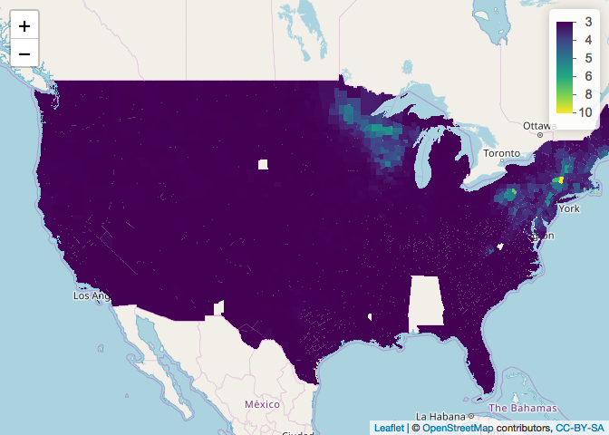
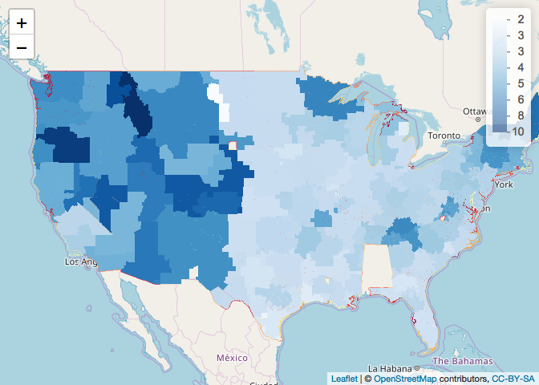
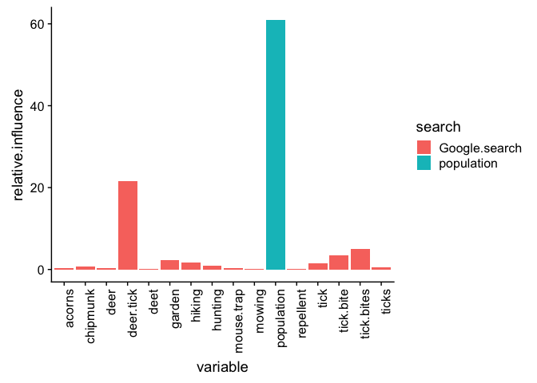
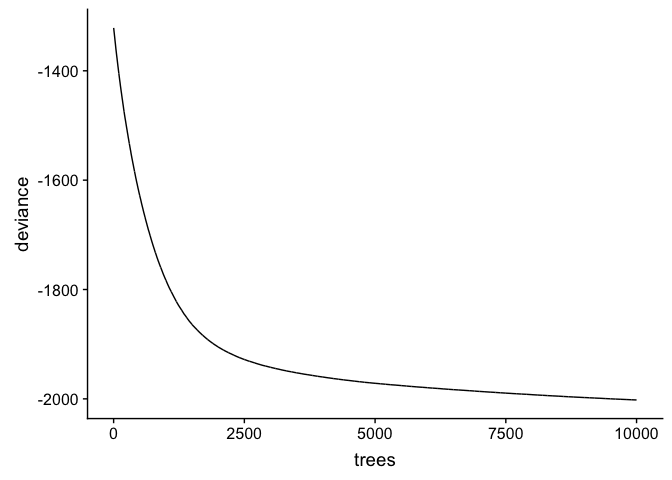
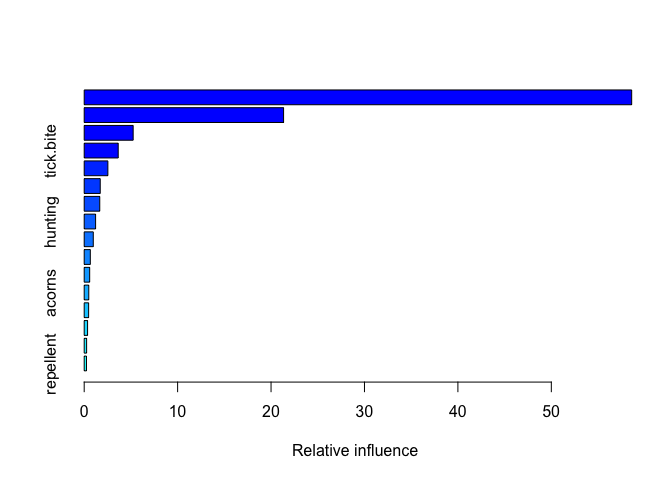
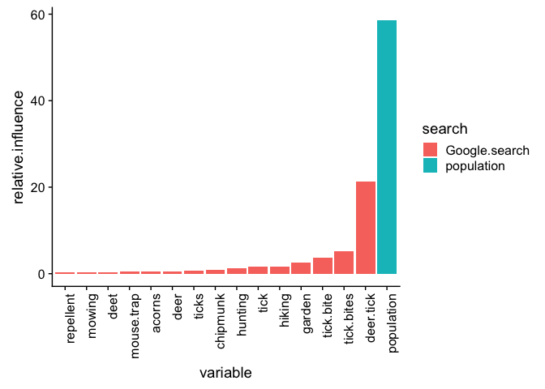
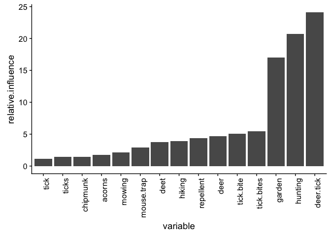
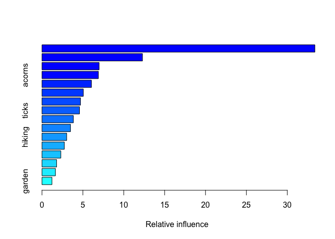

tick\_searches
================
Ilya
5/13/2018

#### Objective: Predict Lyme disease risk at temporal and spatial scales useful for decision-makers (public health agencies, healthcare providers, members of the public).

#### When we go outdoors, we run a risk of coming into contact with ticks that could give us disease-causing pathogens. In the eastern U.S., blacklegged ticks (Ixodes scapularis) transmit the bacterium Borrelia burgdorferi, which causes Lyme disease; in the West Coast, the Western blacklegged tick (Ixodes pacificus) is the vector for Lyme disease. Both of these ticks also transmit pathogens causing other diseases in people and pets. Tick activity varies depending on time of year, weather, wildlife host abundance, and other factors. Knowing the level of risk in our area at a particular time can help us decide what outdoor activities to pursue and what precautions to take (such as checking oneself for ticks after going into tick habitat, use of repellent).

#### Lyme disease risk arises from two interacting causes: first, the abundance of infected host-seeking blacklegged ticks; and second, human behavior that brings us into proximity of ticks. The abundance of infected ticks seeking hosts, also referred to as entomological risk, is influenced by the wildlife host community in a particular place, landscape characteristics (e.g., forest cover, geographic location), and weather. We are exposed to ticks through our work and recreation. Our risk further depends on the extent to which we apply tick-bite prevention methods.

#### Internet search data offer a source of real-time information on people's encounters with ticks. If we know people in our area are searching more for ticks, this could be a sign that tick activity is high and we need to be more vigilant against ticks. Volume of searches related to ecological factors that affect risk (e.g. "chipmunk") or activities that expose people to ticks (e.g., "hiking) or that reduce risk (e.g. "repellent), may also be useful in predicting risk. To evaluate whether internet search data provides a useful measure of disease risk, here we use Google trends data from 2004 to 2016 to predict Lyme disease incidence in those years.

##### install packages

    ## 
    ## Attaching package: 'geojsonio'

    ## The following object is masked from 'package:base':
    ## 
    ##     pretty

    ## 
    ## Attaching package: 'lubridate'

    ## The following object is masked from 'package:base':
    ## 
    ##     date

    ## 
    ## Attaching package: 'data.table'

    ## The following objects are masked from 'package:lubridate':
    ## 
    ##     hour, isoweek, mday, minute, month, quarter, second, wday,
    ##     week, yday, year

    ## The following object is masked from 'package:raster':
    ## 
    ##     shift

    ## 
    ## Attaching package: 'devtools'

    ## The following object is masked from 'package:geojsonio':
    ## 
    ##     lint

    ## 
    ## Attaching package: 'dplyr'

    ## The following objects are masked from 'package:data.table':
    ## 
    ##     between, first, last

    ## The following objects are masked from 'package:lubridate':
    ## 
    ##     intersect, setdiff, union

    ## The following objects are masked from 'package:raster':
    ## 
    ##     intersect, select, union

    ## The following objects are masked from 'package:stats':
    ## 
    ##     filter, lag

    ## The following objects are masked from 'package:base':
    ## 
    ##     intersect, setdiff, setequal, union

    ## Loading required package: survival

    ## Loading required package: lattice

    ## Loading required package: splines

    ## Loading required package: parallel

    ## Loaded gbm 2.1.3

    ## Loading required package: ggplot2

    ## 
    ## Attaching package: 'caret'

    ## The following object is masked from 'package:survival':
    ## 
    ##     cluster

    ## 
    ## Attaching package: 'cowplot'

    ## The following object is masked from 'package:ggplot2':
    ## 
    ##     ggsave

    ## 
    ## Attaching package: 'ggstance'

    ## The following objects are masked from 'package:ggplot2':
    ## 
    ##     geom_errorbarh, GeomErrorbarh

    ## 
    ## Attaching package: 'tidyr'

    ## The following object is masked from 'package:raster':
    ## 
    ##     extract

    ## Downloading GitHub repo PMassicotte/gtrendsR@master
    ## from URL https://api.github.com/repos/PMassicotte/gtrendsR/zipball/master

    ## Installing gtrendsR

    ## '/Library/Frameworks/R.framework/Resources/bin/R' --no-site-file  \
    ##   --no-environ --no-save --no-restore --quiet CMD INSTALL  \
    ##   '/private/var/folders/0d/qm_pqljx11s_ddc42g1_yscr0000gn/T/RtmpazDwjn/devtools1431e2ba4ad9b/PMassicotte-gtrendsR-35d98c0'  \
    ##   --library='/Library/Frameworks/R.framework/Versions/3.4/Resources/library'  \
    ##   --install-tests

    ## 

    ## phantomjs has been installed to /Users/fischhoff/Library/Application Support/PhantomJS

###### read in geojson file with nielsen dmas, plot map of dma with color based on percentage with cable (to check these data make sense)

``` r
#https://rstudio.github.io/leaflet/json.html
substrRight <- function(x, n){
  substr(x, nchar(x)-n+1, nchar(x))
}

#nielsen DMA
dma <- geojsonio::geojson_read("https://rawgit.com/simzou/nielsen-dma/master/nielsentopo.json",
  what = "sp")

#make map of dmas to make sure they look okay
pal <- colorNumeric("viridis", NULL)

#commenting this out because it does not display well in github_document
dmaMap <- leaflet(dma) %>%
  addTiles() %>%
  addPolygons(stroke = FALSE, smoothFactor = 0.3, fillOpacity = 1,
    fillColor = ~pal(log10(cableperc)),
    label = ~paste0(name, ": ", formatC(cableperc, big.mark = ","))) %>%
  addLegend(pal = pal, values = ~log10(cableperc), opacity = 1.0,
    labFormat = labelFormat(transform = function(x) round(10^x)))
dmaMap
```


``` r
#sort dma by dma1
dma.df = as.data.frame(dma)
dma.df$dma1 = as.character(dma.df$dma1)
dma.df$state = substrRight(dma.df$dma1, 2)

dma.df = dma.df[order(dma.df$state, dma.df$dma1),]
save(dma.df, file ="dma.df.Rdata")
write.csv(dma.df, file = "dma.csv")
```

get google trends data
======================

##### We used the term "tick bite", and the top 10 related queries for that term. We excluded queries related to tick species other than the blacklegged tick (Ixodes scapularis), and related to tick encounters with pets. We also excluded queries such as "what does tick bite look like", that contain within it other search terms already included (in this case, "tick bite"). We also included several search terms related to ecological factors (e.g. "deer") and behavioral factors (e.g. "repellent") that may mediate risk. Google Trends values are from 0 to 100. Values reflect the popularity of a search term, relative to the popularity of other search terms within a geographical area.

``` r
#make function for substring
substrRight <- function(x, n){
  substr(x, nchar(x)-n+1, nchar(x))
}

years = seq(from = 2004, to = 2016, by = 1)
#sequence of years lagged by one year, to be used for terms like chipmunk that should be lagged that way
year.lag.1 = seq(from = 2003, to = 2015, by =1)
#sequence of years lagged by two years
year.lag.2 = seq(from = 2002, to = 2014, by =1)

#make data.frame of start and end day of each year
start.month.day = rep("01-01",length(years))
end.month.day = rep("12-31", length(years))
start.days = paste(as.character(years), start.month.day, sep="-")
end.days = paste(as.character(years), end.month.day, sep="-")
lag0=rep(0, length(end.days))
days_df = data.frame(year = years,
                     start.days = start.days,
                     end.days = end.days,
                     lag = lag0)

start.days.lag1 = paste(as.character(year.lag.1), start.month.day, sep="-")
end.days.lag1 = paste(as.character(year.lag.1), end.month.day, sep="-")
lag1=rep(1, length(end.days.lag1))
days_tmp = data.frame(year = year.lag.1,
                      start.days = start.days.lag1,
                      end.days = end.days.lag1,
                      lag = lag1)
days_df = rbind(days_df, days_tmp)

start.days.lag2 = paste(as.character(year.lag.2), start.month.day, sep="-")
end.days.lag2 = paste(as.character(year.lag.2), end.month.day, sep="-")
lag2=rep(2, length(end.days.lag2))
days_tmp = data.frame(year = year.lag.2,
                      start.days = start.days.lag2,
                      end.days = end.days.lag2,
                      lag = lag2)
days_df = rbind(days_df, days_tmp)

terms = c("garden", "mowing", "tick", "hiking", "hunting", "deet", "repellent", "deer tick", "tick bites", "ticks", "chipmunk", "mouse trap",
           "deer", "acorns", "mouse")
terms_current_df_field = c("garden", "mowing","tick", "hiking", "hunting", "deet","repellent","deer.tick", "tick bites", "ticks", "chipmunk", "mouse.trap", "deer", "acorns", "mouse")
lag_seq = c(rep(0,10) ,1,1,2,2,1)

#test set, commenting out for now
# terms = c("deet")
# terms_current_df_field = c("deet")
# lag_seq = c(0)

out = NULL
a = 1
b =1

#confirm that values of NA are likely 0
#     tmp <- gtrends(keyword = "deet", geo = c("US"), time = paste(year_subset$start.days, year_subset$end.days, sep = " "), category = 0, hl = "en-US",
#     low_search_volume = TRUE)
# tmp$interest_by_dma$hits
# tmp$interest_by_dma$location
    
for (a in 1:length(years)){
#for (a in c(1:2)){#test set
  print(a)
    #initialize a data.frame with one search term
    year_subset= subset(days_df, lag == 0 & year == years[a])
    gt <- gtrends(keyword = "tick bite", geo = c("US"), time = paste(year_subset$start.days, year_subset$end.days, sep = " "), category = 0, hl = "en-US",
    low_search_volume = TRUE)
    #get last two characters for the state
    gt$interest_by_dma$state = substrRight(gt$interest_by_dma$location, 2)
    gt$interest_by_dma$year = years[a]
    gt = gt$interest_by_dma
    gt = gt[order(gt$location),]

    gt$tick.bite = gt$hits
    gt$tick.bite[gt$tick.bite == "<1"]=  1#replace any "<1"
    gt$tick.bite[is.na(gt$tick.bite)]=  0#replace any NA with 0
    gt$tick.bite = as.numeric(as.character(gt$tick.bite))
    gt = gt[,c("location","tick.bite", "state", "year")]

  for (b in 1:length(terms)){#begin for loop through terms
    lag_tmp = lag_seq[b]
    #year
    year_subset = subset(days_df, lag == lag_tmp & year == (years[a]-lag_tmp))#find the year in question for this term and relevant time lag
    #only proceed if 2004 or later, else no google trends data
    if (year_subset$year >=2004){
      #now can proceed
            #deer tick
        gt.tmp <- gtrends(keyword = terms[b], geo = c("US"), time = paste(year_subset$start.days, year_subset$end.days, sep = " "), category = 0, hl = "en-US",
                           low_search_volume = TRUE)
        gt.tmp$interest_by_dma$state = substrRight(gt.tmp$interest_by_dma$location, 2)
        gt.tmp$interest_by_dma$year = years[a]
        gt.tmp = gt.tmp$interest_by_dma
        gt.tmp = gt.tmp[order(gt.tmp$location),]
        gt.tmp$hits[gt.tmp$hits=="<1"]= 1#replace any "<1"
        gt.tmp$hits[is.na(gt.tmp$hits)]=  0#replace any NA with 0
        gt.tmp$hits = as.numeric(as.character(gt.tmp$hits))
        gt.tmp[,c(terms_current_df_field[b])]= gt.tmp$hits
        gt.tmp = gt.tmp[,c("location",terms_current_df_field[b], "state", "year")]
        #now add to gt
        #gt.tmp$location == gt$location
        gt[,c(terms_current_df_field[b])] = gt.tmp[,c(terms_current_df_field[b])]
        #rm(gt.tmp)
    } 
    else if (year_subset$year <2004){
      print("else")
      gt[,c(terms_current_df_field[b])]=NA
    }
  }#end for loop through terms
  out = rbind(out, gt)
}#end for loop through years
```

    ## [1] 1
    ## [1] "else"
    ## [1] "else"
    ## [1] "else"
    ## [1] "else"
    ## [1] "else"
    ## [1] 2
    ## [1] "else"
    ## [1] "else"
    ## [1] 3
    ## [1] 4
    ## [1] 5
    ## [1] 6
    ## [1] 7
    ## [1] 8
    ## [1] 9
    ## [1] 10
    ## [1] 11
    ## [1] 12
    ## [1] 13

``` r
gt = out
save(gt, file = "gt.Rdata")

#output one year/keyword subset for assigning google dma names to dma names in json file (they are slightly different)
dma.tab = subset(gt, year ==2004) 
dma.tab = dma.tab[order(dma.tab$state),]
write.csv(dma.tab, file = "dma.tab.google.csv")
```

##### assign google dma names to dma-county file (do this part in excel, pseudo code here)

``` r
#next: 
#open dma.csv and  dma.tab.google.csv in excel, 
#copy in google trends dma names into dma.csv, 
#align the two dma name sets, fixing state abbreviations, 
#and save dma.csv as dma.google.assigned.by.hand2.csv
```

##### read dma json file back in after assigning google trends dma names to it and fixing state abbreviations

``` r
load("dma.df.Rdata")
dma.assigned = read.csv( "dma.google.assigned.by.hand2.csv")
dma.assigned = subset(dma.assigned, !is.na(id))
names(dma.assigned)[names(dma.assigned)=="location"]="google.dma"
dma.assigned = dma.assigned[order(dma.assigned$id),]
dma.df = dma.df[order(dma.df$id),]
#check these are all true as error check nothing odd happened
dma.assigned$state = as.character(dma.assigned$state)

inds = which(dma.df$dma1 !=dma.assigned$dma1)
inds#should be empty
```

    ## integer(0)

``` r
dma.ggl <- dma.assigned
keep.col = c("latitude","dma","dma1", "longitude", "state", "google.dma")
dma.ggl = dma.ggl[,keep.col]

save(dma.ggl, file = "dma.ggl.Rdata")
```

##### now assign google dmas to counties

``` r
require(sp)
load("dma.ggl.Rdata")

#https://catalog.data.gov/dataset/us-counties/resource/cc1b2e44-d5a4-4c26-82c1-39b0da37bfb8
counties.test <- shapefile("tl_2016_us_county.shp")
counties = counties.test
#confirm there is a projetion in counties
projection(counties)#there is none, but we're not going to use it
```

    ## [1] "+proj=longlat +datum=NAD83 +no_defs +ellps=GRS80 +towgs84=0,0,0"

``` r
#pal <- colorNumeric("viridis", NULL)

#make map of counties to make sure they look like counties -- commented out to make markdown smaller
# counties_map <-  leaflet(counties) %>%
#   addTiles() %>%
#   addPolygons(stroke = FALSE, smoothFactor = 0.3, fillOpacity = 1,
#     fillColor = ~pal((as.numeric(STATEFP))),
#     label = ~paste0(NAME, ": ", formatC(as.numeric(STATEFP), big.mark = ","))) %>%
#   addLegend(pal = pal, values = ~(as.numeric(STATEFP)), opacity = 1.0,
#     labFormat = labelFormat(transform = function(x) round(10^x)))
# counties_map

#read dma in again as polygons (need it to be polygons, not data.frame)
dma <- geojsonio::geojson_read("https://rawgit.com/simzou/nielsen-dma/master/nielsentopo.json",
  what = "sp")

#tried assigning a projection to dma, but it seemed to result in holes in polygons
# dma_project <- projection(dma, CRS("+proj=longlat +datum=WGS84 +no_defs +ellps=WGS84 +towgs84=0,0,0"))

#then assign google dma name
#make version of dma.ggl w/ only relevant columns
dma.ggl.sm = dma.ggl[,c("dma1","google.dma")]
#merge dma with dma.ggl.sm, assigning google dma name
#source: http://www.nickeubank.com/wp-content/uploads/2015/10/RGIS2_MergingSpatialData_part1_Joins.html#spatial-non-spatial
#doing this with merge messes it up w/ respect to holes in polygons, so instead use for loop
# dma = merge(dma,dma.ggl.sm, by.x = "dma1", by.y = "dma1")
dma$dma.google = NA
udma = unique(dma$dma1)
a = 1
for (a in 1:length(udma)){
  ind = which(dma$dma1==udma[a])
  ind.google = which(as.character(dma.ggl.sm$dma1)==udma[a])
  dma$dma.google[ind]= as.character(dma.ggl.sm$google.dma[ind.google])
}

#counties has a projection; dma does not; assigning no projection to counties
projection(counties) <- projection(dma)#package raster

#this does not work if identical CRS(x,y) is not true
counties$dma.ggl <- over( counties, dma)$dma.google#name of dma

#read in fps codes, in order to assign abbreviated and long state name to counties
fps = fread("https://www2.census.gov/geo/docs/reference/state.txt")
fps = fps[,c("STATE", "STUSAB", "STATE_NAME")]
names(fps)[names(fps)=="STATE"]="STATEFP"

setdiff(names(fps), names(counties))
```

    ## [1] "STUSAB"     "STATE_NAME"

``` r
counties$STATEFP = as.numeric(as.character(counties$STATEFP))
dim(counties)
```

    ## [1] 3233   18

``` r
counties = merge(counties,fps, by.x = "STATEFP", by.y = "STATEFP")

dim(counties)#confirm no counties are lost
```

    ## [1] 3233   20

``` r
save(counties, file = "counties.Rdata")

#used this below to check for holes, and found them in dma when it had a projection assigned (which resulted in function over failing)
# require(devtools)
# install_github("eblondel/cleangeo")
# require(cleangeo)
# report <- clgeo_CollectionReport(counties)
# summary <- clgeo_SummaryReport(report)
# issues <- report[report$valid == FALSE,]
# 
# report <- clgeo_CollectionReport(dma)
# summary <- clgeo_SummaryReport(report)
# issues <- report[report$valid == FALSE,]
```

##### read in CDC Lyme data and reshape

``` r
#website: https://www.cdc.gov/lyme/stats/index.html
L = read.csv("https://www.cdc.gov/lyme/resources/ld-Case-Counts-by-County-00-16.csv")
L = reshape(L, direction = "long", varying = 5:21, sep = "")
dim(L)
```

    ## [1] 54281     7

``` r
save(L, file = "L.Rdata")
```

##### read in census data from SEER.

``` r
library(data.table)
#source: https://seer.cancer.gov/popdata/download.html
#dictionary for data: https://seer.cancer.gov/popdata/popdic.html
A = read.table("us.1990_2016.19ages.adjusted.txt", skip = 1)
A=as.data.frame(A)
A$V1 = as.character(A$V1)
A$year = substr(A$V1, 1, 4)
A$state = substr(A$V1, 5, 6)
A$county_fps = substr(A$V1, 9, 11)
A$population = substr(A$V1, 19, 26)
save(A, file = "A.Rdata")
# 
```

fix population in census data
=============================

``` r
library(data.table)
load("A.Rdata") 
A$population.2 =  as.numeric(substr(A$population,regexpr("[^0]",A$population),nchar(A$population)))
 A$population = A$population.2
 #make field with state followed by county_fps -- make as numeric to get rid of leading 0s so it matches up with fps next
A$state_countyfps = paste(A$state, as.numeric(as.character(A$county_fps)))
 length(unique(A$state_countyfps))
```

    ## [1] 3155

``` r
 keep.col = c("V1", "year", "state", "county_fps", "population", "state_countyfps")
A = A[, keep.col]

# #county fps
 fps = fread("https://www2.census.gov/geo/docs/reference/codes/files/national_county.txt")
 #assign meaningful names
 names(fps)= c("state", "statefp", "county_fps", "county", "classfp")
 fps = data.frame(fps)
 keep.col = c("state", "county", "county_fps", "statefp")
 fps = fps[, keep.col]
 fps$state_countyfps = paste(fps$state, fps$county_fps)
 #commenting this out because there each county_fps may be used in multiple states -- not unique nationally 
 #A$county_fps=as.numeric(as.character(A$county_fps))

 test = setdiff(A$state_countyfps, fps$state_countyfps )
 A.test = subset(A, state_countyfps %in% test)
 unique(A.test$state)#includes AK, AZ, CO, HI, VA, KR
```

    ## [1] "AK" "AZ" "CO" "HI" "VA" "KR"

``` r
 #A.test$county_fps = as.numeric(as.character(A.test$county_fps))
 #to merge need to add county field
 #A.test$county = NA#14 counties in A don't have match in fps 
 #A.test$statefp = NA
 
 A$county_fps=as.numeric(as.character(A$county_fps))#removing trailing ones means can merge by this field (together with state_countyfps and state)
 #A.test2 = merge(A.test, fps, by = intersect(names(A.test), names(fps)))
  A2 = merge(A, fps)#need to merge by this field or else some state_countyfps are lost
  length(unique(A2$state_countyfps))
```

    ## [1] 3141

``` r
#
 #A3 = rbind(A2, A.test)
# A = A3
  A3 = A2
 A3$year = as.numeric(A3$year)
 A3$population =  as.numeric(substr(A3$population,regexpr("[^0]",A3$population),nchar(A3$population)))
# A2 = A
 save(A3, file = "A3.Rdata")
```

##### read in Census data and summarize by year

``` r
load("A3.Rdata")
A = A3
keep = c("state", "population", "county", "year", "county_fps", "state_countyfps", "statefp")
A1 = A[,keep]

#now use county_state as group_by variable (as alternative to state_countyfps that is easier to interpret)
A1$county_state = paste(A1$county, A1$state, sep = "_")
A2 <- A1 %>%
  group_by(county_state, year) %>%
  summarize(population = sum(population),
            county = county[1], 
            state = state[1], 
            state_countyfps = state_countyfps[1],
            county_fps=county_fps[1],
            statefp = statefp[1])
length(unique(A2$state_countyfps))
```

    ## [1] 3141

``` r
census = A2
save(census, file = "census.Rdata")
```

##### read back in Census data, reshape long, assign full names of states

``` r
load("census.Rdata")
#names(census)[names(census)=="state"]="state_name"
names(census)[names(census)=="county"]="county_name"
census = subset(census, year >=2004)

#read in file of state abbreviations
states = read.csv("50_us_states_all_data.csv")
states = states[,c(2:3)]
colnames(states) =c("state_name", "state")

intersect(names(census), names(states))
```

    ## [1] "state"

``` r
#add state abbreviation to census data
census1 = merge(census, states, by = "state")
#loses a few rows
#check a few rows
head(census1)
```

    ##   state                 county_state year population
    ## 1    AK       North Slope Borough_AK 2016       9606
    ## 2    AK       Bristol Bay Borough_AK 2016        898
    ## 3    AK Matanuska-Susitna Borough_AK 2016     104365
    ## 4    AK    Anchorage Municipality_AK 2013     301143
    ## 5    AK    Anchorage Municipality_AK 2011     296397
    ## 6    AK    Anchorage Municipality_AK 2010     293415
    ##                 county_name state_countyfps county_fps statefp state_name
    ## 1       North Slope Borough          AK 185        185       2     Alaska
    ## 2       Bristol Bay Borough           AK 60         60       2     Alaska
    ## 3 Matanuska-Susitna Borough          AK 170        170       2     Alaska
    ## 4    Anchorage Municipality           AK 20         20       2     Alaska
    ## 5    Anchorage Municipality           AK 20         20       2     Alaska
    ## 6    Anchorage Municipality           AK 20         20       2     Alaska

``` r
tail(census1)
```

    ##       state       county_state year population     county_name
    ## 39894    WY Washakie County_WY 2005       8022 Washakie County
    ## 39895    WY  Natrona County_WY 2005      69922  Natrona County
    ## 39896    WY  Natrona County_WY 2006      70806  Natrona County
    ## 39897    WY   Weston County_WY 2015       7230   Weston County
    ## 39898    WY   Carbon County_WY 2004      15236   Carbon County
    ## 39899    WY  Natrona County_WY 2014      81432  Natrona County
    ##       state_countyfps county_fps statefp state_name
    ## 39894           WY 43         43      56    Wyoming
    ## 39895           WY 25         25      56    Wyoming
    ## 39896           WY 25         25      56    Wyoming
    ## 39897           WY 45         45      56    Wyoming
    ## 39898            WY 7          7      56    Wyoming
    ## 39899           WY 25         25      56    Wyoming

``` r
length(unique(census$year))
```

    ## [1] 13

``` r
save(census1, file = "census1.Rdata")
```

##### combine census and LD data

``` r
load("census1.Rdata")
census = census1
load("L.Rdata")
#make county_name and county_state
names(L)[names(L)=="Ctyname"]="county_name"
names(L)[names(L)=="Stname"]="state_name"
names(L)[names(L)=="time"]="year"
L$county_state =paste(L$county_name, L$state_name, sep = " ")
L = L[, c("county_name", "county_state", "state_name", "year", "Cases")]

test  = subset(census, is.na(population))#should be empty
#census = census[, c("state_name", "county_name", "year", "population", "state", "county_state")]
census$county_state=paste(census$county_name, census$state_name, sep = " ")

length(setdiff(L$county_state,census$county_state))
```

    ## [1] 125

``` r
length(setdiff(census$county_state,L$county_state))
```

    ## [1] 5

``` r
#seems to be missing Alabama, but that's okay as it's way South so doesn't have much Lyme 
L1 = merge(census, L, by = intersect(names(census), names(L)))
L = L1
L$incidence = 100000*L$Cases/L$population
length(unique(L$year))
```

    ## [1] 13

``` r
length(unique(L$state_countyfps))
```

    ## [1] 3068

``` r
Lcensus = L
save(Lcensus, file = "Lcensus.Rdata") 
```

##### assign DMA and google trends to Lyme disease data

``` r
require(sp)
load("Lcensus.Rdata")#Lyme
L = Lcensus
L$county_state=tolower(L$county_state)
load("gt.Rdata")
load("counties.Rdata")
names(counties)[names(counties)=="NAMELSAD"]="county_name"
names(counties)[names(counties)=="STUSAB"]="state"
counties$county_state =tolower(paste(counties$county_name, counties$STATE_NAME, sep = " "))
keep.col = c("dma.ggl", "county_state", "STATEFP"      ,"COUNTYFP", "county_name", "INTPTLAT", "INTPTLON","state"     ,  "STATE_NAME"    )
counties = counties[,keep.col]
counties.df = data.frame(counties)
names(counties.df)=tolower(names(counties.df))
counties.df = counties.df[,c("dma.ggl", "county_state")]
#lose some AL counties here
dim(L)
```

    ## [1] 39844    11

``` r
#make version that is numeric
L$state_county_fp = paste(L$statefp, L$county_fps)
L =L[,c("county_state", "year", "Cases", "county_name", "state_name", "state", "population", "incidence", "state_county_fp")]
Lc = merge(L,counties.df,by = intersect(names(L), names(counties.df)))
dim(Lc)#none are lost
```

    ## [1] 39844    10

``` r
#assign google trends to L
names(gt)[names(gt)=="location"]="dma.ggl"

# gt = gt[,c("dma.ggl", "deet", "year")]

gt = gt[,c("dma.ggl", "tick.bite"      , "year"      , "garden"    , "mowing"    , "tick",       "hiking", "hunting"  ,"deet"       ,"repellent",  "deer.tick" , "tick bites", "ticks"   ,   "chipmunk",   "mouse.trap", "deer","acorns", "mouse")]
L1 = merge(Lc, gt, by = c("dma.ggl", "year"))

#L1 = subset(L1, !is.na(incidence))
save(L1, file = "L1.Rdata")
```

##### summarize by county across time for plotting

``` r
load("L1.Rdata")
L1$tick.bites = L1[,20]
names(L1)
```

    ##  [1] "dma.ggl"         "year"            "county_state"   
    ##  [4] "Cases"           "county_name"     "state_name"     
    ##  [7] "state"           "population"      "incidence"      
    ## [10] "state_county_fp" "tick.bite"       "garden"         
    ## [13] "mowing"          "tick"            "hiking"         
    ## [16] "hunting"         "deet"            "repellent"      
    ## [19] "deer.tick"       "tick bites"      "ticks"          
    ## [22] "chipmunk"        "mouse.trap"      "deer"           
    ## [25] "acorns"          "mouse"           "tick.bites"

``` r
# terms_current_df_field = c("garden", "mowing","tick", "hiking", "hunting", "deet","repellent","deer.tick", "tick bites", "ticks", "chipmunk", "mouse.trap", "deer", "acorns")

L1$tick.bite=as.numeric(as.character(L1$tick.bite))
library(dplyr)
Lc<-L1 %>%
  group_by(county_state) %>%
  summarize(population = mean(population[!is.na(population)]),
            Cases = sum(Cases),
            incidence = mean(incidence[!is.na(incidence)]),
            garden = mean(garden[!is.na(garden)]),
            mowing = mean(mowing[!is.na(mowing)]),
            hunting = mean(hunting[!is.na(hunting)]),
            tick = mean(tick[!is.na(tick)]),
            deer.tick = mean(deer.tick[!is.na(deer.tick)]),
            tick.bite = mean(tick.bite[!is.na(tick.bite)]),
            tick.bites=mean(tick.bites[!is.na(tick.bites)]),
            ticks = mean(ticks[!is.na(ticks)]), 
            chipmunk = mean(chipmunk[!is.na(chipmunk)]),
            mouse.trap = mean(mouse.trap[!is.na(mouse.trap)]),
            mouse = mean(mouse[!is.na(mouse)]),
            deer = mean(deer[!is.na(deer)]),
            acorns = mean(acorns[!is.na(acorns)]),
            repellent = mean(repellent[!is.na(repellent)]),
            hiking = mean(hiking[!is.na(hiking)]),
            deet = mean(deet[!is.na(deet)]),
            state = state[1],
            county_name = county_name[1],
            state_county_fp = state_county_fp[1],
            #county_fps = county_fps[1],
            #statefp = statefp[1],
            dma.ggl = dma.ggl[1]
            )
#summary(L1$incidence.dma)
#L <- L1
save(Lc, file = "Lc.Rdata")


tmp = subset(Lc, county_name %in% "Dutchess County")
```

##### read in shapefile of counties and make map of incidence by county

``` r
load("Lc.Rdata")
L = Lc
#L$state_county_fp = paste(L$statefp, L$county_fps)
#L$COUNTYFP = as.numeric(as.character(L$countyfp))
C <- shapefile("/Users/fischhoff/app_wild/tick_searches/age_codes/cb_2017_us_county_500k.shp")
C$COUNTYFP=as.numeric(as.character(C$COUNTYFP))
head(C$STATEFP)
```

    ## [1] "01" "01" "01" "01" "01" "01"

``` r
C$STATEFP=as.numeric(as.character(C$STATEFP))
C$state_county_fp = paste(C$STATEFP, C$COUNTYFP)
outC <- append_data(C, L, key.shp = "state_county_fp", key.data = "state_county_fp",
                    ignore.duplicates = TRUE)
```

    ## Under coverage: 197 out of 3233 shape features did not get appended data. Run under_coverage() to get the corresponding feature id numbers and key values.

``` r
test = under_coverage()
check = subset(L, state_county_fp %in% test$value)
check2 = subset(C, state_county_fp %in% test$value)
unique(check$county_state)
```

    ## character(0)

``` r
#make map of dmas to make sure they look okay
pal <- colorNumeric("viridis", NULL)
#commenting this out because it does not display well in github_document
M<- leaflet(outC) %>%
  addTiles() %>%
  setView(lat = 39.5, lng=-98.5, zoom =4) %>%
    addPolygons(stroke = FALSE, smoothFactor = 0.3, fillOpacity = 1,
    fillColor = ~pal(outC$incidence),
    #label with county name 
    label = ~paste0(county_name, ": ", formatC(outC$incidence, big.mark = ","))) %>%
   addLegend(pal = pal, values = outC$incidence, opacity = 1.0,
     labFormat = labelFormat(transform = function(x) round(10^x)))

mapshot(M, file = "incidence.png")
M
```


##### read in shapefile of counties and make map of incidence\_rescaled (from 0 to 1) by county -- to see if rescaling data makes patterns more apparent

``` r
load("Lc.Rdata")
L = Lc
#retitle column to make it more obvious how to link to shapefile
#names(L)[names(L)=="state_countyfps"]="state_county_fp"
#L$state_county_fp = paste(L$statefp, L$county_fps)
C <- shapefile("/Users/fischhoff/app_wild/tick_searches/age_codes/cb_2017_us_county_500k.shp")
C$COUNTYFP=as.numeric(as.character(C$COUNTYFP))
head(C$STATEFP)
```

    ## [1] "01" "01" "01" "01" "01" "01"

``` r
C$STATEFP=as.numeric(as.character(C$STATEFP))
C$state_county_fp = paste(C$STATEFP, C$COUNTYFP)
outC <- append_data(C, L, key.shp = "state_county_fp", key.data = "state_county_fp",
                    ignore.duplicates = TRUE)
```

    ## Under coverage: 197 out of 3233 shape features did not get appended data. Run under_coverage() to get the corresponding feature id numbers and key values.

``` r
outC = subset(outC, !is.na(incidence))
outC$incidence_rescaled =rescale_mid(outC$incidence, to = c(0,1), mid=median(outC$incidence))
test = under_coverage()
check = subset(L, state_county_fp %in% test$value)
check2 = subset(C, state_county_fp %in% test$value)
unique(check$county_state)
```

    ## character(0)

``` r
#make map of dmas to make sure they look okay
pal <- colorNumeric("viridis", NULL)
#commenting this out because it does not display well in github_document
inc_resc_map<- leaflet(outC) %>%
  addTiles() %>%
    setView(lat = 39.5, lng=-98.5, zoom =4) %>%
  addPolygons(stroke = FALSE, smoothFactor = 0.3, fillOpacity = 1,
    fillColor = ~pal(outC$incidence_rescaled),
    #label with county name 
    label = ~paste0(county_name, ": ", formatC(outC$incidence_rescaled, big.mark = ","))) %>%
   addLegend(pal = pal, values = outC$incidence_rescaled, opacity = 1.0,
     labFormat = labelFormat(transform = function(x) round(10^x)))
inc_resc_map
```


``` r
#mapshot(N, file = "incidence_rescaled.png")
```

##### read in shapefile of counties and make map of tick.bite by county, together with outlines of counties by dma

``` r
load("Lc.Rdata")
L = Lc
#L$state_county_fp = paste(L$statefp, L$county_fps)
#L$COUNTYFP = as.numeric(as.character(L$countyfp))
C <- shapefile("/Users/fischhoff/app_wild/tick_searches/age_codes/cb_2017_us_county_500k.shp")
C$COUNTYFP=as.numeric(as.character(C$COUNTYFP))
head(C$STATEFP)
```

    ## [1] "01" "01" "01" "01" "01" "01"

``` r
C$STATEFP=as.numeric(as.character(C$STATEFP))
C$state_county_fp = paste(C$STATEFP, C$COUNTYFP)
outC <- append_data(C, L, key.shp = "state_county_fp", key.data = "state_county_fp",
                    ignore.duplicates = TRUE)
```

    ## Under coverage: 197 out of 3233 shape features did not get appended data. Run under_coverage() to get the corresponding feature id numbers and key values.

``` r
outC = subset(outC, !is.na(tick.bite))
outC = subset(outC, tick.bite!="NaN")

outC$tick.bite_rescaled =rescale_mid(outC$tick.bite, to = c(0,1), mid=median(outC$tick.bite))
test = under_coverage()
check = subset(L, state_county_fp %in% test$value)
check2 = subset(C, state_county_fp %in% test$value)
unique(check$county_state)
```

    ## character(0)

``` r
#make map of dmas to make sure they look okay
pal <- colorNumeric("Blues", NULL)
pal_dma <- colorNumeric("YlOrRd", NULL)
#commenting this out because it does not display well in github_document
leaflet(outC) %>%
  addTiles() %>%
      setView(lat = 39.5, lng=-98.5, zoom =4) %>%

    #add polygons for dma.ggl 
  addPolygons(stroke = TRUE, smoothFactor=0.3, opacity = 1, weight = 1,
              fill=FALSE,color = ~pal_dma(as.numeric(as.factor(outC$dma.ggl))))%>%

  addPolygons(stroke = FALSE, smoothFactor = 0.3, fillOpacity = 1,
    fillColor = ~pal(outC$tick.bite_rescaled),
    #label with county name
    label = ~paste0(county_name, ": ", formatC(outC$tick.bite_rescaled, big.mark = ","))) %>%
   addLegend(pal = pal, values = outC$tick.bite_rescaled, opacity = 0.5,
     labFormat = labelFormat(transform = function(x) round(10^x)))
```



##### read in shapefile of counties and make map of hunting\_rescaled by dma, together with outlines of counties by dma

``` r
load("Lc.Rdata")
L = Lc
#L$state_county_fp = paste(L$statefp, L$county_fps)
#L$COUNTYFP = as.numeric(as.character(L$countyfp))
C <- shapefile("/Users/fischhoff/app_wild/tick_searches/age_codes/cb_2017_us_county_500k.shp")
C$COUNTYFP=as.numeric(as.character(C$COUNTYFP))
head(C$STATEFP)
```

    ## [1] "01" "01" "01" "01" "01" "01"

``` r
C$STATEFP=as.numeric(as.character(C$STATEFP))
C$state_county_fp = paste(C$STATEFP, C$COUNTYFP)
outC <- append_data(C, L, key.shp = "state_county_fp", key.data = "state_county_fp",
                    ignore.duplicates = TRUE)
```

    ## Under coverage: 197 out of 3233 shape features did not get appended data. Run under_coverage() to get the corresponding feature id numbers and key values.

``` r
outC = subset(outC, !is.na(tick.bite))
outC = subset(outC, tick.bite!="NaN")

outC$hunting_rescaled =rescale_mid(outC$hunting, to = c(0,1), mid=median(outC$hunting))
test = under_coverage()
check = subset(L, state_county_fp %in% test$value)
check2 = subset(C, state_county_fp %in% test$value)
unique(check$county_state)
```

    ## character(0)

``` r
#make map of dmas to make sure they look okay
pal <- colorNumeric("Blues", NULL)
pal_dma <- colorNumeric("YlOrRd", NULL)
#commenting this out because it does not display well in github_document
leaflet(outC) %>%
  addTiles() %>%
      setView(lat = 39.5, lng=-98.5, zoom =4) %>%

    #add polygons for dma.ggl 
  addPolygons(stroke = TRUE, smoothFactor=0.3, opacity = 1, weight = 1,
              fill=FALSE,color = ~pal_dma(as.numeric(as.factor(outC$dma.ggl))))%>%

  addPolygons(stroke = FALSE, smoothFactor = 0.3, fillOpacity = 1,
    fillColor = ~pal(outC$hunting_rescaled),
    #label with county name
    label = ~paste0(county_name, ": ", formatC(outC$hunting_rescaled, big.mark = ","))) %>%
   addLegend(pal = pal, values = outC$hunting_rescaled, opacity = 0.5,
     labFormat = labelFormat(transform = function(x) round(10^x)))
```


##### read in shapefile of counties and make map of hiking\_rescaled by dma, together with outlines of counties by dma

``` r
load("Lc.Rdata")
L = Lc
#L$state_county_fp = paste(L$statefp, L$county_fps)
#L$COUNTYFP = as.numeric(as.character(L$countyfp))
C <- shapefile("/Users/fischhoff/app_wild/tick_searches/age_codes/cb_2017_us_county_500k.shp")
C$COUNTYFP=as.numeric(as.character(C$COUNTYFP))
head(C$STATEFP)
```

    ## [1] "01" "01" "01" "01" "01" "01"

``` r
C$STATEFP=as.numeric(as.character(C$STATEFP))
C$state_county_fp = paste(C$STATEFP, C$COUNTYFP)
outC <- append_data(C, L, key.shp = "state_county_fp", key.data = "state_county_fp",
                    ignore.duplicates = TRUE)
```

    ## Under coverage: 197 out of 3233 shape features did not get appended data. Run under_coverage() to get the corresponding feature id numbers and key values.

``` r
outC = subset(outC, !is.na(tick.bite))
outC = subset(outC, tick.bite!="NaN")

outC$hiking_rescaled =rescale_mid(outC$hiking, to = c(0,1), mid=median(outC$hiking))
test = under_coverage()
check = subset(L, state_county_fp %in% test$value)
check2 = subset(C, state_county_fp %in% test$value)
unique(check$county_state)
```

    ## character(0)

``` r
#make map of dmas to make sure they look okay
pal <- colorNumeric("Blues", NULL)
pal_dma <- colorNumeric("YlOrRd", NULL)
#commenting this out because it does not display well in github_document
leaflet(outC) %>%
  addTiles() %>%
      setView(lat = 39.5, lng=-98.5, zoom =4) %>%

    #add polygons for dma.ggl 
  addPolygons(stroke = TRUE, smoothFactor=0.3, opacity = 1, weight = 1,
              fill=FALSE,color = ~pal_dma(as.numeric(as.factor(outC$dma.ggl))))%>%

  addPolygons(stroke = FALSE, smoothFactor = 0.3, fillOpacity = 1,
    fillColor = ~pal(outC$hiking_rescaled),
    #label with county name
    label = ~paste0(county_name, ": ", formatC(outC$hiking_rescaled, big.mark = ","))) %>%
   addLegend(pal = pal, values = outC$hiking_rescaled, opacity = 0.5,
     labFormat = labelFormat(transform = function(x) round(10^x)))
```



##### read in shapefile of counties and make map of deer\_rescaled by dma, together with outlines of counties by dma

``` r
load("Lc.Rdata")
L = Lc
#L$state_county_fp = paste(L$statefp, L$county_fps)
#L$COUNTYFP = as.numeric(as.character(L$countyfp))
C <- shapefile("/Users/fischhoff/app_wild/tick_searches/age_codes/cb_2017_us_county_500k.shp")
C$COUNTYFP=as.numeric(as.character(C$COUNTYFP))
head(C$STATEFP)
```

    ## [1] "01" "01" "01" "01" "01" "01"

``` r
C$STATEFP=as.numeric(as.character(C$STATEFP))
C$state_county_fp = paste(C$STATEFP, C$COUNTYFP)
outC <- append_data(C, L, key.shp = "state_county_fp", key.data = "state_county_fp",
                    ignore.duplicates = TRUE)
```

    ## Under coverage: 197 out of 3233 shape features did not get appended data. Run under_coverage() to get the corresponding feature id numbers and key values.

``` r
outC = subset(outC, !is.na(tick.bite))
outC = subset(outC, tick.bite!="NaN")

outC$deer_rescaled =rescale_mid(outC$deer, to = c(0,1), mid=median(outC$deer))
test = under_coverage()
check = subset(L, state_county_fp %in% test$value)
check2 = subset(C, state_county_fp %in% test$value)
unique(check$county_state)
```

    ## character(0)

``` r
#make map of dmas to make sure they look okay
pal <- colorNumeric("Blues", NULL)
pal_dma <- colorNumeric("YlOrRd", NULL)
#commenting this out because it does not display well in github_document
leaflet(outC) %>%
  addTiles() %>%
      setView(lat = 39.5, lng=-98.5, zoom =4) %>%

    #add polygons for dma.ggl 
  addPolygons(stroke = TRUE, smoothFactor=0.3, opacity = 1, weight = 1,
              fill=FALSE,color = ~pal_dma(as.numeric(as.factor(outC$dma.ggl))))%>%

  addPolygons(stroke = FALSE, smoothFactor = 0.3, fillOpacity = 1,
    fillColor = ~pal(outC$deer_rescaled),
    #label with county name
    label = ~paste0(county_name, ": ", formatC(outC$deer_rescaled, big.mark = ","))) %>%
   addLegend(pal = pal, values = outC$deer_rescaled, opacity = 0.5,
     labFormat = labelFormat(transform = function(x) round(10^x)))
```


##### read in shapefile of counties and make map of mouse.trap\_rescaled by dma, together with outlines of counties by dma

``` r
load("Lc.Rdata")
L = Lc
#L$state_county_fp = paste(L$statefp, L$county_fps)
#L$COUNTYFP = as.numeric(as.character(L$countyfp))
C <- shapefile("/Users/fischhoff/app_wild/tick_searches/age_codes/cb_2017_us_county_500k.shp")
C$COUNTYFP=as.numeric(as.character(C$COUNTYFP))
head(C$STATEFP)
```

    ## [1] "01" "01" "01" "01" "01" "01"

``` r
C$STATEFP=as.numeric(as.character(C$STATEFP))
C$state_county_fp = paste(C$STATEFP, C$COUNTYFP)
outC <- append_data(C, L, key.shp = "state_county_fp", key.data = "state_county_fp",
                    ignore.duplicates = TRUE)
```

    ## Under coverage: 197 out of 3233 shape features did not get appended data. Run under_coverage() to get the corresponding feature id numbers and key values.

``` r
outC = subset(outC, !is.na(tick.bite))
outC = subset(outC, tick.bite!="NaN")

outC$mouse.trap_rescaled =rescale_mid(outC$mouse.trap, to = c(0,1), mid=median(outC$mouse.trap, na.rm=TRUE))
test = under_coverage()
check = subset(L, state_county_fp %in% test$value)
check2 = subset(C, state_county_fp %in% test$value)
unique(check$county_state)
```

    ## character(0)

``` r
#make map of dmas to make sure they look okay
pal <- colorNumeric("Blues", NULL)
pal_dma <- colorNumeric("YlOrRd", NULL)
#commenting this out because it does not display well in github_document
leaflet(outC) %>%
  addTiles() %>%
      setView(lat = 39.5, lng=-98.5, zoom =4) %>%

    #add polygons for dma.ggl 
  addPolygons(stroke = TRUE, smoothFactor=0.3, opacity = 1, weight = 1,
              fill=FALSE,color = ~pal_dma(as.numeric(as.factor(outC$dma.ggl))))%>%

  addPolygons(stroke = FALSE, smoothFactor = 0.3, fillOpacity = 1,
    fillColor = ~pal(outC$mouse.trap_rescaled),
    #label with county name
    label = ~paste0(county_name, ": ", formatC(outC$mouse.trap_rescaled, big.mark = ","))) %>%
   addLegend(pal = pal, values = outC$mouse.trap_rescaled, opacity = 0.5,
     labFormat = labelFormat(transform = function(x) round(10^x)))
```


##### read in shapefile of counties and make map of deet\_rescaled by dma, together with outlines of counties by dma

``` r
load("Lc.Rdata")
L = Lc
#L$state_county_fp = paste(L$statefp, L$county_fps)
#L$COUNTYFP = as.numeric(as.character(L$countyfp))
C <- shapefile("/Users/fischhoff/app_wild/tick_searches/age_codes/cb_2017_us_county_500k.shp")
C$COUNTYFP=as.numeric(as.character(C$COUNTYFP))
head(C$STATEFP)
```

    ## [1] "01" "01" "01" "01" "01" "01"

``` r
C$STATEFP=as.numeric(as.character(C$STATEFP))
C$state_county_fp = paste(C$STATEFP, C$COUNTYFP)
outC <- append_data(C, L, key.shp = "state_county_fp", key.data = "state_county_fp",
                    ignore.duplicates = TRUE)
```

    ## Under coverage: 197 out of 3233 shape features did not get appended data. Run under_coverage() to get the corresponding feature id numbers and key values.

``` r
outC = subset(outC, !is.na(tick.bite))
outC = subset(outC, tick.bite!="NaN")

outC$deet_rescaled =rescale_mid(outC$deet, to = c(0,1), mid=median(outC$deet, na.rm=TRUE))
test = under_coverage()
check = subset(L, state_county_fp %in% test$value)
check2 = subset(C, state_county_fp %in% test$value)
unique(check$county_state)
```

    ## character(0)

``` r
#make map of dmas to make sure they look okay
pal <- colorNumeric("Blues", NULL)
pal_dma <- colorNumeric("YlOrRd", NULL)
#commenting this out because it does not display well in github_document
leaflet(outC) %>%
  addTiles() %>%
      setView(lat = 39.5, lng=-98.5, zoom =4) %>%

    #add polygons for dma.ggl 
  addPolygons(stroke = TRUE, smoothFactor=0.3, opacity = 1, weight = 1,
              fill=FALSE,color = ~pal_dma(as.numeric(as.factor(outC$dma.ggl))))%>%

  addPolygons(stroke = FALSE, smoothFactor = 0.3, fillOpacity = 1,
    fillColor = ~pal(outC$deet_rescaled),
    #label with county name
    label = ~paste0(county_name, ": ", formatC(outC$deet_rescaled, big.mark = ","))) %>%
   addLegend(pal = pal, values = outC$deet_rescaled, opacity = 0.5,
     labFormat = labelFormat(transform = function(x) round(10^x)))
```


##### summarize by dma -- test with one variable

``` r
load("L1.Rdata")
#L1$tick.bites = L1[,20]
L = L1
library(dplyr)
L1<-L %>%
  group_by(dma.ggl, year) %>%
  summarize(pop.dma = sum(population),
            Cases.dma = sum(Cases),
            incidence.dma = 100000*Cases.dma/pop.dma,
            # garden = garden[1],
            # mowing = mowing[1],
            # hunting = hunting[1],
            # tick = tick[1],
            # deer.tick = deer.tick[1],
            # tick.bite = tick.bite[1],
            # tick.bites=tick.bites[1],
            # ticks = ticks[1], 
            # chipmunk = chipmunk[1],
            # mouse.trap = mouse.trap[1],
            #mouse = mean(mouse[!is.na(mouse)]),
            # deer =deer[1],
            # acorns = acorns[1],
            # repellent = repellent[1],
            # hiking = hiking[1],
            deet = deet[1],
            state = state[1])
summary(L1$incidence.dma)
```

    ##     Min.  1st Qu.   Median     Mean  3rd Qu.     Max. 
    ##   0.0000   0.0000   0.4248   7.8521   1.6906 268.9252

``` r
#L <- L1
L2 = L1
save(L2, file = "L2.Rdata")
summary(L2)
```

    ##    dma.ggl               year         pop.dma           Cases.dma     
    ##  Length:2379        Min.   :2004   Min.   :    1385   Min.   :   0.0  
    ##  Class :character   1st Qu.:2007   1st Qu.:  323586   1st Qu.:   0.0  
    ##  Mode  :character   Median :2010   Median :  794328   Median :   4.0  
    ##                     Mean   :2010   Mean   : 1644339   Mean   : 162.3  
    ##                     3rd Qu.:2013   3rd Qu.: 1903494   3rd Qu.:  20.0  
    ##                     Max.   :2016   Max.   :21955677   Max.   :8238.0  
    ##  incidence.dma           deet           state          
    ##  Min.   :  0.0000   Min.   :  0.00   Length:2379       
    ##  1st Qu.:  0.0000   1st Qu.:  0.00   Class :character  
    ##  Median :  0.4248   Median : 11.00   Mode  :character  
    ##  Mean   :  7.8521   Mean   : 16.11                     
    ##  3rd Qu.:  1.6906   3rd Qu.: 26.00                     
    ##  Max.   :268.9252   Max.   :100.00

##### summarize by dma

``` r
load("L1.Rdata")
L1$tick.bites = L1[,20]
L = L1
library(dplyr)
L1<-L %>%
  group_by(dma.ggl, year) %>%
  summarize(pop.dma = sum(population),
            Cases.dma = sum(Cases),
            incidence.dma = 100000*Cases.dma/pop.dma,
            garden = garden[1],
            mowing = mowing[1],
            hunting = hunting[1],
            tick = tick[1],
            deer.tick = deer.tick[1],
            tick.bite = tick.bite[1],
            tick.bites=tick.bites[1],
            ticks = ticks[1], 
            chipmunk = chipmunk[1],
            mouse.trap = mouse.trap[1],
            #mouse = mean(mouse[!is.na(mouse)]),
            deer =deer[1],
            acorns = acorns[1],
            repellent = repellent[1],
            hiking = hiking[1],
            deet = deet[1],
            state = state[1])
summary(L1$incidence.dma)
```

    ##     Min.  1st Qu.   Median     Mean  3rd Qu.     Max. 
    ##   0.0000   0.0000   0.4248   7.8521   1.6906 268.9252

``` r
#L <- L1
L2 = L1
save(L2, file = "L2.Rdata")
summary(L2)
```

    ##    dma.ggl               year         pop.dma           Cases.dma     
    ##  Length:2379        Min.   :2004   Min.   :    1385   Min.   :   0.0  
    ##  Class :character   1st Qu.:2007   1st Qu.:  323586   1st Qu.:   0.0  
    ##  Mode  :character   Median :2010   Median :  794328   Median :   4.0  
    ##                     Mean   :2010   Mean   : 1644339   Mean   : 162.3  
    ##                     3rd Qu.:2013   3rd Qu.: 1903494   3rd Qu.:  20.0  
    ##                     Max.   :2016   Max.   :21955677   Max.   :8238.0  
    ##                                                                       
    ##  incidence.dma          garden           mowing          hunting      
    ##  Min.   :  0.0000   Min.   :  0.00   Min.   :  0.00   Min.   :  0.00  
    ##  1st Qu.:  0.0000   1st Qu.: 30.00   1st Qu.:  7.00   1st Qu.: 14.00  
    ##  Median :  0.4248   Median : 35.00   Median : 19.00   Median : 24.00  
    ##  Mean   :  7.8521   Mean   : 36.17   Mean   : 21.84   Mean   : 27.68  
    ##  3rd Qu.:  1.6906   3rd Qu.: 41.00   3rd Qu.: 31.00   3rd Qu.: 37.00  
    ##  Max.   :268.9252   Max.   :100.00   Max.   :100.00   Max.   :100.00  
    ##                                                                       
    ##       tick          deer.tick        tick.bite        tick.bites    
    ##  Min.   :  0.00   Min.   :  0.00   Min.   :  0.00   Min.   :  0.00  
    ##  1st Qu.: 21.00   1st Qu.:  0.00   1st Qu.:  0.00   1st Qu.:  0.00  
    ##  Median : 31.00   Median :  4.00   Median : 11.00   Median :  0.00  
    ##  Mean   : 32.82   Mean   : 10.15   Mean   : 16.15   Mean   : 12.96  
    ##  3rd Qu.: 42.00   3rd Qu.: 14.00   3rd Qu.: 25.00   3rd Qu.: 22.00  
    ##  Max.   :100.00   Max.   :100.00   Max.   :100.00   Max.   :100.00  
    ##                                                                     
    ##      ticks           chipmunk        mouse.trap          deer       
    ##  Min.   :  0.00   Min.   :  0.00   Min.   :  0.00   Min.   :  0.00  
    ##  1st Qu.: 12.00   1st Qu.:  9.00   1st Qu.:  0.00   1st Qu.: 19.00  
    ##  Median : 20.00   Median : 23.00   Median : 17.00   Median : 29.00  
    ##  Mean   : 22.04   Mean   : 23.94   Mean   : 22.12   Mean   : 32.66  
    ##  3rd Qu.: 29.00   3rd Qu.: 34.00   3rd Qu.: 39.00   3rd Qu.: 43.00  
    ##  Max.   :100.00   Max.   :100.00   Max.   :100.00   Max.   :100.00  
    ##                   NA's   :183      NA's   :183      NA's   :366     
    ##      acorns         repellent          hiking            deet       
    ##  Min.   :  0.00   Min.   :  0.00   Min.   :  0.00   Min.   :  0.00  
    ##  1st Qu.:  0.00   1st Qu.: 14.00   1st Qu.: 17.00   1st Qu.:  0.00  
    ##  Median : 12.00   Median : 26.00   Median : 23.00   Median : 11.00  
    ##  Mean   : 15.79   Mean   : 28.25   Mean   : 27.23   Mean   : 16.11  
    ##  3rd Qu.: 24.00   3rd Qu.: 40.00   3rd Qu.: 34.00   3rd Qu.: 26.00  
    ##  Max.   :100.00   Max.   :100.00   Max.   :100.00   Max.   :100.00  
    ##  NA's   :366                                                        
    ##     state          
    ##  Length:2379       
    ##  Class :character  
    ##  Mode  :character  
    ##                    
    ##                    
    ##                    
    ## 

##### predict cases, predictors include population: run boosted regression tree analysis -- analyze at dma-level w/ gbm. trees 10000, lr 0.001

##### testing whether folds works with no zeros

``` r
# set.seed(1234)
# 
# load("L2.Rdata")
# # L2$tick.bites = as.numeric(L2$tick.bites)
# # L2$hiking = as.numeric(L2$hiking)
# L2$Cases.dma=as.numeric(L2$Cases.dma)
# #library(dismo)
# L = L2
# # L = subset(L,!is.na(hiking))
# #L$deer.tick = as.numeric(as.character(L$deer.tick))
# L$dma.ggl = factor(L$dma.ggl)
# L = data.frame(L)#have to change back from tibble to data.frame!!
# L$state = factor(L$state)
# L = L[,c("Cases.dma", "pop.dma","garden","mowing","hunting","tick","deer.tick", "tick.bite","tick.bites","ticks","chipmunk","mouse.trap","deer","acorns","repellent","hiking","deet")]
# 
# 
# DP =createDataPartition(L$Cases.dma, p = 0.8)
# Train = L[DP$Resample1,]
# Test = L[-DP$Resample1,]
# save(Test, file = "Test.Rdata")
# 
# ntrees = 10000
# Train = Train[,c("dma.ggl", "year", "pop.dma", "Cases.dma", "deet")]
# gbm.dma = gbm(data=Train,
#                             Cases.dma ~pop.dma+deet,
#                             distribution = "poisson",
#                             n.trees = ntrees,#fit up to two-way interactions
#                             shrinkage = 0.001,
#                             cv.folds = 2,#getting subscript out of bounds with cv.folds>0
#                             interaction.depth = 2,
#                             bag.fraction = 0.5)#default 
# 
# print(1-sum((Train$Cases.dma - predict(gbm.dma, newdata=Train, n.trees =ntrees,
#                                          type="response"))^2)/
#         sum((Train$Cases.dma - mean(Train$Cases.dma))^2))
# 
# #check names of columns used as predictors: 
# save(gbm.dma, file = "gbm.dma.Rdata")
# x = summary(gbm.dma)
# 
# #write results to csv
# x.df= data.frame(variable = x$var, 
#                  relative.influence = x$rel.inf)
# x.df$relative.influence = round(x.df$relative.influence, digits = 3)
# write.csv(x.df, file = "relative.influence.csv")
# #check number of trees
# ntrees = gbm.dma$n.trees
# print(ntrees)#made 
# print(x.df)
# ind = which(x.df$variable == "pop.dma")
# variable = as.character(x.df$variable)
# variable[ind]=as.character("population")
# x.df$variable = variable
# search = rep("Google.search", dim(x.df)[1])
# search[x.df$variable == "population"]="population"
# x.df$search = factor(search) 
# ggplot(data = x.df, aes(x =variable, y = relative.influence, fill = search))+
#   theme(axis.text.x = element_text(angle = 90, hjust = 1))+
# #  plot.tmp = ggplot()+
# 
#   geom_bar(stat="identity")
# ggsave("Figure.search.jpg")
# save(gbm.dma, file="gbm.dma.cases.pop.t10000.lr001.Rdata")
```

##### predict cases, predictors include population: run boosted regression tree analysis -- analyze at dma-level w/ gbm. trees 10000, lr 0.001

``` r
set.seed(1234)

load("L2.Rdata")
L2$tick.bites = as.numeric(L2$tick.bites)
L2$hiking = as.numeric(L2$hiking)
L2$Cases.dma=as.numeric(L2$Cases.dma)
#library(dismo)
L = L2
L = subset(L,!is.na(hiking))
#L$deer.tick = as.numeric(as.character(L$deer.tick))
L$dma.ggl = factor(L$dma.ggl)
L = data.frame(L)#have to change back from tibble to data.frame!!
L$state = factor(L$state)
L = L[,c("Cases.dma", "pop.dma","garden","mowing","hunting","tick","deer.tick", "tick.bite","tick.bites","ticks","chipmunk","mouse.trap","deer","acorns","repellent","hiking","deet")]

DP =createDataPartition(L$Cases.dma, p = 0.8)
Train = L[DP$Resample1,]
Test = L[-DP$Resample1,]
save(Test, file = "Test.Rdata")

ntrees = 10000
gbm.dma = gbm(data=Train,
                            Cases.dma ~pop.dma+garden +mowing +hunting+tick+deer.tick +tick.bite+tick.bites+ticks+chipmunk+mouse.trap+deer+acorns+repellent+hiking+deet
,
                            distribution = "poisson",
                            n.trees = ntrees,#fit up to two-way interactions
                            shrinkage = 0.001,
                            cv.folds = 5,#getting subscript out of bounds with cv.folds>0
                            interaction.depth = 4,
                            bag.fraction = 0.5)#default 

print(1-sum((Train$Cases.dma - predict(gbm.dma, newdata=Train, n.trees =ntrees,
                                         type="response"))^2)/
        sum((Train$Cases.dma - mean(Train$Cases.dma))^2))
```

    ## [1] 0.9247633

``` r
print(1-sum((Test$Cases.dma - predict(gbm.dma, newdata=Test, n.trees =ntrees,
                                         type="response"))^2)/
        sum((Test$Cases.dma - mean(Test$Cases.dma))^2))
```

    ## [1] 0.6975303

``` r
#check names of columns used as predictors: 
save(gbm.dma, file = "gbm.dma.Rdata")
x = summary(gbm.dma)
```


``` r
#write results to csv
x.df= data.frame(variable = x$var, 
                 relative.influence = x$rel.inf)
x.df$relative.influence = round(x.df$relative.influence, digits = 3)
write.csv(x.df, file = "relative.influence.csv")
#check number of trees
ntrees = gbm.dma$n.trees
print(ntrees)#made 
```

    ## [1] 10000

``` r
print(x.df)
```

    ##      variable relative.influence
    ## 1     pop.dma             61.237
    ## 2   deer.tick             18.577
    ## 3  tick.bites              9.393
    ## 4   tick.bite              3.985
    ## 5      garden              1.906
    ## 6     hunting              1.246
    ## 7      hiking              0.833
    ## 8        tick              0.570
    ## 9        deer              0.513
    ## 10   chipmunk              0.413
    ## 11      ticks              0.347
    ## 12     mowing              0.250
    ## 13 mouse.trap              0.220
    ## 14       deet              0.213
    ## 15     acorns              0.185
    ## 16  repellent              0.111

``` r
ind = which(x.df$variable == "pop.dma")
variable = as.character(x.df$variable)
variable[ind]=as.character("population")
x.df$variable = variable
search = rep("Google.search", dim(x.df)[1])
search[x.df$variable == "population"]="population"
x.df$search = factor(search) 
ggplot(data = x.df, aes(x =variable, y = relative.influence, fill = search))+
  theme(axis.text.x = element_text(angle = 90, hjust = 1))+
#  plot.tmp = ggplot()+

  geom_bar(stat="identity")
```


``` r
ggsave("Figure.search.jpg")
```

    ## Saving 7 x 5 in image

``` r
save(gbm.dma, file="gbm.dma.cases.pop.t10000.lr001.Rdata")
```

##### plot deviance curve -- not clear whether it has leveled off or not

``` r
library(ggplot2)
df = data.frame(deviance = gbm.dma$train.error, trees = seq(from = 1, to = length(gbm.dma$train.error)))
p <- ggplot(data = df, aes(x=trees, y = deviance))+
  geom_line()
p
```


##### predict cases, predictors include population: run boosted regression tree analysis -- analyze at dma-level w/ gbm. trees 50000, lr 0.001

``` r
set.seed(1234)

load("L2.Rdata")

#library(dismo)
L = L2
L$deer.tick = as.numeric(as.character(L$deer.tick))
L$dma.ggl = factor(L$dma.ggl)
L = data.frame(L)#have to change back from tibble to data.frame!!
L$state = factor(L$state)

L = L[,c("Cases.dma", "pop.dma","garden","mowing","hunting","tick","deer.tick", "tick.bite","tick.bites","ticks","chipmunk","mouse.trap","deer","acorns","repellent","hiking","deet")]

DP =createDataPartition(L$Cases.dma, p = 0.8)
Train = L[DP$Resample1,]
Test = L[-DP$Resample1,]
save(Test, file = "Test.Rdata")

ntrees = 50000
gbm.dma = gbm(data=Train,
                            Cases.dma ~pop.dma+garden +mowing +hunting+tick+deer.tick +tick.bite+tick.bites+ticks+chipmunk+mouse.trap+deer+acorns+repellent+hiking+deet,
                            distribution = "poisson",#default
                            n.trees = ntrees,#fit up to two-way interactions
                            shrinkage = 0.001,
                            cv.folds = 5,#getting subscript out of bounds with cv.folds>0
                            interaction.depth = 4,
                            bag.fraction = 0.5)#default 

print(1-sum((Train$Cases.dma - predict(gbm.dma, newdata=Train, n.trees =ntrees,
                                         type="response"))^2)/
        sum((Train$Cases.dma - mean(Train$Cases.dma))^2))
```

    ## [1] 0.9912115

``` r
print(1-sum((Test$Cases.dma - predict(gbm.dma, newdata=Test, n.trees =ntrees,
                                         type="response"))^2)/
        sum((Test$Cases.dma - mean(Test$Cases.dma))^2))
```

    ## [1] 0.6095708

``` r
#check names of columns used as predictors: 
save(gbm.dma, file = "gbm.dma.Rdata")
x = summary(gbm.dma)
```


``` r
#write results to csv
x.df= data.frame(variable = x$var, 
                 relative.influence = x$rel.inf)
x.df$relative.influence = round(x.df$relative.influence, digits = 3)
write.csv(x.df, file = "relative.influence.csv")
#check number of trees
ntrees = gbm.dma$n.trees
print(ntrees)#made 
```

    ## [1] 50000

``` r
print(x.df)
```

    ##      variable relative.influence
    ## 1     pop.dma             58.741
    ## 2   deer.tick             18.556
    ## 3  tick.bites              9.180
    ## 4   tick.bite              4.079
    ## 5      garden              2.005
    ## 6     hunting              1.597
    ## 7      hiking              0.979
    ## 8        deer              0.835
    ## 9        tick              0.763
    ## 10   chipmunk              0.737
    ## 11 mouse.trap              0.587
    ## 12      ticks              0.523
    ## 13       deet              0.414
    ## 14     mowing              0.406
    ## 15     acorns              0.395
    ## 16  repellent              0.203

``` r
ind = which(x.df$variable == "pop.dma")
variable = as.character(x.df$variable)
variable[ind]=as.character("population")
x.df$variable = variable
search = rep("Google.search", dim(x.df)[1])
search[x.df$variable == "population"]="population"

#order variables by relative influence 
x.df$variable = factor(x.df$variable, levels = 
x.df$variable[order(x.df$relative.influence)])
ggplot(data = x.df, aes(x =variable, y = relative.influence, fill = search))+
  theme(axis.text.x = element_text(angle = 90, hjust = 1))+
#  plot.tmp = ggplot()+

  geom_bar(stat="identity")
```



``` r
ggsave("Figure.search.jpg")
```

    ## Saving 7 x 5 in image

``` r
save(gbm.dma, file="gbm.dma.cases.pop.t10000.lr001.Rdata")
```

##### plot deviance curve -- appears to have leveled off with 50000 trees, lr. 0.001

``` r
library(ggplot2)
df = data.frame(deviance = gbm.dma$train.error, trees = seq(from = 1, to = length(gbm.dma$train.error)))
p <- ggplot(data = df, aes(x=trees, y = deviance))+
  geom_line()
p
```



####### predict cases, predictors DO NOT include population: run boosted regression tree analysis -- analyze at dma-level w/ gbm. trees 50000, lr 0.001

``` r
set.seed(1234)

load("L2.Rdata")

#library(dismo)
L = L2
L$deer.tick = as.numeric(as.character(L$deer.tick))
L$dma.ggl = factor(L$dma.ggl)
L = data.frame(L)#have to change back from tibble to data.frame!!
L$state = factor(L$state)
L = L[,c("Cases.dma", "pop.dma","garden","mowing","hunting","tick","deer.tick", "tick.bite","tick.bites","ticks","chipmunk","mouse.trap","deer","acorns","repellent","hiking","deet")]


DP =createDataPartition(L$Cases.dma, p = 0.8)
Train = L[DP$Resample1,]
Test = L[-DP$Resample1,]
save(Test, file = "Test.Rdata")

ntrees = 50000
gbm.dma = gbm(data=Train,
                            Cases.dma ~garden +mowing +hunting+tick+deer.tick +tick.bite+tick.bites+ticks+chipmunk+mouse.trap+deer+acorns+repellent+hiking+deet,
                            distribution = "poisson",#default
                            n.trees = ntrees,#fit up to two-way interactions
                            shrinkage = 0.001,
                            cv.folds = 5,#getting subscript out of bounds with cv.folds>0
                            interaction.depth = 4,
                            bag.fraction = 0.5)#default 

print(1-sum((Train$Cases.dma - predict(gbm.dma, newdata=Train, n.trees =ntrees,
                                         type="response"))^2)/
        sum((Train$Cases.dma - mean(Train$Cases.dma))^2))
```

    ## [1] 0.980193

``` r
print(1-sum((Test$Cases.dma - predict(gbm.dma, newdata=Test, n.trees =ntrees,
                                         type="response"))^2)/
        sum((Test$Cases.dma - mean(Test$Cases.dma))^2))
```

    ## [1] 0.1914954

``` r
#check names of columns used as predictors: 
save(gbm.dma, file = "gbm.dma.Rdata")
x = summary(gbm.dma)
```



``` r
#write results to csv
x.df= data.frame(variable = x$var, 
                 relative.influence = x$rel.inf)
x.df$relative.influence = round(x.df$relative.influence, digits = 3)
write.csv(x.df, file = "relative.influence.csv")
#check number of trees
ntrees = gbm.dma$n.trees
print(ntrees)#made 
```

    ## [1] 50000

``` r
print(x.df)
```

    ##      variable relative.influence
    ## 1   deer.tick             22.575
    ## 2     hunting             22.548
    ## 3      garden             14.655
    ## 4  tick.bites              9.635
    ## 5        deer              6.117
    ## 6   tick.bite              5.808
    ## 7  mouse.trap              3.330
    ## 8      mowing              2.816
    ## 9    chipmunk              2.658
    ## 10       deet              2.389
    ## 11  repellent              2.226
    ## 12       tick              1.457
    ## 13     acorns              1.315
    ## 14     hiking              1.289
    ## 15      ticks              1.182

``` r
ind = which(x.df$variable == "pop.dma")
variable = as.character(x.df$variable)
variable[ind]=as.character("population")
x.df$variable = variable
# search = rep("Google.search", dim(x.df)[1])
# search[x.df$variable == "population"]="population"

#order variables by relative influence 
x.df$variable = factor(x.df$variable, levels = 
x.df$variable[order(x.df$relative.influence)])
ggplot(data = x.df, aes(x =variable, y = relative.influence))+
  theme(axis.text.x = element_text(angle = 90, hjust = 1))+
#  plot.tmp = ggplot()+

  geom_bar(stat="identity")
```



``` r
ggsave("Figure.search.jpg")
```

    ## Saving 7 x 5 in image

``` r
save(gbm.dma, file="gbm.dma.cases.t10000.lr001.Rdata")
```

##### plot deviance curve with 50000 trees, lr. 0.001, population not included as predictor of cases

``` r
library(ggplot2)
df = data.frame(deviance = gbm.dma$train.error, trees = seq(from = 1, to = length(gbm.dma$train.error)))
p <- ggplot(data = df, aes(x=trees, y = deviance))+
  geom_line()
p
```


##### predict incidence, predictors include population: run boosted regression tree analysis -- analyze at dma-level w/ gbm. trees 50000, lr 0.001

``` r
set.seed(1234)

load("L2.Rdata")

#library(dismo)
L = L2
L$deer.tick = as.numeric(as.character(L$deer.tick))
L$dma.ggl = factor(L$dma.ggl)
L = data.frame(L)#have to change back from tibble to data.frame!!
L$state = factor(L$state)
# keep.col = c("incidence.dma", "deer.tick", "tick.bite", "ticks", "tick.bites", "hiking", "deet", "repellent")
L = L[,c("incidence.dma", "pop.dma","garden","mowing","hunting","tick","deer.tick", "tick.bite","tick.bites","ticks","chipmunk","mouse.trap","deer","acorns","repellent","hiking","deet")]

DP =createDataPartition(L$incidence.dma, p = 0.8)
Train = L[DP$Resample1,]
Test = L[-DP$Resample1,]
save(Test, file = "Test.Rdata")

ntrees = 50000
gbm.dma = gbm(data=Train,
                            incidence.dma ~pop.dma+ garden +mowing +hunting+tick+deer.tick +tick.bite+tick.bites+ticks+chipmunk+mouse.trap+deer+acorns+repellent+hiking+deet,
                            distribution = "gaussian",#default
                            n.trees = ntrees,#fit up to two-way interactions
                            shrinkage = 0.001,
                            interaction.depth = 4,
                            cv.folds = 5,#getting subscript out of bounds with cv.folds>0

                            bag.fraction = 0.5)#default 

print(1-sum((Train$incidence.dma - predict(gbm.dma, newdata=Train, n.trees =ntrees,
                                         type="response"))^2)/
        sum((Train$incidence.dma - mean(Train$incidence.dma))^2))
```

    ## [1] 0.9420752

``` r
print(1-sum((Test$incidence.dma - predict(gbm.dma, newdata=Test, n.trees =ntrees,
                                         type="response"))^2)/
        sum((Test$incidence.dma - mean(Test$incidence.dma))^2))
```

    ## [1] 0.5572294

``` r
#check names of columns used as predictors: 
save(gbm.dma, file = "gbm.dma.Rdata")
x = summary(gbm.dma)
```


``` r
#write results to csv
x.df= data.frame(variable = x$var, 
                 relative.influence = x$rel.inf)
x.df$relative.influence = round(x.df$relative.influence, digits = 3)
write.csv(x.df, file = "relative.influence.csv")
#check number of trees
ntrees = gbm.dma$n.trees
print(ntrees)#made 
```

    ## [1] 50000

``` r
print(x.df)
```

    ##      variable relative.influence
    ## 1   deer.tick             38.502
    ## 2     pop.dma             10.313
    ## 3        tick              8.452
    ## 4   tick.bite              6.266
    ## 5     hunting              4.806
    ## 6        deer              4.666
    ## 7    chipmunk              4.520
    ## 8  mouse.trap              4.305
    ## 9  tick.bites              4.000
    ## 10     mowing              2.717
    ## 11     hiking              2.451
    ## 12     garden              2.381
    ## 13     acorns              2.372
    ## 14       deet              1.612
    ## 15  repellent              1.347
    ## 16      ticks              1.292

``` r
ind = which(x.df$variable == "pop.dma")
variable = as.character(x.df$variable)
variable[ind]=as.character("population")
x.df$variable = variable
search = rep("Google.search", dim(x.df)[1])
search[x.df$variable == "population"]="population"

#order variables by relative influence 
x.df$variable = factor(x.df$variable, levels = 
x.df$variable[order(x.df$relative.influence)])
ggplot(data = x.df, aes(x =variable, y = relative.influence, fill = search))+
  theme(axis.text.x = element_text(angle = 90, hjust = 1))+
#  plot.tmp = ggplot()+

  geom_bar(stat="identity")
```



``` r
ggsave("Figure.search.jpg")
```

    ## Saving 7 x 5 in image

``` r
#save(gbm.dma, file="gbm.dma.cases.pop.t10000.lr001.Rdata")
```

##### plot deviance curve -- appears to have leveled off with 50000 trees, lr. 0.001

``` r
library(ggplot2)
df = data.frame(deviance = gbm.dma$train.error, trees = seq(from = 1, to = length(gbm.dma$train.error)))
p <- ggplot(data = df, aes(x=trees, y = deviance))+
  geom_line()
p
```


##### predict incidence, predictors do not include population: run boosted regression tree analysis -- analyze at dma-level w/ gbm. trees 50000, lr 0.001

``` r
set.seed(1234)

load("L2.Rdata")

#library(dismo)
L = L2
L$deer.tick = as.numeric(as.character(L$deer.tick))
L$dma.ggl = factor(L$dma.ggl)
L = data.frame(L)#have to change back from tibble to data.frame!!
L$state = factor(L$state)
L = L[,c("incidence.dma", "pop.dma","garden","mowing","hunting","tick","deer.tick", "tick.bite","tick.bites","ticks","chipmunk","mouse.trap","deer","acorns","repellent","hiking","deet")]

DP =createDataPartition(L$incidence.dma, p = 0.8)
Train = L[DP$Resample1,]
Test = L[-DP$Resample1,]
save(Test, file = "Test.Rdata")

ntrees = 50000
gbm.dma = gbm(data=Train,
                            incidence.dma ~garden +mowing +hunting+tick+deer.tick +tick.bite+tick.bites+ticks+chipmunk+mouse.trap+deer+acorns+repellent+hiking+deet,
 
                            distribution = "gaussian",#default
                            n.trees = ntrees,#fit up to two-way interactions
                            shrinkage = 0.001,
                            interaction.depth = 4,
                             cv.folds = 10,#getting subscript out of bounds with cv.folds>0

                            bag.fraction = 0.5)#default 

print(1-sum((Train$incidence.dma - predict(gbm.dma, newdata=Train, n.trees =ntrees,
                                         type="response"))^2)/
        sum((Train$incidence.dma - mean(Train$incidence.dma))^2))
```

    ## [1] 0.9192183

``` r
print(1-sum((Test$incidence.dma - predict(gbm.dma, newdata=Test, n.trees =ntrees,
                                         type="response"))^2)/
        sum((Test$incidence.dma - mean(Test$incidence.dma))^2))
```

    ## [1] 0.2899977

``` r
#check names of columns used as predictors: 
save(gbm.dma, file = "gbm.dma.Rdata")
x = summary(gbm.dma)
```



``` r
#write results to csv
x.df= data.frame(variable = x$var, 
                 relative.influence = x$rel.inf)
x.df$relative.influence = round(x.df$relative.influence, digits = 3)
write.csv(x.df, file = "relative.influence.csv")
#check number of trees
ntrees = gbm.dma$n.trees
print(ntrees)#made 
```

    ## [1] 50000

``` r
print(x.df)
```

    ##      variable relative.influence
    ## 1   deer.tick             39.037
    ## 2        tick              8.257
    ## 3   tick.bite              6.616
    ## 4  mouse.trap              5.964
    ## 5        deer              5.782
    ## 6     hunting              5.485
    ## 7    chipmunk              5.188
    ## 8  tick.bites              4.745
    ## 9      mowing              4.610
    ## 10     acorns              3.214
    ## 11     hiking              3.038
    ## 12     garden              2.423
    ## 13       deet              2.115
    ## 14  repellent              1.811
    ## 15      ticks              1.714

``` r
ind = which(x.df$variable == "pop.dma")
variable = as.character(x.df$variable)
variable[ind]=as.character("population")
x.df$variable = variable
# search = rep("Google.search", dim(x.df)[1])
# search[x.df$variable == "population"]="population"

#order variables by relative influence 
x.df$variable = factor(x.df$variable, levels = 
x.df$variable[order(x.df$relative.influence)])
ggplot(data = x.df, aes(x =variable, y = relative.influence))+
  theme(axis.text.x = element_text(angle = 90, hjust = 1))+
#  plot.tmp = ggplot()+

  geom_bar(stat="identity")
```


``` r
ggsave("Figure.search.jpg")
```

    ## Saving 7 x 5 in image

``` r
#save(gbm.dma, file="gbm.dma.cases.pop.t10000.lr001.Rdata")
```

##### plot deviance curve -- with 50000 trees, lr. 0.001

``` r
library(ggplot2)
df = data.frame(deviance = gbm.dma$train.error, trees = seq(from = 1, to = length(gbm.dma$train.error)))
p <- ggplot(data = df, aes(x=trees, y = deviance))+
  geom_line()
p
```


dismo: fit cofeed model, ntrees = 10000, lr = 0.001 -- Cases, including population
==================================================================================

``` r
library(dismo)

load("L2.Rdata")
L = L2
L = data.frame(L)#have to change back from tibble to data.frame!!
L$dma.ggl = factor(L$dma.ggl)
L$state = factor(L$state)
L$Cases.dma=as.numeric(L$Cases.dma)
DP =createDataPartition(L$Cases.dma, p = 0.8)
Train = L[DP$Resample1,]
Test = L[-DP$Resample1,]
#ntrees = 50000

ntrees = 10000
 
 # gbm.x = c("pop.dma", "garden","mowing","hunting", "tick", "deer.tick", "tick.bite","tick.bites","ticks","chipmunk","mouse.trap","deer","acorns","repellent","hiking","deet")
 gbm.x = which(names(Train) %in% c("pop.dma", "garden","mowing","hunting", "tick", "deer.tick", "tick.bite","tick.bites","ticks","chipmunk","mouse.trap","deer","acorns","repellent","hiking","deet"))
#gbm.x = which(names(Train) %in% c("pop.dma", "deer.tick"))
#gbm.x = c("pop.dma","deer.tick")
gbm.y = which(names(Train)=="Cases.dma")
#Train$deer.tick[is.na(Train$deer.tick)]=0

#Train = Train[,c(gbm.x,gbm.y)]

gbm.dismo <- gbm.step(data=Train,
                            gbm.x = gbm.x,
                            gbm.y = gbm.y,
                            tree.complexity = 4,
                            learning.rate =0.001,
                            max.trees = ntrees,
                          family="poisson",#default
                            n.folds = 10,
                      bag.fraction =0.5)#default 
```

    ## 
    ##  
    ##  GBM STEP - version 2.9 
    ##  
    ## Performing cross-validation optimisation of a boosted regression tree model 
    ## for Cases.dma and using a family of poisson 
    ## Using 1904 observations and 16 predictors 
    ## creating 10 initial models of 50 trees 
    ## 
    ##  folds are unstratified 
    ## total mean deviance =  768.0028 
    ## tolerance is fixed at  0.768 
    ## ntrees resid. dev. 
    ## 50    724.2158 
    ## now adding trees... 
    ## 100   681.7145 
    ## 150   643.3839 
    ## 200   608.7743 
    ## 250   577.1469 
    ## 300   548.0328 
    ## 350   521.5022 
    ## 400   497.071 
    ## 450   474.5912 
    ## 500   453.4632 
    ## 550   434.1479 
    ## 600   416.076 
    ## 650   399.1457 
    ## 700   383.4661 
    ## 750   368.9365 
    ## 800   355.2475 
    ## 850   342.646 
    ## 900   330.8477 
    ## 950   319.7726 
    ## 1000   309.5471 
    ## 1050   299.9412 
    ## 1100   290.5924 
    ## 1150   282.2186 
    ## 1200   274.198 
    ## 1250   266.6509 
    ## 1300   259.7333 
    ## 1350   253.2056 
    ## 1400   247.0667 
    ## 1450   241.2997 
    ## 1500   235.9688 
    ## 1550   231.0447 
    ## 1600   226.3128 
    ## 1650   221.8454 
    ## 1700   217.734 
    ## 1750   213.9092 
    ## 1800   210.2558 
    ## 1850   206.9128 
    ## 1900   203.809 
    ## 1950   200.763 
    ## 2000   197.9646 
    ## 2050   195.2888 
    ## 2100   192.936 
    ## 2150   190.5192 
    ## 2200   188.2901 
    ## 2250   186.0973 
    ## 2300   184.0793 
    ## 2350   182.2295 
    ## 2400   180.5127 
    ## 2450   178.8123 
    ## 2500   177.3095 
    ## 2550   175.8419 
    ## 2600   174.4208 
    ## 2650   173.172 
    ## 2700   171.8523 
    ## 2750   170.5771 
    ## 2800   169.3219 
    ## 2850   168.299 
    ## 2900   167.241 
    ## 2950   166.1431 
    ## 3000   165.1439 
    ## 3050   164.1632 
    ## 3100   163.2786 
    ## 3150   162.3525 
    ## 3200   161.521 
    ## 3250   160.7393 
    ## 3300   159.9491 
    ## 3350   159.209 
    ## 3400   158.4145 
    ## 3450   157.6961 
    ## 3500   157.0089 
    ## 3550   156.4212 
    ## 3600   155.7586 
    ## 3650   155.136 
    ## 3700   154.5883 
    ## 3750   154.0093 
    ## 3800   153.5505 
    ## 3850   153.0676 
    ## 3900   152.5318 
    ## 3950   152.0037 
    ## 4000   151.5713 
    ## 4050   151.0779 
    ## 4100   150.6463 
    ## 4150   150.2499 
    ## 4200   149.819 
    ## 4250   149.4034 
    ## 4300   148.9901 
    ## 4350   148.5985 
    ## 4400   148.2431 
    ## 4450   147.9178 
    ## 4500   147.5946 
    ## 4550   147.3038 
    ## 4600   147.0273 
    ## 4650   146.7284 
    ## 4700   146.4315 
    ## 4750   146.1582 
    ## 4800   145.8785 
    ## 4850   145.6139 
    ## 4900   145.3681 
    ## 4950   145.1431 
    ## 5000   144.9287 
    ## 5050   144.6666 
    ## 5100   144.4686 
    ## 5150   144.2266 
    ## 5200   144.0323 
    ## 5250   143.8274 
    ## 5300   143.6241 
    ## 5350   143.4296 
    ## 5400   143.2529 
    ## 5450   143.0909 
    ## 5500   142.9527 
    ## 5550   142.7714 
    ## 5600   142.5896 
    ## 5650   142.4011 
    ## 5700   142.238 
    ## 5750   142.0909 
    ## 5800   141.9307 
    ## 5850   141.7636 
    ## 5900   141.6044 
    ## 5950   141.4578 
    ## 6000   141.3434 
    ## 6050   141.201 
    ## 6100   141.0687 
    ## 6150   140.962 
    ## 6200   140.8293 
    ## 6250   140.7237 
    ## 6300   140.6072 
    ## 6350   140.4583 
    ## 6400   140.3363 
    ## 6450   140.2231 
    ## 6500   140.0762 
    ## 6550   139.9625 
    ## 6600   139.8684 
    ## 6650   139.7336 
    ## 6700   139.5896 
    ## 6750   139.474 
    ## 6800   139.3443 
    ## 6850   139.2139 
    ## 6900   139.1299 
    ## 6950   139.0557 
    ## 7000   138.9311 
    ## 7050   138.8505 
    ## 7100   138.7167 
    ## 7150   138.5956 
    ## 7200   138.5101 
    ## 7250   138.4127 
    ## 7300   138.2851 
    ## 7350   138.1988 
    ## 7400   138.087 
    ## 7450   137.9608 
    ## 7500   137.8683 
    ## 7550   137.7714 
    ## 7600   137.677 
    ## 7650   137.5178 
    ## 7700   137.396 
    ## 7750   137.2867 
    ## 7800   137.15 
    ## 7850   137.0104 
    ## 7900   136.95 
    ## 7950   136.8472 
    ## 8000   136.7617 
    ## 8050   136.6569 
    ## 8100   136.5932 
    ## 8150   136.5355 
    ## 8200   136.434 
    ## 8250   136.3225 
    ## 8300   136.2641 
    ## 8350   136.1262 
    ## 8400   135.9843 
    ## 8450   135.853 
    ## 8500   135.7974 
    ## 8550   135.6738 
    ## 8600   135.6353 
    ## 8650   135.5305 
    ## 8700   135.453 
    ## 8750   135.3544 
    ## 8800   135.2771 
    ## 8850   135.2023 
    ## 8900   135.1121 
    ## 8950   135.0013 
    ## 9000   134.8886 
    ## 9050   134.7705 
    ## 9100   134.7047 
    ## 9150   134.596 
    ## 9200   134.5023 
    ## 9250   134.4273 
    ## 9300   134.3482 
    ## 9350   134.2714 
    ## 9400   134.2219 
    ## 9450   134.1649 
    ## 9500   134.1616 
    ## 9550   134.09 
    ## 9600   134.0192 
    ## 9650   133.9098 
    ## 9700   133.8599

    ## fitting final gbm model with a fixed number of 9700 trees for Cases.dma


    ## 
    ## mean total deviance = 768.003 
    ## mean residual deviance = 83.725 
    ##  
    ## estimated cv deviance = 133.86 ; se = 21.706 
    ##  
    ## training data correlation = 0.956 
    ## cv correlation =  0.865 ; se = 0.021 
    ##  
    ## elapsed time -  0.06 minutes

``` r
print(1-sum((Train$Cases.dma - predict(gbm.dismo, newdata=Train, n.trees =ntrees,
                                        type="response"))^2)/
        sum((Train$Cases.dma - mean(Train$Cases.dma))^2))
```

    ## Warning in predict.gbm(gbm.dismo, newdata = Train, n.trees = ntrees, type
    ## = "response"): Number of trees not specified or exceeded number fit so far.
    ## Using 9700.

    ## [1] 0.9130534

``` r
#once Train is set, then compute R2 for Test
print(1-sum((Test$Cases.dma - predict(gbm.dismo, newdata=Test, n.trees =ntrees,
                                         type="response"))^2)/
        sum((Test$Cases.dma - mean(Test$Cases.dma))^2))
```

    ## Warning in predict.gbm(gbm.dismo, newdata = Test, n.trees = ntrees, type =
    ## "response"): Number of trees not specified or exceeded number fit so far.
    ## Using 9700.

    ## [1] 0.7086419

``` r
#check names of columns used as predictors: 
 x = summary(gbm.dismo)
```


``` r
# 
 x.df= data.frame(variable = x$var, 
                  relative.influence = x$rel.inf)
x.df$variable=as.character(x.df$variable)
x.df$variable = factor(x.df$variable, levels = x.df$variable[order(x.df$relative.influence)])
ggplot(data = x.df, aes(x =variable, y = relative.influence, fill = search))+
  theme(axis.text.x = element_text(angle = 90, hjust = 1))+
#  plot.tmp = ggplot()+

  geom_bar(stat="identity")
```


``` r
#ggsave("Figure.2.cofeed.relative.jpg")
save(gbm.dismo, file = "gbm.dismo.Rdata")
```
