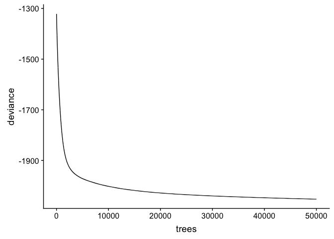
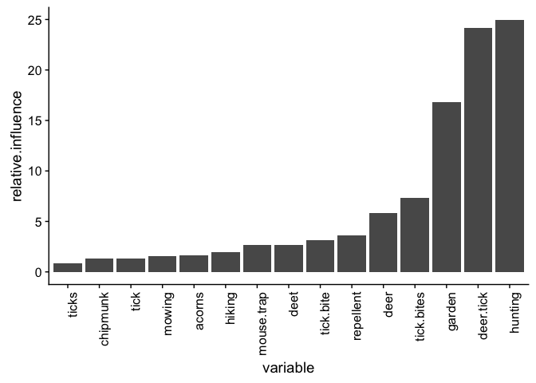
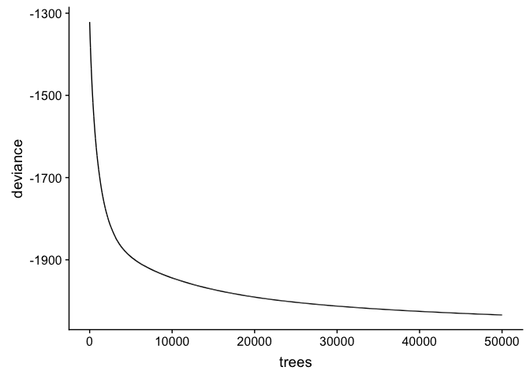

tick\_searches
================
Ilya
5/13/2018

#### When we go outdoors, we run a risk of coming into contact with ticks that could give us disease-causing pathogens. In the eastern U.S., blacklegged ticks (Ixodes scapularis) transmit the bacterium Borrelia burgdorferi, which causes Lyme disease; in the West Coast, the Western blacklegged tick (Ixodes pacificus) is the vector for Lyme disease. Both of these ticks also transmit pathogens causing other diseases in people and pets. Tick activity varies depending on time of year, weather, wildlife host abundance, and other factors. Knowing the level of risk in our area at a particular time can help us decide what outdoor activities to pursue and what precautions to take (such as checking oneself for ticks after going into tick habitat).

#### Internet search data offer a potential source of real-time information on people's encounters with ticks. If we know people in our area are searching more for ticks, this could be a sign that tick activity is high and we need to be more vigilant against ticks. In evaluating whether internet search data provide a useful measure of disease risk, an important step is determining whether internet search predicts Lyme disease incidence. Here we use Google trends data from 2004 to 2016 to predict Lyme disease incidence in those years. The analysis demonstrates that top searches related to tick bites account for 50% of the variance in Lyme disease incidence. Based on this finding, Google search data appears to be a useful measure of encountering ticks that make us sick. A next step will be identifying variables (e.g., weather) that predict increases in Google searches about tick bites, to enable earlier warning of tick risk.

install packages
================

``` r
list.of.packages <- c("sp", "raster", "leaflet", "geojsonio", "lubridate", "data.table", "dismo", "devtools", "dplyr")
new.packages <- list.of.packages[!(list.of.packages %in% installed.packages()[,"Package"])]
if(length(new.packages)) install.packages(new.packages)

print(new.packages)
```

    ## character(0)

``` r
library(devtools)
devtools::install_github("PMassicotte/gtrendsR", branch = "low-search-volume") #use version for getting low search volume regions https://github.com/PMassicotte/gtrendsR/issues/229
```

    ## Downloading GitHub repo PMassicotte/gtrendsR@master
    ## from URL https://api.github.com/repos/PMassicotte/gtrendsR/zipball/master

    ## Installing gtrendsR

    ## '/Library/Frameworks/R.framework/Resources/bin/R' --no-site-file  \
    ##   --no-environ --no-save --no-restore --quiet CMD INSTALL  \
    ##   '/private/var/folders/0d/qm_pqljx11s_ddc42g1_yscr0000gn/T/Rtmp1qiAFb/devtoolse1b0c1495e/PMassicotte-gtrendsR-08b0edb'  \
    ##   --library='/Library/Frameworks/R.framework/Versions/3.4/Resources/library'  \
    ##   --install-tests

    ## 

``` r
library(gtrendsR) 
library(sp)
library(raster)
library(leaflet)
library(lubridate)
```

    ## 
    ## Attaching package: 'lubridate'

    ## The following object is masked from 'package:base':
    ## 
    ##     date

``` r
library(data.table)
```

    ## 
    ## Attaching package: 'data.table'

    ## The following objects are masked from 'package:lubridate':
    ## 
    ##     hour, isoweek, mday, minute, month, quarter, second, wday,
    ##     week, yday, year

    ## The following object is masked from 'package:raster':
    ## 
    ##     shift

``` r
library(dismo)
library(dplyr)
```

    ## 
    ## Attaching package: 'dplyr'

    ## The following objects are masked from 'package:data.table':
    ## 
    ##     between, first, last

    ## The following objects are masked from 'package:lubridate':
    ## 
    ##     intersect, setdiff, union

    ## The following objects are masked from 'package:raster':
    ## 
    ##     intersect, select, union

    ## The following objects are masked from 'package:stats':
    ## 
    ##     filter, lag

    ## The following objects are masked from 'package:base':
    ## 
    ##     intersect, setdiff, setequal, union

read in geojson file with nielsen dmas
======================================

``` r
#https://rstudio.github.io/leaflet/json.html
substrRight <- function(x, n){
  substr(x, nchar(x)-n+1, nchar(x))
}

#nielsen DMA
dma <- geojsonio::geojson_read("https://rawgit.com/simzou/nielsen-dma/master/nielsentopo.json",
  what = "sp")

#make map of dmas to make sure they look okay
pal <- colorNumeric("viridis", NULL)

#commenting this out because it does not display well in github_document
# leaflet(dma) %>%
#   addTiles() %>%
#   addPolygons(stroke = FALSE, smoothFactor = 0.3, fillOpacity = 1,
#     fillColor = ~pal(log10(cableperc)),
#     label = ~paste0(name, ": ", formatC(cableperc, big.mark = ","))) %>%
#   addLegend(pal = pal, values = ~log10(cableperc), opacity = 1.0,
#     labFormat = labelFormat(transform = function(x) round(10^x)))

#sort dma by dma1
dma.df = as.data.frame(dma)
dma.df$dma1 = as.character(dma.df$dma1)
dma.df$state = substrRight(dma.df$dma1, 2)

dma.df = dma.df[order(dma.df$state, dma.df$dma1),]
save(dma.df, file ="dma.df.Rdata")
write.csv(dma.df, file = "dma.csv")
```

get google trends data
======================

##### Note: additional terms may be useful for predicting Lyme disease (e.g., outdoor activities, symptoms, "Lyme disease", wildlife host community). But for this analysis the focus is on terms that reflect encounters with ticks. We used the term "tick bite", and the top 10 related queries for that term. We excluded queries related to tick species other than the blacklegged tick (Ixodes scapularis), and related to tick encounters with pets. We also excluded queries such as "what does tick bite look like", that contain within it other search terms already included (in this case, "tick bite").

``` r
#make function for substring
substrRight <- function(x, n){
  substr(x, nchar(x)-n+1, nchar(x))
}

years = seq(from = 2004, to = 2016, by = 1)
year.lag.1 = seq(from = 2004, to = 2015, by =1)
year.lag.2 = seq(from = 2004, to = 2014, by =1)
# year.lag.1 = seq(from = 2004, to = 2015, by =1)

start.month.day = rep("01-01",length(years))
end.month.day = rep("12-31", length(years))
start.days = paste(as.character(years), start.month.day, sep="-")
end.days = paste(as.character(years), end.month.day, sep="-")
start.days.lag1 = paste(as.character(year.lag.1), start.month.day, sep="-")
end.days.lag1 = paste(as.character(year.lag.1), end.month.day, sep="-")

start.days.lag2 = paste(as.character(year.lag.2), start.month.day, sep="-")
end.days.lag2 = paste(as.character(year.lag.2), end.month.day, sep="-")

out = NULL
a = 1
#for (a in 1){
for (a in 1:length(years)){
  print(a)
  gt <- gtrends(keyword = "tick bite", geo = c("US"), time = paste(start.days[a], end.days[a], sep = " "), gprop = c("web"), category = 0, hl = "en-US",
  low_search_volume = TRUE)
  gt$interest_by_dma$state = substrRight(gt$interest_by_dma$location, 2)
  gt$interest_by_dma$year = years[a]
  gt = gt$interest_by_dma
    gt = gt[order(gt$location),]
    gt$tick.bite = gt$hits
    gt = gt[,c("location","tick.bite", "state", "year")]

      #deer tick
            gt.deer.tick <- gtrends(keyword = "deer tick", geo = c("US"), time = paste(start.days.lag1[a], end.days.lag1[a], sep = " "), gprop = c("web"), category = 0, hl = "en-US",
                       low_search_volume = TRUE)
    gt.deer.tick$interest_by_dma$state = substrRight(gt.deer.tick$interest_by_dma$location, 2)
    gt.deer.tick$interest_by_dma$year = year.lag.2[a]+2
    gt.deer.tick = gt.deer.tick$interest_by_dma
    gt.deer.tick = gt.deer.tick[order(gt.deer.tick$location),]
    gt.deer.tick$deer.tick = gt.deer.tick$hits
    gt.deer.tick = gt.deer.tick[,c("location","deer.tick", "state", "year")]
    #now add to gt
    gt.deer.tick$location == gt$location
    gt$deer.tick = gt.deer.tick$deer.tick
    rm(gt.deer.tick)

      #tick.bites 
      gt.tick.bites <- gtrends(keyword = "tick bites", geo = c("US"), time = paste(start.days.lag1[a], end.days.lag1[a], sep = " "), gprop = c("web"), category = 0, hl = "en-US",
                              low_search_volume = TRUE)
      gt.tick.bites$interest_by_dma$state = substrRight(gt.tick.bites$interest_by_dma$location, 2)
      gt.tick.bites$interest_by_dma$year = year.lag.2[a]+2
      gt.tick.bites = gt.tick.bites$interest_by_dma
      gt.tick.bites = gt.tick.bites[order(gt.tick.bites$location),]
      gt.tick.bites$tick.bites = gt.tick.bites$hits
      gt.tick.bites = gt.tick.bites[,c("location","tick.bites", "state", "year")]
      #now add to gt
      gt.tick.bites$location == gt$location
      gt$tick.bites = gt.tick.bites$tick.bites
      rm(gt.tick.bites)
      
      #ticks 
      gt.ticks <- gtrends(keyword = "ticks", geo = c("US"), time = paste(start.days.lag1[a], end.days.lag1[a], sep = " "), gprop = c("web"), category = 0, hl = "en-US",
                              low_search_volume = TRUE)
      gt.ticks$interest_by_dma$state = substrRight(gt.ticks$interest_by_dma$location, 2)
      gt.ticks$interest_by_dma$year = year.lag.2[a]+2
      gt.ticks = gt.ticks$interest_by_dma
      gt.ticks = gt.ticks[order(gt.ticks$location),]
      gt.ticks$ticks = gt.ticks$hits
      gt.ticks = gt.ticks[,c("location","ticks", "state", "year")]
      #now add to gt
      gt.ticks$location == gt$location
      gt$ticks = gt.ticks$ticks
      rm(gt.ticks)

      #repellent 
    gt.repellent <- gtrends(keyword = "repellent", geo = c("US"), time = paste(start.days.lag1[a], end.days.lag1[a], sep = " "), gprop = c("web"), category = 0, hl = "en-US",
                        low_search_volume = TRUE)
    gt.repellent$interest_by_dma$state = substrRight(gt.repellent$interest_by_dma$location, 2)
    gt.repellent$interest_by_dma$year = year.lag.2[a]+2
    gt.repellent = gt.repellent$interest_by_dma
    gt.repellent = gt.repellent[order(gt.repellent$location),]
    gt.repellent$repellent = gt.repellent$hits
    gt.repellent = gt.repellent[,c("location","repellent", "state", "year")]
    #now add to gt
    gt.repellent$location == gt$location
    gt$repellent = gt.repellent$repellent
    rm(gt.repellent)

    #hiking 
    gt.hiking <- gtrends(keyword = "hiking", geo = c("US"), time = paste(start.days.lag1[a], end.days.lag1[a], sep = " "), gprop = c("web"), category = 0, hl = "en-US",
                        low_search_volume = TRUE)
    gt.hiking$interest_by_dma$state = substrRight(gt.hiking$interest_by_dma$location, 2)
    gt.hiking$interest_by_dma$year = year.lag.2[a]+2
    gt.hiking = gt.hiking$interest_by_dma
    gt.hiking = gt.hiking[order(gt.hiking$location),]
    gt.hiking$hiking = gt.hiking$hits
    gt.hiking = gt.hiking[,c("location","hiking", "state", "year")]
    #now add to gt
    gt.hiking$location == gt$location
    gt$hiking = gt.hiking$hiking
    rm(gt.hiking)

    #deet 
    gt.deet <- gtrends(keyword = "deet", geo = c("US"), time = paste(start.days.lag1[a], end.days.lag1[a], sep = " "), gprop = c("web"), category = 0, hl = "en-US",
                        low_search_volume = TRUE)
    gt.deet$interest_by_dma$state = substrRight(gt.deet$interest_by_dma$location, 2)
    gt.deet$interest_by_dma$year = year.lag.2[a]+2
    gt.deet = gt.deet$interest_by_dma
    gt.deet = gt.deet[order(gt.deet$location),]
    gt.deet$deet = gt.deet$hits
    gt.deet = gt.deet[,c("location","deet", "state", "year")]
    #now add to gt
    gt.deet$location == gt$location
    gt$deet = gt.deet$deet
    rm(gt.deet)
    out = rbind(out, gt)


}
```

    ## [1] 1
    ## [1] 2
    ## [1] 3
    ## [1] 4
    ## [1] 5
    ## [1] 6
    ## [1] 7
    ## [1] 8
    ## [1] 9
    ## [1] 10
    ## [1] 11
    ## [1] 12
    ## [1] 13

``` r
gt = out
save(gt, file = "gt.Rdata")

#output one year/keyword subset for assigning google dma names to dma names in json file (they are slightly different)
dma.tab = subset(gt, year ==2004) 
dma.tab = dma.tab[order(dma.tab$state),]
write.csv(dma.tab, file = "dma.tab.google.csv")
```

assign google dma names to dma-county file (do this part in excel, pseudo code here)
====================================================================================

``` r
#next: 
#open dma.csv and  dma.tab.google.csv in excel, 
#copy in google trends dma names into dma.csv, 
#align the two dma name sets, fixing state abbreviations, 
#and save dma.csv as dma.google.assigned.by.hand.csv
```

read dma json file back in after assigning google trends dma names to it and fixing state abbreviations
=======================================================================================================

``` r
load("dma.df.Rdata")
dma.assigned = read.csv( "dma.google.assigned.by.hand.csv")
dma.assigned = dma.assigned[order(dma.assigned$id),]
dma.df = dma.df[order(dma.df$id),]
#check these are all true as error check nothing odd happened
dma.df$dma1 ==dma.assigned$dma1
```

    ##   [1] TRUE TRUE TRUE TRUE TRUE TRUE TRUE TRUE TRUE TRUE TRUE TRUE TRUE TRUE
    ##  [15] TRUE TRUE TRUE TRUE TRUE TRUE TRUE TRUE TRUE TRUE TRUE TRUE TRUE TRUE
    ##  [29] TRUE TRUE TRUE TRUE TRUE TRUE TRUE TRUE TRUE TRUE TRUE TRUE TRUE TRUE
    ##  [43] TRUE TRUE TRUE TRUE TRUE TRUE TRUE TRUE TRUE TRUE TRUE TRUE TRUE TRUE
    ##  [57] TRUE TRUE TRUE TRUE TRUE TRUE TRUE TRUE TRUE TRUE TRUE TRUE TRUE TRUE
    ##  [71] TRUE TRUE TRUE TRUE TRUE TRUE TRUE TRUE TRUE TRUE TRUE TRUE TRUE TRUE
    ##  [85] TRUE TRUE TRUE TRUE TRUE TRUE TRUE TRUE TRUE TRUE TRUE TRUE TRUE TRUE
    ##  [99] TRUE TRUE TRUE TRUE TRUE TRUE TRUE TRUE TRUE TRUE TRUE TRUE TRUE TRUE
    ## [113] TRUE TRUE TRUE TRUE TRUE TRUE TRUE TRUE TRUE TRUE TRUE TRUE TRUE TRUE
    ## [127] TRUE TRUE TRUE TRUE TRUE TRUE TRUE TRUE TRUE TRUE TRUE TRUE TRUE TRUE
    ## [141] TRUE TRUE TRUE TRUE TRUE TRUE TRUE TRUE TRUE TRUE TRUE TRUE TRUE TRUE
    ## [155] TRUE TRUE TRUE TRUE TRUE TRUE TRUE TRUE TRUE TRUE TRUE TRUE TRUE TRUE
    ## [169] TRUE TRUE TRUE TRUE TRUE TRUE TRUE TRUE TRUE TRUE TRUE TRUE TRUE TRUE
    ## [183] TRUE TRUE TRUE TRUE TRUE TRUE TRUE TRUE TRUE TRUE TRUE TRUE TRUE TRUE
    ## [197] TRUE TRUE TRUE TRUE TRUE TRUE TRUE TRUE TRUE TRUE

``` r
#fix DC
ind.dc = which(dma.assigned$state == "D)")
dma.assigned$state = as.character(dma.assigned$state)
dma.assigned$state[ind.dc]= "DC"
dma.ggl <- dma.assigned
keep.col = c("latitude","dma","dma1", "longitude", "state", "google.dma")
dma.ggl = dma.ggl[,keep.col]

save(dma.ggl, file = "dma.ggl.Rdata")
```

now assign google dmas to counties
==================================

``` r
require(sp)
load("dma.ggl.Rdata")
counties <- geojsonio::geojson_read("http://eric.clst.org/assets/wiki/uploads/Stuff/gz_2010_us_050_00_500k.json",
  what = "sp")

#https://catalog.data.gov/dataset/us-counties/resource/cc1b2e44-d5a4-4c26-82c1-39b0da37bfb8
counties.test <- shapefile("tl_2016_us_county.shp")
counties = counties.test
#confirm there is a projetion in counties
projection(counties)#there is none, but we're not going to use it
```

    ## [1] "+proj=longlat +datum=NAD83 +no_defs +ellps=GRS80 +towgs84=0,0,0"

``` r
pal <- colorNumeric("viridis", NULL)

#http://eric.clst.org/tech/usgeojson/
#make map of counties to make sure they look like counties -- commented out to make markdown smaller
# leaflet(counties) %>%
#   addTiles() %>%
#   addPolygons(stroke = FALSE, smoothFactor = 0.3, fillOpacity = 1,
#     fillColor = ~pal((as.numeric(STATEFP))),
#     label = ~paste0(NAME, ": ", formatC(as.numeric(STATEFP), big.mark = ","))) %>%
#   addLegend(pal = pal, values = ~(as.numeric(STATEFP)), opacity = 1.0,
#     labFormat = labelFormat(transform = function(x) round(10^x)))

#read dma in again as polygons (need it to be polygons, not data.frame)
dma <- geojsonio::geojson_read("https://rawgit.com/simzou/nielsen-dma/master/nielsentopo.json",
  what = "sp")

#tried assigning a projection to dma, but it seemed to result in holes in polygons
# dma_project <- projection(dma, CRS("+proj=longlat +datum=WGS84 +no_defs +ellps=WGS84 +towgs84=0,0,0"))

#then assign google dma name
#male version of dma.ggl w/ only relevant columns
dma.ggl.sm = dma.ggl[,c("dma1","google.dma")]
#merge dma with dma.ggl.sm, assigning google dma name
#http://www.nickeubank.com/wp-content/uploads/2015/10/RGIS2_MergingSpatialData_part1_Joins.html#spatial-non-spatial
#doing this with merge messes it up w/ respect to holes in polygons, so instead use for loop
# dma = merge(dma,dma.ggl.sm, by.x = "dma1", by.y = "dma1")
dma$dma.google = NA
udma = unique(dma$dma1)
a = 1
for (a in 1:length(udma)){
  ind = which(dma$dma1==udma[a])
  ind.google = which(dma.ggl.sm$dma1==udma[a])
  dma$dma.google[ind]= as.character(dma.ggl.sm$google.dma[ind.google])
}

#counties has a projection; dma does not; assigning no projection to counties
projection(counties) <- projection(dma)#package raster

#this does not work if identical CRS(x,y) is not true
counties$dma.ggl <- over( counties, dma)$dma.google#name of dma

#read in fps codes
fps = fread("https://www2.census.gov/geo/docs/reference/state.txt")
fps = fps[,c("STATE", "STUSAB", "STATE_NAME")]
names(fps)[names(fps)=="STATE"]="STATEFP"

counties = merge(counties,fps, by.x = "STATEFP", by.y = "STATEFP")
save(counties, file = "counties.Rdata")

#used this below to check for holes, and found them in dma when it had a projection assigned (which resulted in function over failing)
# require(devtools)
# install_github("eblondel/cleangeo")
# require(cleangeo)
# report <- clgeo_CollectionReport(counties)
# summary <- clgeo_SummaryReport(report)
# issues <- report[report$valid == FALSE,]
# 
# report <- clgeo_CollectionReport(dma)
# summary <- clgeo_SummaryReport(report)
# issues <- report[report$valid == FALSE,]
```

read in CDC Lyme data and reshape
=================================

``` r
#website: https://www.cdc.gov/lyme/stats/index.html
L = read.csv("https://www.cdc.gov/lyme/resources/ld-Case-Counts-by-County-00-16.csv")
L = reshape(L, direction = "long", varying = 5:21, sep = "")
dim(L)
```

    ## [1] 54281     7

``` r
save(L, file = "L.Rdata")
```

read in census data from SEER.
==============================

``` r
library(data.table)
#source: https://seer.cancer.gov/popdata/download.html
#dictionary for data: https://seer.cancer.gov/popdata/popdic.html
A = read.table("us.1990_2016.19ages.adjusted.txt", skip = 1)
A=as.data.frame(A)
A$V1 = as.character(A$V1)
A$year = substr(A$V1, 1, 4)
A$state = substr(A$V1, 5, 6)
A$county_fps = substr(A$V1, 9, 11)
A$population = substr(A$V1, 19, 26)
save(A, file = "A.Rdata")
# 
```

fix population in census data
=============================

``` r
library(data.table)
load("A.Rdata") 
A$population.2 =  as.numeric(substr(A$population,regexpr("[^0]",A$population),nchar(A$population)))
 A$population = A$population.2
 keep.col = c("V1", "year", "state", "county_fps", "population")
A = A[, keep.col]

# #county fps
 fps = fread("https://www2.census.gov/geo/docs/reference/codes/files/national_county.txt")
 names(fps)= c("state", "statefp", "county_fps", "county", "classfp")
 fps = data.frame(fps)
 keep.col = c("state", "county", "county_fps")
 fps = fps[, keep.col]
 test = setdiff(A$county_fps, fps$county_fps )
 A.test = subset(A, county_fps %in% test)
 #merge to add county field
 A.test2 = merge(A.test, fps)
 A2 = merge(A, fps, by = intersect(names(A), names(fps)))
#
 A3 = rbind(A2, A.test2)
#
 A = A3
#
 A$year = as.numeric(A$year)
 A$population =  as.numeric(substr(A$population,regexpr("[^0]",A$population),nchar(A$population)))
 save(A, file = "A.Rdata")
```

read in Census data and summarize by year
=========================================

``` r
load("A.Rdata")
keep = c("state", "population", "county", "year")
A1 = A[,keep]

A1$county_state = paste(A1$county, A1$state, sep = "_")
A2 <- A1 %>%
  group_by(county_state, year) %>%
  summarize(population = sum(population),
            county = county[1], 
            state = state[1])
census = A2
save(census, file = "census.Rdata")
```

read back in Census data, reshape long, assign full names of states
===================================================================

``` r
load("census.Rdata")
#names(census)[names(census)=="state"]="state_name"
names(census)[names(census)=="county"]="county_name"
census = subset(census, year >=2004)

#read in file of state abbreviations
states = read.csv("50_us_states_all_data.csv")
states = states[,c(2:3)]
colnames(states) =c("state_name", "state")

intersect(names(census), names(states))
```

    ## [1] "state"

``` r
#add state abbreviation to census data
census1 = merge(census, states, by = "state")
#check a few rows
census = census1
head(census1)
```

    ##   state                  county_state year population
    ## 1    AK  Matanuska-Susitna Borough_AK 2004      70761
    ## 2    AK Lake and Peninsula Borough_AK 2006       1624
    ## 3    AK  Hoonah-Angoon Census Area_AK 2015       2118
    ## 4    AK     Petersburg Census Area_AK 2016       3149
    ## 5    AK  Matanuska-Susitna Borough_AK 2006      78633
    ## 6    AK   Yakutat City and Borough_AK 2015        620
    ##                  county_name state_name
    ## 1  Matanuska-Susitna Borough     Alaska
    ## 2 Lake and Peninsula Borough     Alaska
    ## 3  Hoonah-Angoon Census Area     Alaska
    ## 4     Petersburg Census Area     Alaska
    ## 5  Matanuska-Susitna Borough     Alaska
    ## 6   Yakutat City and Borough     Alaska

``` r
tail(census1)
```

    ##       state      county_state year population    county_name    state_name
    ## 15766    WV  Wetzel County_WV 2008      16645  Wetzel County West Virginia
    ## 15767    WV Webster County_WV 2004       9612 Webster County West Virginia
    ## 15768    WV Webster County_WV 2005       9463 Webster County West Virginia
    ## 15769    WV Webster County_WV 2006       9391 Webster County West Virginia
    ## 15770    WV Webster County_WV 2007       9260 Webster County West Virginia
    ## 15771    WV Webster County_WV 2008       9260 Webster County West Virginia

``` r
length(unique(census$year))
```

    ## [1] 13

``` r
save(census, file = "census.Rdata")
```

combine census and LD data
==========================

``` r
load("census.Rdata")
load("L.Rdata")
#make county_name and county_state
names(L)[names(L)=="Ctyname"]="county_name"
names(L)[names(L)=="Stname"]="state_name"
names(L)[names(L)=="time"]="year"
L$county_state =paste(L$county_name, L$state_name, sep = " ")
L = L[, c("county_name", "county_state", "state_name", "year", "Cases")]

test  = subset(census, is.na(population))#should be empty
#census = census[, c("state_name", "county_name", "year", "population", "state", "county_state")]
census$county_state=paste(census$county_name, census$state_name, sep = " ")

length(setdiff(L$county_state,census$county_state))
```

    ## [1] 1979

``` r
length(setdiff(census$county_state,L$county_state))
```

    ## [1] 3

``` r
#seems to be missing Alabama, but that's okay as it's way South so doesn't have much Lyme 
L1 = merge(census, L, by = intersect(names(census), names(L)))
L = L1
L$incidence = 100000*L$Cases/L$population
length(unique(L$year))
```

    ## [1] 13

``` r
save(L, file = "L.Rdata") 
```

assign DMA and google trends to Lyme disease data
=================================================

``` r
require(sp)
# library(reshape2)
library(tidyr)
```

    ## 
    ## Attaching package: 'tidyr'

    ## The following object is masked from 'package:raster':
    ## 
    ##     extract

``` r
load("L.Rdata")#Lyme
load("gt.Rdata")
load("counties.Rdata")
names(counties)[names(counties)=="NAMELSAD"]="county_name"
names(counties)[names(counties)=="STUSAB"]="state"
counties$county_state =paste(counties$county_name, counties$STATE_NAME, sep = " ")
keep.col = c("dma.ggl", "county_state", "STATEFP"      ,"COUNTYFP", "county_name", "INTPTLAT", "INTPTLON","state"     ,  "STATE_NAME"    )
counties = counties[,keep.col]
counties.df = data.frame(counties)
names(counties.df)=tolower(names(counties.df))

L = merge(L,counties.df)

#assign google trends to L
gt = subset(gt, !is.na(gt$year))
names(gt)[names(gt)=="location"]="dma.ggl"
gt = gt[,c("dma.ggl", "year", "deer.tick", "tick.bite", "ticks", "tick.bites", "repellent", "deet", "hiking")]
L1 = merge(L, gt, by = c("dma.ggl", "year"))

L = subset(L1, !is.na(incidence))
save(L, file = "L.Rdata")
```

summarize by dma
================

``` r
load("L.Rdata")
library(dplyr)
L1<-L %>%
  group_by(dma.ggl, year) %>%
  summarize(pop.dma = sum(population),
            Cases.dma = sum(Cases),
            incidence.dma = 100000*Cases.dma/pop.dma,
            deer.tick = deer.tick[1],
            tick.bite = tick.bite[1],
            tick.bites=tick.bites[1],
            ticks = ticks[1], 
            repellent = repellent[1],
            hiking = hiking[1],
            deet = deet[1])
summary(L1$incidence.dma)
```

    ##     Min.  1st Qu.   Median     Mean  3rd Qu.     Max. 
    ##   0.0000   0.0000   0.3169   6.8025   1.6384 319.5010

``` r
#L <- L1
save(L1, file = "L1.Rdata")
```

run boosted regression tree analysis -- analyze at dma-level
============================================================

``` r
load("L1.Rdata")
library(dismo)
L = L1
L$deer.tick = as.numeric(as.character(L$deer.tick))
L$dma.ggl = factor(L$dma.ggl)
L = data.frame(L)#have to change back from tibble to data.frame!!
indices = seq(from = 1, to = dim(L)[1])
set.seed(1234)

indices = sample(indices, replace=FALSE)
L$rand = indices
#holdout cutoff
h.cutoff = round(0.2*max(L$rand))
#training cutoff 
t.cutoff = h.cutoff+1

Test = subset(L, rand<=h.cutoff)
keep.col = c("incidence.dma", "deer.tick", "tick.bite", "ticks", "tick.bites", "hiking", "deet", "repellent")
Test = Test[, keep.col]

save(Test, file = "Test.Rdata")
Train = subset(L, rand>=t.cutoff)
Train = Train[, keep.col]

tc.2.lr.1 <- gbm.step(data=Train,
                            gbm.x = 2:8, 
                            gbm.y = 1,#incidence
                            family = "gaussian",
                            tree.complexity = 2,#fit up to two-way interactions
                            learning.rate = 0.001,
                            bag.fraction = 0.75)#recommend between 0.5 and 0.75
```

    ## Loading required namespace: gbm

    ## 
    ##  
    ##  GBM STEP - version 2.9 
    ##  
    ## Performing cross-validation optimisation of a boosted regression tree model 
    ## for incidence.dma and using a family of gaussian 
    ## Using 1498 observations and 7 predictors 
    ## creating 10 initial models of 50 trees 
    ## 
    ##  folds are unstratified 
    ## total mean deviance =  617.9509 
    ## tolerance is fixed at  0.618 
    ## ntrees resid. dev. 
    ## 50    606.7934 
    ## now adding trees... 
    ## 100   596.1055 
    ## 150   586.0309 
    ## 200   577.2497 
    ## 250   569.042 
    ## 300   561.5313 
    ## 350   554.8046 
    ## 400   548.3425 
    ## 450   542.7753 
    ## 500   537.2552 
    ## 550   532.3432 
    ## 600   527.6631 
    ## 650   523.3763 
    ## 700   519.5406 
    ## 750   516.1505 
    ## 800   512.9202 
    ## 850   509.9944 
    ## 900   507.202 
    ## 950   504.7719 
    ## 1000   502.3634 
    ## 1050   500.1684 
    ## 1100   498.0884 
    ## 1150   496.1674 
    ## 1200   494.4443 
    ## 1250   492.9411 
    ## 1300   491.4888 
    ## 1350   490.2557 
    ## 1400   489.1376 
    ## 1450   488.2319 
    ## 1500   487.3388 
    ## 1550   486.3294 
    ## 1600   485.4879 
    ## 1650   484.735 
    ## 1700   484.1053 
    ## 1750   483.5254 
    ## 1800   482.9865 
    ## 1850   482.4877 
    ## 1900   482.1564 
    ## 1950   481.7834 
    ## 2000   481.469 
    ## 2050   481.2082 
    ## 2100   480.9306 
    ## 2150   480.7396 
    ## 2200   480.4518 
    ## 2250   480.2562 
    ## 2300   480.1651 
    ## 2350   480.0225 
    ## 2400   480.0366 
    ## 2450   479.9479 
    ## 2500   479.9767 
    ## 2550   479.9532 
    ## 2600   479.8144 
    ## 2650   479.8861 
    ## 2700   479.9031 
    ## 2750   479.7881 
    ## 2800   479.7225 
    ## 2850   479.7378 
    ## 2900   479.8452 
    ## 2950   479.7994 
    ## 3000   479.8812

    ## fitting final gbm model with a fixed number of 2800 trees for incidence.dma



    ## 
    ## mean total deviance = 617.951 
    ## mean residual deviance = 391.966 
    ##  
    ## estimated cv deviance = 479.723 ; se = 111.38 
    ##  
    ## training data correlation = 0.619 
    ## cv correlation =  0.501 ; se = 0.051 
    ##  
    ## elapsed time -  0.23 minutes

``` r
#check names of columns used as predictors: 
save(tc.2.lr.1, file = "tc.2.lr.1.Rdata")
x = summary(tc.2.lr.1)
```



``` r
#write results to csv
x.df= data.frame(variable = x$var, 
                 relative.influence = x$rel.inf)
x.df$relative.influence = round(x.df$relative.influence, digits = 3)
write.csv(x.df, file = "relative.influence.csv")
#check number of trees
ntrees = tc.2.lr.1$n.trees
print(ntrees)#made 
```

    ## [1] 2800

``` r
print(x.df)
```

    ##     variable relative.influence
    ## 1  deer.tick             42.577
    ## 2  tick.bite             28.187
    ## 3      ticks             11.893
    ## 4  repellent              7.497
    ## 5 tick.bites              6.951
    ## 6     hiking              2.202
    ## 7       deet              0.695

for now not simplifying model -- on basis that different terms may be relevant to different places
==================================================================================================

``` r
#dismo/gbm: simplify model by lower learning rate allowing for as many drops as possible
# tc.2.lr.1.simp <- gbm.simplify(tc.2.lr.1)
# summary(tc.2.lr.1.simp)
# tc.2.lr.1.simp$final.drops
```

make plot from fit from gbm
===========================

``` r
load("tc.2.lr.1.Rdata")
gbm.plot(tc.2.lr.1, n.plots=7, write.title = TRUE)
```



``` r
#rm(list = ls())
```

Find mean-squared error for test data
=====================================

``` r
load("tc.2.lr.1.Rdata")
load("Test.Rdata")

yhat.boost=predict(tc.2.lr.1,newdata=Test,n.trees = tc.2.lr.1$n.trees)
mse = mean((yhat.boost-Test$incidence.dma)^2)
mse_sqrt = sqrt(mse)
print("square root of mean squared error")
```

    ## [1] "square root of mean squared error"

``` r
mse_sqrt
```

    ## [1] 14.71692

``` r
print("mean incidence")
```

    ## [1] "mean incidence"

``` r
mean(Test$incidence.dma)
```

    ## [1] 6.301157
